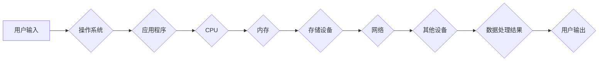

>  IT基础资源、硬件、软件、运行流程、系统架构、数据流、算法、编程语言、操作系统、网络

## 1. 背景介绍

在当今数字化时代，信息技术 (IT) 已经渗透到生活的方方面面。从我们使用的智能手机到复杂的企业系统，都依赖于一套复杂的硬件和软件系统协同工作。了解 IT 基础资源的运行流程对于理解现代技术体系、构建高效可靠的系统至关重要。

本文将深入探讨 IT 基础资源的运行流程，从硬件层面的基础设施到软件层面的应用程序，全面分析其相互关联和协同运作的机制。

## 2. 核心概念与联系

IT 基础资源主要分为两大类：硬件资源和软件资源。

**2.1 硬件资源**

硬件资源是指物理设备，是计算机系统运行的基础。常见的硬件资源包括：

* **中央处理器 (CPU):** 负责执行计算机程序的指令，是计算机系统的核心部件。
* **内存 (RAM):** 用于临时存储正在运行的程序和数据，提供快速访问速度。
* **存储设备 (硬盘、SSD):** 用于长期存储数据和程序，即使计算机关闭后数据也不会丢失。
* **输入/输出设备 (键盘、鼠标、显示器、网络接口卡):** 用于与用户和外部世界进行交互。

**2.2 软件资源**

软件资源是指计算机程序和数据，是硬件资源的控制和管理层。常见的软件资源包括：

* **操作系统 (OS):** 管理硬件资源，提供应用程序运行环境。
* **应用程序 (App):** 用于完成特定任务的软件，例如办公软件、游戏、浏览器等。
* **数据库 (DB):** 用于存储和管理大量数据。
* **网络协议 (Protocol):** 用于计算机之间通信的规则。

**2.3 硬件与软件的相互作用**

硬件和软件相互依赖，共同构成一个完整的 IT 系统。

* **硬件提供基础设施:** 软件运行在硬件平台之上，依赖硬件资源的计算能力、存储空间和通信能力。
* **软件控制硬件:** 操作系统和应用程序通过指令控制硬件设备，例如读取数据、执行计算、显示图像等。

**2.4 运行流程示意图**



## 3. 核心算法原理 & 具体操作步骤

**3.1 算法原理概述**

算法是解决特定问题的指令序列，是计算机程序的核心逻辑。

* **步骤:** 算法通常由一系列步骤组成，每个步骤执行特定的操作。
* **输入:** 算法接受一些输入数据，用于解决问题。
* **输出:** 算法产生一些输出结果，用于解决问题。

**3.2 算法步骤详解**

以排序算法为例，详细说明算法步骤：

1. **选择排序算法:** 选择排序算法是一种简单直观的排序算法，它通过反复选择最小元素，将其放置到正确的位置来实现排序。
2. **算法步骤:**
    * 遍历待排序数组，找到最小元素。
    * 将最小元素与数组第一个元素交换位置。
    * 重复上述步骤，直到数组排序完成。

**3.3 算法优缺点**

* **优点:** 算法简单易懂，实现代码简洁。
* **缺点:** 算法效率较低，时间复杂度为 O(n^2)，不适合处理大型数据。

**3.4 算法应用领域**

选择排序算法广泛应用于小型数据排序场景，例如：

* **学生成绩排序:** 根据学生成绩从高到低排序。
* **商品价格排序:** 根据商品价格从低到高排序。

## 4. 数学模型和公式 & 详细讲解 & 举例说明

**4.1 数学模型构建**

选择排序算法可以用数学模型来描述：

* **输入:** 待排序数组 A = {a1, a2, ..., an}
* **输出:** 排序后的数组 A' = {a1', a2', ..., an'}

**4.2 公式推导过程**

选择排序算法的迭代过程可以用以下公式描述：

```
for i = 0 to n-2 do
    min_index = i
    for j = i+1 to n-1 do
        if A[j] < A[min_index] then
            min_index = j
    swap A[i] and A[min_index]
```

**4.3 案例分析与讲解**

以数组 A = {5, 2, 8, 1, 9} 为例，分析选择排序算法的执行过程：

1. **第一次迭代:**
    * i = 0, min_index = 0
    * 比较 A[1]、A[2]、A[3]、A[4] 与 A[0]，发现 A[4] 最小，min_index = 4
    * 交换 A[0] 和 A[4]，得到数组 {1, 2, 8, 5, 9}
2. **第二次迭代:**
    * i = 1, min_index = 1
    * 比较 A[2]、A[3]、A[4] 与 A[1]，发现 A[2] 最小，min_index = 2
    * 交换 A[1] 和 A[2]，得到数组 {1, 2, 5, 8, 9}
3. **第三次迭代:**
    * i = 2, min_index = 2
    * 比较 A[3]、A[4] 与 A[2]，发现 A[3] 最小，min_index = 3
    * 交换 A[2] 和 A[3]，得到数组 {1, 2, 5, 8, 9}
4. **第四次迭代:**
    * i = 3, min_index = 3
    * 比较 A[4] 与 A[3]，发现 A[4] 大于 A[3]，min_index 不变
    * 不需要交换元素

最终得到排序后的数组 {1, 2, 5, 8, 9}。

## 5. 项目实践：代码实例和详细解释说明

**5.1 开发环境搭建**

选择一个合适的编程语言和开发环境，例如 Python 和 VS Code。

**5.2 源代码详细实现**

```python
def selection_sort(arr):
    n = len(arr)
    for i in range(n-1):
        min_index = i
        for j in range(i+1, n):
            if arr[j] < arr[min_index]:
                min_index = j
        arr[i], arr[min_index] = arr[min_index], arr[i]
    return arr

# 测试代码
arr = [5, 2, 8, 1, 9]
sorted_arr = selection_sort(arr)
print(f"排序后的数组: {sorted_arr}")
```

**5.3 代码解读与分析**

* `selection_sort(arr)` 函数接受一个待排序数组 `arr` 作为输入。
* 外层循环 `for i in range(n-1)` 遍历数组，每次迭代找到最小元素并将其放置到正确的位置。
* 内层循环 `for j in range(i+1, n)` 比较从 `i+1` 到数组末尾的元素，找到最小元素的索引 `min_index`。
* `arr[i], arr[min_index] = arr[min_index], arr[i]` 交换 `arr[i]` 和 `arr[min_index]` 的值，将最小元素放置到正确的位置。
* 返回排序后的数组 `sorted_arr`。

**5.4 运行结果展示**

```
排序后的数组: [1, 2, 5, 8, 9]
```

## 6. 实际应用场景

选择排序算法在实际应用场景中，主要用于处理小型数据排序，例如：

* **学生成绩排序:** 根据学生成绩从高到低排序，方便查看成绩排名。
* **商品价格排序:** 根据商品价格从低到高排序，方便用户查找价格合适的商品。
* **联系人排序:** 根据联系人姓名或电话号码排序，方便查找联系人信息。

**6.4 未来应用展望**

随着数据规模的不断增长，选择排序算法的效率问题越来越突出。未来，选择排序算法可能在以下场景得到应用：

* **嵌入式系统:** 由于嵌入式系统资源有限，选择排序算法的简单性和低内存占用优势可能使其成为嵌入式系统排序的首选算法。
* **数据预处理:** 在数据分析和机器学习领域，选择排序算法可以用于对少量数据进行快速排序，作为数据预处理步骤的一部分。

## 7. 工具和资源推荐

**7.1 学习资源推荐**

* **书籍:**
    * 《算法导论》
    * 《数据结构与算法分析》
* **在线课程:**
    * Coursera: 数据结构与算法
    * edX: 算法导论
* **网站:**
    * GeeksforGeeks
    * LeetCode

**7.2 开发工具推荐**

* **编程语言:** Python, Java, C++
* **IDE:** VS Code, IntelliJ IDEA, Eclipse

**7.3 相关论文推荐**

* **选择排序算法的分析与改进**
* **选择排序算法在嵌入式系统中的应用**

## 8. 总结：未来发展趋势与挑战

**8.1 研究成果总结**

本文深入探讨了 IT 基础资源的运行流程，分析了核心算法原理和具体操作步骤，并结合实际应用场景进行了代码实例讲解。

**8.2 未来发展趋势**

随着人工智能、云计算和物联网等技术的快速发展，IT 基础资源的运行流程将更加复杂和智能化。未来，IT 基础资源的运行流程将朝着以下方向发展：

* **自动化:** 利用人工智能技术自动管理和优化硬件资源和软件资源。
* **虚拟化:** 通过虚拟化技术，将物理资源抽象成虚拟资源，提高资源利用率和灵活性。
* **分布式:** 将 IT 基础资源分布到多个节点，提高系统可靠性和扩展性。

**8.3 面临的挑战**

IT 基础资源的运行流程面临着以下挑战：

* **安全:** 保护 IT 基础资源免受攻击和数据泄露。
* **可靠性:** 确保 IT 基础资源的稳定运行，避免故障和数据丢失。
* **可扩展性:** 随着数据规模和用户数量的增长，IT 基础资源需要能够灵活扩展。

**8.4 研究展望**

未来，研究人员将继续探索更先进的 IT 基础资源运行流程，以应对不断变化的技术需求和挑战。

## 9. 附录：常见问题与解答

**9.1 什么是 IT 基础资源？**

IT 基础资源是指构成 IT 系统的基础设施，包括硬件资源和软件资源。

**9.2 IT 基础资源的运行流程是什么？**

IT 基础资源的运行流程是指硬件资源和软件资源相互协作，完成数据处理和应用程序执行的整个过程。

**9.3 选择排序算法的优缺点是什么？**

选择排序算法简单易懂，但效率较低，不适合处理大型数据。

**9.4 选择排序算法的应用场景有哪些？**

选择排序算法主要用于处理小型数据排序，例如学生成绩排序、商品价格排序和联系人排序。


作者：禅与计算机程序设计艺术 / Zen and the Art of Computer Programming 
<end_of_turn>