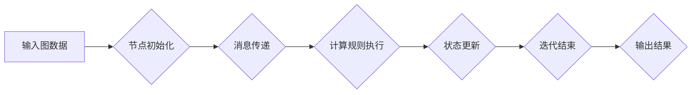

> Pregel, 图计算, 并行算法, 数据流, 迭代算法, 编程模型

## 1. 背景介绍

随着互联网和社交网络的蓬勃发展，海量数据以指数级增长，其中蕴含着丰富的知识和价值。如何高效地挖掘和分析这些数据成为了一个重要的挑战。图数据作为一种强大的数据模型，能够有效地表示现实世界中的复杂关系，在社交网络分析、推荐系统、知识图谱构建等领域有着广泛的应用。

然而，传统的数据库系统和数据处理框架难以处理海量图数据的复杂计算需求。为了解决这一问题，Google于2010年提出了Pregel算法，并将其作为一种图计算编程模型，为高效处理图数据提供了新的思路。

Pregel是一种基于数据流的迭代算法，它将图数据划分为多个节点，并通过迭代的方式进行计算。每个节点在迭代过程中会接收来自相邻节点的信息，并根据预先定义的计算规则更新自身的状态。通过多次迭代，Pregel能够完成对图数据的各种分析任务，例如：

* **路径查找:** 寻找图中两点之间的路径。
* **中心性分析:** 计算图中节点的重要性。
* **社区发现:** 发现图中具有相似连接的节点集。
* **流行趋势分析:** 分析图中信息传播的趋势。

## 2. 核心概念与联系

Pregel的核心概念包括：

* **图:** 由节点和边组成的数据结构，节点代表实体，边代表实体之间的关系。
* **迭代:** Pregel算法通过多次迭代的方式进行计算，每次迭代中，每个节点都会接收来自相邻节点的信息，并根据计算规则更新自身的状态。
* **消息传递:** 节点之间通过消息传递的方式进行信息交换。
* **计算规则:** 每个节点都具有一个计算规则，该规则定义了节点如何处理接收到的消息并更新自身的状态。

**Pregel架构流程图:**



## 3. 核心算法原理 & 具体操作步骤

### 3.1  算法原理概述

Pregel算法的核心思想是将图数据划分为多个节点，并通过迭代的方式进行计算。每个节点在迭代过程中会接收来自相邻节点的信息，并根据预先定义的计算规则更新自身的状态。通过多次迭代，Pregel能够完成对图数据的各种分析任务。

Pregel算法的具体步骤如下：

1. **初始化:** 将图数据划分为多个节点，并为每个节点分配一个初始状态。
2. **消息传递:** 每个节点向其相邻节点发送消息，消息内容包含节点的当前状态和计算规则。
3. **计算规则执行:** 每个节点接收来自相邻节点的消息后，根据预先定义的计算规则更新自身的状态。
4. **状态更新:** 节点更新自身的状态后，将新的状态发送给其相邻节点。
5. **迭代结束:** 当所有节点的状态不再发生变化时，迭代结束。

### 3.2  算法步骤详解

1. **图数据划分:** 将图数据划分为多个节点，每个节点代表图中的一个实体。
2. **节点初始化:** 为每个节点分配一个初始状态，例如节点的度数、标签等。
3. **消息传递:** 每个节点向其相邻节点发送消息，消息内容包含节点的当前状态和计算规则。
4. **计算规则执行:** 每个节点接收来自相邻节点的消息后，根据预先定义的计算规则更新自身的状态。
5. **状态更新:** 节点更新自身的状态后，将新的状态发送给其相邻节点。
6. **迭代:** 重复步骤3-5，直到所有节点的状态不再发生变化。

### 3.3  算法优缺点

**优点:**

* **并行性:** Pregel算法可以并行执行，能够有效地利用多核处理器和分布式计算资源。
* **易于编程:** Pregel提供了一种简洁的编程模型，开发者可以方便地编写图计算程序。
* **通用性:** Pregel算法可以应用于各种图计算任务，例如路径查找、中心性分析、社区发现等。

**缺点:**

* **内存消耗:** Pregel算法需要存储图数据和节点状态，对于大型图数据，内存消耗可能很大。
* **迭代次数:** Pregel算法需要多次迭代才能完成计算，迭代次数过多可能会导致计算时间过长。
* **数据倾斜:** 如果图数据存在数据倾斜问题，可能会导致某些节点处理大量消息，影响算法效率。

### 3.4  算法应用领域

Pregel算法在以下领域有着广泛的应用:

* **社交网络分析:** 分析社交网络中的用户关系、社区结构、信息传播路径等。
* **推荐系统:** 基于用户行为和商品关系，推荐用户感兴趣的商品或内容。
* **知识图谱构建:** 从文本数据中提取实体和关系，构建知识图谱。
* **生物信息学:** 分析蛋白质相互作用网络、基因调控网络等。
* **金融风险管理:** 分析金融网络中的风险传播路径。

## 4. 数学模型和公式 & 详细讲解 & 举例说明

### 4.1  数学模型构建

Pregel算法可以抽象为一个图计算模型，其中：

* **图:** G = (V, E)，V是节点集合，E是边集合。
* **节点状态:**  每个节点 v ∈ V 都有一个状态 s(v)，初始状态为 s₀(v)。
* **计算规则:**  每个节点 v 都有一个计算规则 f(v, N(v)), N(v) 是 v 的邻居节点集合，该规则定义了节点如何根据邻居节点的信息更新自身的状态。

### 4.2  公式推导过程

Pregel算法的迭代过程可以表示为以下公式：

```
s(v)_t+1 = f(v, {s(u)_t | u ∈ N(v)})
```

其中：

* s(v)_t 表示节点 v 在第 t 次迭代的当前状态。
* s(u)_t 表示节点 u 在第 t 次迭代的当前状态。
* N(v) 表示节点 v 的邻居节点集合。
* f(v, N(v)) 表示节点 v 的计算规则。

### 4.3  案例分析与讲解

**举例说明:**

假设我们有一个图 G = (V, E)，其中 V = {A, B, C, D}，E = {(A, B), (A, C), (B, D)}。

每个节点的初始状态为 0。

节点 A 的计算规则为：

```
f(A, {s(B), s(C)}) = s(B) + s(C)
```

节点 B 的计算规则为：

```
f(B, {s(A), s(D)}) = s(A) * 2
```

节点 C 的计算规则为：

```
f(C, {s(A)}) = s(A) + 1
```

节点 D 的计算规则为：

```
f(D, {s(B)}) = s(B) / 2
```

**迭代过程:**

* **第 0 次迭代:** 所有节点的状态为 0。
* **第 1 次迭代:**

    * A 的状态更新为 f(A, {0, 0}) = 0。
    * B 的状态更新为 f(B, {0, 0}) = 0。
    * C 的状态更新为 f(C, {0}) = 0。
    * D 的状态更新为 f(D, {0}) = 0。

* **第 2 次迭代:**

    * A 的状态更新为 f(A, {0, 0}) = 0。
    * B 的状态更新为 f(B, {0}) = 0。
    * C 的状态更新为 f(C, {0}) = 0。
    * D 的状态更新为 f(D, {0}) = 0。

* **后续迭代:** 所有节点的状态不再发生变化，迭代结束。

## 5. 项目实践：代码实例和详细解释说明

### 5.1  开发环境搭建

Pregel算法可以基于多种编程语言和框架实现，例如Java、Python、Scala等。

这里以Java为例，介绍Pregel算法的代码实现。

需要安装Java开发环境和Hadoop分布式计算框架。

### 5.2  源代码详细实现

```java
// 节点类
public class MyVertex {
    private int id;
    private int value;

    public MyVertex(int id, int value) {
        this.id = id;
        this.value = value;
    }

    public int getId() {
        return id;
    }

    public int getValue() {
        return value;
    }

    public void setValue(int value) {
        this.value = value;
    }
}

// 计算规则类
public class MyVertexProgram {
    public void compute(MyVertex vertex, Iterable<MyVertex> neighbors) {
        int sum = vertex.getValue();
        for (MyVertex neighbor : neighbors) {
            sum += neighbor.getValue();
        }
        vertex.setValue(sum);
    }
}

// 主程序类
public class PregelExample {
    public static void main(String[] args) {
        // 创建图数据
        // ...

        // 创建Pregel作业
        PregelJob job = new PregelJob();
        job.setVertexClass(MyVertex.class);
        job.setVertexProgramClass(MyVertexProgram.class);
        // ...

        // 提交作业
        job.run();
    }
}
```

### 5.3  代码解读与分析

* **节点类:** `MyVertex` 类代表图中的一个节点，包含节点的ID和值。
* **计算规则类:** `MyVertexProgram` 类定义了节点的计算规则，该规则接收节点的邻居节点信息，并更新节点的值。
* **主程序类:** `PregelExample` 类创建Pregel作业，设置节点类和计算规则类，并提交作业到Hadoop集群执行。

### 5.4  运行结果展示

运行Pregel作业后，每个节点的值都会被更新，最终结果可以从节点的状态中获取。

## 6. 实际应用场景

Pregel算法在实际应用场景中有着广泛的应用，例如：

* **社交网络分析:** 分析社交网络中的用户关系、社区结构、信息传播路径等。
* **推荐系统:** 基于用户行为和商品关系，推荐用户感兴趣的商品或内容。
* **知识图谱构建:** 从文本数据中提取实体和关系，构建知识图谱。
* **生物信息学:** 分析蛋白质相互作用网络、基因调控网络等。
* **金融风险管理:** 分析金融网络中的风险传播路径。

### 6.4  未来应用展望

随着大数据和人工智能技术的快速发展，Pregel算法在未来将有更广泛的应用前景，例如：

* **图神经网络:** 将Pregel算法与图神经网络结合，用于更复杂的图数据分析任务。
* **联邦学习:** 将Pregel算法应用于联邦学习，用于隐私保护下的图数据分析。
* **边缘计算:** 将Pregel算法部署到边缘设备，用于离线图数据分析。

## 7. 工具和资源推荐

### 7.1  学习资源推荐

* **Pregel论文:** https://static.googleusercontent.com/media/research.google.com/en//pubs/archive/42911.pdf
* **GraphX:** https://spark.apache.org/docs/latest/graphx-programming-guide.html
* **Neo4j:** https://neo4j.com/

### 7.2  开发工具推荐

* **Hadoop:** https://hadoop.apache.org/
* **Spark:** https://spark.apache.org/
* **GraphDB:** https://graphdb.com/

### 7.3  相关论文推荐

* **PowerGraph:** https://static.googleusercontent.com