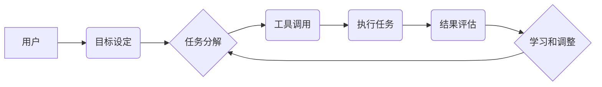

> AutoGPT, 大模型, AI Agent, 应用开发, 编程, 自动化, 

## 1. 背景介绍

近年来，大模型技术取得了飞速发展，其强大的语言理解和生成能力为人工智能的应用开辟了广阔的领域。然而，大模型的应用往往局限于特定的任务，缺乏灵活性和自主性。为了解决这一问题，AutoGPT 应运而生。

AutoGPT 是一种基于大型语言模型（LLM）的自治代理，它能够根据用户给定的目标，自主地规划、执行和评估任务。AutoGPT 具有以下特点：

* **自主性:** AutoGPT 可以根据目标自动生成执行计划，并根据计划的执行结果进行调整。
* **多步骤推理:** AutoGPT 可以进行多步骤推理，解决复杂的任务。
* **记忆和上下文:** AutoGPT 可以记住之前的对话和执行结果，并将其用于后续任务的执行。
* **可扩展性:** AutoGPT 可以与其他工具和服务集成，扩展其功能。

## 2. 核心概念与联系

AutoGPT 的核心概念是将大模型与强化学习算法相结合，使其能够自主地学习和改进。

**AutoGPT 架构**



**核心概念:**

* **大模型 (LLM):**  AutoGPT 基于强大的语言模型，例如 GPT-3.5 或 GPT-4，这些模型能够理解和生成人类语言。
* **强化学习 (RL):**  AutoGPT 使用强化学习算法来训练模型，使其能够根据任务结果获得奖励，并不断改进执行策略。
* **任务分解:** AutoGPT 将复杂的任务分解成一系列更小的子任务，并分别执行。
* **工具调用:** AutoGPT 可以调用外部工具和服务，例如搜索引擎、数据库、代码执行器等，以完成任务。
* **结果评估:** AutoGPT 会评估每个子任务的结果，并根据评估结果调整执行策略。

## 3. 核心算法原理 & 具体操作步骤

### 3.1  算法原理概述

AutoGPT 的核心算法原理是基于强化学习的**代理学习**。代理学习的目标是训练一个代理，使其能够在环境中自主地采取行动，以最大化累积的奖励。

AutoGPT 的代理学习过程可以概括为以下步骤：

1. **环境感知:** 代理通过感知环境信息，例如用户输入、历史记录等，来了解当前状态。
2. **目标设定:** 代理根据用户给定的目标，设定相应的奖励函数。
3. **行动选择:** 代理根据当前状态和奖励函数，选择最优的行动。
4. **环境反馈:** 代理执行行动后，环境会反馈相应的奖励和新的状态。
5. **策略更新:** 代理根据环境反馈，更新其策略，以提高未来获得奖励的概率。

### 3.2  算法步骤详解

1. **初始化:**  AutoGPT 初始化一个代理，并设置其初始状态和策略。
2. **目标设定:** 用户向 AutoGPT 提供一个目标，例如“写一篇关于 AutoGPT 的博客文章”。
3. **任务分解:** AutoGPT 将目标分解成一系列子任务，例如“收集关于 AutoGPT 的信息”、“撰写文章框架”、“编写文章内容”等。
4. **行动选择:**  对于每个子任务，AutoGPT 会根据其策略选择相应的行动，例如“搜索网络获取相关信息”、“生成文章框架”、“使用语言模型生成文章内容”等。
5. **工具调用:** AutoGPT 会调用相应的工具和服务来执行行动，例如使用搜索引擎获取信息、使用代码执行器生成代码等。
6. **结果评估:** AutoGPT 会评估每个子任务的结果，并根据评估结果更新其策略。
7. **循环执行:** AutoGPT 会重复步骤 4-6，直到完成所有子任务，并最终完成用户给定的目标。

### 3.3  算法优缺点

**优点:**

* **自主性:** AutoGPT 可以自主地规划和执行任务，无需人工干预。
* **多步骤推理:** AutoGPT 可以进行多步骤推理，解决复杂的任务。
* **可扩展性:** AutoGPT 可以与其他工具和服务集成，扩展其功能。

**缺点:**

* **训练成本:** 训练 AutoGPT 需要大量的计算资源和数据。
* **可靠性:** AutoGPT 的执行结果可能受到环境因素和模型偏差的影响，可靠性需要进一步提高。
* **安全性:** AutoGPT 的自主性也带来了一些安全风险，需要采取相应的安全措施。

### 3.4  算法应用领域

AutoGPT 的应用领域非常广泛，例如：

* **内容创作:** 自动生成文章、故事、诗歌等内容。
* **代码生成:** 自动生成代码、修复代码错误等。
* **任务自动化:** 自动化日常任务，例如发送邮件、预约会议等。
* **数据分析:** 自动分析数据，发现隐藏的模式和趋势。
* **客户服务:** 自动回复客户咨询，提供个性化服务。

## 4. 数学模型和公式 & 详细讲解 & 举例说明

### 4.1  数学模型构建

AutoGPT 的核心数学模型是基于强化学习的**价值函数**和**策略网络**。

* **价值函数 (V(s))**:  价值函数用来评估代理在某个状态 s 下的预期奖励。
* **策略网络 (π(a|s))**:  策略网络用来预测代理在某个状态 s 下选择动作 a 的概率。

### 4.2  公式推导过程

AutoGPT 使用**深度强化学习 (Deep RL)** 的算法来训练价值函数和策略网络。常用的算法包括**深度 Q 网络 (DQN)** 和**策略梯度 (Policy Gradient)**。

* **DQN**:  DQN 使用 Q 值表来存储每个状态-动作对的预期奖励，并通过神经网络来逼近 Q 值表。
* **策略梯度**:  策略梯度直接优化策略网络的参数，使其能够最大化累积的奖励。

### 4.3  案例分析与讲解

假设 AutoGPT 正在执行一个任务，目标是找到一个特定的文件。

* **状态 (s)**:  AutoGPT 的当前状态，例如搜索历史、文件路径等。
* **动作 (a)**:  AutoGPT 可以执行的动作，例如搜索文件、打开文件、关闭文件等。
* **奖励 (r)**:  AutoGPT 执行动作后获得的奖励，例如找到文件获得高奖励，找不到文件获得低奖励。

通过训练 DQN 或策略梯度算法，AutoGPT 可以学习到一个 Q 值表或策略网络，从而能够在不同的状态下选择最优的动作，以最大化找到文件的奖励。

## 5. 项目实践：代码实例和详细解释说明

### 5.1  开发环境搭建

AutoGPT 的开发环境需要包含以下软件：

* **Python:**  AutoGPT 基于 Python 语言开发。
* **PyTorch 或 TensorFlow:**  AutoGPT 使用深度学习框架来训练模型。
* **OpenAI API:**  AutoGPT 需要调用 OpenAI 的 API 来使用 GPT-3.5 或 GPT-4 模型。

### 5.2  源代码详细实现

AutoGPT 的源代码可以从 GitHub 上获取。

```python
# AutoGPT.py

import openai
import os

# 设置 OpenAI API 密钥
openai.api_key = os.getenv("OPENAI_API_KEY")

# 定义 AutoGPT 类
class AutoGPT:
    def __init__(self, target):
        self.target = target

    # 定义目标分解方法
    def decompose_task(self):
        # ...

    # 定义行动选择方法
    def choose_action(self, state):
        # ...

    # 定义工具调用方法
    def call_tool(self, action):
        # ...

    # 定义结果评估方法
    def evaluate_result(self, result):
        # ...

    # 定义训练方法
    def train(self):
        # ...

# 创建 AutoGPT 实例
agent = AutoGPT("写一篇关于 AutoGPT 的博客文章")

# 启动 AutoGPT
agent.train()
```

### 5.3  代码解读与分析

* **`__init__` 方法:**  初始化 AutoGPT 实例，设置目标。
* **`decompose_task` 方法:**  将目标分解成一系列子任务。
* **`choose_action` 方法:**  根据当前状态选择最优的动作。
* **`call_tool` 方法:**  调用相应的工具和服务执行动作。
* **`evaluate_result` 方法:**  评估每个子任务的结果。
* **`train` 方法:**  训练 AutoGPT 模型。

### 5.4  运行结果展示

运行 AutoGPT 后，它会根据目标和环境信息，自主地规划和执行任务，最终生成一篇关于 AutoGPT 的博客文章。

## 6. 实际应用场景

AutoGPT 的实际应用场景非常广泛，例如：

### 6.1  内容创作

* 自动生成新闻报道、博客文章、社交媒体内容等。
* 创作小说、诗歌、剧本等创意内容。

### 6.2  代码生成

* 自动生成代码模板、函数代码、类代码等。
* 自动修复代码错误、优化代码性能等。

### 6.3  任务自动化

* 自动化日常办公任务，例如发送邮件、预约会议、整理文档等。
* 自动化数据处理任务，例如数据清洗、数据分析、数据可视化等。

### 6.4  未来应用展望

随着大模型技术和强化学习算法的不断发展，AutoGPT 的应用场景将会更加广泛，例如：

* **个性化教育:**  根据学生的学习情况，自动生成个性化的学习计划和内容。
* **智能客服:**  提供更加智能、个性化的客户服务体验。
* **科学研究:**  加速科学研究的进程，例如药物研发、材料科学等。

## 7. 工具和资源推荐

### 7.1  学习资源推荐

* **OpenAI API 文档:** https://platform.openai.com/docs/api-reference
* **Deep RL 课程:** https://www.deeplearning.ai/courses/reinforcement-learning/

### 7.2  开发工具推荐

* **Python:** https://www.python.org/
* **PyTorch:** https://pytorch.org/
* **TensorFlow:** https://www.tensorflow.org/

### 7.3  相关论文推荐

* **Auto-GPT: An Open-Source Framework for Autonomous Agents**
* **Deep Reinforcement Learning: An Overview**

## 8. 总结：未来发展趋势与挑战

### 8.1  研究成果总结

AutoGPT 的研究成果表明，将大模型与强化学习算法相结合，可以构建出具有自主性和学习能力的 AI 代理。

### 8.2  未来发展趋势

未来 AutoGPT 的发展趋势包括：

* **模型能力提升:**  利用更强大的大模型和更先进的强化学习算法，提升 AutoGPT 的执行能力和智能水平。
* **多模态交互:**  支持多模态交互，例如文本、图像、音频等，使 AutoGPT 能够处理更复杂的任务。
* **安全性和可靠性:**  加强 AutoGPT 的安全性和可靠性，使其能够在更广泛的场景下安全地应用。

### 8.3  面临的挑战

AutoGPT 还面临着一些挑战，例如：

* **训练成本:**  训练 AutoGPT 需要大量的计算资源和数据，成本较高。
* **可靠性:**  AutoGPT 的执行结果可能受到环境因素和模型偏差的影响，可靠性需要进一步提高。
* **安全性:**  AutoGPT 的自主性也带来了一些安全风险，需要采取相应的安全措施。

### 8.4  研究展望

未来，AutoGPT 将继续朝着更智能、更安全、更可靠的方向发展，并将在更多领域发挥重要作用。


## 9. 附录：常见问题与解答

**Q1: AutoGPT 是开源的吗？**

A1: 是的，AutoGPT 的源代码可以在 GitHub 上获取。

**Q2: