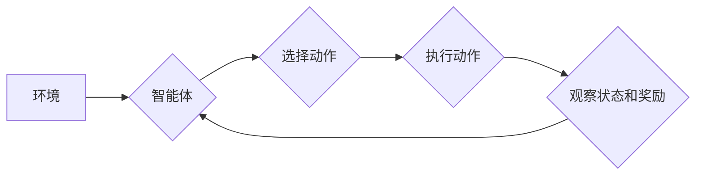

> Q-learning, 流量预测, 深度学习, 强化学习, 算法优化

## 1. 背景介绍

随着互联网的蓬勃发展，网络流量呈指数级增长，流量预测已成为网络运营、资源规划和服务质量保障的关键环节。传统的流量预测方法主要依赖于统计模型和历史数据，但这些方法难以捕捉流量的复杂性和非线性特征。近年来，深度学习和强化学习等人工智能技术为流量预测提供了新的思路和方法。

强化学习（Reinforcement Learning，RL）是一种机器学习范式，它通过智能体与环境的交互学习最优策略。Q-learning是RL领域最经典的算法之一，它通过学习状态-动作价值函数（Q-value）来指导智能体的决策。Q-learning算法具有学习能力强、适应性好、能够处理复杂环境等特点，使其在流量预测领域具有广阔的应用前景。

## 2. 核心概念与联系

### 2.1 强化学习框架

强化学习的核心概念是智能体与环境的交互过程。智能体通过感知环境的状态，选择动作并执行，从而获得奖励或惩罚。智能体的目标是通过不断学习和调整策略，最大化累积的奖励。

**强化学习框架主要包含以下几个要素：**

* **智能体（Agent）：** 决策者，通过感知环境并选择动作来影响环境状态。
* **环境（Environment）：** 智能体所处的外部世界，会根据智能体的动作产生新的状态和奖励。
* **状态（State）：** 环境的当前描述，例如网络流量、用户数量等。
* **动作（Action）：** 智能体可以执行的操作，例如调整带宽、优化路由等。
* **奖励（Reward）：** 环境对智能体动作的反馈，可以是正向奖励或负向惩罚。
* **策略（Policy）：** 智能体根据当前状态选择动作的规则。

**Q-learning算法是一种基于价值函数的强化学习算法，其核心思想是学习状态-动作价值函数（Q-value），Q-value表示在当前状态执行某个动作后，未来累积的奖励期望值。**

### 2.2 Q-learning算法原理

**Q-learning算法通过迭代更新Q-value来学习最优策略。**

**算法流程如下：**

1. 初始化Q-value表，将所有Q-value设置为0。
2. 在环境中进行交互，智能体根据策略选择动作，并观察环境状态和奖励。
3. 更新Q-value表，根据Bellman方程计算新的Q-value。
4. 重复步骤2和3，直到Q-value表收敛。

**Bellman方程：**

$$Q(s,a) = Q(s,a) + \alpha [r + \gamma \max_{a'} Q(s',a') - Q(s,a)]$$

其中：

* $Q(s,a)$：状态$s$下执行动作$a$的Q-value。
* $\alpha$：学习率，控制学习速度。
* $r$：当前状态下获得的奖励。
* $\gamma$：折扣因子，控制未来奖励的权重。
* $s'$：执行动作$a$后进入的新状态。
* $a'$：在新的状态$s'$下选择的最优动作。

**Mermaid 流程图：**



## 3. 核心算法原理 & 具体操作步骤

### 3.1 算法原理概述

Q-learning算法的核心思想是通过学习状态-动作价值函数（Q-value）来指导智能体的决策。Q-value表示在当前状态执行某个动作后，未来累积的奖励期望值。

**Q-learning算法的学习过程可以概括为以下几个步骤：**

1. **初始化Q-value表：** 将所有状态-动作对的Q-value设置为0。
2. **根据策略选择动作：** 智能体根据当前状态和策略选择一个动作。
3. **执行动作并观察环境反馈：** 智能体执行选择的动作，并观察环境状态和奖励。
4. **更新Q-value表：** 根据Bellman方程更新状态-动作对的Q-value。
5. **重复步骤2-4：** 重复以上步骤，直到Q-value表收敛。

### 3.2 算法步骤详解

**1. 初始化Q-value表：**

Q-value表是一个二维数组，其中每一行代表一个状态，每一列代表一个动作。初始化时，将所有Q-value设置为0。

**2. 根据策略选择动作：**

在开始学习之前，需要选择一个策略来指导智能体选择动作。常见的策略包括：

* **ε-贪婪策略：** 以概率ε随机选择一个动作，以概率1-ε选择Q-value最大的动作。
* **softmax策略：** 根据每个动作的Q-value计算概率，选择概率最大的动作。

**3. 执行动作并观察环境反馈：**

智能体执行选择的动作，并观察环境状态和奖励。

**4. 更新Q-value表：**

根据Bellman方程更新状态-动作对的Q-value：

$$Q(s,a) = Q(s,a) + \alpha [r + \gamma \max_{a'} Q(s',a') - Q(s,a)]$$

其中：

* $Q(s,a)$：状态$s$下执行动作$a$的Q-value。
* $\alpha$：学习率，控制学习速度。
* $r$：当前状态下获得的奖励。
* $\gamma$：折扣因子，控制未来奖励的权重。
* $s'$：执行动作$a$后进入的新状态。
* $a'$：在新的状态$s'$下选择的最优动作。

**5. 重复步骤2-4：**

重复以上步骤，直到Q-value表收敛。

### 3.3 算法优缺点

**优点：**

* 学习能力强：能够学习复杂环境下的最优策略。
* 适应性好：能够适应环境变化。
* 能够处理离散动作空间。

**缺点：**

* 训练时间长：需要大量的训练数据和时间。
* 容易陷入局部最优解。
* 需要设置学习率和折扣因子等超参数。

### 3.4 算法应用领域

Q-learning算法在许多领域都有应用，例如：

* **机器人控制：** 训练机器人学习最优的运动策略。
* **游戏人工智能：** 训练游戏角色学习最优的游戏策略。
* **推荐系统：** 训练推荐系统学习用户的偏好。
* **金融交易：** 训练交易策略学习最优的交易决策。

## 4. 数学模型和公式 & 详细讲解 & 举例说明

### 4.1 数学模型构建

**流量预测模型可以看作是一个状态空间和动作空间的映射关系。**

* **状态空间：** 包含网络流量、用户数量、时间等特征。
* **动作空间：** 包含调整带宽、优化路由、缓存策略等操作。

**Q-learning算法的目标是学习一个状态-动作价值函数（Q-value），该函数将每个状态-动作对映射到一个奖励期望值。**

### 4.2 公式推导过程

**Bellman方程是Q-learning算法的核心公式，它描述了Q-value的更新规则：**

$$Q(s,a) = Q(s,a) + \alpha [r + \gamma \max_{a'} Q(s',a') - Q(s,a)]$$

其中：

* $Q(s,a)$：状态$s$下执行动作$a$的Q-value。
* $\alpha$：学习率，控制学习速度。
* $r$：当前状态下获得的奖励。
* $\gamma$：折扣因子，控制未来奖励的权重。
* $s'$：执行动作$a$后进入的新状态。
* $a'$：在新的状态$s'$下选择的最优动作。

**公式推导过程：**

Bellman方程的推导基于动态规划的思想。它表示当前状态下执行动作$a$的Q-value应该等于当前Q-value加上学习率乘以奖励加未来最优Q-value的期望值减去当前Q-value。

### 4.3 案例分析与讲解

**假设我们有一个简单的流量预测模型，状态空间包含当前时间和流量，动作空间包含调整带宽。**

* **状态：** (时间=10:00, 流量=1000)
* **动作：** 调整带宽为1200

**如果执行这个动作后，奖励为100，并且折扣因子为0.9，那么根据Bellman方程，我们可以更新Q-value：**

$$Q(10:00, 1000, 调整带宽为1200) = Q(10:00, 1000, 调整带宽为1200) + \alpha [100 + 0.9 \max_{a'} Q(s',a') - Q(10:00, 1000, 调整带宽为1200)]$$

其中：

* $s'$：执行动作后进入的新状态，例如(时间=10:05, 流量=1100)。
* $a'$：在新的状态$s'$下选择的最优动作。

**通过不断更新Q-value，Q-learning算法可以学习到最优的带宽调整策略。**

## 5. 项目实践：代码实例和详细解释说明

### 5.1 开发环境搭建

**开发环境：**

* 操作系统：Ubuntu 20.04
* Python版本：3.8
* 库依赖：

```
pip install numpy pandas matplotlib tensorflow
```

### 5.2 源代码详细实现

```python
import numpy as np
import pandas as pd
from tensorflow.keras.models import Sequential
from tensorflow.keras.layers import Dense

# 数据加载和预处理
# ...

# Q-learning算法实现
class QLearningAgent:
    def __init__(self, state_size, action_size, learning_rate=0.1, discount_factor=0.9):
        self.state_size = state_size
        self.action_size = action_size
        self.learning_rate = learning_rate
        self.discount_factor = discount_factor
        self.q_table = np.zeros((state_size, action_size))

    def choose_action(self, state):
        # 使用ε-贪婪策略选择动作
        if np.random.rand() < 0.1:
            return np.random.randint(self.action_size)
        else:
            return np.argmax(self.q_table[state])

    def update_q_table(self, state, action, reward, next_state):
        # 更新Q-table
        self.q_table[state, action] = self.q_table[state, action] + self.learning_rate * (
            reward + self.discount_factor * np.max(self.q_table[next_state]) - self.q_table[state, action]
        )

# 训练Q-learning算法
agent = QLearningAgent(state_size, action_size)
# ...
```

### 5.3 代码解读与分析

**代码解读：**

* **数据加载和预处理：** 首先需要加载和预处理流量数据，将其转换为适合Q-learning算法输入的格式。
* **QLearningAgent类：** 定义了Q-learning智能体，包含状态空间、动作空间、学习率、折扣因子和Q-table。
* **choose_action方法：** 使用ε-贪婪策略选择动作。
* **update_q_table方法：** 根据Bellman方程更新Q-table。
*