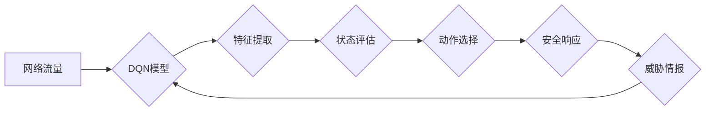

> 深度强化学习，DQN，安全防御，智能检测，响应自动化，威胁情报

## 1. 背景介绍

在当今数字时代，网络安全威胁日益复杂，传统的安全防御机制难以有效应对不断演变的攻击手段。面对海量数据和复杂的攻击场景，安全运营团队需要高效、智能地识别和响应威胁。深度强化学习（Deep Reinforcement Learning，DRL）作为一种新兴的机器学习技术，凭借其强大的学习能力和适应性，为安全防御领域带来了新的希望。

深度强化学习的核心思想是通过训练智能代理，使其在与环境交互的过程中不断学习和优化策略，最终达到预设的目标。在安全防御领域，我们可以将智能代理视为安全分析引擎，环境视为网络攻击场景，目标视为识别和响应威胁。通过训练DQN模型，可以使其学习识别不同类型的网络攻击，并自动采取相应的防御措施。

## 2. 核心概念与联系

### 2.1 深度强化学习

深度强化学习（DRL）是一种机器学习方法，它结合了深度神经网络和强化学习算法。

* **深度神经网络（DNN）**：用于提取网络数据中的特征和模式，例如网络流量、系统日志等。
* **强化学习（RL）**：通过奖励机制引导智能代理学习最优策略，以最大化累积奖励。

在DRL中，智能代理与环境交互，根据环境的反馈（奖励或惩罚）调整其策略，最终学习到最优的行动策略。

### 2.2 DQN算法

DQN（Deep Q-Network）是深度强化学习中的一种经典算法，它利用深度神经网络来估计状态-动作值函数（Q-value），并通过经验回放和目标网络来稳定训练过程。

DQN算法的核心思想是：

* **状态-动作值函数（Q-value）**：表示在给定状态下执行特定动作的期望累积奖励。
* **目标网络**：用于评估目标Q-value，并与主网络进行对比更新。
* **经验回放**：将训练过程中收集到的经验存储在经验池中，并随机采样经验进行训练，以缓解训练过程中的样本相关性问题。

### 2.3 安全防御场景

在安全防御场景中，我们可以将DQN算法应用于以下任务：

* **入侵检测**：识别网络流量中的恶意行为，例如扫描、拒绝服务攻击等。
* **恶意软件检测**：识别恶意软件的特征，并将其隔离或删除。
* **漏洞利用检测**：检测攻击者利用漏洞进行攻击的行为。
* **安全响应自动化**：自动执行安全响应措施，例如封锁恶意IP地址、隔离受感染主机等。

**Mermaid 流程图**



## 3. 核心算法原理 & 具体操作步骤

### 3.1 算法原理概述

DQN算法的核心是学习一个状态-动作值函数（Q-value），该函数能够估计在给定状态下执行特定动作的期望累积奖励。DQN算法利用深度神经网络来逼近Q-value函数，并通过强化学习的原理进行训练。

训练过程如下：

1. 智能代理与环境交互，收集状态、动作、奖励和下一个状态的经验。
2. 将收集到的经验存储在经验池中。
3. 从经验池中随机采样经验，并利用深度神经网络估计Q-value。
4. 计算损失函数，并利用梯度下降算法更新神经网络的权重。
5. 重复步骤3和4，直到模型收敛。

### 3.2 算法步骤详解

1. **环境初始化**: 设置网络安全防御环境，包括网络拓扑、攻击场景、安全策略等。
2. **状态表示**: 将网络安全环境的状态表示为一个向量，例如网络流量特征、系统日志信息等。
3. **动作空间**: 定义智能代理可以执行的动作，例如封锁IP地址、隔离主机、更新安全策略等。
4. **奖励函数**: 设计一个奖励函数，根据智能代理的动作和环境的变化给予奖励或惩罚。
5. **DQN模型训练**: 利用深度神经网络构建DQN模型，并通过强化学习算法进行训练。
6. **策略评估**: 利用训练好的DQN模型评估其在不同场景下的性能，例如识别率、响应时间等。
7. **策略优化**: 根据策略评估结果，调整DQN模型的训练参数或网络结构，以提高其性能。

### 3.3 算法优缺点

**优点**:

* **学习能力强**: DQN算法能够学习复杂的网络安全防御策略，并适应不断变化的攻击场景。
* **自动化程度高**: DQN算法可以自动识别和响应威胁，减轻安全运营团队的工作负担。
* **可扩展性强**: DQN算法可以应用于各种规模的网络安全防御场景。

**缺点**:

* **训练时间长**: DQN算法的训练过程需要大量的数据和计算资源，训练时间较长。
* **数据依赖性强**: DQN算法的性能取决于训练数据的质量和数量。
* **解释性差**: DQN模型的决策过程较为复杂，难以解释其决策依据。

### 3.4 算法应用领域

DQN算法在安全防御领域具有广泛的应用前景，例如：

* **入侵检测**: 识别网络流量中的恶意行为，例如扫描、拒绝服务攻击等。
* **恶意软件检测**: 识别恶意软件的特征，并将其隔离或删除。
* **漏洞利用检测**: 检测攻击者利用漏洞进行攻击的行为。
* **安全响应自动化**: 自动执行安全响应措施，例如封锁恶意IP地址、隔离受感染主机等。

## 4. 数学模型和公式 & 详细讲解 & 举例说明

### 4.1 数学模型构建

DQN算法的核心是学习一个状态-动作值函数（Q-value），该函数能够估计在给定状态下执行特定动作的期望累积奖励。

数学模型如下：

$$Q(s, a) = E[\sum_{t=0}^{\infty} \gamma^t r_{t+1}|s_t = s, a_t = a]$$

其中：

* $Q(s, a)$：状态 $s$ 下执行动作 $a$ 的Q-value。
* $r_{t+1}$：时间步 $t+1$ 的奖励。
* $\gamma$：折扣因子，控制未来奖励的权重。
* $E$：期望值。

### 4.2 公式推导过程

DQN算法利用深度神经网络来逼近Q-value函数，并通过强化学习的原理进行训练。

训练目标是最小化以下损失函数：

$$L = \frac{1}{N} \sum_{i=1}^{N} (y_i - Q(s_i, a_i))^2$$

其中：

* $N$：训练样本的数量。
* $y_i$：目标Q-value，计算公式如下：

$$y_i = r_{i+1} + \gamma \max_{a'} Q(s_{i+1}, a')$$

* $Q(s_i, a_i)$：模型预测的Q-value。

### 4.3 案例分析与讲解

假设我们训练一个DQN模型用于识别网络流量中的恶意行为。

* **状态**: 网络流量特征，例如源IP地址、目的IP地址、端口号、协议类型等。
* **动作**: 封锁IP地址、隔离主机、更新安全策略等。
* **奖励**: 如果智能代理正确识别恶意行为，则给予正向奖励；否则给予负向奖励。

通过训练DQN模型，我们可以学习到一个Q-value函数，该函数能够估计在给定网络流量特征下执行特定动作的期望累积奖励。

## 5. 项目实践：代码实例和详细解释说明

### 5.1 开发环境搭建

* **操作系统**: Ubuntu 20.04
* **Python版本**: 3.8
* **深度学习框架**: TensorFlow 2.0
* **其他依赖**: numpy, matplotlib, seaborn等

### 5.2 源代码详细实现

```python
import tensorflow as tf
import numpy as np

# 定义DQN模型
class DQN(tf.keras.Model):
    def __init__(self, state_size, action_size):
        super(DQN, self).__init__()
        self.dense1 = tf.keras.layers.Dense(64, activation='relu')
        self.dense2 = tf.keras.layers.Dense(32, activation='relu')
        self.output = tf.keras.layers.Dense(action_size)

    def call(self, state):
        x = self.dense1(state)
        x = self.dense2(x)
        return self.output(x)

# 定义训练函数
def train_dqn(model, experience_replay_buffer, batch_size, gamma, epsilon):
    # 从经验池中采样数据
    batch = random.sample(experience_replay_buffer, batch_size)

    # 计算目标Q-value
    with tf.GradientTape() as tape:
        states = tf.convert_to_tensor([sample[0] for sample in batch])
        actions = tf.convert_to_tensor([sample[1] for sample in batch])
        rewards = tf.convert_to_tensor([sample[2] for sample in batch])
        next_states = tf.convert_to_tensor([sample[3] for sample in batch])
        dones = tf.convert_to_tensor([sample[4] for sample in batch])

        # 获取模型预测的Q-value
        q_values = model(states)
        q_target = rewards + gamma * tf.reduce_max(model(next_states), axis=1) * (1 - dones)

        # 计算损失函数
        loss = tf.keras.losses.MeanSquaredError()(q_target, q_values)

    # 更新模型参数
    gradients = tape.gradient(loss, model.trainable_variables)
    optimizer.apply_gradients(zip(gradients, model.trainable_variables))

# 训练DQN模型
model = DQN(state_size, action_size)
optimizer = tf.keras.optimizers.Adam(learning_rate=0.001)
experience_replay_buffer = []

for episode in range(num_episodes):
    # 初始化状态
    state = env.reset()

    # 训练一个episode
    done = False
    while not done:
        # 选择动作
        action = choose_action(state, epsilon)

        # 执行动作
        next_state, reward, done, _ = env.step(action)

        # 存储经验
        experience_replay_buffer.append((state, action, reward, next_state, done))

        # 更新状态
        state = next_state

        # 训练模型
        if len(experience_replay_buffer) >= batch_size:
            train_dqn(model, experience_replay_buffer, batch_size, gamma, epsilon)

```

### 5.3 代码解读与分析

* **DQN模型**: 使用深度神经网络构建DQN模型，包含两层全连接层和一层输出层。
* **训练函数**: 定义训练函数，包括从经验池中采样数据、计算目标Q-value、计算损失函数和更新模型参数。
* **训练循环**: 训练DQN模型，包括初始化状态、执行动作、存储经验和训练模型。

### 5.4 运行结果展示

训练完成后，可以评估DQN模型的性能，例如识别率、响应时间等。

## 6. 实际应用场景

DQN算法在安全防御领域具有广泛的应用场景，例如：

* **入侵检测**: DQN可以学习识别网络流量中的恶意行为，例如扫描、拒绝服务攻击等。
* **恶意软件检测**: DQN可以学习识别恶意软件的