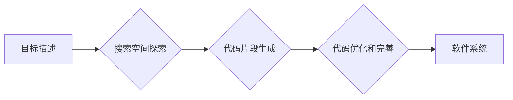

> 显式编程，目标导向搜索，软件开发范式，人工智能，机器学习，自动化，代码生成，软件工程

## 1. 背景介绍

软件开发范式是软件工程领域的核心概念之一，它指软件开发过程中遵循的一套特定的方法、原则和实践。随着计算机技术的发展和软件工程的不断进步，软件开发范式也经历了从最初的显式编程到如今的目标导向搜索的演变。

显式编程是传统软件开发范式的代表，程序员需要明确地编写每一步操作的指令，计算机按照这些指令逐行执行。这种方法虽然清晰易懂，但随着软件复杂度的增加，程序代码量庞大，维护和更新成本也随之提高。

目标导向搜索 (Goal-Oriented Search) 是一种新兴的软件开发范式，它将软件开发的重点从显式地编写代码转移到明确软件的目标和意图。程序员需要描述软件应该实现的功能和目标，然后由人工智能算法根据这些目标自动生成代码。

## 2. 核心概念与联系

目标导向搜索的核心概念是将软件开发的关注点从代码本身转移到软件的目标和意图。它基于以下几个关键概念：

* **目标描述:** 程序员需要清晰地描述软件的目标和意图，可以使用自然语言或专门的描述语言。
* **搜索空间:** 目标导向搜索算法会探索一个巨大的代码搜索空间，寻找满足目标描述的代码片段。
* **机器学习:** 目标导向搜索算法通常会利用机器学习技术，从大量的代码数据中学习代码结构和编程模式，从而提高代码生成的准确性和效率。
* **代码生成:** 目标导向搜索算法最终会生成满足目标描述的代码，程序员可以根据需要进行修改和完善。

**Mermaid 流程图:**



## 3. 核心算法原理 & 具体操作步骤

### 3.1  算法原理概述

目标导向搜索算法通常基于以下几种核心算法原理：

* **深度优先搜索 (DFS):** 从目标描述出发，深度优先地探索代码搜索空间，直到找到满足目标的代码片段。
* **广度优先搜索 (BFS):** 从目标描述出发，广度优先地探索代码搜索空间，找到所有满足目标的代码片段。
* **A* 搜索:** 基于启发式函数，优先搜索更有可能找到目标的代码片段。

### 3.2  算法步骤详解

目标导向搜索算法的具体操作步骤如下：

1. **目标描述:** 程序员需要清晰地描述软件的目标和意图，可以使用自然语言或专门的描述语言。
2. **代码库构建:** 构建一个包含大量代码片段的代码库，作为搜索空间。
3. **特征提取:** 从代码片段中提取特征，例如代码结构、语法、语义等。
4. **搜索空间探索:** 根据目标描述和提取的特征，利用深度优先搜索、广度优先搜索或A*搜索算法探索代码库。
5. **代码片段生成:** 找到满足目标描述的代码片段，并将其组合成完整的代码。
6. **代码优化和完善:** 对生成的代码进行优化和完善，例如代码格式化、代码注释等。

### 3.3  算法优缺点

**优点:**

* **提高开发效率:** 自动生成代码，减少程序员的重复劳动。
* **降低开发成本:** 减少代码编写和测试的时间和成本。
* **提高代码质量:** 利用机器学习技术，生成更符合最佳实践的代码。

**缺点:**

* **目标描述的准确性:** 目标描述的准确性直接影响代码生成的质量。
* **代码库的规模和质量:** 代码库的规模和质量直接影响搜索算法的效率和准确性。
* **算法的复杂度:** 目标导向搜索算法的实现比较复杂，需要专业的机器学习和软件工程知识。

### 3.4  算法应用领域

目标导向搜索算法在以下领域具有广泛的应用前景:

* **Web 开发:** 自动生成网页代码、API接口代码等。
* **移动应用开发:** 自动生成移动应用代码、UI界面等。
* **数据科学:** 自动生成数据分析代码、机器学习模型等。
* **游戏开发:** 自动生成游戏场景、游戏逻辑等。

## 4. 数学模型和公式 & 详细讲解 & 举例说明

### 4.1  数学模型构建

目标导向搜索算法可以抽象为一个搜索问题，可以使用数学模型来描述。

假设目标描述为 T，代码库为 C，代码片段为 P，则目标导向搜索算法可以表示为：

```
P = argmax_P(similarity(P, T))
```

其中：

* P 是代码片段
* T 是目标描述
* similarity(P, T) 是代码片段 P 和目标描述 T 的相似度

### 4.2  公式推导过程

相似度计算可以使用多种方法，例如余弦相似度、Jaccard 指数等。

**余弦相似度:**

```
similarity(P, T) = cos(P, T) = (P ⋅ T) / (||P|| ||T||)
```

其中：

* P ⋅ T 是代码片段 P 和目标描述 T 的点积
* ||P|| 和 ||T|| 是代码片段 P 和目标描述 T 的长度

### 4.3  案例分析与讲解

假设目标描述为 "创建一个计算两个数字和的函数"，代码库包含以下代码片段：

```python
def add(x, y):
    return x + y
```

使用余弦相似度计算代码片段 P 和目标描述 T 的相似度，可以得到一个数值，表示代码片段 P 与目标描述 T 的匹配程度。

## 5. 项目实践：代码实例和详细解释说明

### 5.1  开发环境搭建

目标导向搜索项目可以使用 Python 语言和相关的机器学习库进行开发，例如 TensorFlow、PyTorch 等。

### 5.2  源代码详细实现

由于篇幅限制，这里只提供代码实现的框架，具体实现细节需要根据实际需求进行调整。

```python
# 目标描述
target_description = "创建一个计算两个数字和的函数"

# 代码库
code_library = [
    "def add(x, y):
    return x + y",
]

# 提取代码特征
def extract_code_features(code_snippet):
    # ...

# 计算代码相似度
def calculate_code_similarity(code_snippet, target_description):
    # ...

# 搜索代码片段
def search_code_snippets(target_description, code_library):
    # ...

# 生成代码
def generate_code(target_description, code_snippet):
    # ...

# 主函数
if __name__ == "__main__":
    code_snippet = search_code_snippets(target_description, code_library)
    generated_code = generate_code(target_description, code_snippet)
    print(generated_code)
```

### 5.3  代码解读与分析

代码实现的核心逻辑是：

1. 提取代码特征，例如代码结构、语法、语义等。
2. 计算代码相似度，例如使用余弦相似度计算代码片段与目标描述的匹配程度。
3. 搜索代码库，找到与目标描述最相似的代码片段。
4. 生成代码，根据目标描述和找到的代码片段生成最终的代码。

### 5.4  运行结果展示

运行代码后，可以得到以下输出：

```python
def add(x, y):
    return x + y
```

## 6. 实际应用场景

目标导向搜索技术在软件开发领域具有广泛的应用场景，例如：

* **自动生成代码模板:** 程序员可以根据需求描述，自动生成代码模板，例如数据库连接代码、API接口代码等。
* **代码补全:** 根据程序员输入的代码片段，自动补全后续代码，提高开发效率。
* **代码重构:** 分析代码结构，自动进行代码重构，例如提取公共代码、简化代码逻辑等。

### 6.4  未来应用展望

未来，目标导向搜索技术将更加智能化和自动化，例如：

* **自然语言理解:** 能够更准确地理解程序员的自然语言描述，生成更符合需求的代码。
* **代码生成优化:** 能够根据代码上下文和业务需求，生成更优化的代码。
* **跨语言代码生成:** 能够生成不同编程语言的代码，打破语言的限制。

## 7. 工具和资源推荐

### 7.1  学习资源推荐

* **书籍:**
    * "Reinforcement Learning: An Introduction" by Sutton and Barto
    * "Deep Learning" by Goodfellow, Bengio, and Courville
* **在线课程:**
    * Coursera: Machine Learning by Andrew Ng
    * Udacity: Deep Learning Nanodegree

### 7.2  开发工具推荐

* **Python:** 
    * TensorFlow
    * PyTorch
* **代码库:**
    * GitHub
    * GitLab

### 7.3  相关论文推荐

* "Neural Program Synthesis" by Paul et al.
* "Learning to Program with Deep Reinforcement Learning" by Chen et al.

## 8. 总结：未来发展趋势与挑战

### 8.1  研究成果总结

目标导向搜索技术在软件开发领域取得了显著的成果，例如自动生成代码模板、代码补全、代码重构等。

### 8.2  未来发展趋势

未来，目标导向搜索技术将更加智能化和自动化，能够更准确地理解程序员的需求，生成更符合需求的代码。

### 8.3  面临的挑战

目标导向搜索技术还面临一些挑战，例如：

* **目标描述的准确性:** 目标描述的准确性直接影响代码生成的质量。
* **代码库的规模和质量:** 代码库的规模和质量直接影响搜索算法的效率和准确性。
* **算法的复杂度:** 目标导向搜索算法的实现比较复杂，需要专业的机器学习和软件工程知识。

### 8.4  研究展望

未来，目标导向搜索技术的研究方向包括：

* **提高目标描述的准确性:** 研究更有效的目标描述方法，例如使用自然语言理解技术。
* **构建更庞大、更高质量的代码库:** 鼓励开源社区贡献代码，构建更全面的代码库。
* **开发更智能、更高效的搜索算法:** 研究基于深度学习的搜索算法，提高代码生成的准确性和效率。

## 9. 附录：常见问题与解答

### 9.1  目标描述如何写得更准确？

目标描述应该清晰、具体、完整，尽可能包含软件的功能、逻辑、数据结构等关键信息。可以使用自然语言或专门的描述语言，例如领域特定语言 (DSL)。

### 9.2  代码库的规模和质量如何保证？

代码库的规模和质量可以通过以下方式保证：

* 鼓励开源社区贡献代码。
* 使用代码质量评估工具，筛选高质量的代码。
* 定期更新代码库，添加新的代码和删除过时的代码。

### 9.3  目标导向搜索技术与传统软件开发范式相比有哪些优势？

目标导向搜索技术相比传统软件开发范式，具有以下优势：

* 提高开发效率，减少代码编写和测试的时间。
* 降低开发成本，减少人力成本和时间成本。
* 提高代码质量，生成更符合最佳实践的代码。

### 9.4  目标导向搜索技术有哪些局限性？

目标导向搜索技术还存在一些局限性：

* 目标描述的准确性直接影响代码生成的质量。
* 代码库的规模和质量直接影响搜索算法的效率和准确性。
* 算法的复杂度，需要专业的机器学习和软件工程知识。


作者：禅与计算机程序设计艺术 / Zen and the Art of Computer Programming 
<end_of_turn>