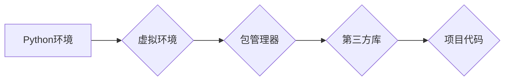

> 大模型开发，微调，Python，环境搭建，机器学习，深度学习

## 1. 背景介绍

在人工智能领域，大模型的兴起掀起了前所未有的技术浪潮。从文本生成、机器翻译到图像识别、语音合成，大模型展现出强大的能力，深刻地改变着我们与世界交互的方式。然而，想要参与到大模型的开发和应用中，首先需要搭建一个坚实可靠的开发环境。

Python作为人工智能领域最受欢迎的编程语言之一，凭借其简洁易懂的语法、丰富的库和活跃的社区，成为了大模型开发的理想选择。本文将从零开始，详细介绍如何搭建一个用于大模型开发的Python环境，并为初学者提供清晰易懂的指导。

## 2. 核心概念与联系

### 2.1 Python环境

Python环境是指用于运行Python程序的软件环境，它包含了Python解释器、标准库、第三方库以及用户自定义的模块。

### 2.2 虚拟环境

虚拟环境是一种隔离的Python环境，它可以帮助我们管理不同的项目依赖，避免版本冲突。

### 2.3 包管理器

包管理器是用于管理Python第三方库的工具，它可以帮助我们轻松安装、更新和卸载库。

**Mermaid 流程图**



## 3. 核心算法原理 & 具体操作步骤

### 3.1 算法原理概述

虚拟环境的原理是通过创建独立的Python解释器和库目录，从而隔离不同的项目依赖。当我们创建虚拟环境时，Python解释器和库目录都会被独立地创建，这样不同的项目就可以使用不同的Python版本和库，而不会相互干扰。

### 3.2 算法步骤详解

1. **安装Python:** 首先需要安装Python解释器。可以从Python官网下载安装包，并按照安装向导进行操作。

2. **创建虚拟环境:** 使用`venv`模块创建虚拟环境。

```bash
python3 -m venv env
```

3. **激活虚拟环境:** 激活虚拟环境，以便使用该环境下的Python解释器和库。

```bash
source env/bin/activate
```

4. **安装包管理器:** 在虚拟环境中安装包管理器，例如`pip`。

```bash
python -m pip install --upgrade pip
```

5. **安装第三方库:** 使用包管理器安装所需的第三方库。

```bash
pip install numpy pandas tensorflow
```

6. **退出虚拟环境:** 使用`deactivate`命令退出虚拟环境。

```bash
deactivate
```

### 3.3 算法优缺点

**优点:**

* 隔离不同项目依赖，避免版本冲突。
* 灵活管理不同项目所需的Python版本和库。
* 提高代码可移植性。

**缺点:**

* 需要额外的步骤来创建和激活虚拟环境。
* 可能会增加项目文件大小。

### 3.4 算法应用领域

虚拟环境广泛应用于各种Python项目开发，例如：

* 机器学习和深度学习项目
* Web开发项目
* 数据分析和科学计算项目
* 桌面应用程序开发项目

## 4. 数学模型和公式 & 详细讲解 & 举例说明

### 4.1 数学模型构建

虚拟环境的构建过程可以抽象为一个数学模型，其中：

* **环境变量:** 代表虚拟环境的配置信息，例如Python版本、库路径等。
* **依赖关系:** 代表项目所需的第三方库和其版本信息。
* **隔离机制:** 保证不同虚拟环境之间相互独立，避免依赖冲突。

### 4.2 公式推导过程

虚拟环境的隔离机制可以利用操作系统提供的机制，例如：

* **文件系统隔离:** 将虚拟环境的库目录独立于系统库目录，避免冲突。
* **环境变量隔离:** 在激活虚拟环境时，设置环境变量，指向虚拟环境下的Python解释器和库目录。

### 4.3 案例分析与讲解

假设我们有两个项目，项目A需要使用Python3.7版本和`numpy`库，而项目B需要使用Python3.8版本和`pandas`库。

如果使用同一个Python环境，则可能会出现版本冲突。

使用虚拟环境可以解决这个问题：

* 创建两个虚拟环境，分别命名为`env_A`和`env_B`。
* 在`env_A`中安装Python3.7版本和`numpy`库。
* 在`env_B`中安装Python3.8版本和`pandas`库。
* 激活相应的虚拟环境，即可使用对应版本的Python和库进行开发。

## 5. 项目实践：代码实例和详细解释说明

### 5.1 开发环境搭建

1. **安装Python:** 下载并安装Python解释器，例如Python3.8。

2. **安装包管理器:** 使用`pip`安装包管理器。

```bash
python -m pip install --upgrade pip
```

3. **创建虚拟环境:** 使用`venv`模块创建虚拟环境。

```bash
python3 -m venv env
```

4. **激活虚拟环境:** 激活虚拟环境。

```bash
source env/bin/activate
```

### 5.2 源代码详细实现

```python
# 导入必要的库
import numpy as np

# 创建一个 NumPy 数组
array = np.array([1, 2, 3, 4, 5])

# 打印数组
print(array)
```

### 5.3 代码解读与分析

* `import numpy as np`: 导入NumPy库，并使用别名`np`引用。
* `array = np.array([1, 2, 3, 4, 5])`: 创建一个NumPy数组，包含元素1到5。
* `print(array)`: 打印数组内容。

### 5.4 运行结果展示

```
[1 2 3 4 5]
```

## 6. 实际应用场景

虚拟环境在实际开发中应用广泛，例如：

* **机器学习项目:** 不同机器学习模型可能依赖不同的库版本，虚拟环境可以帮助我们管理这些依赖，避免冲突。
* **Web开发项目:** 不同的Web框架和库可能需要不同的Python版本，虚拟环境可以帮助我们隔离不同的项目依赖。
* **数据分析项目:** 数据分析项目可能需要使用不同的数据处理库和工具，虚拟环境可以帮助我们管理这些依赖，提高代码可移植性。

### 6.4 未来应用展望

随着人工智能技术的不断发展，大模型的应用场景将更加广泛。虚拟环境将继续发挥重要作用，帮助开发者高效地开发和部署大模型应用。

## 7. 工具和资源推荐

### 7.1 学习资源推荐

* **Python官方文档:** https://docs.python.org/
* **虚拟环境文档:** https://docs.python.org/3/library/venv.html
* **包管理器文档:** https://pip.pypa.io/en/stable/

### 7.2 开发工具推荐

* **PyCharm:** https://www.jetbrains.com/pycharm/
* **VS Code:** https://code.visualstudio.com/

### 7.3 相关论文推荐

* **Virtual Environments for Python:** https://www.python.org/dev/peps/pep-0405/

## 8. 总结：未来发展趋势与挑战

### 8.1 研究成果总结

本文介绍了Python环境搭建的步骤，重点讲解了虚拟环境的原理、使用方法和应用场景。虚拟环境是Python开发中不可或缺的一部分，它帮助我们管理依赖，提高代码可移植性，并为大模型开发提供了坚实的基础。

### 8.2 未来发展趋势

随着大模型的不断发展，虚拟环境将面临新的挑战和机遇。未来，虚拟环境可能会更加智能化，能够自动管理依赖，并提供更丰富的功能，例如容器化部署、环境共享等。

### 8.3 面临的挑战

* **复杂性:** 随着项目规模的扩大，虚拟环境的管理可能会变得更加复杂。
* **兼容性:** 不同版本的Python和库之间可能存在兼容性问题。
* **安全性:** 虚拟环境的安全问题也需要得到重视。

### 8.4 研究展望

未来，虚拟环境的研究方向将包括：

* **自动化管理:** 自动化虚拟环境的创建、配置和管理。
* **容器化部署:** 将虚拟环境打包成容器，方便部署和共享。
* **安全增强:** 加强虚拟环境的安全机制，防止攻击和数据泄露。

## 9. 附录：常见问题与解答

### 9.1 问题：如何解决虚拟环境的依赖冲突？

**解答：**

* 使用不同的虚拟环境隔离不同的项目依赖。
* 使用包管理器升级或卸载冲突的库。
* 使用`pip freeze`命令列出虚拟环境中的所有库，并检查是否有冲突。

### 9.2 问题：如何共享虚拟环境？

**解答：**

* 将虚拟环境打包成容器，例如Docker容器。
* 使用`venv`模块导出虚拟环境，并将其导入到其他机器上。

### 9.3 问题：如何卸载虚拟环境？

**解答：**

* 使用`rm -rf env`命令删除虚拟环境目录。


作者：禅与计算机程序设计艺术 / Zen and the Art of Computer Programming 
<end_of_turn>