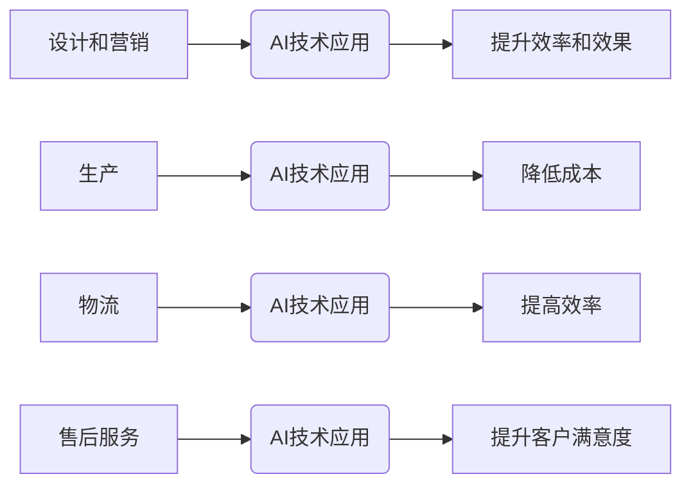

> AI公司、价值微笑曲线、技术创新、商业模式、市场竞争、未来趋势

## 1. 背景介绍

在当今科技飞速发展的时代，人工智能（AI）正以惊人的速度改变着我们的生活和工作方式。AI技术在各个领域都展现出巨大的潜力，从医疗保健到金融服务，从自动驾驶到个性化教育，AI正在推动着社会进步和经济发展。

然而，AI技术的发展也带来了新的挑战和机遇。对于AI公司来说，如何在激烈的市场竞争中脱颖而出，建立可持续的商业模式，并创造真正的价值，成为摆在他们面前的关键问题。

价值微笑曲线是分析企业价值链中不同环节利润分配的经典模型。它指出，在价值链中，设计和营销环节往往能够创造更高的利润，而生产和物流环节的利润相对较低。

将价值微笑曲线与AI公司结合起来，我们可以发现，AI技术本身并不等同于商业成功。AI公司需要在技术创新、商业模式创新和市场竞争等方面都做出突破，才能在价值链中占据有利位置，创造可观的利润。

## 2. 核心概念与联系

**2.1 价值微笑曲线**

价值微笑曲线是一个描述企业价值链中不同环节利润分配的模型。它将价值链分为四个环节：

* **设计和营销：** 创造产品和服务的独特价值，吸引客户，建立品牌形象。
* **生产：** 将产品和服务转化为现实，满足客户需求。
* **物流：** 将产品和服务从生产环节运送到客户手中。
* **售后服务：** 为客户提供产品和服务的使用支持和维护。

价值微笑曲线表明，设计和营销环节往往能够创造更高的利润，而生产和物流环节的利润相对较低。

**2.2 AI公司**

AI公司是指利用人工智能技术开发和提供产品和服务的企业。AI公司的业务范围非常广泛，包括：

* **人工智能软件开发：** 开发各种AI算法和应用，例如机器学习、深度学习、自然语言处理等。
* **人工智能硬件制造：** 生产AI芯片、传感器、机器人等硬件设备。
* **人工智能服务提供：** 为企业提供AI咨询、培训、部署等服务。

**2.3 联系**

将价值微笑曲线与AI公司结合起来，我们可以发现：

* **AI技术可以提升设计和营销环节的效率和效果。** 例如，AI可以帮助企业进行市场调研、用户画像分析、个性化营销等，从而提高营销精准度和转化率。
* **AI技术可以降低生产和物流环节的成本。** 例如，AI可以帮助企业进行自动化生产、智能物流管理等，从而提高生产效率和降低物流成本。
* **AI技术可以为企业提供更优质的售后服务。** 例如，AI可以帮助企业建立智能客服系统、提供个性化产品推荐等，从而提升客户满意度。

因此，AI公司需要充分利用AI技术，在价值链中占据有利位置，才能实现可持续发展。



## 3. 核心算法原理 & 具体操作步骤

### 3.1  算法原理概述

**3.1.1 机器学习**

机器学习是人工智能领域的核心技术之一，它通过算法训练模型，使模型能够从数据中学习，并对新数据进行预测或分类。机器学习算法可以分为监督学习、无监督学习和强化学习三大类。

* **监督学习：** 利用标记数据训练模型，例如图像分类、文本识别等。
* **无监督学习：** 利用未标记数据发现数据中的模式，例如聚类分析、异常检测等。
* **强化学习：** 通过试错学习，使模型在特定环境中获得最大奖励，例如游戏AI、机器人控制等。

**3.1.2 深度学习**

深度学习是机器学习的一种高级形式，它利用多层神经网络来模拟人类大脑的学习过程。深度学习算法能够处理海量数据，并提取数据的复杂特征，在图像识别、语音识别、自然语言处理等领域取得了突破性进展。

### 3.2  算法步骤详解

**3.2.1 机器学习算法步骤**

1. **数据收集和预处理：** 收集相关数据，并进行清洗、转换、特征工程等预处理工作。
2. **模型选择：** 根据具体任务选择合适的机器学习算法。
3. **模型训练：** 利用训练数据训练模型，调整模型参数，使模型能够准确预测或分类。
4. **模型评估：** 利用测试数据评估模型的性能，例如准确率、召回率、F1-score等。
5. **模型部署：** 将训练好的模型部署到实际应用场景中。

**3.2.2 深度学习算法步骤**

1. **数据收集和预处理：** 与机器学习算法类似，需要收集相关数据并进行预处理。
2. **网络结构设计：** 设计多层神经网络的结构，包括层数、节点数、激活函数等。
3. **模型训练：** 利用训练数据训练深度学习模型，调整模型参数，使模型能够学习数据的复杂特征。
4. **模型评估：** 利用测试数据评估模型的性能，例如准确率、损失函数等。
5. **模型调优：** 根据评估结果，调整模型参数、网络结构等，进一步提高模型性能。
6. **模型部署：** 将训练好的深度学习模型部署到实际应用场景中。

### 3.3  算法优缺点

**3.3.1 机器学习算法**

* **优点：** 
    * 能够从数据中学习，并对新数据进行预测或分类。
    * 算法种类丰富，可以根据具体任务选择合适的算法。
    * 应用广泛，在各个领域都取得了成功。
* **缺点：** 
    * 需要大量的标记数据进行训练。
    * 对数据质量要求较高，数据噪声或偏差会影响模型性能。
    * 难以解释模型的决策过程。

**3.3.2 深度学习算法**

* **优点：** 
    * 能够处理海量数据，并提取数据的复杂特征。
    * 在图像识别、语音识别、自然语言处理等领域取得了突破性进展。
* **缺点：** 
    * 需要大量的计算资源进行训练。
    * 对数据质量要求更高，数据偏差会更加明显。
    * 难以解释模型的决策过程。

### 3.4  算法应用领域

**3.4.1 机器学习算法**

* **图像识别：** 人脸识别、物体检测、图像分类等。
* **语音识别：** 语音转文本、语音助手等。
* **自然语言处理：** 文本分类、情感分析、机器翻译等。
* **推荐系统：** 产品推荐、内容推荐等。
* **欺诈检测：** 银行卡欺诈、网络欺诈等。

**3.4.2 深度学习算法**

* **计算机视觉：** 图像识别、视频分析、三维重建等。
* **语音识别：** 语音合成、语音增强等。
* **自然语言处理：** 机器翻译、文本摘要、对话系统等。
* **自动驾驶：** 路线规划、目标识别、决策控制等。
* **医疗诊断：** 影像分析、疾病预测等。

## 4. 数学模型和公式 & 详细讲解 & 举例说明

### 4.1  数学模型构建

**4.1.1 价值微笑曲线模型**

价值微笑曲线模型可以用一个简单的数学公式来表示：

$$
Profit = f(Design & Marketing) - f(Production & Logistics)
$$

其中：

* **Profit** 表示企业利润。
* **Design & Marketing** 表示设计和营销环节的价值贡献。
* **Production & Logistics** 表示生产和物流环节的价值贡献。
* **f()** 表示价值贡献函数，其具体形式取决于企业的具体情况。

**4.1.2 AI技术价值贡献模型**

AI技术可以提升设计和营销环节的价值贡献，降低生产和物流环节的价值贡献。我们可以用以下公式来表示AI技术对价值链的影响：

$$
AI\_Value = \alpha * f(Design & Marketing) + \beta * f(Production & Logistics)
$$

其中：

* **AI\_Value** 表示AI技术带来的价值贡献。
* **α** 和 **β** 是两个权重系数，分别表示AI技术对设计和营销环节以及生产和物流环节的影响程度。

### 4.2  公式推导过程

**4.2.1 价值贡献函数推导**

价值贡献函数的具体形式取决于企业的具体情况，例如行业、产品、市场竞争等。我们可以通过以下方法来推导价值贡献函数：

* **数据分析：** 利用历史数据分析不同环节的价值贡献，建立回归模型或其他统计模型。
* **专家访谈：** 咨询行业专家，了解不同环节的价值贡献，并根据专家意见构建价值贡献函数。
* **案例研究：** 研究其他企业的案例，分析其价值链结构和价值贡献，并借鉴经验构建价值贡献函数。

**4.2.2 权重系数确定**

权重系数 α 和 β 的确定需要根据企业的具体情况进行调整。我们可以通过以下方法来确定权重系数：

* **成本分析：** 分析不同环节的成本，并根据成本占比确定权重系数。
* **市场调研：** 通过市场调研了解客户对不同环节的价值感知，并根据客户反馈确定权重系数。
* **实验测试：** 通过A/B测试等实验方法，比较不同权重系数下企业的利润表现，并选择最佳的权重系数。

### 4.3  案例分析与讲解

**4.3.1 案例：电商平台**

对于电商平台来说，设计和营销环节的价值贡献非常高，例如产品推荐、个性化营销、用户体验设计等。而生产和物流环节的价值贡献相对较低，例如仓储物流、配送服务等。因此，电商平台可以利用AI技术提升设计和营销环节的价值贡献，例如：

* **个性化推荐：** 利用机器学习算法分析用户的购买历史、浏览记录等数据，推荐个性化的商品。
* **精准营销：** 利用自然语言处理算法分析用户的评论、反馈等数据，进行精准的营销推广。
* **智能客服：** 利用深度学习算法构建智能客服系统，为用户提供快速、高效的客户服务。

**4.3.2 案例：制造业**

对于制造业来说，生产和物流环节的价值贡献非常高，例如自动化生产、智能物流管理等。而设计和营销环节的价值贡献相对较低，例如产品设计、市场营销等。因此，制造业可以利用AI技术降低生产和物流环节的成本，例如：

* **自动化生产：** 利用机器人、协作机器人等自动化设备进行生产，提高生产效率，降低人工成本。
* **智能物流管理：** 利用AI算法优化物流路线、调度车辆、预测需求等，提高物流效率，降低物流成本。

## 5. 项目实践：代码实例和详细解释说明

### 5.1  开发环境搭建

**5.1.1 软件环境**

* Python 3.x
* TensorFlow 或 PyTorch
* Jupyter Notebook

**5.1.2 硬件环境**

* CPU 或 GPU

### 5.2  源代码详细实现

**5.2.1 图像分类示例代码（使用 TensorFlow）**

```python
import tensorflow as tf

# 定义模型结构
model = tf.keras.models.Sequential([
    tf.keras.layers.Conv2D(32, (3, 3), activation='relu', input_shape=(28, 28, 1)),
    tf.keras.layers.MaxPooling2D((2, 2)),
    tf.keras.layers.Conv2D(64, (3, 3), activation='relu'),
    tf.keras.layers.Max