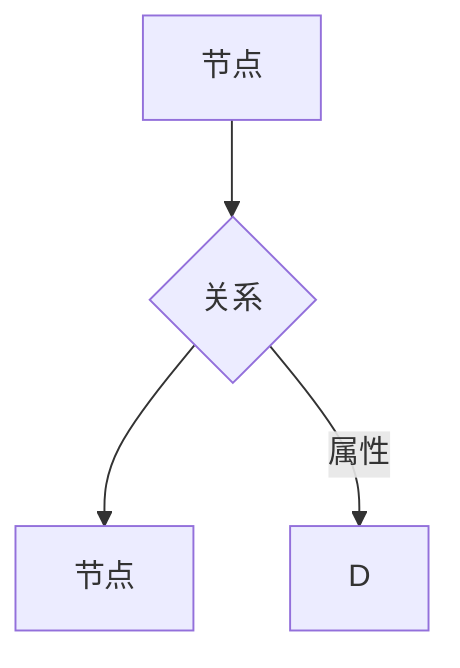

> 图数据库、节点、边、关系、查询语言、算法、应用场景、Neo4j、Gremlin

## 1. 背景介绍

随着互联网和移动互联网的快速发展，数据呈现出爆炸式增长，传统的关系型数据库已经难以满足对复杂数据关系的存储和查询需求。图数据库作为一种新型的数据库，凭借其强大的数据建模能力和高效的查询性能，逐渐成为处理复杂网络关系数据的首选工具。

图数据库的核心思想是将数据表示为节点和边，节点代表实体，边代表实体之间的关系。这种数据模型能够更直观地反映现实世界中的复杂关系，例如社交网络、推荐系统、知识图谱等。

## 2. 核心概念与联系

图数据库的核心概念包括：

* **节点 (Node):** 图数据库中的基本单元，代表一个实体，例如用户、商品、文章等。每个节点都具有唯一的标识符和一系列属性。
* **边 (Edge):** 连接两个节点的线，代表实体之间的关系，例如“关注”、“购买”、“评论”等。边也具有属性，可以描述关系的类型、强度、时间等信息。
* **关系 (Relationship):** 边所代表的关系类型，例如“关注”、“购买”、“评论”等。关系可以具有方向性，例如“关注”是单向关系，而“购买”是双向关系。
* **路径 (Path):** 连接多个节点的边序列，代表实体之间的关系链。例如，用户A关注用户B，用户B关注用户C，则路径为A->B->C。

**图数据库架构**



## 3. 核心算法原理 & 具体操作步骤

### 3.1  算法原理概述

图数据库的核心算法主要包括：

* **节点查找算法:** 用于根据节点属性或关系查找特定节点。常见的算法包括BFS（广度优先搜索）、DFS（深度优先搜索）、A*算法等。
* **路径查找算法:** 用于根据起点和终点节点查找连接它们的路径。常见的算法包括Dijkstra算法、Floyd算法、Bellman-Ford算法等。
* **社区发现算法:** 用于发现图中紧密连接的节点子集，即社区。常见的算法包括Louvain算法、Girvan-Newman算法等。

### 3.2  算法步骤详解

以BFS算法为例，其步骤如下：

1. 从起始节点开始，将该节点加入队列。
2. 从队列中取出第一个节点，将其所有相邻节点加入队列。
3. 重复步骤2，直到队列为空。

### 3.3  算法优缺点

**BFS算法**

* **优点:** 能够找到最短路径，易于实现。
* **缺点:** 对于大型图，时间复杂度较高。

### 3.4  算法应用领域

图数据库算法广泛应用于以下领域：

* **社交网络分析:** 发现用户之间的关系、社区结构、流行趋势等。
* **推荐系统:** 基于用户行为和商品关系进行个性化推荐。
* **知识图谱构建:** 建立实体和关系的知识图谱，用于知识检索、推理和问答。
* **网络安全:** 检测恶意活动、识别攻击路径等。

## 4. 数学模型和公式 & 详细讲解 & 举例说明

### 4.1  数学模型构建

图数据库可以用数学模型来表示，其中：

* **节点集:** N = {n1, n2, ..., nk}，表示图中的所有节点。
* **边集:** E = {(n1, n2), (n2, n3), ..., (nk-1, nk)}，表示图中的所有边。

### 4.2  公式推导过程

**节点度:** 节点n的度是指与该节点相连的边的数量，记为deg(n)。

**路径长度:** 路径p的长度是指路径中边的数量，记为len(p)。

### 4.3  案例分析与讲解

**示例:**

假设有一个图数据库，其中节点集N = {A, B, C, D}，边集E = {(A, B), (B, C), (C, D)}。

* 节点A的度为1，因为与节点B相连一条边。
* 节点B的度为2，因为与节点A和C相连两条边。
* 路径A->B->C的长度为2。

## 5. 项目实践：代码实例和详细解释说明

### 5.1  开发环境搭建

本示例使用Neo4j作为图数据库，Python作为编程语言。

* 安装Neo4j：https://neo4j.com/download/
* 安装Python和PyNeo4j库：pip install pyneo4j

### 5.2  源代码详细实现

```python
from py2neo import Graph

# 连接Neo4j数据库
graph = Graph("bolt://localhost:7687", auth=("neo4j", "password"))

# 创建节点
node1 = graph.create_node("Person", name="Alice")
node2 = graph.create_node("Person", name="Bob")

# 创建边
graph.create_unique(
    "KNOWS", node1, node2, weight=1
)

# 查询节点
result = graph.run("MATCH (n:Person) RETURN n")
for record in result:
    print(record["n"]["name"])

# 查询路径
result = graph.run("MATCH (a:Person)-[r:KNOWS]->(b:Person) RETURN a, r, b")
for record in result:
    print(record["a"]["name"], record["r"]["weight"], record["b"]["name"])
```

### 5.3  代码解读与分析

* 代码首先连接Neo4j数据库。
* 然后创建两个节点，分别代表Alice和Bob。
* 创建一条边，表示Alice认识Bob。
* 使用Cypher查询语言查询节点和路径。

### 5.4  运行结果展示

```
Alice
Bob
Alice 1 Bob
```

## 6. 实际应用场景

图数据库在以下领域具有广泛的应用场景：

* **社交网络分析:** 分析用户关系、社区结构、流行趋势等。
* **推荐系统:** 基于用户行为和商品关系进行个性化推荐。
* **知识图谱构建:** 建立实体和关系的知识图谱，用于知识检索、推理和问答。
* **网络安全:** 检测恶意活动、识别攻击路径等。

### 6.4  未来应用展望

随着数据量的不断增长和人工智能技术的进步，图数据库的应用场景将更加广泛，例如：

* **智能城市:** 建立城市基础设施的知识图谱，实现城市管理的智能化。
* **医疗保健:** 建立患者和疾病的知识图谱，辅助医生诊断和治疗。
* **金融科技:** 建立金融机构和客户的知识图谱，提高风险管理和客户服务水平。

## 7. 工具和资源推荐

### 7.1  学习资源推荐

* **Neo4j官方文档:** https://neo4j.com/docs/
* **图数据库入门教程:** https://www.tutorialspoint.com/graph_database/index.htm
* **图数据库书籍:** 《图数据库原理与实践》、《图数据库实战》

### 7.2  开发工具推荐

* **Neo4j Desktop:** https://neo4j.com/download/desktop/
* **Graphviz:** https://graphviz.org/
* **Cypher Shell:** https://neo4j.com/docs/cypher-manual/current/

### 7.3  相关论文推荐

* **The Neo4j Graph Database:** https://neo4j.com/docs/graph-database/current/
* **Graph Databases: A Survey:** https://dl.acm.org/doi/10.1145/3159652.3159660

## 8. 总结：未来发展趋势与挑战

### 8.1  研究成果总结

图数据库技术近年来取得了显著进展，其数据模型、算法和应用场景不断丰富。

### 8.2  未来发展趋势

* **云原生图数据库:** 将图数据库部署在云平台，实现弹性伸缩和高可用性。
* **人工智能与图数据库的融合:** 将人工智能技术应用于图数据库的查询、分析和推理。
* **异构图数据库:** 支持多种数据类型和关系模型的图数据库。

### 8.3  面临的挑战

* **数据规模和复杂度:** 处理海量复杂数据的图数据库性能和效率仍然是一个挑战。
* **查询语言和算法:** 需要开发更强大的查询语言和算法，以满足复杂数据分析的需求。
* **标准化和生态系统:** 图数据库标准化和生态系统建设还需要进一步完善。

### 8.4  研究展望

未来，图数据库技术将继续朝着更智能、更高效、更易用方向发展，并在更多领域发挥重要作用。

## 9. 附录：常见问题与解答

**常见问题:**

* **图数据库和关系型数据库有什么区别？**

**解答:**

图数据库以节点和边为基本单元，更适合处理复杂关系数据，而关系型数据库以表和行为基本单元，更适合处理结构化数据。

* **Neo4j是什么？**

**解答:**

Neo4j是目前最流行的图数据库之一，支持Cypher查询语言和多种数据类型。

* **如何学习图数据库？**

**解答:**

可以参考Neo4j官方文档、图数据库入门教程和书籍等资源进行学习。


作者：禅与计算机程序设计艺术 / Zen and the Art of Computer Programming 
<end_of_turn>