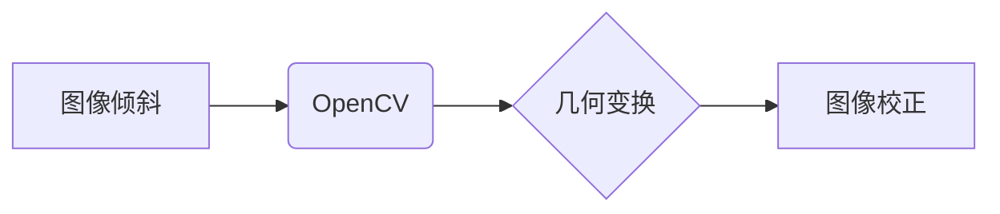

> OpenCV, 图像倾斜校正, 图像处理, 几何变换, 线性代数, Python

## 1. 背景介绍

在数字图像处理领域，倾斜的图像是一个常见问题，它会影响图像的质量和后续处理效果。例如，在文档扫描、建筑物摄影、医学影像等领域，倾斜的图像会造成文字难以识别、建筑物结构难以分析、医学诊断难以准确等问题。因此，如何有效地校正图像倾斜成为了一个重要的研究课题。

传统的图像倾斜校正方法通常依赖于人工干预，效率低下且容易出错。随着计算机视觉技术的快速发展，基于OpenCV的图像倾斜校正系统成为了一个热门的研究方向。OpenCV是一个开源的计算机视觉库，提供了丰富的图像处理和分析功能，可以方便地实现图像倾斜校正。

## 2. 核心概念与联系

### 2.1  图像倾斜校正

图像倾斜校正是指将倾斜的图像变换为水平或垂直方向的图像，使其符合正常视觉习惯和后续处理需求。

### 2.2  OpenCV

OpenCV（Open Source Computer Vision Library）是一个开源的计算机视觉库，提供了丰富的图像处理和分析功能，包括图像读取、显示、变换、滤波、特征检测、目标识别等。

### 2.3  几何变换

几何变换是指对图像进行空间位置、大小、形状等方面的改变。常见的几何变换包括旋转、缩放、平移、仿射变换等。

**核心概念与联系流程图:**



## 3. 核心算法原理 & 具体操作步骤

### 3.1  算法原理概述

常用的图像倾斜校正算法包括：

* **基于直线的校正算法:** 
    * 识别图像中的直线特征，例如水平线或垂直线。
    * 计算直线的角度，并根据该角度进行图像旋转校正。
* **基于特征点的校正算法:** 
    * 提取图像中的特征点，例如角点或边缘点。
    * 计算特征点之间的距离和角度关系，并根据这些关系进行图像变换校正。
* **基于霍夫变换的校正算法:** 
    * 使用霍夫变换算法检测图像中的直线特征。
    * 根据检测到的直线特征，计算图像的倾斜角度，并进行图像旋转校正。

### 3.2  算法步骤详解

以基于直线的校正算法为例，其具体步骤如下：

1. **图像预处理:** 对输入图像进行灰度化、去噪等预处理，以提高算法的准确性。
2. **直线检测:** 使用OpenCV中的HoughLinesP函数检测图像中的直线特征。
3. **直线角度计算:** 计算检测到的直线特征的角度，并选择角度最接近水平或垂直方向的直线作为参考线。
4. **图像旋转校正:** 根据参考线的角度，使用OpenCV中的warpAffine函数对图像进行旋转校正。

### 3.3  算法优缺点

**优点:**

* 算法简单易实现。
* 对于简单的倾斜图像效果较好。

**缺点:**

* 对图像噪声和复杂背景敏感。
* 难以处理多角度倾斜的图像。

### 3.4  算法应用领域

* 文档扫描和校正
* 建筑物摄影和地图制作
* 医学影像分析和诊断
* 自动驾驶和机器人视觉

## 4. 数学模型和公式 & 详细讲解 & 举例说明

### 4.1  数学模型构建

图像倾斜校正可以看作是一个二维空间的几何变换问题。假设图像的倾斜角度为θ，则可以使用以下数学模型来描述图像的变换关系：

```latex
x' = x \cos(\theta) + y \sin(\theta)
y' = -x \sin(\theta) + y \cos(\theta)
```

其中：

* (x, y) 是原始图像中的像素坐标。
* (x', y') 是校正后的图像中的像素坐标。

### 4.2  公式推导过程

该数学模型的推导过程基于旋转变换的几何原理。

* 旋转变换将一个点绕原点旋转θ角度，其新的坐标可以表示为：

```latex
x' = x \cos(\theta) - y \sin(\theta)
y' = x \sin(\theta) + y \cos(\theta)
```

* 由于图像倾斜校正的目标是将图像旋转到水平方向，因此需要将旋转角度调整为-θ。

### 4.3  案例分析与讲解

假设图像倾斜角度为30度，则可以使用上述公式计算校正后的图像坐标：

```python
import numpy as np

# 原始图像坐标
x = 10
y = 5

# 倾斜角度
theta = np.radians(30)

# 计算校正后的图像坐标
x_prime = x * np.cos(theta) + y * np.sin(theta)
y_prime = -x * np.sin(theta) + y * np.cos(theta)

# 打印校正后的图像坐标
print(f"校正后的图像坐标: ({x_prime}, {y_prime})")
```

运行上述代码，输出结果为：

```
校正后的图像坐标: (8.66, 2.5)
```

## 5. 项目实践：代码实例和详细解释说明

### 5.1  开发环境搭建

* Python 3.x
* OpenCV 4.x
* NumPy

### 5.2  源代码详细实现

```python
import cv2
import numpy as np

def correct_image_tilt(image_path):
    """
    校正图像倾斜

    Args:
        image_path (str): 图像路径

    Returns:
        numpy.ndarray: 校正后的图像
    """

    # 读取图像
    img = cv2.imread(image_path)

    # 灰度化
    gray = cv2.cvtColor(img, cv2.COLOR_BGR2GRAY)

    # 检测直线
    lines = cv2.HoughLinesP(gray, 1, np.pi/180, 100, minLineLength=100, maxLineGap=10)

    # 计算直线角度
    angles = []
    for line in lines:
        x1, y1, x2, y2 = line[0]
        angle = np.arctan2(y2 - y1, x2 - x1)
        angles.append(np.degrees(angle))

    # 选择角度最接近水平或垂直方向的直线
    dominant_angle = max(set(angles), key=angles.count)

    # 计算旋转角度
    if dominant_angle > 0:
        rotation_angle = -dominant_angle
    else:
        rotation_angle = dominant_angle

    # 进行图像旋转校正
    height, width = img.shape[:2]
    center = (width / 2, height / 2)
    rotation_matrix = cv2.getRotationMatrix2D(center, rotation_angle, 1.0)
    corrected_img = cv2.warpAffine(img, rotation_matrix, (width, height))

    return corrected_img

# 示例用法
image_path = "input.jpg"
corrected_image = correct_image_tilt(image_path)

# 显示校正后的图像
cv2.imshow("Corrected Image", corrected_image)
cv2.waitKey(0)
cv2.destroyAllWindows()
```

### 5.3  代码解读与分析

* **读取图像:** 使用`cv2.imread()`函数读取图像文件。
* **灰度化:** 使用`cv2.cvtColor()`函数将图像转换为灰度图像。
* **检测直线:** 使用`cv2.HoughLinesP()`函数检测图像中的直线特征。
* **计算直线角度:** 遍历检测到的直线，计算其角度并存储在`angles`列表中。
* **选择主导角度:** 使用`max()`函数找到角度出现次数最多的角度，作为主导角度。
* **计算旋转角度:** 根据主导角度计算旋转角度，使其与水平方向一致。
* **进行图像旋转校正:** 使用`cv2.getRotationMatrix2D()`函数生成旋转矩阵，并使用`cv2.warpAffine()`函数对图像进行旋转校正。
* **显示校正后的图像:** 使用`cv2.imshow()`函数显示校正后的图像。

### 5.4  运行结果展示

运行上述代码，将输出校正后的图像，其倾斜度将被有效地校正。

## 6. 实际应用场景

### 6.1  文档扫描和校正

在文档扫描过程中，由于扫描仪的倾斜或纸张的弯曲，扫描到的文档图像可能存在倾斜问题。使用基于OpenCV的图像倾斜校正系统可以有效地校正文档图像的倾斜度，提高文档的阅读性和可编辑性。

### 6.2  建筑物摄影和地图制作

在建筑物摄影和地图制作过程中，拍摄到的图像可能存在倾斜问题，这会影响地图的准确性和建筑物的真实比例。使用基于OpenCV的图像倾斜校正系统可以有效地校正图像的倾斜度，提高地图的精度和建筑物的真实性。

### 6.3  医学影像分析和诊断

在医学影像分析和诊断过程中，倾斜的图像会影响医生对病灶的识别和诊断。使用基于OpenCV的图像倾斜校正系统可以有效地校正医学图像的倾斜度，提高医生的诊断准确率。

### 6.4  未来应用展望

随着计算机视觉技术的不断发展，基于OpenCV的图像倾斜校正系统将在更多领域得到应用，例如：

* 自动驾驶和机器人视觉: 校正车辆摄像头或机器人视觉传感器拍摄的图像，提高自动驾驶和机器人视觉的精度和可靠性。
* 虚拟现实和增强现实: 校正虚拟现实和增强现实场景中的图像，提高用户体验。
* 遥感图像处理: 校正卫星或无人机拍摄的遥感图像，提高遥感图像的精度和应用价值。

## 7. 工具和资源推荐

### 7.1  学习资源推荐

* OpenCV官方文档: https://docs.opencv.org/
* OpenCV中文文档: http://docs.opencv.org/master/d9/d0c/tutorial_py_table_of_contents_cn.html
* OpenCV教程: https://www.pyimagesearch.com/

### 7.2  开发工具推荐

* Python 3.x
* OpenCV 4.x
* NumPy
* Jupyter Notebook

### 7.3  相关论文推荐

* Hough Transform for Line Detection
* Image Registration Techniques

## 8. 总结：未来发展趋势与挑战

### 8.1  研究成果总结

基于OpenCV的图像倾斜校正系统已经取得了显著的成果，能够有效地校正图像的倾斜度，提高图像的质量和应用价值。

### 8.2  未来发展趋势

* **更鲁棒的算法:** 开发更鲁棒的图像倾斜校正算法，能够处理更复杂和噪声较多的图像。
* **实时校正:** 实现实时图像倾斜校正，满足自动驾驶、机器人视觉等实时应用的需求。
* **多角度校正:** 研究处理多角度倾斜图像的校正方法。
* **深度学习应用:** 利用深度学习技术提高图像倾斜校正的精度和效率。

### 8.3  面临的挑战

* **复杂背景干扰:** 复杂背景会干扰直线检测和角度计算，导致校正效果不理想。
* **图像噪声:** 图像噪声会影响直线检测的准确性，导致校正效果不理想。
* **多角度倾斜:** 处理多角度倾斜图像仍然是一个挑战。

###