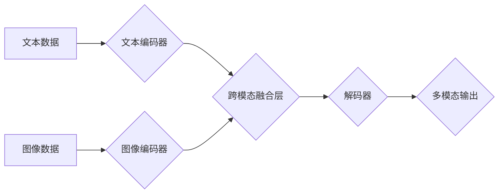

> 多模态大模型，技术原理，实战应用，OpenAI，股权设计，人工智能，深度学习

## 1. 背景介绍

近年来，人工智能（AI）技术取得了飞速发展，其中大模型在自然语言处理、计算机视觉等领域展现出强大的能力。然而，传统的单模态大模型仅处理一种数据类型（如文本或图像），难以捕捉现实世界中多样的信息表达方式。

多模态大模型（Multimodal Large Models，MLMs）应运而生，旨在融合多种模态数据（如文本、图像、音频、视频等），学习跨模态的表示和理解能力。MLMs 能够更好地理解和生成人类语言，并进行更复杂的推理和决策。

OpenAI 的 GPT-3 和 DALL-E 等模型的成功，进一步推动了多模态大模型的研究和应用。这些模型展现了强大的文本生成、图像生成和理解能力，为多模态 AI 的未来发展指明了方向。

## 2. 核心概念与联系

多模态大模型的核心概念是融合不同模态数据，学习跨模态的表示和理解能力。

**2.1 多模态数据融合**

多模态数据融合是指将来自不同模态的数据进行有效整合，形成一个统一的表示。常用的融合方法包括：

* **早期融合:** 将不同模态数据在特征提取阶段进行融合，例如将文本和图像特征进行拼接。
* **晚期融合:** 将不同模态数据分别进行特征提取，然后在决策阶段进行融合，例如将文本和图像分类结果进行投票。
* **跨模态注意力机制:** 学习不同模态数据之间的关系，并赋予不同模态数据不同的权重，例如在文本图像对齐任务中，注意力机制可以学习文本和图像中对应部分的关系。

**2.2 跨模态表示学习**

跨模态表示学习是指学习一个统一的表示空间，使得不同模态的数据能够在同一个空间中进行比较和理解。常用的方法包括：

* **共享嵌入:** 使用相同的嵌入层来学习不同模态数据的表示，例如将文本和图像都映射到一个低维向量空间。
* **跨模态自编码器:** 使用自编码器结构来学习不同模态数据的表示，例如将文本和图像分别编码，然后解码成原始数据。
* **对抗性学习:** 使用对抗性网络来学习不同模态数据的表示，例如生成器学习生成逼真的图像，判别器学习区分真实图像和生成图像。

**2.3 跨模态任务**

跨模态任务是指利用多模态数据进行各种任务，例如：

* **文本图像对齐:** 将文本和图像进行匹配，例如找到描述图像的文本。
* **文本图像问答:** 根据图像和文本进行问答，例如回答关于图像中物体的信息。
* **图像文本生成:** 根据文本生成图像，例如根据文本描述生成相应的图像。
* **视频文本理解:** 根据视频和文本进行理解，例如理解视频中发生的事情。

**Mermaid 流程图**



## 3. 核心算法原理 & 具体操作步骤

### 3.1  算法原理概述

多模态大模型的训练通常基于深度学习框架，例如 TensorFlow 或 PyTorch。训练目标是学习一个能够有效地融合不同模态数据并进行跨模态理解的模型。

常用的训练方法包括：

* **监督学习:** 使用标注数据进行训练，例如文本图像对齐任务中，可以使用标注好的文本图像对进行训练。
* **自监督学习:** 使用无标注数据进行训练，例如通过预测图像中缺失的文本或文本中缺失的图像来进行训练。
* **半监督学习:** 使用少量标注数据和大量无标注数据进行训练，例如通过利用无标注数据进行预训练，然后使用标注数据进行微调。

### 3.2  算法步骤详解

1. **数据预处理:** 将多模态数据进行预处理，例如文本数据进行分词和词嵌入，图像数据进行裁剪和增强。
2. **模型构建:** 根据具体的任务和数据类型，构建多模态大模型的架构，例如使用 Transformer 网络进行文本编码，使用 CNN 或 ResNet 网络进行图像编码。
3. **模型训练:** 使用训练数据进行模型训练，例如使用 Adam 优化器和交叉熵损失函数进行训练。
4. **模型评估:** 使用测试数据评估模型的性能，例如计算准确率、召回率和 F1 值。
5. **模型部署:** 将训练好的模型部署到实际应用场景中，例如用于文本图像对齐、图像文本问答等任务。

### 3.3  算法优缺点

**优点:**

* 能够融合多种模态数据，学习更丰富的表示。
* 能够更好地理解和生成人类语言。
* 能够进行更复杂的推理和决策。

**缺点:**

* 训练数据量大，计算资源消耗高。
* 模型复杂度高，训练和部署难度大。
* 跨模态理解能力仍然存在挑战。

### 3.4  算法应用领域

多模态大模型在多个领域都有广泛的应用，例如：

* **计算机视觉:** 图像分类、目标检测、图像生成、视频理解等。
* **自然语言处理:** 文本分类、情感分析、机器翻译、对话系统等。
* **人机交互:** 语音识别、手势识别、虚拟现实等。
* **医疗保健:** 病理诊断、医学图像分析、药物研发等。

## 4. 数学模型和公式 & 详细讲解 & 举例说明

### 4.1  数学模型构建

多模态大模型的数学模型通常基于深度学习框架，例如 TensorFlow 或 PyTorch。模型的结构通常包括多个编码器和一个解码器。

* **编码器:** 用于学习不同模态数据的表示。例如，文本编码器可以使用 Transformer 网络，图像编码器可以使用 CNN 或 ResNet 网络。
* **解码器:** 用于生成多模态输出，例如文本、图像或视频。

### 4.2  公式推导过程

多模态大模型的训练目标通常是最大化似然函数，即预测正确的输出概率。

假设模型的输出为 $y$, 输入为 $x = (x_1, x_2, ..., x_n)$, 其中 $x_i$ 表示第 $i$ 个模态数据。似然函数为：

$$
P(y|x) = \prod_{i=1}^{n} P(y_i|x_i)
$$

其中 $P(y_i|x_i)$ 表示给定第 $i$ 个模态数据 $x_i$ 预测输出 $y_i$ 的概率。

模型的训练目标是最大化似然函数，可以使用梯度下降算法进行优化。

### 4.3  案例分析与讲解

例如，在文本图像对齐任务中，模型的输入为文本和图像，输出为文本和图像之间的对齐关系。

假设文本为 $t$, 图像为 $v$, 对齐关系为 $r$. 模型的似然函数为：

$$
P(r|t,v) = P(r|t)P(r|v)
$$

其中 $P(r|t)$ 表示给定文本 $t$ 预测对齐关系 $r$ 的概率， $P(r|v)$ 表示给定图像 $v$ 预测对齐关系 $r$ 的概率。

模型的训练目标是最大化似然函数，可以使用梯度下降算法进行优化。

## 5. 项目实践：代码实例和详细解释说明

### 5.1  开发环境搭建

* **操作系统:** Ubuntu 20.04
* **Python 版本:** 3.8
* **深度学习框架:** TensorFlow 2.0
* **其他依赖库:** numpy, pandas, matplotlib

### 5.2  源代码详细实现

```python
import tensorflow as tf

# 定义文本编码器
class TextEncoder(tf.keras.Model):
    def __init__(self, vocab_size, embedding_dim, hidden_dim):
        super(TextEncoder, self).__init__()
        self.embedding = tf.keras.layers.Embedding(vocab_size, embedding_dim)
        self.lstm = tf.keras.layers.LSTM(hidden_dim)

    def call(self, inputs):
        x = self.embedding(inputs)
        x = self.lstm(x)
        return x

# 定义图像编码器
class ImageEncoder(tf.keras.Model):
    def __init__(self, image_size, embedding_dim, hidden_dim):
        super(ImageEncoder, self).__init__()
        self.conv1 = tf.keras.layers.Conv2D(32, (3, 3), activation='relu')
        self.pool1 = tf.keras.layers.MaxPooling2D((2, 2))
        self.conv2 = tf.keras.layers.Conv2D(64, (3, 3), activation='relu')
        self.pool2 = tf.keras.layers.MaxPooling2D((2, 2))
        self.flatten = tf.keras.layers.Flatten()
        self.dense = tf.keras.layers.Dense(hidden_dim)

    def call(self, inputs):
        x = self.conv1(inputs)
        x = self.pool1(x)
        x = self.conv2(x)
        x = self.pool2(x)
        x = self.flatten(x)
        x = self.dense(x)
        return x

# 定义跨模态融合层
class CrossModalFusion(tf.keras.layers.Layer):
    def __init__(self, hidden_dim):
        super(CrossModalFusion, self).__init__()
        self.dense = tf.keras.layers.Dense(hidden_dim)

    def call(self, inputs):
        text_embedding, image_embedding = inputs
        x = tf.concat([text_embedding, image_embedding], axis=-1)
        x = self.dense(x)
        return x

# 定义多模态大模型
class MultiModalModel(tf.keras.Model):
    def __init__(self, vocab_size, embedding_dim, hidden_dim, image_size):
        super(MultiModalModel, self).__init__()
        self.text_encoder = TextEncoder(vocab_size, embedding_dim, hidden_dim)
        self.image_encoder = ImageEncoder(image_size, embedding_dim, hidden_dim)
        self.cross_modal_fusion = CrossModalFusion(hidden_dim)

    def call(self, inputs):
        text, image = inputs
        text_embedding = self.text_encoder(text)
        image_embedding = self.image_encoder(image)
        fused_embedding = self.cross_modal_fusion([text_embedding, image_embedding])
        return fused_embedding
```

### 5.3  代码解读与分析

* **文本编码器:** 使用 Embedding 层将文本单词映射到低维向量空间，然后使用 LSTM 层学习文本的上下文信息。
* **图像编码器:** 使用 CNN 网络提取图像特征，并使用 Flatten 层将特征向量化。
* **跨模态融合层:** 将文本和图像的特征向量进行拼接，然后使用 Dense 层学习跨模态的表示。
* **多模态大模型:** 将文本编码器、图像编码器和跨模态融合层组合起来，形成一个完整的多模态大模型。

### 5.4  运行结果展示

训练好的多模态大模型可以用于各种跨模态任务，例如文本图像对齐、图像文本问答等。

## 6. 实际应用场景

### 6.1  文本图像对齐

多模态大模型可以用于将文本和图像