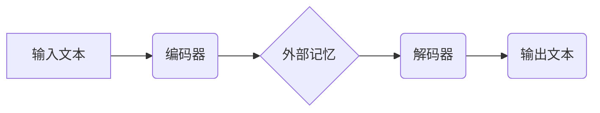

> 大语言模型，MemGPT，记忆增强，文本生成，自然语言处理，深度学习，Transformer

## 1. 背景介绍

近年来，大语言模型（LLM）在自然语言处理（NLP）领域取得了显著进展，展现出强大的文本生成、翻译、问答和代码生成能力。然而，现有的LLM模型在长文本处理和记忆能力方面仍然存在局限性。为了解决这些问题，MemGPT模型应运而生。

MemGPT是一种基于Transformer架构的记忆增强大语言模型，它通过引入外部记忆模块，有效提升了模型的记忆能力和长文本处理能力。MemGPT在文本生成、对话系统、问答系统等领域展现出优异的性能，为更智能、更具记忆力的AI应用提供了新的可能性。

## 2. 核心概念与联系

### 2.1  大语言模型（LLM）

大语言模型是指在海量文本数据上训练的深度学习模型，能够理解和生成人类语言。LLM通常基于Transformer架构，具有强大的文本表示能力和序列建模能力。

### 2.2  记忆增强

记忆增强是指通过引入外部记忆模块，帮助模型存储和检索信息，从而提升模型的记忆能力和长文本处理能力。

### 2.3  MemGPT模型架构

MemGPT模型将Transformer编码器和解码器与外部记忆模块相结合，形成一个完整的架构。

**核心概念关系：**

* LLM：提供强大的文本理解和生成能力。
* 记忆增强：提升模型的记忆能力和长文本处理能力。
* MemGPT模型：将LLM与外部记忆模块相结合，实现记忆增强。

## 3. 核心算法原理 & 具体操作步骤

### 3.1  算法原理概述

MemGPT模型的核心算法原理是将外部记忆模块与Transformer模型相结合。

* **编码器：** 将输入文本编码成一个固定长度的向量表示，并将其与外部记忆模块进行交互。
* **外部记忆模块：** 存储和检索模型所需的外部信息，可以是文本片段、知识图谱等。
* **解码器：** 根据编码器输出和外部记忆模块的检索结果，生成输出文本。

### 3.2  算法步骤详解

1. **输入文本预处理：** 将输入文本进行分词、词嵌入等预处理操作。
2. **编码器处理：** 将预处理后的文本输入到编码器中，编码器将文本转换为一个固定长度的向量表示。
3. **外部记忆交互：** 编码器输出的向量表示与外部记忆模块进行交互，可以是通过注意力机制或其他方式。
4. **解码器生成：** 解码器根据编码器输出和外部记忆模块的检索结果，生成输出文本。
5. **输出文本后处理：** 对输出文本进行解码、去噪等后处理操作。

### 3.3  算法优缺点

**优点：**

* 提升记忆能力：通过外部记忆模块，MemGPT模型可以存储和检索更长期的信息，从而提升模型的记忆能力。
* 增强长文本处理能力：MemGPT模型可以处理更长的文本序列，并更好地理解文本的上下文关系。
* 提高文本生成质量：MemGPT模型可以利用外部记忆模块中的知识和信息，生成更准确、更流畅的文本。

**缺点：**

* 训练复杂度高：MemGPT模型的训练需要大量的计算资源和时间。
* 记忆模块设计难度大：外部记忆模块的设计需要考虑存储容量、检索效率和信息更新机制等因素。

### 3.4  算法应用领域

MemGPT模型在以下领域具有广泛的应用前景：

* 文本生成：小说、诗歌、剧本等创作。
* 对话系统：聊天机器人、虚拟助手等。
* 问答系统：知识问答、搜索引擎等。
* 摘要生成：新闻、文档等文本的摘要生成。
* 机器翻译：跨语言文本的翻译。

## 4. 数学模型和公式 & 详细讲解 & 举例说明

### 4.1  数学模型构建

MemGPT模型的数学模型构建主要基于Transformer架构和注意力机制。

* **Transformer编码器：** 使用多层Transformer编码器，每个编码器层包含多头注意力机制和前馈神经网络。
* **外部记忆模块：** 使用可学习的权重矩阵将编码器输出与外部记忆中的信息进行关联，并通过注意力机制选择相关信息。
* **解码器：** 使用多层Transformer解码器，每个解码器层包含多头注意力机制、编码器-解码器注意力机制和前馈神经网络。

### 4.2  公式推导过程

MemGPT模型的数学公式推导过程较为复杂，涉及到Transformer架构的注意力机制、前馈神经网络等多个模块的计算。

* **注意力机制：** 用于计算输入序列中每个词与其他词之间的相关性，并根据相关性分配不同的权重。
* **前馈神经网络：** 用于对输入向量进行非线性变换，提取特征信息。

### 4.3  案例分析与讲解

假设我们有一个输入文本“今天天气很好”，MemGPT模型将使用编码器将文本编码成一个向量表示，然后与外部记忆模块进行交互。外部记忆模块可能存储一些关于天气的知识，例如“晴天”对应着“天气很好”。通过注意力机制，MemGPT模型可以将“天气很好”与外部记忆中的“晴天”相关联，从而更好地理解文本的含义。

## 5. 项目实践：代码实例和详细解释说明

### 5.1  开发环境搭建

MemGPT模型的开发环境搭建需要以下软件和工具：

* Python 3.x
* PyTorch 或 TensorFlow
* CUDA 和 cuDNN（用于GPU加速）
* Git

### 5.2  源代码详细实现

MemGPT模型的源代码实现较为复杂，需要根据具体的模型架构和应用场景进行定制。

* **编码器和解码器实现：** 使用PyTorch或TensorFlow框架实现Transformer编码器和解码器。
* **外部记忆模块实现：** 可以使用可学习的权重矩阵或其他方式实现外部记忆模块。
* **训练脚本：** 使用PyTorch或TensorFlow框架编写训练脚本，训练MemGPT模型。

### 5.3  代码解读与分析

MemGPT模型的代码实现需要对Transformer架构、注意力机制、前馈神经网络等概念有深入的理解。

* **注意力机制实现：** 需要理解注意力机制的计算过程，并将其应用到MemGPT模型中。
* **外部记忆模块实现：** 需要根据具体的应用场景选择合适的外部记忆模块实现方式。
* **训练脚本分析：** 需要分析训练脚本中的参数设置、训练策略等，并根据实际情况进行调整。

### 5.4  运行结果展示

MemGPT模型的运行结果可以包括以下方面：

* **文本生成质量：** 使用BLEU、ROUGE等指标评估文本生成的质量。
* **记忆能力：** 通过问答任务或其他方式评估模型的记忆能力。
* **长文本处理能力：** 使用长文本数据集评估模型的长文本处理能力。

## 6. 实际应用场景

### 6.1  对话系统

MemGPT模型可以用于构建更智能、更具记忆力的对话系统。例如，可以利用MemGPT模型构建一个虚拟助手，它可以记住用户的历史对话内容，并根据上下文提供更精准的回复。

### 6.2  问答系统

MemGPT模型可以用于构建更强大的问答系统。例如，可以利用MemGPT模型构建一个知识问答系统，它可以从外部知识库中检索相关信息，并生成更准确的答案。

### 6.3  文本摘要

MemGPT模型可以用于生成更准确、更流畅的文本摘要。例如，可以利用MemGPT模型对新闻文章、学术论文等文本进行摘要生成，提取关键信息并生成简洁的摘要。

### 6.4  未来应用展望

MemGPT模型在未来还具有广泛的应用前景，例如：

* **个性化教育：** 根据学生的学习进度和知识点，提供个性化的学习内容和辅导。
* **医疗诊断：** 辅助医生进行疾病诊断，并提供个性化的治疗方案。
* **法律服务：** 帮助律师进行法律研究和案件分析。

## 7. 工具和资源推荐

### 7.1  学习资源推荐

* **论文：**
    * “MemGPT: A Memory-Augmented Transformer for Long-Term Text Generation”
    * “Attention Is All You Need”
* **博客文章：**
    * “Understanding Transformers”
    * “Memory Augmented Neural Networks”
* **在线课程：**
    * “Deep Learning Specialization” (Coursera)
    * “Natural Language Processing with Deep Learning” (Udacity)

### 7.2  开发工具推荐

* **PyTorch:** https://pytorch.org/
* **TensorFlow:** https://www.tensorflow.org/
* **Hugging Face Transformers:** https://huggingface.co/transformers/

### 7.3  相关论文推荐

* **“BERT: Pre-training of Deep Bidirectional Transformers for Language Understanding”**
* **“GPT-3: Language Models are Few-Shot Learners”**
* **“T5: Text-to-Text Transfer Transformer”**

## 8. 总结：未来发展趋势与挑战

### 8.1  研究成果总结

MemGPT模型在记忆增强和长文本处理方面取得了显著进展，为更智能、更具记忆力的AI应用提供了新的可能性。

### 8.2  未来发展趋势

* **模型规模和性能提升：** 随着计算资源的不断提升，MemGPT模型的规模和性能将会进一步提升。
* **外部记忆模块创新：** 研究人员将继续探索新的外部记忆模块设计方案，提高模型的记忆能力和效率。
* **多模态记忆增强：** 将MemGPT模型扩展到多模态数据，例如文本、图像、音频等，实现更全面的信息理解和记忆。

### 8.3  面临的挑战

* **训练复杂度和效率：** MemGPT模型的训练需要大量的计算资源和时间，如何提高训练效率是一个重要的挑战。
* **外部记忆模块设计：** 如何设计一个高效、灵活、可扩展的外部记忆模块是一个重要的研究方向。
* **数据安全和隐私：** MemGPT模型需要存储和处理大量的用户数据，如何保证数据安全和隐私是一个重要的伦理问题。

### 8.4  研究展望

MemGPT模型的研究前景广阔，未来将继续朝着更智能、更具记忆力的方向发展。

## 9. 附录：常见问题与解答

### 9.1  MemGPT模型与其他LLM模型相比有什么优势？

MemGPT模型相对于其他LLM模型，具有以下优势：

* 提升记忆能力：通过外部记忆模块，MemGPT模型可以存储和检索更长期的信息。
* 增强长文本处理能力：MemGPT模型可以处理更长的文本序列，并更好地理解文本的上下文关系。

### 9.2  MemGPT模型的训练需要哪些资源？

MemGPT模型的训练需要以下资源：

* 大量的文本数据
* 高性能计算平台（例如GPU）
* 充足的存储空间

### 9.3  MemGPT模型的应用场景有哪些？

MemGPT模型的应用场景包括：

* 文本生成
* 对话系统
* 问答系统
* 摘要生成
* 机器翻译

### 9.4  如何获取MemGPT模型的源代码？

MemGPT模型的源代码可以从GitHub等开源平台获取。

### 9.5  MemGPT模型的未来发展趋势是什么？

MemGPT模型的未来发展趋势包括：

* 模型规模和性能提升
* 外部记忆模块创新
* 多模态记忆增强

作者：禅与计算机程序设计艺术 / Zen and the Art of Computer Programming 
<end_of_turn>