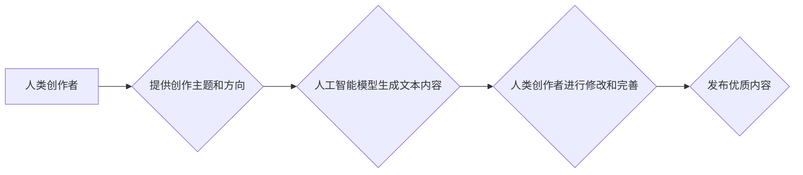

>人工智能，内容创作，自然语言处理，机器学习，深度学习，文本生成，代码生成，创意写作

## 1. 背景介绍

在当今数字时代，内容是王道。无论是商业推广、个人品牌建设还是知识传播，优质的内容都扮演着至关重要的角色。然而，内容创作是一个耗时耗力的过程，需要丰富的知识储备、敏锐的洞察力和强大的表达能力。随着人工智能技术的飞速发展，越来越多的技术手段被应用于内容创作领域，为人们提供了一种全新的创作方式。

## 2. 核心概念与联系

**2.1 内容创作的本质**

内容创作的核心在于将信息以生动、易懂、有价值的方式传递给目标受众。它需要考虑受众的兴趣、需求和认知水平，并通过合适的语言、结构和形式来表达内容。

**2.2 人工智能在内容创作中的应用**

人工智能技术，特别是自然语言处理（NLP）和机器学习（ML）领域取得的突破性进展，为内容创作提供了强大的工具。

* **文本生成:** 利用深度学习模型，可以自动生成各种类型的文本内容，例如文章、故事、诗歌、广告文案等。
* **代码生成:**  人工智能模型可以根据自然语言描述生成代码，极大地提高了开发效率。
* **内容优化:**  人工智能可以分析文本内容，并提供改进建议，例如语法错误、逻辑不通、重复词汇等。

**2.3 人工智能与内容创作的协同关系**

人工智能技术并非要取代人类内容创作者，而是要成为他们的强大助手。

* **解放人力:**  人工智能可以完成重复性、耗时的创作任务，让人类创作者可以专注于更具创意和战略性的工作。
* **提升效率:**  人工智能可以加速内容创作流程，帮助创作者更快地完成作品。
* **拓展可能性:**  人工智能可以帮助创作者探索新的创作思路和形式，突破传统创作的局限性。

**2.4 Mermaid 流程图**



## 3. 核心算法原理 & 具体操作步骤

**3.1 算法原理概述**

文本生成的核心算法是基于深度学习的语言模型，例如GPT-3、BERT等。这些模型通过训练大量的文本数据，学习语言的语法规则、语义关系和写作风格，从而能够生成流畅、自然的文本内容。

**3.2 算法步骤详解**

1. **数据预处理:**  收集并清洗大量文本数据，将其转换为模型可以理解的格式。
2. **模型训练:**  使用深度学习算法训练语言模型，让模型学习文本数据的规律。
3. **文本生成:**  输入文本提示或种子词，模型根据训练数据生成相应的文本内容。
4. **文本后处理:**  对生成的文本进行语法检查、逻辑校对和风格调整，使其更加流畅自然。

**3.3 算法优缺点**

* **优点:**  能够生成高质量、多样化的文本内容，适应不同的写作风格和主题。
* **缺点:**  需要大量的训练数据，训练成本较高；生成的文本可能存在逻辑错误或偏见；缺乏真正的创造力和理解能力。

**3.4 算法应用领域**

* **内容创作:**  自动生成新闻报道、博客文章、社交媒体文案等。
* **教育培训:**  生成个性化学习内容、自动批改作业等。
* **客服服务:**  构建智能聊天机器人，自动回复用户咨询。

## 4. 数学模型和公式 & 详细讲解 & 举例说明

**4.1 数学模型构建**

文本生成模型通常基于循环神经网络（RNN）或变压器（Transformer）架构。

* **RNN:**  RNN能够处理序列数据，例如文本，并学习文本中词语之间的依赖关系。

* **Transformer:**  Transformer是一种更先进的架构，它利用注意力机制来捕捉文本中的长距离依赖关系，能够生成更流畅、更自然的文本内容。

**4.2 公式推导过程**

由于篇幅限制，此处不再详细推导数学公式。

**4.3 案例分析与讲解**

例如，GPT-3模型使用Transformer架构，并训练了大量的文本数据。当用户输入一个文本提示，例如“今天天气真好”，GPT-3模型会根据训练数据预测下一个词语，并以此类推，最终生成一段完整的文本内容。

## 5. 项目实践：代码实例和详细解释说明

**5.1 开发环境搭建**

使用Python语言和相关的深度学习框架，例如TensorFlow或PyTorch，搭建开发环境。

**5.2 源代码详细实现**

```python
# 使用GPT-2模型生成文本内容
from transformers import pipeline

generator = pipeline('text-generation', model='gpt2')

text = generator("今天天气真好", max_length=50, num_return_sequences=3)

for output in text:
    print(output['generated_text'])
```

**5.3 代码解读与分析**

* `pipeline('text-generation', model='gpt2')`:  使用HuggingFace Transformers库加载预训练的GPT-2模型，并创建文本生成管道。
* `generator("今天天气真好", max_length=50, num_return_sequences=3)`:  输入文本提示“今天天气真好”，并设置生成文本的最大长度为50个词语，生成3个不同的文本序列。
* `print(output['generated_text'])`:  打印生成的文本内容。

**5.4 运行结果展示**

```
今天天气真好，阳光明媚，鸟儿在歌唱。
今天天气真好，万里无云，心情舒畅。
今天天气真好，适合出去散步。
```

## 6. 实际应用场景

**6.1 内容营销**

* 自动生成产品描述、广告文案、社交媒体帖子等。
* 个性化推荐内容，提高用户参与度。

**6.2 教育培训**

* 生成个性化学习内容，例如习题、练习、案例分析等。
* 自动批改作业，提供个性化反馈。

**6.3 客户服务**

* 构建智能聊天机器人，自动回复用户咨询。
* 提供24小时在线服务，提高客户满意度。

**6.4 未来应用展望**

* 更智能、更具创造力的内容创作工具。
* 内容创作与其他领域（例如游戏、电影、音乐）的融合。
* 内容创作的民主化，让更多人能够参与到内容创作中。

## 7. 工具和资源推荐

**7.1 学习资源推荐**

* **书籍:**  《深度学习》、《自然语言处理》
* **在线课程:**  Coursera、edX、Udacity
* **开源项目:**  HuggingFace Transformers、OpenAI GPT-3

**7.2 开发工具推荐**

* **Python:**  Python是一种流行的编程语言，广泛应用于人工智能领域。
* **TensorFlow:**  TensorFlow是一个开源的机器学习框架，提供丰富的工具和资源。
* **PyTorch:**  PyTorch是一个另一个流行的机器学习框架，以其灵活性和易用性而闻名。

**7.3 相关论文推荐**

* **Attention Is All You Need:**  提出了Transformer架构，彻底改变了自然语言处理领域。
* **BERT: Pre-training of Deep Bidirectional Transformers for Language Understanding:**  提出了BERT模型，在许多自然语言理解任务上取得了突破性进展。
* **GPT-3: Language Models are Few-Shot Learners:**  提出了GPT-3模型，展示了大型语言模型的强大能力。

## 8. 总结：未来发展趋势与挑战

**8.1 研究成果总结**

人工智能技术在内容创作领域取得了显著进展，为人们提供了新的创作方式和可能性。

**8.2 未来发展趋势**

* 模型规模和能力的进一步提升。
* 内容创作与其他领域（例如多媒体、虚拟现实）的融合。
* 更注重内容的个性化、多样性和原创性。

**8.3 面临的挑战**

* 算法的公平性和可解释性。
* 内容的原创性和版权问题。
* 人工智能技术带来的社会影响。

**8.4 研究展望**

未来，人工智能技术将继续推动内容创作领域的发展，创造出更加丰富、精彩的内容。

## 9. 附录：常见问题与解答

**9.1 如何选择合适的文本生成模型？**

选择合适的文本生成模型需要考虑以下因素：

* **任务类型:**  不同的任务类型需要不同的模型。例如，生成新闻报道需要模型具备事实性强的能力，而生成诗歌则需要模型具备创造力和想象力。
* **数据规模:**  模型的训练数据规模会影响其性能。
* **计算资源:**  一些大型模型需要大量的计算资源进行训练和推理。

**9.2 如何避免文本生成模型生成的文本存在偏差或错误？**

* 使用高质量、多样化的训练数据。
* 对生成的文本进行人工审核和校对。
* 开发算法来检测和纠正文本中的偏差或错误。

**9.3 人工智能技术对内容创作者的影响是什么？**

人工智能技术可以帮助内容创作者提高效率、拓展可能性，但它并不会取代人类创作者。人类创作者仍然需要发挥自己的创造力和洞察力，为内容创作注入灵魂和情感。

作者：禅与计算机程序设计艺术 / Zen and the Art of Computer Programming


<end_of_turn>