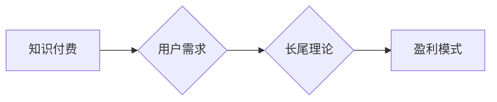

> 知识付费, 长尾理论, 盈利模式, 内容运营, 市场定位, 用户需求, 价值传递, 知识产权, 技术平台

## 1. 背景介绍

在互联网时代，信息爆炸和知识经济的快速发展，知识付费逐渐成为一种重要的商业模式。它打破了传统教育和信息传播的模式，赋予了知识创造者更多的价值获取机会。长尾理论则指出，在互联网时代，大量小众需求的总和，可能超过了少数热门需求的总和。

结合这两个概念，我们可以看到，知识付费在长尾理论的背景下，拥有着巨大的发展潜力。通过精准定位用户需求，打造优质的知识产品，可以有效地满足长尾市场的需求，实现可持续的盈利。

## 2. 核心概念与联系

### 2.1 知识付费

知识付费是指知识创造者通过线上平台，将自己的知识、技能、经验等打包成产品，向付费用户提供学习和获取价值的服务。

### 2.2 长尾理论

长尾理论指出，在互联网时代，大量小众需求的总和，可能超过了少数热门需求的总和。

**核心概念与联系的Mermaid流程图:**



## 3. 核心算法原理 & 具体操作步骤

### 3.1 算法原理概述

知识付费的盈利模式本质上是一种市场匹配算法。通过分析用户需求和知识产品的供需关系，实现精准匹配，从而促进交易和盈利。

### 3.2 算法步骤详解

1. **用户需求分析:** 通过用户行为数据、问卷调查、市场调研等方式，收集用户需求信息，包括用户兴趣、技能水平、学习目标等。
2. **知识产品分类:** 将知识产品按照主题、类型、难度等进行分类，建立知识库。
3. **匹配算法:** 利用机器学习算法，分析用户需求和知识产品特征，进行精准匹配，推荐合适的知识产品给用户。
4. **交易平台:** 提供安全的交易平台，方便用户购买和学习知识产品。
5. **用户反馈:** 收集用户对知识产品的评价和反馈，不断优化匹配算法和知识产品内容。

### 3.3 算法优缺点

**优点:**

* 精准匹配: 能够根据用户需求，推荐最合适的知识产品。
* 提高转化率: 精准匹配可以提高用户购买意愿，从而提高转化率。
* 挖掘长尾市场: 可以满足大量小众需求，挖掘长尾市场潜力。

**缺点:**

* 数据依赖: 算法需要大量用户数据进行训练和优化。
* 算法复杂: 需要专业的技术人员进行开发和维护。
* 用户隐私: 需要妥善处理用户隐私数据。

### 3.4 算法应用领域

* 在线教育
* 技能培训
* 咨询服务
* 内容创作
* 社交平台

## 4. 数学模型和公式 & 详细讲解 & 举例说明

### 4.1 数学模型构建

我们可以用一个简单的数学模型来描述知识付费的盈利模式:

**利润 = (用户数量 * 平均消费金额) - 成本**

其中:

* 用户数量: 购买知识产品的用户数量
* 平均消费金额: 每位用户购买的知识产品平均价格
* 成本: 开发、运营、推广等知识产品的成本

### 4.2 公式推导过程

这个公式的推导过程很简单，就是将知识付费的盈利模式分解成几个关键要素，并用数学表达式表示出来。

### 4.3 案例分析与讲解

假设一个在线教育平台，开发了一门编程课程，目标用户是初学者。

* 用户数量: 1000人
* 平均消费金额: 100元
* 成本: 5000元

根据公式，该课程的利润为:

利润 = (1000 * 100) - 5000 = 95000元

## 5. 项目实践：代码实例和详细解释说明

### 5.1 开发环境搭建

* 操作系统: Windows/macOS/Linux
* 编程语言: Python
* 开发框架: Django/Flask
* 数据库: MySQL/PostgreSQL

### 5.2 源代码详细实现

```python
# 用户模型
class User(models.Model):
    username = models.CharField(max_length=255)
    email = models.EmailField()
    # ... 其他用户属性

# 知识产品模型
class Product(models.Model):
    title = models.CharField(max_length=255)
    description = models.TextField()
    price = models.DecimalField(max_digits=10, decimal_places=2)
    # ... 其他知识产品属性

# 购买记录模型
class Purchase(models.Model):
    user = models.ForeignKey(User, on_delete=models.CASCADE)
    product = models.ForeignKey(Product, on_delete=models.CASCADE)
    purchase_date = models.DateTimeField(auto_now_add=True)
```

### 5.3 代码解读与分析

* 用户模型: 定义了用户的基本属性，如用户名、邮箱等。
* 知识产品模型: 定义了知识产品的基本属性，如标题、描述、价格等。
* 购买记录模型: 记录了用户购买的知识产品信息。

### 5.4 运行结果展示

* 用户可以注册账号，浏览知识产品列表。
* 用户可以根据自己的需求，选择购买感兴趣的知识产品。
* 平台会记录用户的购买记录，并提供相应的学习资源。

## 6. 实际应用场景

### 6.1 在线教育平台

* 课程销售: 提供各种类型的在线课程，例如编程、设计、语言学习等。
* 会员订阅: 提供付费会员服务，用户可以获得更多课程资源和学习支持。

### 6.2 技能培训平台

* 技能认证: 提供技能培训课程，并颁发相应的证书，帮助用户提升职业竞争力。
* 在线咨询: 提供在线咨询服务，帮助用户解决专业问题。

### 6.3 咨询服务平台

* 专业咨询: 提供专业人士的咨询服务，例如法律、财务、心理咨询等。
* 在线问答: 提供在线问答服务，用户可以向专家提问，获得专业解答。

### 6.4 未来应用展望

* 个性化学习: 利用人工智能技术，提供个性化的学习方案和推荐。
* 虚拟现实学习: 利用虚拟现实技术，打造沉浸式的学习体验。
* 元宇宙学习: 在元宇宙环境中，提供更丰富的学习资源和互动体验。

## 7. 工具和资源推荐

### 7.1 学习资源推荐

* 在线课程平台: Coursera, Udemy, edX
* 技术博客: Hacker News, Medium, Stack Overflow
* 书籍: 《The Lean Startup》, 《Zero to One》

### 7.2 开发工具推荐

* 编程语言: Python, JavaScript, Java
* 开发框架: Django, Flask, React
* 数据库: MySQL, PostgreSQL, MongoDB

### 7.3 相关论文推荐

* 《The Long Tail》 by Chris Anderson
* 《Recommender Systems: The Textbook》 by  Koren, Bell, and Volinsky
* 《Deep Learning》 by Ian Goodfellow, Yoshua Bengio, and Aaron Courville

## 8. 总结：未来发展趋势与挑战

### 8.1 研究成果总结

知识付费在长尾理论的背景下，发展迅速，并取得了显著的成果。通过精准匹配用户需求和知识产品，实现了可持续的盈利模式。

### 8.2 未来发展趋势

* 个性化学习: 利用人工智能技术，提供更个性化的学习方案和推荐。
* 沉浸式学习: 利用虚拟现实和增强现实技术，打造更沉浸式的学习体验。
* 元宇宙学习: 在元宇宙环境中，提供更丰富的学习资源和互动体验。

### 8.3 面临的挑战

* 内容质量: 需要不断提升知识产品的质量，满足用户对高质量内容的需求。
* 用户粘性: 需要提高用户粘性，鼓励用户长期使用平台。
* 数据安全: 需要加强数据安全保护，保障用户隐私安全。

### 8.4 研究展望

未来，知识付费将继续朝着更个性化、更沉浸式、更智能化的方向发展。研究者将继续探索新的技术和模式，为用户提供更优质的学习体验。

## 9. 附录：常见问题与解答

### 9.1 如何选择合适的知识付费平台？

* 考虑平台的专业领域、用户群体、课程质量、价格体系等因素。
* 可以参考平台的用户评价和口碑，选择信誉良好的平台。

### 9.2 如何打造优质的知识付费产品？

* 深入了解用户需求，提供有价值的内容。
* 采用生动有趣的教学方式，提高用户学习兴趣。
* 提供完善的售后服务，解决用户疑问。

### 9.3 如何推广知识付费产品？

* 利用社交媒体、搜索引擎优化等方式进行推广。
* 与KOL合作，进行产品推荐。
* 参加行业展会，进行产品展示。


作者：禅与计算机程序设计艺术 / Zen and the Art of Computer Programming 
<end_of_turn>