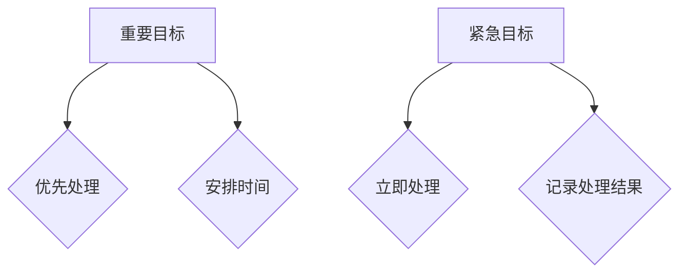

> 巴菲特双目标清单，时间管理，优先级排序，效率提升，目标达成

## 1. 背景介绍

在当今快节奏的社会，时间是宝贵的资源，高效地管理时间对于个人和团队的成功至关重要。许多时间管理方法层出不穷，但如何找到最适合自己的方法，并将其有效地应用于实际工作中，仍然是一个挑战。

巴菲特双目标清单，源于著名投资家沃伦·巴菲特的思维方式，是一种简单而有效的目标管理方法。它强调将目标分解为两个层次：**重要目标**和**紧急目标**，并根据其优先级进行安排。这种方法不仅可以帮助我们更好地理解自己的时间分配，还可以提高工作效率，并最终实现目标。

## 2. 核心概念与联系

巴菲特双目标清单的核心概念是将所有任务按照其重要性和紧急性进行分类，并制定相应的行动计划。

**重要目标**是指对个人或团队长期发展至关重要的目标，例如：

* 提升专业技能
* 建立人脉关系
* 发展个人兴趣爱好

**紧急目标**是指需要立即处理的任务，例如：

* 处理突发事件
* 应对客户紧急需求
* 完成紧迫的项目截止日期

**Mermaid 流程图：**



巴菲特双目标清单的核心在于，我们应该优先处理重要目标，并合理安排时间来完成它们。紧急目标虽然需要及时处理，但它们往往是干扰我们完成重要目标的因素。

## 3. 核心算法原理 & 具体操作步骤

### 3.1  算法原理概述

巴菲特双目标清单的算法原理并不复杂，它本质上是一种基于优先级排序的决策算法。

**步骤：**

1. 列出所有需要完成的任务。
2. 对于每个任务，判断其重要性和紧急性。
3. 将任务按照重要性和紧急性进行分类。
4. 优先处理重要目标，并合理安排时间。
5. 及时处理紧急目标，并记录处理结果。

### 3.2  算法步骤详解

**1. 列出所有需要完成的任务：**

可以利用待办事项清单、笔记软件等工具，将所有需要完成的任务记录下来。

**2. 对于每个任务，判断其重要性和紧急性：**

可以使用以下标准来判断任务的重要性：

* **对个人或团队长期发展至关重要**
* **与个人价值观和目标相符**
* **能够带来长远效益**

可以使用以下标准来判断任务的紧急性：

* **需要立即处理**
* **有明确的截止日期**
* **会带来负面后果**

**3. 将任务按照重要性和紧急性进行分类：**

将任务按照重要性和紧急性进行分类，可以采用以下方法：

* **重要且紧急：** 优先处理，立即行动。
* **重要但不紧急：** 安排时间，定期处理。
* **紧急但不重要：** 委派他人处理，或寻找自动化工具。
* **不重要也不紧急：** 删除或忽略。

**4. 优先处理重要目标，并合理安排时间：**

对于重要目标，应该制定详细的行动计划，并合理安排时间进行处理。可以使用时间管理工具，例如番茄工作法、时间块法等，提高工作效率。

**5. 及时处理紧急目标，并记录处理结果：**

对于紧急目标，应该及时处理，并记录处理结果，以便后续进行总结和改进。

### 3.3  算法优缺点

**优点：**

* 简单易懂，易于实施。
* 能够帮助我们更好地理解自己的时间分配。
* 提高工作效率，并最终实现目标。

**缺点：**

* 对于一些模糊的目标，难以判断其重要性和紧急性。
* 需要不断地调整和优化，才能达到最佳效果。

### 3.4  算法应用领域

巴菲特双目标清单的应用领域非常广泛，可以应用于：

* 个人时间管理
* 项目管理
* 团队协作
* 学习和研究

## 4. 数学模型和公式 & 详细讲解 & 举例说明

巴菲特双目标清单的数学模型并不复杂，它主要基于优先级排序的逻辑。

### 4.1  数学模型构建

我们可以用一个简单的矩阵来表示巴菲特双目标清单的数学模型：

| 重要性 | 紧急性 | 任务分类 |
|---|---|---|
| 高 | 高 | 重要且紧急 |
| 高 | 低 | 重要但不紧急 |
| 低 | 高 | 紧急但不重要 |
| 低 | 低 | 不重要也不紧急 |

其中：

* **重要性**：用一个数值表示任务对个人或团队长期发展的重要性，例如 1-5 分，5 分表示最高重要性。
* **紧急性**：用一个数值表示任务需要立即处理的程度，例如 1-5 分，5 分表示最高紧急性。

### 4.2  公式推导过程

我们可以根据任务的重要性与紧急性，制定相应的处理策略：

* **重要且紧急：** 优先处理，分配最高优先级。
* **重要但不紧急：** 安排时间，分配中等优先级。
* **紧急但不重要：** 委派他人处理，分配最低优先级。
* **不重要也不紧急：** 删除或忽略。

### 4.3  案例分析与讲解

**案例：**

假设我们需要完成以下任务：

* 写一篇技术博客文章 (重要性：5，紧急性：3)
* 处理客户紧急反馈 (重要性：3，紧急性：5)
* 学习新的编程语言 (重要性：4，紧急性：2)
* 整理个人笔记 (重要性：2，紧急性：1)

根据巴菲特双目标清单的数学模型，我们可以将这些任务进行分类：

* **重要且紧急：** 处理客户紧急反馈
* **重要但不紧急：** 写一篇技术博客文章，学习新的编程语言
* **紧急但不重要：** 整理个人笔记

**处理策略：**

1. 优先处理客户紧急反馈，分配最高优先级。
2. 安排时间学习新的编程语言和写一篇技术博客文章，分配中等优先级。
3. 整理个人笔记可以稍后处理，分配最低优先级。

## 5. 项目实践：代码实例和详细解释说明

### 5.1  开发环境搭建

为了更好地演示巴菲特双目标清单的应用，我们可以使用 Python 开发一个简单的任务管理工具。

**开发环境：**

* Python 3.x
* Jupyter Notebook

### 5.2  源代码详细实现

```python
class Task:
    def __init__(self, name, importance, urgency):
        self.name = name
        self.importance = importance
        self.urgency = urgency

    def __str__(self):
        return f"任务名称: {self.name}, 重要性: {self.importance}, 紧急性: {self.urgency}"

tasks = []

while True:
    print("请选择操作:")
    print("1. 添加任务")
    print("2. 查看任务列表")
    print("3. 退出")

    choice = input("请输入您的选择: ")

    if choice == '1':
        name = input("请输入任务名称: ")
        importance = int(input("请输入任务重要性 (1-5): "))
        urgency = int(input("请输入任务紧急性 (1-5): "))
        task = Task(name, importance, urgency)
        tasks.append(task)
        print("任务添加成功!")

    elif choice == '2':
        if not tasks:
            print("任务列表为空!")
        else:
            print("任务列表:")
            for task in tasks:
                print(task)

    elif choice == '3':
        break
    else:
        print("无效选择!")
```

### 5.3  代码解读与分析

这段代码实现了一个简单的任务管理工具，它可以帮助用户添加任务，并根据任务的重要性与紧急性进行排序。

**代码结构：**

* **Task 类：** 定义了一个任务的结构，包含任务名称、重要性和紧急性。
* **tasks 列表：** 用于存储所有任务。
* **主循环：** 提供用户交互界面，允许用户添加任务、查看任务列表和退出程序。

**代码逻辑：**

1. 用户输入选择操作。
2. 根据用户选择执行相应的操作。
3. 添加任务时，用户需要输入任务名称、重要性和紧急性。
4. 查看任务列表时，程序会遍历 tasks 列表，并打印每个任务的信息。

### 5.4  运行结果展示

运行这段代码后，用户可以按照提示操作，添加任务并查看任务列表。

## 6. 实际应用场景

巴菲特双目标清单在实际应用场景中非常广泛，例如：

### 6.1  个人时间管理

我们可以利用巴菲特双目标清单来管理个人时间，优先处理重要目标，例如学习新技能、提升专业能力、发展个人兴趣爱好。

### 6.2  项目管理

在项目管理中，巴菲特双目标清单可以帮助我们优先处理关键任务，并合理分配资源，提高项目效率。

### 6.3  团队协作

团队协作中，巴菲特双目标清单可以帮助团队成员明确目标，并协同完成重要任务。

### 6.4  未来应用展望

随着人工智能技术的不断发展，巴菲特双目标清单的应用场景将会更加广泛。例如，我们可以利用人工智能技术自动分析任务的重要性与紧急性，并提供个性化的时间管理建议。

## 7. 工具和资源推荐

### 7.1  学习资源推荐

* **巴菲特传：** 了解巴菲特的人生哲学和投资理念。
* **高效能人士的七个习惯：** 学习时间管理和个人效率提升的技巧。
* **Getting Things Done：** 掌握任务管理和流程优化的方法。

### 7.2  开发工具推荐

* **Python：** 灵活强大的编程语言，适合开发各种任务管理工具。
* **Jupyter Notebook：** 便捷的交互式编程环境，适合数据分析和可视化。
* **Trello：** 在线项目管理工具，可以用于协同完成任务。

### 7.3  相关论文推荐

* **The Eisenhower Matrix: A Time Management Tool**
* **Prioritization Techniques for Task Scheduling**
* **The Impact of Time Management on Productivity**

## 8. 总结：未来发展趋势与挑战

### 8.1  研究成果总结

巴菲特双目标清单是一种简单而有效的目标管理方法，它可以帮助我们更好地理解自己的时间分配，提高工作效率，并最终实现目标。

### 8.2  未来发展趋势

随着人工智能技术的不断发展，巴菲特双目标清单的应用场景将会更加广泛。例如，我们可以利用人工智能技术自动分析任务的重要性与紧急性，并提供个性化的时间管理建议。

### 8.3  面临的挑战

巴菲特双目标清单的应用也面临一些挑战，例如：

* 如何准确判断任务的重要性与紧急性。
* 如何平衡重要目标和紧急目标之间的冲突。
* 如何保持长期坚持，不断优化时间管理方法。

### 8.4  研究展望

未来，我们可以进一步研究巴菲特双目标清单的应用场景，并结合人工智能技术，开发更加智能化的时间管理工具，帮助人们更高效地管理时间，实现个人和团队的目标。

## 9. 附录：常见问题与解答

**常见问题：**

* 如何判断任务的重要性与紧急性？
* 如何平衡重要目标和紧急目标之间的冲突？
* 如何保持长期坚持，不断优化时间管理方法？

**解答：**

* 任务的重要性与紧急性可以通过以下标准进行判断：
    * **重要性：** 对个人或团队长期发展至关重要，与个人价值观和目标相符，能够带来长远效益。
    * **紧急性：** 需要立即处理，有明确的截止日期，会带来负面后果。
* 为了平衡重要目标和紧急目标之间的冲突，我们可以