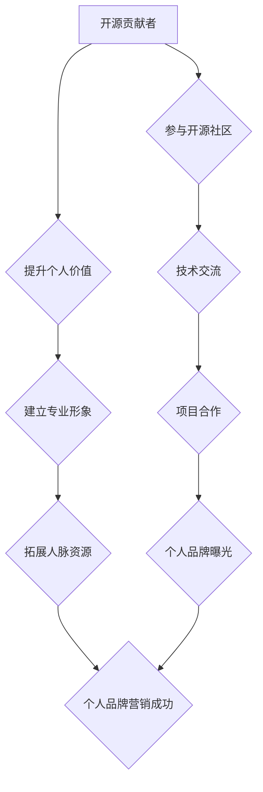

> 开源贡献者，个人品牌，营销策略，社区建设，内容创作，线上推广，线下活动

## 1. 背景介绍

开源软件已经成为现代软件开发的基石，其蓬勃发展离不开无数开源贡献者的辛勤付出。然而，对于许多开源贡献者来说，他们的贡献往往只停留在代码层面，缺乏有效的个人品牌营销，导致个人价值难以得到充分体现。

随着开源社区的日益壮大，竞争也日益激烈。想要在开源领域脱颖而出，个人品牌建设变得尤为重要。个人品牌营销可以帮助开源贡献者提升个人知名度，建立专业形象，吸引更多关注和机会。

## 2. 核心概念与联系

**个人品牌营销**是指个人通过各种手段塑造和推广自己的形象，建立个人价值，最终实现个人目标的过程。对于开源贡献者来说，个人品牌营销的核心在于：

* **突出个人价值:** 展示你的技术能力、项目经验、解决问题的能力以及对开源社区的贡献。
* **建立专业形象:** 通过高质量的内容创作、积极的社区参与和良好的沟通技巧，塑造专业、可靠、值得信赖的形象。
* **拓展人脉资源:** 与其他开源贡献者、开发者、企业和用户建立联系，拓展人脉资源，获得更多合作机会。

**开源社区**是一个由志同道合的开发者组成的网络平台，致力于共同开发和维护开源软件。开源社区为开源贡献者提供了：

* **技术交流平台:** 与其他开发者分享经验、学习新技术、解决技术难题。
* **项目合作机会:** 参与开源项目开发，积累项目经验，提升技术能力。
* **个人品牌曝光机会:** 通过贡献代码、撰写文档、参与社区活动等方式，提升个人知名度和影响力。

**个人品牌营销与开源社区**相互促进，个人品牌营销可以帮助开源贡献者更好地融入开源社区，获得更多认可和机会，而开源社区为个人品牌营销提供了广阔的平台和资源。

**Mermaid 流程图:**



## 3. 核心算法原理 & 具体操作步骤

### 3.1  算法原理概述

个人品牌营销的核心算法可以概括为：

* **内容创作:** 持续创作高质量的技术博客文章、开源项目文档、视频教程等内容，展示你的专业知识和技能。
* **社区参与:** 积极参与开源社区论坛、邮件列表、社交媒体等平台，与其他开发者交流互动，分享经验，解答问题。
* **线上推广:** 利用社交媒体平台、个人网站、博客平台等渠道，推广你的个人品牌和开源项目。
* **线下活动:** 参加开源会议、技术研讨会、线下聚会等活动，与其他开发者建立人脉关系。

### 3.2  算法步骤详解

1. **明确目标:** 确定你的个人品牌营销目标，例如提升知名度、获得更多合作机会、找到理想工作等。
2. **定位个人品牌:** 确定你的个人品牌定位，例如技术专家、开源项目维护者、社区领袖等。
3. **打造个人网站:** 建立一个个人网站或博客，展示你的个人信息、项目经验、技术博客文章等内容。
4. **创作高质量内容:** 持续创作高质量的技术博客文章、开源项目文档、视频教程等内容，并将其发布到个人网站、博客平台、社交媒体等渠道。
5. **积极参与开源社区:** 积极参与开源社区论坛、邮件列表、社交媒体等平台，与其他开发者交流互动，分享经验，解答问题。
6. **线上推广:** 利用社交媒体平台、个人网站、博客平台等渠道，推广你的个人品牌和开源项目。
7. **线下活动:** 参加开源会议、技术研讨会、线下聚会等活动，与其他开发者建立人脉关系。
8. **持续优化:** 定期分析你的个人品牌营销效果，并根据实际情况进行调整和优化。

### 3.3  算法优缺点

**优点:**

* **可量化效果:** 通过网站流量、社交媒体粉丝数、开源项目贡献等指标，可以量化个人品牌营销的效果。
* **成本相对较低:** 相比传统营销方式，个人品牌营销成本相对较低。
* **可持续发展:** 个人品牌营销是一个长期积累的过程，可以持续提升个人价值和影响力。

**缺点:**

* **需要投入时间和精力:** 个人品牌营销需要持续创作内容、参与社区活动、推广个人品牌等，需要投入大量的时间和精力。
* **效果难以预测:** 个人品牌营销的效果难以预测，需要不断尝试和调整。
* **竞争激烈:** 开源社区是一个竞争激烈的环境，需要不断提升自身价值才能脱颖而出。

### 3.4  算法应用领域

个人品牌营销算法广泛应用于开源社区，可以帮助开源贡献者：

* **提升个人知名度:** 通过高质量的内容创作和社区参与，提升个人知名度和影响力。
* **获得更多合作机会:** 建立良好的个人品牌形象，可以吸引更多企业和个人寻求合作。
* **找到理想工作:** 个人品牌营销可以帮助开源贡献者展示自己的技术能力和项目经验，吸引更多理想工作机会。

## 4. 数学模型和公式 & 详细讲解 & 举例说明

### 4.1  数学模型构建

个人品牌营销可以抽象为一个动态系统，其核心要素包括：

* **个人价值 (PV):** 包括技术能力、项目经验、社区贡献等方面。
* **品牌知名度 (BN):** 指个人在开源社区中的知名度和影响力。
* **人脉资源 (NR):** 指个人与其他开发者、企业和用户的联系网络。

这些要素之间存在着相互影响的关系，可以构建一个数学模型来描述个人品牌营销的过程：

```
PV = f(知识积累, 项目经验, 社区贡献)
BN = g(PV, 内容创作, 社区参与, 线上推广)
NR = h(BN, 线下活动, 人脉拓展)
```

其中，f、g、h分别代表不同的函数，描述了各个要素之间的关系。

### 4.2  公式推导过程

由于个人品牌营销是一个复杂的过程，其数学模型的推导过程较为复杂，需要考虑多个因素的影响。

例如，个人价值的提升需要不断学习新知识、积累项目经验、参与开源社区贡献等，这些因素可以分别用不同的函数来描述。

品牌知名度的提升则需要个人价值的支撑，同时还需要通过内容创作、社区参与、线上推广等方式来扩大影响力。

人脉资源的积累则需要品牌知名度的基础，并通过线下活动、人脉拓展等方式来建立联系网络。

### 4.3  案例分析与讲解

假设有一个开源贡献者，他的技术能力比较强，参与过多个开源项目，积累了丰富的项目经验。

他开始进行个人品牌营销，通过创作高质量的技术博客文章、积极参与开源社区论坛、推广个人网站等方式，逐渐提升了个人价值和品牌知名度。

随着品牌知名度的提升，他开始参加开源会议、技术研讨会等线下活动，建立了更多的行业人脉资源。

最终，他通过个人品牌营销获得了更多合作机会，找到了理想的工作。

## 5. 项目实践：代码实例和详细解释说明

### 5.1  开发环境搭建

为了更好地展示个人品牌营销的实践案例，我们可以创建一个简单的个人品牌网站。

开发环境搭建步骤如下：

1. 安装一个本地代码编辑器，例如VS Code、Sublime Text等。
2. 安装一个Web服务器，例如Apache、Nginx等。
3. 安装一个数据库管理系统，例如MySQL、PostgreSQL等。

### 5.2  源代码详细实现

我们可以使用HTML、CSS、JavaScript等前端技术，以及Python、Django等后端技术来开发一个简单的个人品牌网站。

以下是一个简单的个人品牌网站的代码示例：

```html
<!DOCTYPE html>
<html>
<head>
  <title>个人品牌网站</title>
  <link rel="stylesheet" href="style.css">
</head>
<body>
  <h1>我的个人品牌网站</h1>
  <p>欢迎访问我的个人品牌网站！</p>
  <ul>
    <li><a href="#">我的项目</a></li>
    <li><a href="#">我的博客</a></li>
    <li><a href="#">联系我</a></li>
  </ul>
</body>
</html>
```

```css
body {
  font-family: sans-serif;
}

h1 {
  text-align: center;
}

ul {
  list-style-type: none;
  padding: 0;
}

li {
  margin-bottom: 10px;
}
```

### 5.3  代码解读与分析

* HTML代码定义了网站的基本结构，包括标题、段落、列表等元素。
* CSS代码定义了网站的样式，例如字体、颜色、布局等。

### 5.4  运行结果展示

将以上代码保存到本地，并使用Web服务器启动，即可访问到个人品牌网站。

## 6. 实际应用场景

### 6.1  开源项目维护者

开源项目维护者可以通过个人品牌营销来提升项目知名度，吸引更多贡献者和用户。

例如，可以定期发布项目更新日志、撰写技术博客文章、参与开源社区论坛等方式，来提高项目的曝光度和影响力。

### 6.2  技术博客作者

技术博客作者可以通过个人品牌营销来建立专业形象，吸引更多读者和潜在雇主。

例如，可以创作高质量的技术博客文章、积极参与社区讨论、推广个人博客等方式，来提升个人知名度和影响力。

### 6.3  开源社区领袖

开源社区领袖可以通过个人品牌营销来扩大社区影响力，吸引更多开发者加入社区。

例如，可以组织线下活动、举办线上讲座、积极参与社区决策等方式，来提升社区的活跃度和知名度。

### 6.4  未来应用展望

随着开源软件的日益普及，个人品牌营销在开源社区将发挥越来越重要的作用。

未来，个人品牌营销将更加注重个性化、数据化和智能化。

例如，可以使用人工智能技术来分析用户的兴趣爱好，推荐个性化的内容；可以使用数据分析工具来跟踪个人品牌营销的效果，进行优化调整；可以使用智能化工具来自动化一些营销任务，提高效率。

## 7. 工具和资源推荐

### 7.1  学习资源推荐

* **开源社区网站:** GitHub、GitLab、Bitbucket等
* **技术博客平台:** Medium、Dev.to、Hacker News等
* **在线学习平台:** Coursera、Udemy、edX等

### 7.2  开发工具推荐

* **代码编辑器:** VS Code、Sublime Text、Atom等
* **Web服务器:** Apache、Nginx、IIS等
* **数据库管理系统:** MySQL、PostgreSQL、MongoDB等

### 7.3  相关论文推荐

* **The Impact of Open Source Software on Innovation**
* **The Economics of Open Source Software**
* **Open Source Software Development: A Review**

## 8. 总结：未来发展趋势与挑战

### 8.1  研究成果总结

个人品牌营销在开源社区已经取得了一定的成果，帮助开源贡献者提升个人价值、获得更多机会。

未来，个人品牌营销将更加注重个性化、数据化和智能化，并与其他技术趋势融合，例如人工智能、区块链等。

### 8.2  未来发展趋势

* **个性化营销:** 利用人工智能技术分析用户的兴趣爱好，推荐个性化的内容和服务。
* **数据驱动营销:** 使用数据分析工具跟踪个人品牌营销的效果，进行优化调整。
* **智能化营销:** 使用智能化工具自动化一些营销任务，提高效率。
* **跨平台营销:** 将个人品牌营销推广到多个平台，例如社交媒体、博客平台、视频平台等。

### 8.3  面临的挑战

* **信息过载