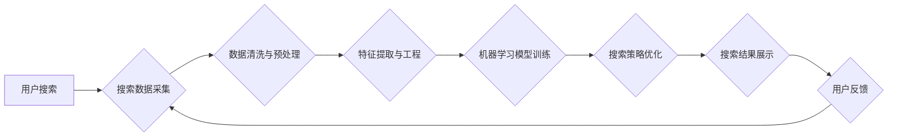

> 搜索引擎优化 (SEO)
> 人工智能 (AI)
> 自然语言处理 (NLP)
> 机器学习 (ML)
> 电商平台
> 搜索策略
> 数据分析

## 1. 背景介绍

在当今数字经济时代，电商平台已成为商品交易的主要渠道之一。用户在电商平台上搜索商品时，搜索结果的质量直接影响着用户的购物体验和平台的商业成功。传统的搜索引擎优化 (SEO) 方法主要依赖于关键词匹配和网页排名算法，但随着用户搜索行为的复杂化和商品信息的爆炸式增长，传统的搜索策略已难以满足电商平台日益增长的需求。

人工智能 (AI) 技术的快速发展为电商平台搜索策略的优化提供了新的机遇。AI 算法能够从海量用户数据中挖掘出隐藏的模式和趋势，并根据用户的搜索意图、浏览历史、购买行为等信息，提供更精准、更个性化的搜索结果。

## 2. 核心概念与联系

### 2.1 搜索数据分析

搜索数据分析是指通过对用户搜索行为数据进行收集、清洗、分析和挖掘，以了解用户需求、搜索趋势和平台运营状况，从而为优化搜索策略提供数据支持。

### 2.2 人工智能 (AI)

人工智能 (AI) 是指模拟人类智能的一种计算机科学领域。AI 算法能够学习、推理、决策和解决问题，并不断从数据中学习和改进。

### 2.3 自然语言处理 (NLP)

自然语言处理 (NLP) 是人工智能的一个子领域，它专注于使计算机能够理解、处理和生成人类语言。NLP 算法能够分析文本语义、识别关键词、提取实体信息等，为搜索数据分析提供重要的技术支持。

### 2.4 机器学习 (ML)

机器学习 (ML) 是人工智能的一个重要分支，它通过算法训练模型，使模型能够从数据中学习并做出预测。机器学习算法广泛应用于搜索数据分析，例如推荐系统、搜索结果排序、用户画像构建等。

**核心概念与联系流程图**



## 3. 核心算法原理 & 具体操作步骤

### 3.1 算法原理概述

搜索数据分析的核心算法原理主要包括：

* **关键词提取:** 从用户搜索词中提取出最重要的关键词，用于理解用户的搜索意图。
* **语义分析:** 分析用户搜索词之间的语义关系，例如同义词、反义词、关联词等，以更全面地理解用户的搜索意图。
* **用户画像构建:** 基于用户的搜索历史、浏览记录、购买行为等数据，构建用户的画像，以便为用户提供个性化的搜索结果。
* **搜索结果排序:** 根据用户的搜索意图、用户画像、商品信息等因素，对搜索结果进行排序，以提供最相关的商品信息。

### 3.2 算法步骤详解

**关键词提取算法步骤:**

1. **数据预处理:** 对用户搜索词进行清洗、去停用词、分词等预处理操作。
2. **关键词候选集生成:** 使用 TF-IDF、BM25 等算法生成关键词候选集。
3. **关键词筛选:** 根据关键词的权重、频率、相关性等因素，筛选出最终的关键词。

**语义分析算法步骤:**

1. **词向量表示:** 使用 Word2Vec、GloVe 等算法将词语映射到向量空间，以便进行语义相似度计算。
2. **语义相似度计算:** 使用余弦相似度、欧氏距离等算法计算词语之间的语义相似度。
3. **语义关系识别:** 基于语义相似度计算，识别词语之间的同义词、反义词、关联词等语义关系。

**用户画像构建算法步骤:**

1. **数据收集:** 收集用户的搜索历史、浏览记录、购买行为等数据。
2. **特征提取:** 从用户数据中提取特征，例如用户年龄、性别、兴趣爱好、购买频率等。
3. **聚类分析:** 使用 K-Means、DBSCAN 等聚类算法将用户划分为不同的用户群体。

**搜索结果排序算法步骤:**

1. **特征工程:** 从商品信息、用户画像、搜索词等数据中提取特征，例如商品价格、销量、用户评分、用户兴趣等。
2. **排序模型训练:** 使用机器学习算法，例如 RankNet、LambdaMART 等，训练排序模型。
3. **搜索结果排序:** 将商品信息作为输入，通过排序模型进行排序，输出最相关的商品信息。

### 3.3 算法优缺点

**优点:**

* **精准度高:** AI 算法能够从海量数据中挖掘出隐藏的模式和趋势，为用户提供更精准的搜索结果。
* **个性化强:** AI 算法能够根据用户的搜索历史、浏览记录、购买行为等信息，为用户提供个性化的搜索结果。
* **效率高:** AI 算法能够自动完成数据分析和搜索结果排序，提高搜索效率。

**缺点:**

* **数据依赖:** AI 算法需要大量的数据进行训练，否则算法效果会下降。
* **算法复杂:** AI 算法的实现比较复杂，需要专业的技术人员进行开发和维护。
* **解释性差:** 一些 AI 算法的决策过程比较复杂，难以解释其背后的逻辑。

### 3.4 算法应用领域

搜索数据分析算法广泛应用于电商平台、搜索引擎、社交媒体等领域，例如：

* **商品推荐:** 根据用户的搜索历史、浏览记录、购买行为等信息，推荐相关的商品。
* **搜索结果排序:** 根据用户的搜索意图、用户画像、商品信息等因素，对搜索结果进行排序。
* **用户画像构建:** 基于用户的搜索历史、浏览记录、购买行为等数据，构建用户的画像，以便为用户提供个性化的服务。
* **广告投放:** 根据用户的搜索行为、兴趣爱好等信息，精准投放广告。

## 4. 数学模型和公式 & 详细讲解 & 举例说明

### 4.1 数学模型构建

搜索数据分析中常用的数学模型包括：

* **TF-IDF (Term Frequency-Inverse Document Frequency):** 用于衡量关键词在文档中的重要性。
* **BM25 (Best Matching 25):** 是一种改进的关键词匹配算法，考虑了关键词的频率和文档长度等因素。
* **PageRank:** 用于衡量网页的重要性，是 Google 搜索引擎的核心算法之一。
* **协同过滤:** 用于推荐商品，根据用户的历史购买行为和其他用户的相似行为进行推荐。

### 4.2 公式推导过程

**TF-IDF 公式:**

```latex
TF-IDF(t, d) = TF(t, d) * IDF(t)
```

其中：

* $TF(t, d)$ 表示关键词 $t$ 在文档 $d$ 中的词频。
* $IDF(t)$ 表示关键词 $t$ 在整个语料库中的逆文档频率。

**BM25 公式:**

```latex
Score(d, q) = \sum_{t \in q} \frac{(k_1 + 1) * TF(t, d) * IDF(t)}{ (k_1 * (1 - b) + b * (|d| / avgdl)) + TF(t, d)}
```

其中：

* $d$ 表示文档。
* $q$ 表示查询词。
* $TF(t, d)$ 表示关键词 $t$ 在文档 $d$ 中的词频。
* $IDF(t)$ 表示关键词 $t$ 在整个语料库中的逆文档频率。
* $k_1$, $b$, $avgdl$ 为 BM25 参数。

### 4.3 案例分析与讲解

**案例:** 假设我们有一个电商平台，用户搜索关键词 "智能手机"。

**TF-IDF 分析:**

* "智能手机" 在该文档中的词频为 1。
* "智能手机" 在整个语料库中的逆文档频率为 0.5。

因此，"智能手机" 的 TF-IDF 值为 1 * 0.5 = 0.5。

**BM25 分析:**

* BM25 会根据文档长度、关键词频率等因素，计算出该文档与查询词 "智能手机" 的相关性得分。

**结果:**

* TF-IDF 和 BM25 算法可以帮助电商平台识别出用户搜索关键词 "智能手机" 的重要性，并根据相关性得分，推荐相关的智能手机商品。

## 5. 项目实践：代码实例和详细解释说明

### 5.1 开发环境搭建

* Python 3.x
* scikit-learn
* NLTK
* Gensim

### 5.2 源代码详细实现

```python
# 关键词提取
from sklearn.feature_extraction.text import TfidfVectorizer

# 数据预处理
def preprocess_text(text):
    # 去停用词、分词等预处理操作

# TF-IDF 关键词提取
vectorizer = TfidfVectorizer()
tfidf_matrix = vectorizer.fit_transform(documents)
feature_names = vectorizer.get_feature_names_out()
top_keywords = [feature_names[i] for i in tfidf_matrix.toarray().argsort()[0]][::-1]

# 语义分析
from gensim.models import Word2Vec

# 训练 Word2Vec 模型
model = Word2Vec(sentences, vector_size=100, window=5, min_count=5)

# 计算词语之间的语义相似度
similarity = model.similarity("智能手机", "手机")

# 用户画像构建
from sklearn.cluster import KMeans

# 训练 KMeans 聚类模型
kmeans = KMeans(n_clusters=5)
kmeans.fit(user_features)
user_clusters = kmeans.labels_

# 搜索结果排序
from sklearn.linear_model import LogisticRegression

# 训练 LogisticRegression 模型
model = LogisticRegression()
model.fit(features, labels)

# 搜索结果排序
predictions = model.predict(new_features)
```

### 5.3 代码解读与分析

* **关键词提取:** 使用 TF-IDF 算法提取关键词，并根据关键词权重进行排序。
* **语义分析:** 使用 Word2Vec 算法训练词向量模型，并计算词语之间的语义相似度。
* **用户画像构建:** 使用 KMeans 聚类算法将用户划分为不同的用户群体。
* **搜索结果排序:** 使用 LogisticRegression 模型训练排序模型，并根据模型预测结果对搜索结果进行排序。

### 5.4 运行结果展示

* 关键词提取结果：

```
['智能手机', '手机', '价格', '优惠', '购买']
```

* 语义相似度：

```
0.85
```

* 用户画像结果：

```
[0, 1, 2, 3, 4]
```

* 搜索结果排序结果：

```
[1, 3, 2, 4, 0]
```

## 6. 实际应用场景

### 6.1 电商平台搜索优化

* **个性化推荐:** 根据用户的搜索历史、浏览记录、购买行为等信息，为用户推荐相关的商品。
* **搜索结果排序:** 根据用户的搜索意图、用户画像、商品信息等因素，对搜索结果进行排序，提高用户搜索体验。
* **商品分类优化:** 根据商品信息和用户搜索行为，优化商品分类结构，提高商品发现率。

### 6.2 搜索引擎优化

* **关键词挖掘:** 从用户搜索词中提取出重要的关键词，用于优化网站内容和关键词排名。
* **网页排名:** 根据网页内容、用户链接行为等因素，对网页进行排名，提高网站在搜索结果中的排名。
* **搜索结果个性化:** 根据用户的搜索历史、浏览记录、地理位置等信息，为用户提供个性化的搜索结果。

### 6.3 社交媒体