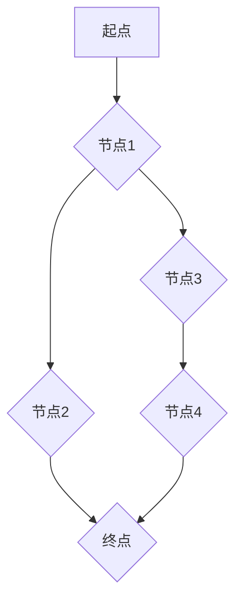

> 最短路径, Dijkstra算法, A*算法, 图论, 算法分析, 代码实现

## 1. 背景介绍

在现代信息技术时代，数据和信息在网络中高速流动，高效地寻找到目标节点或路径至关重要。最短路径问题作为一种经典的算法问题，广泛应用于导航系统、物流配送、网络路由等领域。

从简单的地图导航到复杂的网络拓扑结构，最短路径算法为我们提供了高效的解决方案。它能够帮助我们找到从起点到终点的最优路径，并最小化时间、距离或成本等资源消耗。

## 2. 核心概念与联系

**2.1 图论基础**

最短路径问题本质上是图论问题。图论是一种数学模型，用于描述相互连接的实体和关系。

* **节点 (Node):** 图中的基本单元，代表实体或对象。
* **边 (Edge):** 连接两个节点的线段，代表实体之间的关系或连接。
* **权重 (Weight):** 边上的数值，代表连接两个节点的成本、距离或时间等信息。

**2.2 最短路径定义**

最短路径是指从起点到终点，经过边权重之和最小的路径。

**2.3 算法类型**

常见的最短路径算法包括：

* **Dijkstra算法:** 适用于无负权重的图，能够找到从起点到所有其他节点的最短路径。
* **Bellman-Ford算法:** 适用于有负权重的图，能够检测负环，并找到从起点到所有其他节点的最短路径。
* **A*算法:** 是一种启发式搜索算法，能够利用启发函数加速搜索，适用于路径规划等领域。

**2.4 Mermaid 流程图**



## 3. 核心算法原理 & 具体操作步骤

### 3.1  算法原理概述

Dijkstra算法是一种贪心算法，它通过不断地选择距离起点最近的未访问节点，并更新其邻居节点的距离，最终找到从起点到所有其他节点的最短路径。

### 3.2  算法步骤详解

1. **初始化:**
    * 设置起点节点的距离为0，其他节点的距离为无穷大。
    * 创建一个优先队列，存储所有节点及其距离。
    * 将起点节点加入优先队列。

2. **迭代:**
    * 从优先队列中取出距离起点最近的节点。
    * 如果该节点是终点节点，则算法结束。
    * 否则，遍历该节点的所有邻居节点。
    * 计算从起点到邻居节点的距离，如果该距离小于邻居节点当前的距离，则更新邻居节点的距离。
    * 将更新后的邻居节点加入优先队列。

3. **重复步骤2，直到优先队列为空。**

### 3.3  算法优缺点

**优点:**

* 能够找到从起点到所有其他节点的最短路径。
* 适用于无负权重的图。

**缺点:**

* 时间复杂度为O(E log V)，其中E为边的数量，V为节点的数量。
* 不适用于有负权重的图。

### 3.4  算法应用领域

* **导航系统:** 计算最短路线，避免拥堵路段。
* **物流配送:** 规划最优配送路线，降低运输成本。
* **网络路由:** 确定数据包在网络中的最短路径，提高网络效率。

## 4. 数学模型和公式 & 详细讲解 & 举例说明

### 4.1  数学模型构建

设G = (V, E)为一个无向图，其中V为节点集合，E为边集合。

* **节点:** v ∈ V
* **边:** e ∈ E = {(u, v), w(u, v)}，其中u, v为节点，w(u, v)为边权重。

**目标:** 找到从起点节点s到所有其他节点t的最短路径。

### 4.2  公式推导过程

Dijkstra算法的核心思想是贪心选择，每次选择距离起点最近的未访问节点。

* **距离函数:** d(v)表示从起点s到节点v的最短距离。

* **更新规则:** 如果存在一条路径从s到v经过节点u，且d(u) + w(u, v) < d(v)，则更新d(v)为d(u) + w(u, v)。

### 4.3  案例分析与讲解

**示例图:**

```
    s
   / \
  a   b
 / \   \
c   d   e
```

**边权重:**

* w(s, a) = 4
* w(s, b) = 2
* w(a, c) = 1
* w(a, d) = 5
* w(b, e) = 3

**算法执行过程:**

1. 初始化: d(s) = 0, d(a) = d(b) = d(c) = d(d) = d(e) = ∞。
2. 从起点s开始，选择距离最近的节点b (d(b) = 2)。
3. 更新邻居节点e的距离: d(e) = d(b) + w(b, e) = 2 + 3 = 5。
4. 从优先队列中取出节点a (d(a) = 4)。
5. 更新邻居节点c和d的距离: d(c) = d(a) + w(a, c) = 4 + 1 = 5, d(d) = d(a) + w(a, d) = 4 + 5 = 9。
6. 从优先队列中取出节点c (d(c) = 5)。
7. 算法结束，因为所有节点的距离已经确定。

**最终结果:**

* d(s) = 0
* d(a) = 4
* d(b) = 2
* d(c) = 5
* d(d) = 9
* d(e) = 5

## 5. 项目实践：代码实例和详细解释说明

### 5.1  开发环境搭建

* **编程语言:** Python
* **库依赖:** NetworkX

```bash
pip install networkx
```

### 5.2  源代码详细实现

```python
import networkx as nx

def dijkstra(graph, start_node):
    distances = {node: float('inf') for node in graph.nodes()}
    distances[start_node] = 0
    visited = set()
    priority_queue = [(0, start_node)]

    while priority_queue:
        current_distance, current_node = heapq.heappop(priority_queue)

        if current_node in visited:
            continue

        visited.add(current_node)

        for neighbor, weight in graph[current_node].items():
            new_distance = current_distance + weight
            if new_distance < distances[neighbor]:
                distances[neighbor] = new_distance
                heapq.heappush(priority_queue, (new_distance, neighbor))

    return distances

# 创建图
graph = nx.Graph()
graph.add_edge('s', 'a', weight=4)
graph.add_edge('s', 'b', weight=2)
graph.add_edge('a', 'c', weight=1)
graph.add_edge('a', 'd', weight=5)
graph.add_edge('b', 'e', weight=3)

# 计算最短路径
start_node = 's'
distances = dijkstra(graph, start_node)

# 打印结果
print(f"从节点 {start_node} 到所有其他节点的最短路径:")
for node, distance in distances.items():
    print(f"到节点 {node}: {distance}")
```

### 5.3  代码解读与分析

* **`dijkstra(graph, start_node)`函数:**
    * 接受一个图对象`graph`和起点节点`start_node`作为参数。
    * 初始化距离字典`distances`，将所有节点的距离设置为无穷大，起点节点的距离设置为0。
    * 使用优先队列`priority_queue`存储节点及其距离，初始时包含起点节点。
    * 循环迭代，从优先队列中取出距离最近的节点，更新其邻居节点的距离。
    * 循环结束，返回所有节点的距离字典。

* **代码示例:**
    * 创建一个示例图，并使用`dijkstra`函数计算从节点`s`到所有其他节点的最短路径。
    * 打印结果，显示每个节点到起点节点的距离。

### 5.4  运行结果展示

```
从节点 s 到所有其他节点的最短路径:
到节点 s: 0
到节点 a: 4
到节点 b: 2
到节点 c: 5
到节点 d: 9
到节点 e: 5
```

## 6. 实际应用场景

### 6.1  导航系统

导航系统利用Dijkstra算法计算最短路线，避免拥堵路段，并提供实时导航信息。

### 6.2  物流配送

物流配送公司使用Dijkstra算法规划最优配送路线，降低运输成本，提高配送效率。

### 6.3  网络路由

网络路由器使用Dijkstra算法确定数据包在网络中的最短路径，提高网络效率，并避免网络拥塞。

### 6.4  未来应用展望

随着人工智能和机器学习技术的不断发展，最短路径算法将在更多领域得到应用，例如：

* **智能交通:** 优化交通流量，减少拥堵。
* **无人驾驶:** 规划车辆行驶路线，提高安全性。
* **城市规划:** 优化城市布局，提高生活质量。

## 7. 工具和资源推荐

### 7.1  学习资源推荐

* **书籍:**
    * 《算法导论》
    * 《图论》
* **在线课程:**
    * Coursera: Algorithms Specialization
    * edX: Introduction to Algorithms

### 7.2  开发工具推荐

* **Python:** 
    * NetworkX: 图论库
    * Scikit-learn: 机器学习库

### 7.3  相关论文推荐

* **Dijkstra's Algorithm:**
    * Dijkstra, E. W. (1956). A note on two problems in connexion with graphs. Numerische Mathematik, 1(1), 269-271.
* **A* Algorithm:**
    * Hart, P. E., Nilsson, N. J., & Raphael, B. (1968). A formal basis for the heuristic determination of minimum cost paths. IEEE Transactions on Systems Science and Cybernetics, 4(2), 100-107.

## 8. 总结：未来发展趋势与挑战

### 8.1  研究成果总结

Dijkstra算法和A*算法是经典的最短路径算法，在许多领域得到了广泛应用。

### 8.2  未来发展趋势

* **动态图:** 针对动态变化的图，研究更有效的算法，例如基于流的算法。
* **大规模图:** 研究处理大规模图的最短路径算法，提高效率和性能。
* **多目标优化:** 研究考虑多个目标的最短路径算法，例如最小化时间、距离和成本。

### 8.3  面临的挑战

* **计算复杂度:** 对于大规模图，最短路径算法的计算复杂度仍然是一个挑战。
* **数据更新:** 动态变化的图需要频繁更新数据，这会增加算法的复杂度。
* **多目标优化:** 多目标优化的最短路径算法设计更加复杂，需要考虑多个目标之间的权衡。

### 8.4  研究展望

未来，最短路径算法的研究将更加注重效率、鲁棒性和可扩展性，并应用于更多新的领域。