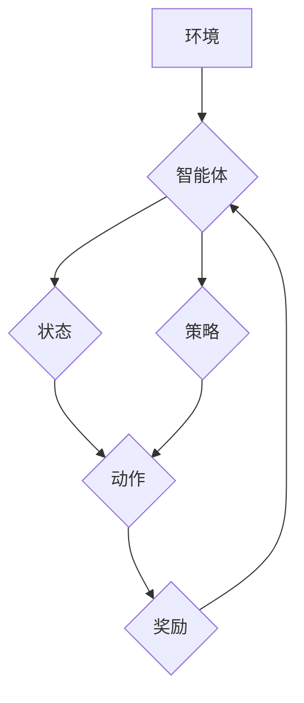

> 深度学习,强化学习,Q-learning,深度Q-网络,目标函数,策略梯度,环境交互,算法优化

## 1. 背景介绍

在机器学习领域，强化学习 (Reinforcement Learning, RL) 作为一种学习方式，吸引了越来越多的研究者和实践者的关注。强化学习的核心思想是通过试错学习，让智能体在与环境交互的过程中不断优化策略，最终达到预设的目标。

传统的 Q-learning 算法在解决离散状态和动作空间的问题上表现出色，但当面对连续状态和动作空间的复杂问题时，其性能会受到限制。为了克服这一局限性，深度 Q-learning (Deep Q-learning) 应运而生。它将深度神经网络引入 Q-learning 算法，能够有效地学习连续状态和动作空间中的价值函数，从而在更复杂的环境中取得更好的表现。

## 2. 核心概念与联系

**2.1 强化学习基本概念**

强化学习的核心要素包括：

* **智能体 (Agent):**  学习和决策的实体。
* **环境 (Environment):** 智能体所处的外部世界。
* **状态 (State):** 环境的当前描述。
* **动作 (Action):** 智能体在特定状态下可以执行的操作。
* **奖励 (Reward):** 环境对智能体动作的反馈，可以是正向或负向。
* **策略 (Policy):** 智能体在不同状态下选择动作的规则。

**2.2 Q-learning 算法原理**

Q-learning 是一种基于价值函数的强化学习算法。其目标是学习一个 Q-表，其中 Q(s, a) 表示在状态 s 下执行动作 a 的期望回报。

Q-learning 算法通过迭代更新 Q-表，不断逼近最优策略。更新规则如下：

$$Q(s, a) \leftarrow Q(s, a) + \alpha [r + \gamma \max_{a'} Q(s', a') - Q(s, a)]$$

其中：

* $\alpha$ 是学习率，控制着学习速度。
* $r$ 是当前状态下的奖励。
* $\gamma$ 是折扣因子，控制着未来奖励的权重。
* $s'$ 是执行动作 a 后进入的下一个状态。
* $a'$ 是在下一个状态 $s'$ 下选择的最优动作。

**2.3 深度 Q-learning 的引入**

深度 Q-learning 将深度神经网络用于学习 Q-函数。深度神经网络能够学习复杂非线性关系，从而更好地处理连续状态和动作空间的问题。

**2.4 深度 Q-网络 (DQN) 架构**

DQN 是一种典型的深度 Q-learning 算法，其架构包括：

* **输入层:**  接收环境状态的特征向量。
* **隐藏层:**  多个全连接层，用于提取特征和学习复杂关系。
* **输出层:**  输出每个动作对应的 Q-值。

**2.5 Mermaid 流程图**



## 3. 核心算法原理 & 具体操作步骤

### 3.1 算法原理概述

深度 Q-learning 算法的核心思想是利用深度神经网络学习状态-动作对的价值函数，并通过最大化价值函数来选择最优动作。

算法流程如下：

1. 初始化深度 Q-网络。
2. 从环境中获取初始状态。
3. 根据当前状态，使用深度 Q-网络预测每个动作的 Q-值。
4. 选择 Q-值最大的动作，并执行该动作。
5. 从环境中获取奖励和下一个状态。
6. 更新深度 Q-网络的参数，使 Q-值朝着最优方向逼近。
7. 重复步骤 2-6，直到达到终止条件。

### 3.2 算法步骤详解

1. **初始化深度 Q-网络:**

   * 定义网络结构，包括输入层、隐藏层和输出层。
   * 初始化网络参数，通常使用随机初始化。

2. **从环境中获取初始状态:**

   * 环境会提供当前状态的特征向量。

3. **根据当前状态，使用深度 Q-网络预测每个动作的 Q-值:**

   * 将状态特征向量作为输入，输入到深度 Q-网络中。
   * 网络输出每个动作对应的 Q-值。

4. **选择 Q-值最大的动作，并执行该动作:**

   * 选择 Q-值最大的动作作为当前动作。
   * 执行该动作后，环境会提供奖励和下一个状态。

5. **从环境中获取奖励和下一个状态:**

   * 环境会根据执行的动作提供奖励和下一个状态的特征向量。

6. **更新深度 Q-网络的参数，使 Q-值朝着最优方向逼近:**

   * 使用目标函数和梯度下降算法更新网络参数。
   * 目标函数通常是 Q-值与实际奖励的差值。

7. **重复步骤 2-6，直到达到终止条件:**

   * 终止条件可以是达到最大迭代次数、达到目标奖励或环境状态达到终止状态。

### 3.3 算法优缺点

**优点:**

* 可以处理连续状态和动作空间的问题。
* 学习能力强，能够学习复杂非线性关系。

**缺点:**

* 训练过程复杂，需要大量的训练数据和计算资源。
* 容易陷入局部最优解。

### 3.4 算法应用领域

深度 Q-learning 算法在许多领域都有广泛的应用，例如：

* **游戏 AI:**  学习玩游戏，例如 Atari 游戏、Go 游戏等。
* **机器人控制:**  控制机器人执行复杂任务，例如导航、抓取等。
* **推荐系统:**  根据用户的历史行为推荐物品。
* **金融交易:**  学习股票交易策略。

## 4. 数学模型和公式 & 详细讲解 & 举例说明

### 4.1 数学模型构建

深度 Q-learning 的核心是学习一个 Q-函数，该函数将状态-动作对映射到期望回报。

数学模型可以表示为：

$$Q(s, a) = E[R_{t+1} + \gamma \max_{a'} Q(s', a') | s_t = s, a_t = a]$$

其中：

* $Q(s, a)$ 是在状态 $s$ 下执行动作 $a$ 的期望回报。
* $R_{t+1}$ 是在下一个时间步 $t+1$ 获得的奖励。
* $\gamma$ 是折扣因子，控制着未来奖励的权重。
* $s'$ 是执行动作 $a$ 后进入的下一个状态。
* $a'$ 是在下一个状态 $s'$ 下选择的最优动作。

### 4.2 公式推导过程

深度 Q-learning 算法使用目标函数来更新 Q-网络的参数。目标函数通常是 Q-值与实际奖励的差值，称为 Bellman 误差。

$$Loss = E[(r + \gamma \max_{a'} Q(s', a') - Q(s, a))^2]$$

其中：

* $Loss$ 是目标函数。
* $r$ 是当前状态下的奖励。
* $s'$ 是执行动作 $a$ 后进入的下一个状态。
* $a'$ 是在下一个状态 $s'$ 下选择的最优动作。

使用梯度下降算法更新网络参数，使目标函数最小化。

### 4.3 案例分析与讲解

假设一个智能体在玩一个简单的游戏，游戏环境有两种状态： "红灯" 和 "绿灯"，两种动作： "前进" 和 "停止"。

* 在 "红灯" 状态下，执行 "前进" 动作会得到 -1 的奖励，执行 "停止" 动作会得到 0 的奖励。
* 在 "绿灯" 状态下，执行 "前进" 动作会得到 1 的奖励，执行 "停止" 动作会得到 0 的奖励。

深度 Q-learning 算法可以学习到以下 Q-值：

* $Q("红灯", "前进") = -1$
* $Q("红灯", "停止") = 0$
* $Q("绿灯", "前进") = 1$
* $Q("绿灯", "停止") = 0$

通过学习这些 Q-值，智能体可以做出最优决策，在 "红灯" 状态下停止，在 "绿灯" 状态下前进。

## 5. 项目实践：代码实例和详细解释说明

### 5.1 开发环境搭建

* Python 3.x
* TensorFlow 或 PyTorch 深度学习框架
* OpenAI Gym 或其他强化学习环境

### 5.2 源代码详细实现

```python
import tensorflow as tf

# 定义深度 Q-网络
class DQN(tf.keras.Model):
    def __init__(self, state_size, action_size):
        super(DQN, self).__init__()
        self.dense1 = tf.keras.layers.Dense(64, activation='relu')
        self.dense2 = tf.keras.layers.Dense(32, activation='relu')
        self.output = tf.keras.layers.Dense(action_size)

    def call(self, state):
        x = self.dense1(state)
        x = self.dense2(x)
        return self.output(x)

# 初始化深度 Q-网络
model = DQN(state_size=4, action_size=2)

# 定义目标函数
def loss_function(y_true, y_pred):
    return tf.keras.losses.mean_squared_error(y_true, y_pred)

# 定义优化器
optimizer = tf.keras.optimizers.Adam(learning_rate=0.001)

# 训练循环
for episode in range(1000):
    # 从环境中获取初始状态
    state = env.reset()

    # 训练一个回合
    done = False
    while not done:
        # 根据当前状态，使用深度 Q-网络预测每个动作的 Q-值
        q_values = model(state)

        # 选择 Q-值最大的动作
        action = tf.argmax(q_values).numpy()

        # 执行该动作后，环境会提供奖励和下一个状态
        next_state, reward, done, _ = env.step(action)

        # 更新深度 Q-网络的参数
        with tf.GradientTape() as tape:
            # 计算目标值
            target_q_values = reward + 0.99 * tf.reduce_max(model(next_state))
            # 计算 Bellman 误差
            loss = loss_function(target_q_values, model(state)[action])
        # 更新网络参数
        gradients = tape.gradient(loss, model.trainable_variables)
        optimizer.apply_gradients(zip(gradients, model.trainable_variables))

        # 更新当前状态
        state = next_state

# 保存训练好的模型
model.save('dqn_model.h5')

```

### 5.3 代码解读与分析

* 代码首先定义了深度 Q-网络的结构，包括输入层、隐藏层和输出层。
* 然后初始化深度 Q-网络模型。
* 定义了目标函数和优化器。
* 训练循环中，从环境中获取初始状态，并执行一个回合。
* 在每个时间步，根据当前状态使用深度 Q-网络预测每个动作的 Q-值，选择 Q-值最大的动作执行。
* 执行动作后，获取奖励和下一个状态，并更新深度 Q-网络的参数。
* 训练完成后，保存训练好的模型。

### 5.4 运行结果展示

训练好的模型可以用于控制智能体在环境中执行任务。例如，可以训练一个智能体玩 Atari 游戏，并观察其在游戏中的表现。

## 6. 实际应用场景

### 6.1 游戏 AI

深度 Q-learning 算法在游戏 AI 中取得了显著的成果，例如：

* AlphaGo