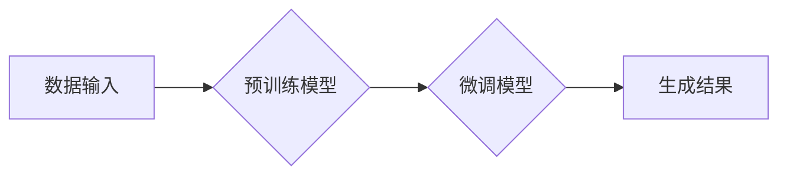

> 生成式AI, AIGC, 商业智能, 自然语言处理, 深度学习, Transformer, 图像生成, 文本生成, 代码生成

## 1. 背景介绍

近年来，人工智能（AI）技术取得了飞速发展，特别是生成式人工智能（Generative AI）的兴起，为商业智能（Business Intelligence，BI）领域带来了革命性的变革。生成式AI是指能够根据输入数据生成新数据的AI模型，它能够学习数据中的模式和规律，并生成类似或全新的数据。

传统的BI系统主要依赖于数据分析和可视化，能够帮助企业从海量数据中挖掘洞察力，但其生成能力有限。而生成式AIGC则能够突破这一局限，通过生成文本、图像、代码等多种形式的数据，为企业提供更丰富的智能服务。

## 2. 核心概念与联系

**2.1  AIGC 的核心概念**

AIGC是指利用人工智能技术，从已有的数据中学习，并生成新的、有价值的数据。它涵盖了多种技术，包括：

* **自然语言处理（NLP）：** 处理和理解人类语言，例如文本生成、机器翻译、对话系统等。
* **计算机视觉（CV）：** 处理和理解图像和视频，例如图像识别、物体检测、图像生成等。
* **音频处理：** 处理和理解音频信号，例如语音识别、音乐生成、音频合成等。

**2.2  AIGC 与商业智能的联系**

AIGC能够为商业智能提供以下方面的支持：

* **数据增强：** 通过生成新的数据样本，丰富现有数据集，提高模型训练效果。
* **洞察力发现：** 利用生成式模型，从数据中发现更深层次的模式和关系，提供更精准的洞察力。
* **智能决策支持：** 生成不同决策方案的文本描述，帮助企业决策者做出更明智的选择。
* **个性化服务：** 根据用户的需求，生成个性化的产品推荐、营销文案等，提升用户体验。

**2.3  AIGC 架构**



## 3. 核心算法原理 & 具体操作步骤

**3.1  算法原理概述**

生成式AIGC的核心算法是基于深度学习的生成模型，其中Transformer模型是目前最先进的生成模型之一。Transformer模型利用自注意力机制，能够捕捉文本序列中的长距离依赖关系，生成更流畅、更自然的文本。

**3.2  算法步骤详解**

1. **数据预处理：** 将原始数据进行清洗、格式化、编码等处理，使其能够被模型理解。
2. **预训练模型训练：** 使用大量的文本数据训练预训练模型，例如GPT-3、BERT等，使其能够掌握语言的语法、语义和上下文关系。
3. **微调模型训练：** 将预训练模型应用于特定任务，例如文本生成、图像生成等，并使用少量标记数据进行微调，使其能够生成更符合特定任务需求的数据。
4. **数据生成：** 将输入数据输入到微调模型中，模型根据训练得到的知识和模式，生成新的数据。

**3.3  算法优缺点**

**优点：**

* 生成能力强：能够生成高质量、多样化的文本、图像、代码等数据。
* 适应性强：能够应用于多种不同的任务和领域。
* 自动化程度高：能够自动完成数据生成过程，提高效率。

**缺点：**

* 数据依赖性强：模型的性能取决于训练数据的质量和数量。
* 计算资源消耗大：训练大型生成模型需要大量的计算资源。
* 伦理风险：生成式模型可能被用于生成虚假信息、恶意内容等，需要谨慎使用。

**3.4  算法应用领域**

* **文本生成：** 文章写作、故事创作、对话系统、机器翻译等。
* **图像生成：** 图片合成、图像修复、艺术创作等。
* **代码生成：** 代码自动补全、代码生成器、软件测试等。
* **音频生成：** 音乐合成、语音合成、音频特效等。

## 4. 数学模型和公式 & 详细讲解 & 举例说明

**4.1  数学模型构建**

生成式AIGC模型通常基于概率模型，例如变分自编码器（VAE）和生成对抗网络（GAN）。

* **VAE:** 将输入数据编码成低维表示，然后解码生成新的数据。

* **GAN:** 由生成器和判别器两部分组成，生成器试图生成逼真的数据，判别器试图区分真实数据和生成数据。

**4.2  公式推导过程**

VAE的损失函数通常由两个部分组成：

* **重构损失：** 衡量生成数据与真实数据的差异。
* **KL散度：** 衡量编码后的数据分布与标准正态分布的差异。

GAN的损失函数则由生成器和判别器的两个部分组成：

* **生成器损失：** 判别器对生成数据进行分类的错误率。
* **判别器损失：** 判别器对真实数据和生成数据的分类错误率。

**4.3  案例分析与讲解**

例如，使用VAE模型生成图像，可以将图像编码成一个低维向量，然后根据这个向量解码生成新的图像。

## 5. 项目实践：代码实例和详细解释说明

**5.1  开发环境搭建**

使用Python语言开发AIGC项目，需要安装以下软件包：

* TensorFlow或PyTorch深度学习框架
* NumPy数值计算库
* Matplotlib数据可视化库

**5.2  源代码详细实现**

以下是一个使用TensorFlow构建简单的文本生成模型的代码示例：

```python
import tensorflow as tf

# 定义模型结构
model = tf.keras.Sequential([
    tf.keras.layers.Embedding(input_dim=vocab_size, output_dim=embedding_dim),
    tf.keras.layers.LSTM(units=lstm_units),
    tf.keras.layers.Dense(units=vocab_size, activation='softmax')
])

# 编译模型
model.compile(optimizer='adam', loss='sparse_categorical_crossentropy', metrics=['accuracy'])

# 训练模型
model.fit(x_train, y_train, epochs=epochs)

# 生成文本
text = model.predict(x_input)
```

**5.3  代码解读与分析**

* **Embedding层:** 将单词转换为稠密的向量表示。
* **LSTM层:** 学习文本序列中的长距离依赖关系。
* **Dense层:** 将LSTM输出转换为每个单词的概率分布。
* **Adam优化器:** 用于更新模型参数。
* **Sparse categorical crossentropy损失函数:** 用于计算模型预测结果与真实结果之间的差异。

**5.4  运行结果展示**

训练完成后，可以使用模型生成新的文本。例如，可以输入一个句子作为起点，模型会根据训练得到的知识和模式，生成后续的句子。

## 6. 实际应用场景

**6.1  营销文案生成**

AIGC可以根据目标客户群体和产品特点，自动生成吸引人的营销文案，例如广告语、产品描述、社交媒体内容等。

**6.2  客户服务自动化**

AIGC可以构建智能客服系统，自动回复客户常见问题，提高客户服务效率。

**6.3  内容创作辅助**

AIGC可以帮助作家、记者等内容创作者，生成文章、故事、剧本等创意内容，提高创作效率。

**6.4  未来应用展望**

随着AIGC技术的不断发展，其应用场景将更加广泛，例如：

* **个性化教育:** 根据学生的学习进度和需求，生成个性化的学习内容。
* **医疗诊断辅助:** 分析患者的病历和影像数据，辅助医生进行诊断。
* **科学研究加速:** 自动生成实验方案、分析实验数据，加速科学研究进程。

## 7. 工具和资源推荐

**7.1  学习资源推荐**

* **书籍:**
    * 《深度学习》
    * 《自然语言处理》
* **在线课程:**
    * Coursera上的深度学习课程
    * edX上的自然语言处理课程

**7.2  开发工具推荐**

* **TensorFlow:** 开源深度学习框架
* **PyTorch:** 开源深度学习框架
* **Hugging Face:** 提供预训练模型和开发工具

**7.3  相关论文推荐**

* **Attention Is All You Need:** 提出Transformer模型
* **Generative Adversarial Networks:** 提出GAN模型
* **Variational Autoencoders for Generation:** 提出VAE模型

## 8. 总结：未来发展趋势与挑战

**8.1  研究成果总结**

AIGC技术取得了显著进展，能够生成高质量、多样化的数据，为商业智能领域带来了新的机遇。

**8.2  未来发展趋势**

* **模型规模和能力提升:** 训练更大规模的模型，提高生成数据的质量和多样性。
* **多模态生成:** 融合文本、图像、音频等多种模态数据，生成更丰富的智能服务。
* **可解释性增强:** 提高模型的可解释性，帮助用户理解模型的决策过程。

**8.3  面临的挑战**

* **数据安全和隐私:** 生成式模型需要大量数据进行训练，如何保护数据安全和隐私是一个重要挑战。
* **伦理风险:** 生成式模型可能被用于生成虚假信息、恶意内容等，需要制定相应的伦理规范和监管机制。
* **计算资源消耗:** 训练大型生成模型需要大量的计算资源，如何降低计算成本是一个重要问题。

**8.4  研究展望**

未来，AIGC技术将继续发展，为商业智能领域带来更多创新应用。需要加强对AIGC技术的研发和应用，并制定相应的政策和规范，引导其健康发展。

## 9. 附录：常见问题与解答

**9.1  AIGC与传统BI的区别是什么？**

传统BI主要依赖于数据分析和可视化，而AIGC能够生成新的数据，为商业智能提供更丰富的服务。

**9.2  如何选择合适的AIGC模型？**

选择合适的AIGC模型需要根据具体的应用场景和数据特点进行选择。

**9.3  如何解决AIGC模型的伦理风险？**

需要制定相应的伦理规范和监管机制，引导AIGC技术健康发展。


作者：禅与计算机程序设计艺术 / Zen and the Art of Computer Programming 
<end_of_turn>