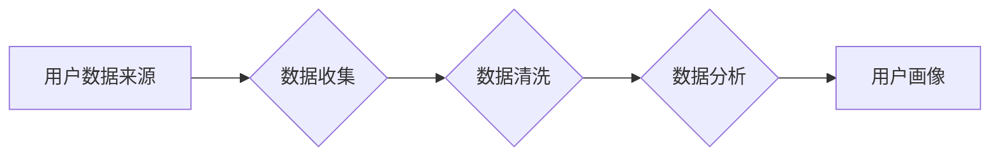

> 用户画像，数据收集，机器学习，数据分析，数据挖掘，用户行为，个性化推荐

## 1. 背景介绍

在当今数据爆炸的时代，用户画像已成为企业精准营销、产品开发和用户体验优化不可或缺的工具。用户画像是指通过对用户数据进行分析和挖掘，构建出用户特征、行为、偏好等多维度的描述，从而形成对用户的深入理解。

传统的用户画像构建方法主要依赖于人工调查和问卷调查，效率低下且难以捕捉用户细微的变化。随着大数据和人工智能技术的快速发展，数据驱动型用户画像构建方法逐渐成为主流。

## 2. 核心概念与联系

用户画像数据收集的核心概念包括：

* **用户数据**: 指与用户相关的所有信息，包括用户基本信息、行为数据、偏好数据、社交数据等。
* **数据收集**: 指从各种渠道获取用户数据，包括网站、APP、社交平台、传感器等。
* **数据清洗**: 指对收集到的用户数据进行处理，去除无效数据、重复数据和错误数据，确保数据质量。
* **数据分析**: 指对清洗后的用户数据进行分析，挖掘用户特征、行为模式和潜在需求。
* **用户画像**: 指基于数据分析结果，构建出用户特征、行为、偏好等多维度的描述。

**数据收集流程图:**



## 3. 核心算法原理 & 具体操作步骤

### 3.1  算法原理概述

用户画像数据收集的核心算法主要包括：

* **聚类算法**: 将用户数据按照相似性进行分组，形成用户群体。
* **关联规则挖掘**: 发现用户行为之间的关联关系，例如哪些用户同时购买了哪些产品。
* **推荐算法**: 基于用户历史行为和偏好，推荐用户可能感兴趣的内容或产品。

### 3.2  算法步骤详解

**聚类算法步骤:**

1. **数据预处理**: 对用户数据进行清洗、转换和特征工程。
2. **距离度量**: 选择合适的距离度量方法，例如欧氏距离、曼哈顿距离等。
3. **聚类算法选择**: 根据数据特点和需求选择合适的聚类算法，例如K-means聚类、DBSCAN聚类等。
4. **聚类结果评估**: 使用聚类评估指标，例如Silhouette系数、Dunn指数等，评估聚类效果。

**关联规则挖掘步骤:**

1. **数据预处理**: 对用户交易数据进行清洗和转换。
2. **频繁项集挖掘**: 使用Apriori算法或FP-Growth算法挖掘频繁项集。
3. **关联规则生成**: 基于频繁项集，生成关联规则，例如“购买牛奶的用户也经常购买面包”。
4. **关联规则评估**: 使用支持度、置信度等指标评估关联规则的质量。

**推荐算法步骤:**

1. **用户行为数据收集**: 收集用户浏览历史、购买记录、评分等行为数据。
2. **特征工程**: 对用户行为数据进行特征提取，例如用户喜欢的商品类别、购买频率等。
3. **推荐模型训练**: 使用协同过滤、内容过滤或混合推荐算法训练推荐模型。
4. **推荐结果生成**: 根据用户特征和模型预测，生成个性化推荐结果。

### 3.3  算法优缺点

**聚类算法:**

* **优点**: 可以发现用户群体结构，并对用户进行细分。
* **缺点**: 需要预先设定聚类数量，聚类结果可能存在模糊性。

**关联规则挖掘:**

* **优点**: 可以发现用户行为之间的关联关系，帮助企业了解用户需求。
* **缺点**: 容易产生大量冗余规则，需要进行规则筛选和优化。

**推荐算法:**

* **优点**: 可以提供个性化推荐，提高用户体验和转化率。
* **缺点**: 需要大量的用户数据进行训练，容易出现冷启动问题。

### 3.4  算法应用领域

* **电商**: 用户画像可以帮助电商平台进行精准营销、个性化推荐和商品分类。
* **金融**: 用户画像可以帮助金融机构进行风险评估、客户分层和产品定制。
* **医疗**: 用户画像可以帮助医疗机构进行疾病预测、个性化治疗和健康管理。
* **教育**: 用户画像可以帮助教育机构进行个性化教学、学习推荐和学生管理。

## 4. 数学模型和公式 & 详细讲解 & 举例说明

### 4.1  数学模型构建

用户画像数据收集可以构建以下数学模型：

* **用户行为模型**: 使用马尔科夫链模型或隐马尔科夫模型描述用户行为序列。
* **用户兴趣模型**: 使用概率模型或贝叶斯网络模型描述用户对不同商品的兴趣程度。
* **用户偏好模型**: 使用协同过滤算法或深度学习模型学习用户偏好。

### 4.2  公式推导过程

**马尔科夫链模型**:

假设用户行为序列为{s1, s2, ..., sn}, 其中si表示用户在第i个时间点的行为状态。马尔科夫链模型假设用户在当前时间点的行为状态只依赖于前一个时间点的行为状态，即：

P(si+1 = j | si = i, s0, ..., si-1) = P(si+1 = j | si = i)

其中，P(si+1 = j | si = i)表示用户从状态i转移到状态j的概率。

**协同过滤算法**:

协同过滤算法使用用户-物品交互矩阵来学习用户偏好。假设用户-物品交互矩阵为R，其中Rij表示用户i对物品j的评分。协同过滤算法的目标是预测用户i对物品j的评分，可以使用以下公式：

Rij = μ + ui + vj + eij

其中，μ表示全局平均评分，ui表示用户i的偏好，vj表示物品j的偏好，eij表示评分误差。

### 4.3  案例分析与讲解

**案例**: 假设一个电商平台收集了用户购买商品的历史数据，可以使用马尔科夫链模型来预测用户的下一个购买行为。

**分析**: 可以将用户的购买行为状态分为不同的类别，例如“电子产品”、“服装”、“书籍”等。然后，可以使用马尔科夫链模型学习用户在不同类别之间转移的概率，从而预测用户下一个购买的类别。

## 5. 项目实践：代码实例和详细解释说明

### 5.1  开发环境搭建

* **操作系统**: Ubuntu 18.04
* **编程语言**: Python 3.6
* **开发工具**: Jupyter Notebook
* **库依赖**: pandas, numpy, scikit-learn

### 5.2  源代码详细实现

```python
import pandas as pd
from sklearn.cluster import KMeans

# 加载用户数据
data = pd.read_csv('user_data.csv')

# 数据预处理
# ...

# 聚类算法
kmeans = KMeans(n_clusters=5)
data['cluster'] = kmeans.fit_predict(data[['feature1', 'feature2']])

# 结果展示
print(data.groupby('cluster').mean())
```

### 5.3  代码解读与分析

* **数据加载**: 使用pandas库加载用户数据。
* **数据预处理**: 对用户数据进行清洗、转换和特征工程。
* **聚类算法**: 使用KMeans算法进行聚类，将用户数据分为5个群体。
* **结果展示**: 使用groupby函数对每个聚类进行平均值计算，展示不同聚类用户的特征差异。

### 5.4  运行结果展示

运行代码后，会输出每个聚类用户的特征平均值，例如年龄、收入、购买频率等。

## 6. 实际应用场景

### 6.1  电商平台

* **精准营销**: 根据用户画像，为不同用户群体推送个性化广告和促销活动。
* **个性化推荐**: 根据用户兴趣和购买历史，推荐用户可能感兴趣的商品。
* **商品分类**: 根据用户购买行为，对商品进行分类和标签化，提高商品搜索和发现效率。

### 6.2  金融机构

* **风险评估**: 根据用户画像，评估用户的信用风险和投资风险。
* **客户分层**: 根据用户画像，将客户分为不同的等级，提供差异化的服务。
* **产品定制**: 根据用户画像，开发个性化的金融产品和服务。

### 6.3  医疗机构

* **疾病预测**: 根据用户画像，预测用户的疾病风险和潜在健康问题。
* **个性化治疗**: 根据用户的基因信息、生活习惯和病史，制定个性化的治疗方案。
* **健康管理**: 根据用户的健康数据和行为模式，提供个性化的健康管理建议。

### 6.4  未来应用展望

随着人工智能技术的不断发展，用户画像数据收集将更加智能化、自动化和个性化。未来，用户画像将应用于更广泛的领域，例如教育、娱乐、交通等，为用户提供更加精准、个性化的服务和体验。

## 7. 工具和资源推荐

### 7.1  学习资源推荐

* **书籍**:
    * 《数据挖掘：概念与技术》
    * 《机器学习》
    * 《深度学习》
* **在线课程**:
    * Coursera: 数据科学
    * edX: 机器学习
    * Udacity: 深度学习

### 7.2  开发工具推荐

* **数据分析工具**:
    * pandas
    * numpy
    * scikit-learn
* **机器学习框架**:
    * TensorFlow
    * PyTorch
    * Keras

### 7.3  相关论文推荐

* **用户画像**:
    * User Profiling: A Survey
    * A Survey on User Profiling Techniques
* **数据挖掘**:
    * Data Mining: Concepts and Techniques
    * Introduction to Data Mining

## 8. 总结：未来发展趋势与挑战

### 8.1  研究成果总结

用户画像数据收集已经取得了显著的成果，为企业提供了精准营销、个性化推荐和用户体验优化等方面的支持。

### 8.2  未来发展趋势

* **智能化**: 利用人工智能技术，实现用户画像的自动生成和更新。
* **个性化**: 更加细致地刻画用户的个性特征，提供更加精准的个性化服务。
* **跨平台**: 将用户数据从多个平台整合，构建更加全面的用户画像。

### 8.3  面临的挑战

* **数据隐私**: 如何保护用户数据隐私，避免数据泄露和滥用。
* **数据质量**: 如何保证用户数据的准确性和完整性，避免数据偏差和误导。
* **算法解释性**: 如何提高机器学习算法的解释性，让用户理解模型的决策过程。

### 8.4  研究展望

未来，用户画像数据收集的研究将更加注重数据隐私保护、数据质量控制和算法解释性，以更好地服务于用户和社会发展。

## 9. 附录：常见问题与解答

**常见问题**:

* 如何选择合适的聚类算法？
* 如何评估聚类结果的质量？
* 如何处理用户数据中的缺失值？

**解答**:

* 选择合适的聚类算法需要根据数据特点和需求进行选择。
* 聚类结果的质量可以使用Silhouette系数、Dunn指数等指标进行评估。
* 处理用户数据中的缺失值可以使用平均值填充、中位数填充或删除缺失数据等方法。


作者：禅与计算机程序设计艺术 / Zen and the Art of Computer Programming 
<end_of_turn>