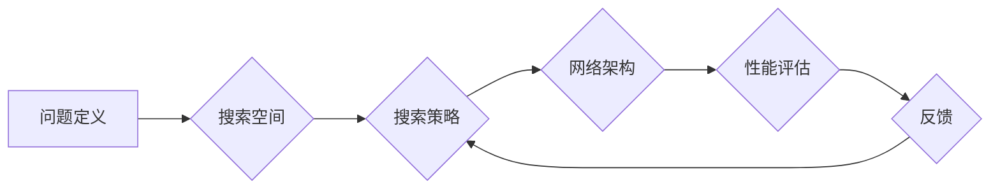

> 神经架构搜索，NAS，深度学习，自动机器学习，自动模型设计，强化学习，进化算法

## 1. 背景介绍

深度学习近年来取得了令人瞩目的成就，在图像识别、自然语言处理、语音识别等领域取得了突破性的进展。然而，深度学习模型的性能通常依赖于精心设计的网络架构，而手工设计网络架构是一个耗时费力、需要专业知识的过程。随着深度学习模型的复杂性不断增加，手工设计网络架构变得越来越困难。

神经架构搜索（NAS）应运而生，它是一种利用机器学习算法自动搜索最佳神经网络架构的技术。NAS的目标是自动设计出性能优异、效率高的深度学习模型，从而解放人类的设计者，加速深度学习的应用发展。

## 2. 核心概念与联系

NAS的核心概念是将神经网络架构设计问题转化为一个优化问题，并利用机器学习算法进行搜索。

**2.1 核心概念**

* **神经网络架构:** 指的是神经网络的结构，包括层数、层类型、神经元数量、连接方式等。
* **搜索空间:** 指的是所有可能的网络架构的集合。
* **搜索策略:** 指的是用于探索搜索空间的算法，例如强化学习、进化算法等。
* **评价指标:** 指的是用于评估网络架构性能的指标，例如准确率、损失函数值等。

**2.2 架构关系图**

**2.3 联系**

NAS通过定义一个搜索空间，并利用搜索策略在搜索空间中探索，最终找到性能最佳的网络架构。

## 3. 核心算法原理 & 具体操作步骤

**3.1 算法原理概述**

NAS算法的核心原理是利用机器学习算法进行自动搜索。常见的NAS算法包括强化学习、进化算法、梯度下降等。

* **强化学习:** 将网络架构设计问题视为一个马尔可夫决策过程，训练一个代理智能体，通过与环境交互，学习到最佳的网络架构。
* **进化算法:** 将网络架构视为个体，通过选择、交叉、变异等操作，模拟自然进化过程，最终找到性能最佳的网络架构。
* **梯度下降:** 将网络架构设计问题视为一个优化问题，利用梯度下降算法搜索最优的网络架构参数。

**3.2 算法步骤详解**

以强化学习为例，NAS算法的具体操作步骤如下：

1. **定义搜索空间:** 确定所有可能的网络架构的集合。
2. **构建代理智能体:** 设计一个能够学习网络架构的代理智能体，例如深度强化学习代理。
3. **训练代理智能体:** 利用强化学习算法训练代理智能体，使其能够在搜索空间中探索，并找到性能最佳的网络架构。
4. **评估网络架构性能:** 对搜索到的网络架构进行评估，例如在测试集上进行精度测试。
5. **反馈结果:** 将网络架构性能反馈给代理智能体，用于更新其策略。

**3.3 算法优缺点**

* **优点:**
    * 自动搜索最佳网络架构，解放人类的设计者。
    * 可以发现人类难以发现的优秀网络架构。
    * 提高深度学习模型的性能和效率。
* **缺点:**
    * 计算资源消耗大，训练时间长。
    * 搜索空间巨大，搜索效率低。
    * 难以解释搜索结果，缺乏可解释性。

**3.4 算法应用领域**

NAS算法在图像识别、自然语言处理、语音识别、机器翻译等深度学习领域都有广泛的应用。

## 4. 数学模型和公式 & 详细讲解 & 举例说明

**4.1 数学模型构建**

NAS算法通常使用强化学习模型，其核心数学模型是价值函数和策略函数。

* **价值函数:** 用于评估网络架构在特定环境下的预期回报。
* **策略函数:** 用于决定代理智能体在特定状态下采取的行动，例如选择下一个网络架构。

**4.2 公式推导过程**

价值函数的推导过程通常使用Bellman方程，策略函数的推导过程通常使用策略梯度算法。

**4.3 案例分析与讲解**

例如，在图像分类任务中，NAS算法可以利用价值函数评估不同网络架构在测试集上的准确率，并利用策略函数选择最优的网络架构进行训练。

## 5. 项目实践：代码实例和详细解释说明

**5.1 开发环境搭建**

NAS项目开发环境通常需要以下软件：

* Python
* TensorFlow 或 PyTorch
* CUDA 和 cuDNN

**5.2 源代码详细实现**

NAS算法的源代码实现通常包括以下部分：

* 搜索空间定义
* 代理智能体设计
* 训练环境搭建
* 训练和评估流程

**5.3 代码解读与分析**

代码解读需要分析代理智能体的架构、搜索策略、评价指标等。

**5.4 运行结果展示**

运行结果展示需要展示搜索到的网络架构、其性能指标以及与手工设计的网络架构的比较。

## 6. 实际应用场景

NAS算法在实际应用场景中可以用于：

* 自动设计高效的图像分类模型
* 自动生成个性化的语音识别模型
* 自动构建高性能的自然语言处理模型

**6.4 未来应用展望**

NAS算法的未来应用前景广阔，例如：

* 自动设计适用于特定任务的网络架构
* 自动生成可解释的深度学习模型
* 自动优化深度学习模型的训练过程

## 7. 工具和资源推荐

**7.1 学习资源推荐**

* 文章：
    * "Neural Architecture Search: A Survey"
    * "AutoML: A Survey of the State-of-the-Art"
* 书籍：
    * "Deep Learning" by Ian Goodfellow, Yoshua Bengio, and Aaron Courville
* 课程：
    * Coursera: "Deep Learning Specialization"

**7.2 开发工具推荐**

* TensorFlow
* PyTorch
* AutoML-Zero

**7.3 相关论文推荐**

* "Neural Architecture Search with Reinforcement Learning"
* "Efficient Neural Architecture Search via Parameter Sharing"
* "ENAS: Efficient Neural Architecture Search via Parameter Sharing"

## 8. 总结：未来发展趋势与挑战

**8.1 研究成果总结**

NAS算法取得了显著的成果，在自动设计深度学习模型方面取得了突破。

**8.2 未来发展趋势**

NAS算法的未来发展趋势包括：

* 更高效的搜索算法
* 更广泛的应用场景
* 更强的可解释性

**8.3 面临的挑战**

NAS算法面临的挑战包括：

* 计算资源消耗大
* 搜索空间巨大
* 难以解释搜索结果

**8.4 研究展望**

未来研究方向包括：

* 开发更高效的搜索算法
* 探索新的搜索空间
* 提高NAS算法的可解释性

## 9. 附录：常见问题与解答

**9.1 什么是NAS？**

NAS是指利用机器学习算法自动搜索最佳神经网络架构的技术。

**9.2 NAS的优势是什么？**

NAS可以自动搜索最佳网络架构，解放人类的设计者，提高深度学习模型的性能和效率。

**9.3 NAS有哪些应用场景？**

NAS在图像识别、自然语言处理、语音识别、机器翻译等深度学习领域都有广泛的应用。

**9.4 如何学习NAS？**

可以学习相关书籍、课程和论文，并尝试使用开源工具进行实践。

作者：禅与计算机程序设计艺术 / Zen and the Art of Computer Programming

<end_of_turn>