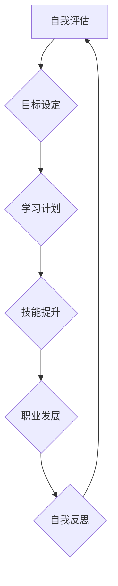

>终身学习，职业生涯规划，人工智能，技术发展，适应能力，学习方法，个人品牌，未来趋势

## 1. 背景介绍

在当今瞬息万变的科技时代，技术发展日新月异，新兴技术层出不穷。作为一名IT从业者，想要保持竞争力，必须不断学习新知识，提升技能，才能在激烈的市场竞争中立于不败之地。终身学习已不再是一种选择，而是一种必修课。

传统的职业生涯规划模式往往是“毕业-工作-退休”，但这种模式在当今时代已经不再适用。随着人工智能、大数据、云计算等技术的快速发展，IT行业面临着前所未有的变革，职业技能的半衰期越来越短，传统的职业路径也变得更加模糊。

因此，我们需要重新思考职业生涯规划，将终身学习融入到职业发展中，才能适应不断变化的市场需求，实现职业生涯的持续发展。

## 2. 核心概念与联系

**2.1 终身学习**

终身学习是指从出生到死亡，始终保持学习的意识和习惯，不断更新知识和技能的过程。它强调的是学习的持续性、主动性和自主性。

**2.2 职业生涯规划**

职业生涯规划是指个体根据自身兴趣、能力、价值观和社会发展趋势，制定未来职业发展方向和目标，并采取相应的行动来实现目标的过程。

**2.3 终身学习与职业生涯规划的联系**

终身学习是职业生涯规划的基础和保障。只有不断学习新知识、提升新技能，才能适应不断变化的市场需求，实现职业生涯的持续发展。

**2.4  终身学习与职业生涯规划的流程图**



## 3. 核心算法原理 & 具体操作步骤

**3.1 算法原理概述**

在终身学习与职业生涯规划中，我们可以运用一些算法原理来辅助我们的决策和行动。例如，我们可以使用**知识图谱算法**来构建个人知识体系，**推荐算法**来推荐适合自己的学习资源，**路径规划算法**来规划职业发展路线。

**3.2 算法步骤详解**

* **知识图谱算法:**
    1. 收集个人知识，包括学习过的课程、阅读过的书籍、参加过的培训等。
    2. 将知识进行结构化，构建知识图谱，其中节点代表知识点，边代表知识之间的关系。
    3. 利用知识图谱算法进行知识推理和挖掘，发现知识之间的关联性，形成个人知识体系。

* **推荐算法:**
    1. 收集用户的学习行为数据，例如学习过的课程、阅读过的书籍、关注的领域等。
    2. 利用推荐算法，根据用户的兴趣和偏好，推荐适合用户的学习资源。
    3. 持续收集用户反馈，不断优化推荐算法的准确性。

* **路径规划算法:**
    1. 确定职业目标，例如想要从事哪种职业，达到什么职位。
    2. 收集职业发展路径信息，例如所需的技能、经验、学历等。
    3. 利用路径规划算法，规划从当前状态到目标状态的最佳路径。

**3.3 算法优缺点**

* **知识图谱算法:**
    * 优点: 可以帮助用户更好地理解和掌握知识，发现知识之间的关联性。
    * 缺点: 需要大量的知识数据作为输入，构建知识图谱需要一定的技术难度。

* **推荐算法:**
    * 优点: 可以帮助用户快速找到适合自己的学习资源，提高学习效率。
    * 缺点: 可能存在推荐偏差，推荐结果可能不符合用户的真实需求。

* **路径规划算法:**
    * 优点: 可以帮助用户规划职业发展路线，提高职业发展效率。
    * 缺点: 职业发展路径可能存在不确定性，算法结果可能需要根据实际情况进行调整。

**3.4 算法应用领域**

* **教育领域:** 个性化学习推荐、知识图谱构建、学习路径规划。
* **人力资源领域:** 职业发展规划、人才推荐、技能匹配。
* **企业管理领域:** 知识管理、人才培养、职业发展咨询。

## 4. 数学模型和公式 & 详细讲解 & 举例说明

**4.1 数学模型构建**

我们可以使用数学模型来描述终身学习与职业生涯规划的过程。例如，我们可以使用**马尔可夫链**来模拟个体的职业发展路径，**动态规划**来优化职业发展决策。

**4.2 公式推导过程**

* **马尔可夫链:**

马尔可夫链是一种用于描述随机过程的数学模型。在职业发展路径的模拟中，我们可以将不同的职业状态作为马尔可夫链的节点，职业转换概率作为马尔可夫链的转移概率。

* **动态规划:**

动态规划是一种用于解决优化问题的数学方法。在职业发展决策中，我们可以使用动态规划来寻找最优的学习计划和职业发展路径。

**4.3 案例分析与讲解**

假设我们有一个个体，他想要从软件工程师发展成为架构师。我们可以使用马尔可夫链来模拟他的职业发展路径，并使用动态规划来优化他的学习计划。

* **马尔可夫链模型:**

我们可以将软件工程师、高级工程师、技术架构师作为马尔可夫链的节点，分别表示三个职业状态。

* **转移概率:**

我们可以根据行业经验和数据统计，确定每个职业状态之间的转换概率。例如，从软件工程师到高级工程师的概率可能是0.6，从高级工程师到技术架构师的概率可能是0.3。

* **动态规划模型:**

我们可以使用动态规划来寻找最优的学习计划，例如，哪些课程需要学习，需要花费多少时间学习，才能达到技术架构师的职业目标。

## 5. 项目实践：代码实例和详细解释说明

**5.1 开发环境搭建**

为了实现终身学习与职业生涯规划的项目，我们可以使用以下开发环境：

* **编程语言:** Python
* **框架:** Django
* **数据库:** PostgreSQL
* **云平台:** AWS

**5.2 源代码详细实现**

以下是一个简单的Python代码示例，用于构建一个简单的知识图谱：

```python
import networkx as nx

# 创建知识图谱
graph = nx.Graph()

# 添加节点
graph.add_node("人工智能")
graph.add_node("机器学习")
graph.add_node("深度学习")

# 添加边
graph.add_edge("人工智能", "机器学习")
graph.add_edge("机器学习", "深度学习")

# 打印知识图谱
print(graph.nodes())
print(graph.edges())
```

**5.3 代码解读与分析**

* **networkx:** 这是一个用于构建和分析网络的Python库。
* **Graph():** 创建一个空的知识图谱。
* **add_node():** 添加节点到知识图谱。
* **add_edge():** 添加边到知识图谱，表示节点之间的关系。
* **nodes():** 返回知识图谱中的所有节点。
* **edges():** 返回知识图谱中的所有边。

**5.4 运行结果展示**

运行以上代码，将会输出以下结果：

```
['人工智能', '机器学习', '深度学习']
[('人工智能', '机器学习'), ('机器学习', '深度学习')]
```

## 6. 实际应用场景

**6.1 教育领域**

* 个性化学习推荐: 根据学生的学习兴趣、能力和进度，推荐适合的学习资源。
* 知识图谱构建: 构建学科知识图谱，帮助学生理解知识之间的关联性。
* 学习路径规划: 为学生规划个性化的学习路径，帮助他们高效地掌握知识。

**6.2 人力资源领域**

* 职业发展规划: 为员工提供个性化的职业发展规划建议，帮助他们实现职业目标。
* 人才推荐: 根据职位需求，推荐符合条件的候选人。
* 技能匹配: 匹配员工的技能和企业的需求，帮助企业找到合适的员工。

**6.3 企业管理领域**

* 知识管理: 建立企业知识库，方便员工查找和共享知识。
* 人才培养: 根据企业发展需求，制定人才培养计划，提升员工技能。
* 职业发展咨询: 为员工提供职业发展咨询服务，帮助他们规划职业发展路径。

**6.4 未来应用展望**

随着人工智能、大数据、云计算等技术的不断发展，终身学习与职业生涯规划将更加智能化、个性化和自动化。未来，我们可以期待以下应用场景:

* 基于人工智能的个性化学习推荐系统，能够更加精准地推荐适合用户的学习资源。
* 基于知识图谱的智能职业发展规划系统，能够帮助用户更全面地了解职业发展路径，并制定更合理的职业发展计划。
* 基于虚拟现实技术的沉浸式学习体验，能够为用户提供更加生动的学习体验。

## 7. 工具和资源推荐

**7.1 学习资源推荐**

* **在线学习平台:** Coursera, edX, Udacity, Udemy
* **技术博客:** Hacker News, Medium, Stack Overflow
* **开源社区:** GitHub, GitLab
* **书籍:** 《编程之美》、《深度学习》、《人工智能简史》

**7.2 开发工具推荐**

* **编程语言:** Python, Java, C++, JavaScript
* **框架:** Django, Flask, Spring Boot
* **数据库:** PostgreSQL, MySQL, MongoDB
* **云平台:** AWS, Azure, Google Cloud

**7.3 相关论文推荐**

* **终身学习:** "Lifelong Learning in Artificial Intelligence"
* **职业生涯规划:** "Career Planning and Development"
* **人工智能:** "Artificial Intelligence: A Modern Approach"

## 8. 总结：未来发展趋势与挑战

**8.1 研究成果总结**

终身学习与职业生涯规划的研究取得了显著成果，例如，开发了基于人工智能的个性化学习推荐系统、基于知识图谱的智能职业发展规划系统等。

**8.2 未来发展趋势**

未来，终身学习与职业生涯规划将更加智能化、个性化和自动化。人工智能、大数据、云计算等技术的不断发展将为终身学习与职业生涯规划提供更强大的技术支撑。

**8.3 面临的挑战**

* **数据隐私:** 个性化学习推荐和职业发展规划需要收集大量的用户数据，如何保护用户数据隐私是一个重要的挑战。
* **算法公平性:** 算法模型可能存在偏差，导致推荐结果不公平，需要不断改进算法模型，确保算法公平性。
* **技术可访问性:** 终身学习与职业生涯规划的工具和资源需要更加易于访问，才能真正惠及所有的人。

**8.4 研究展望**

未来，我们需要继续深入研究终身学习与职业生涯规划的理论和方法，开发更加智能化、个性化和可持续的终身学习与职业生涯规划系统，帮助人们更好地适应不断变化的社会发展趋势。

## 9. 附录：常见问题与解答

**9.1 如何选择适合自己的学习资源？**

* 了解自己的学习目标和兴趣。
* 咨询专业人士或学习平台的推荐。
* 阅读用户评价和评论。
* 尝试不同的学习资源，找到最适合自己的学习方式。

**9.2 如何规划职业发展路径？**

* 了解自己的职业兴趣和能力。
* 研究行业发展趋势和职业需求。
* 制定阶段性的职业目标和行动计划。
* 持续学习和提升技能，保持职业竞争力。

**9.3 如何应对职业生涯中的挑战？**

* 保持积极的心态和学习的热情。
* 寻求帮助和支持，例如导师、同事、朋友。
* 勇于尝试新的事物，不断突破自我。
* 适应变化，不断学习和成长。


作者：禅与计算机程序设计艺术 / Zen and the Art of Computer Programming 
<end_of_turn>