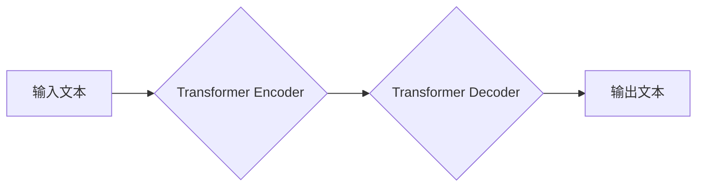

> 生成式模型，GPT，Transformer，自然语言处理，深度学习，文本生成

## 1. 背景介绍

近年来，人工智能领域取得了令人瞩目的进展，其中生成式模型尤为引人注目。这些模型能够根据输入的文本或代码生成新的文本或代码，展现出强大的文本生成能力。其中，由OpenAI开发的GPT系列模型（Generative Pre-trained Transformer）可谓是明星级存在，其在文本生成、机器翻译、代码编写等领域取得了突破性的成果，引发了广泛的关注和研究热潮。

然而，训练一个完整的GPT模型需要海量的计算资源和数据，对于普通开发者来说，这往往是一个难以逾越的障碍。本文将带领你探索生成式模型的奥秘，并通过简化模型架构和训练过程，帮助你训练出自己的简版生成式GPT模型，体验人工智能的魅力。

## 2. 核心概念与联系

### 2.1 生成式模型

生成式模型是一种能够学习数据分布并生成新数据的机器学习模型。与传统的分类或回归模型不同，生成式模型的目标是学习数据的潜在结构和规律，从而能够生成与训练数据相似的新的数据样本。

### 2.2 Transformer

Transformer是一种新型的神经网络架构，其核心特点是利用自注意力机制（Self-Attention）来捕捉文本序列中的长距离依赖关系。与传统的循环神经网络（RNN）相比，Transformer能够更有效地处理长文本序列，并展现出更强的文本理解和生成能力。

### 2.3 GPT模型

GPT模型是基于Transformer架构的生成式模型，其特点是：

* **预训练（Pre-training）：** GPT模型在海量文本数据上进行预训练，学习了语言的语法、语义和上下文关系。
* **自回归（Autoregressive）：** GPT模型采用自回归的方式进行文本生成，即根据之前生成的文本预测下一个词。
* **解码器（Decoder）：** GPT模型主要由一个解码器组成，解码器负责根据输入的文本序列生成新的文本序列。

**Mermaid 流程图**

## 3. 核心算法原理 & 具体操作步骤

### 3.1 算法原理概述

GPT模型的核心算法原理是基于Transformer架构的解码器网络，其通过自注意力机制和多头注意力机制来捕捉文本序列中的长距离依赖关系，并利用前馈神经网络进行特征提取和文本生成。

### 3.2 算法步骤详解

1. **输入处理：** 将输入的文本序列转换为词嵌入向量，每个词都对应一个向量表示。
2. **编码器处理：** 将词嵌入向量输入到Transformer编码器中，编码器通过多层自注意力机制和前馈神经网络，将文本序列编码成一个上下文向量。
3. **解码器处理：** 将上下文向量输入到Transformer解码器中，解码器通过多层自注意力机制和前馈神经网络，生成新的文本序列。
4. **输出生成：** 将解码器输出的每个词的概率分布转换为词，并拼接成新的文本序列。

### 3.3 算法优缺点

**优点：**

* 能够捕捉长距离依赖关系，生成更流畅的文本。
* 预训练模型可以用于各种下游任务，例如文本生成、机器翻译、代码编写等。
* 训练过程相对稳定，收敛速度较快。

**缺点：**

* 训练成本较高，需要大量的计算资源和数据。
* 模型参数量较大，部署和推理成本较高。
* 对于长文本序列的处理能力有限。

### 3.4 算法应用领域

* 文本生成：小说、诗歌、剧本、新闻报道等。
* 机器翻译：将一种语言翻译成另一种语言。
* 代码编写：自动生成代码，辅助程序员开发。
* 聊天机器人：构建更智能的聊天机器人，能够进行自然对话。

## 4. 数学模型和公式 & 详细讲解 & 举例说明

### 4.1 数学模型构建

GPT模型的核心数学模型是基于Transformer架构的解码器网络，其主要包含以下几个模块：

* **多头注意力机制（Multi-Head Attention）：** 用于捕捉文本序列中的长距离依赖关系。
* **前馈神经网络（Feed-Forward Network）：** 用于提取文本序列的特征。
* **位置编码（Positional Encoding）：** 用于将文本序列中的位置信息编码到词嵌入向量中。

### 4.2 公式推导过程

由于篇幅限制，此处不再详细推导GPT模型的数学公式，但可以参考相关论文和书籍进行深入学习。

### 4.3 案例分析与讲解

假设我们想要训练一个简版GPT模型来生成简单的句子，例如“今天天气很好”。我们可以使用预训练的词嵌入向量，并将句子中的每个词转换为向量表示。然后，将这些向量输入到Transformer解码器中，解码器会根据输入的词向量生成下一个词的概率分布。通过不断迭代，最终可以生成完整的句子“今天天气很好”。

## 5. 项目实践：代码实例和详细解释说明

### 5.1 开发环境搭建

为了训练简版GPT模型，我们需要搭建一个开发环境，包括以下软件：

* Python 3.x
* PyTorch 或 TensorFlow
* CUDA 和 cuDNN（可选，用于GPU加速）

### 5.2 源代码详细实现

由于篇幅限制，此处不再提供完整的源代码，但可以参考开源项目和教程进行学习。

### 5.3 代码解读与分析

简版GPT模型的源代码主要包含以下几个部分：

* 数据加载和预处理
* 模型定义
* 损失函数和优化器
* 训练和评估

### 5.4 运行结果展示

训练完成后，我们可以使用简版GPT模型生成新的文本序列，并观察其生成的文本质量。

## 6. 实际应用场景

简版GPT模型可以应用于以下场景：

* 文本摘要：自动生成文本的摘要。
* 文本分类：将文本分类到不同的类别。
* 问答系统：构建简单的问答系统。

### 6.4 未来应用展望

随着人工智能技术的不断发展，简版GPT模型的应用场景将会更加广泛，例如：

* 个性化教育：根据学生的学习情况生成个性化的学习内容。
* 智能客服：构建更智能的客服机器人，能够更好地理解用户的需求。
* 内容创作：辅助内容创作者生成创意内容。

## 7. 工具和资源推荐

### 7.1 学习资源推荐

* **论文：**
    * Attention Is All You Need
    * Language Models are Few-Shot Learners
* **书籍：**
    * Deep Learning
    * Natural Language Processing with PyTorch

### 7.2 开发工具推荐

* **PyTorch:** 深度学习框架
* **TensorFlow:** 深度学习框架
* **Hugging Face Transformers:** 预训练模型库

### 7.3 相关论文推荐

* **BERT:** Bidirectional Encoder Representations from Transformers
* **XLNet:** Generalized Autoregressive Pretraining for Language Understanding

## 8. 总结：未来发展趋势与挑战

### 8.1 研究成果总结

本文介绍了生成式模型的原理和应用，并通过简化模型架构和训练过程，帮助你训练出自己的简版生成式GPT模型。

### 8.2 未来发展趋势

未来，生成式模型将会朝着以下方向发展：

* 模型规模更大，性能更强。
* 应用场景更加广泛，覆盖更多领域。
* 模型训练更加高效，成本更低。

### 8.3 面临的挑战

生成式模型也面临着一些挑战：

* 模型的安全性与可解释性。
* 模型的公平性和偏见问题。
* 模型的伦理问题。

### 8.4 研究展望

未来，我们需要继续深入研究生成式模型的原理和应用，并解决其面临的挑战，使其更好地服务于人类社会。

## 9. 附录：常见问题与解答

### 9.1 如何选择合适的预训练模型？

选择预训练模型时，需要考虑模型的规模、性能和应用场景。

### 9.2 如何训练简版GPT模型？

训练简版GPT模型需要准备训练数据、定义模型架构、选择损失函数和优化器，并进行训练和评估。

### 9.3 如何评估简版GPT模型的性能？

可以使用BLEU、ROUGE等指标来评估简版GPT模型的性能。

作者：禅与计算机程序设计艺术 / Zen and the Art of Computer Programming

<end_of_turn>