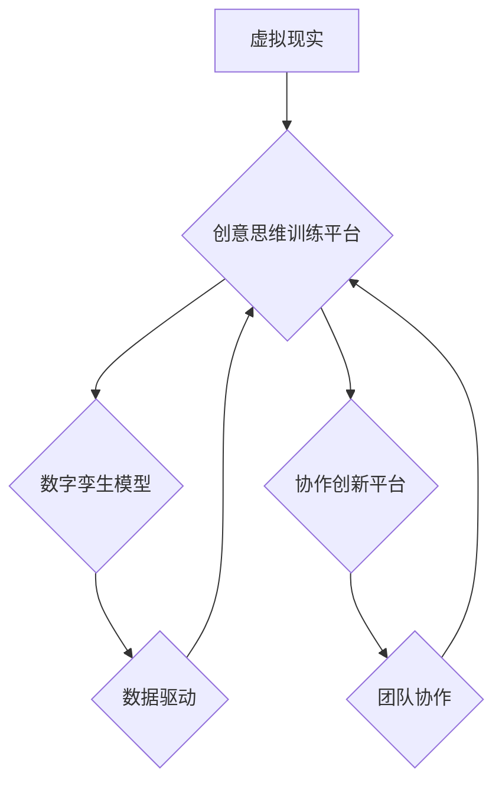

> 虚拟现实、创意思维、训练平台、人工智能、数字孪生、协作创新、商业模式

## 1. 背景介绍

在当今科技飞速发展的时代，创新已成为企业和个人持续发展的关键驱动力。然而，传统的创新模式往往面临着时间成本高、资源投入大、成功率低等挑战。虚拟现实（VR）技术作为一种沉浸式交互体验的新兴技术，为激发创意思维提供了全新的可能性。

VR技术能够构建逼真的虚拟环境，让用户身临其境地体验和探索不同的场景和情境。这种沉浸式体验能够打破现实世界的物理限制，激发用户的想象力和创造力，从而促进创意思维的产生和发展。

## 2. 核心概念与联系

**2.1 虚拟现实（VR）**

虚拟现实是指利用计算机技术模拟真实环境或虚构环境，并通过交互设备（如头戴式显示器、手柄等）提供沉浸式体验的技术。VR技术能够创造逼真的视觉、听觉、触觉等多感官体验，让用户仿佛置身于虚拟世界中。

**2.2 创意思维（Creative Intelligence）**

创意思维是指人类通过思考、想象、联想等方式，产生新的想法、概念、方案和作品的能力。它是一种综合性的认知能力，包括创造性思维、想象力、创新精神、问题解决能力等多个方面。

**2.3 数字孪生（Digital Twin）**

数字孪生是指利用物理模型、传感器数据、人工智能等技术，构建与真实世界物体或系统完全对应的虚拟模型。数字孪生能够实时反映真实世界的状态和变化，并提供模拟和预测功能，为创意思维训练提供真实的数据支持。

**2.4 协作创新（Collaborative Innovation）**

协作创新是指多个个体或团队在共同目标下，通过合作、交流、分享等方式，共同创造新的价值。VR技术能够为协作创新提供虚拟空间和交互平台，促进团队成员之间的协作和沟通，激发共同的创新灵感。

**2.5 核心概念架构**



## 3. 核心算法原理 & 具体操作步骤

**3.1 算法原理概述**

创意思维训练平台的核心算法基于深度学习、自然语言处理和知识图谱等人工智能技术，通过以下步骤实现：

1. **数据采集和预处理:** 收集用户行为数据、创意作品数据、行业知识数据等，并进行清洗、转换、标注等预处理工作。
2. **模型训练:** 利用深度学习算法训练模型，例如生成对抗网络（GAN）、变分自编码器（VAE）等，学习用户创造模式和知识结构。
3. **创意生成:** 根据用户输入的关键词、场景描述等信息，利用训练好的模型生成创意方案、设计草图、故事梗概等。
4. **反馈和迭代:** 用户对生成的创意进行评价和反馈，模型根据反馈信息进行调整和优化，不断提升创意质量。

**3.2 算法步骤详解**

1. **数据采集:** 从用户行为数据、创意作品数据、行业知识库等多个来源收集数据。
2. **数据预处理:** 对收集到的数据进行清洗、转换、标注等预处理工作，例如去除噪声、转换数据格式、标注数据类别等。
3. **特征提取:** 利用自然语言处理技术提取文本数据中的关键词、主题、情感等特征，利用计算机视觉技术提取图像数据中的形状、颜色、纹理等特征。
4. **模型训练:** 利用深度学习算法训练模型，例如GAN、VAE等，学习用户创造模式和知识结构。
5. **创意生成:** 根据用户输入的关键词、场景描述等信息，利用训练好的模型生成创意方案、设计草图、故事梗概等。
6. **反馈和迭代:** 用户对生成的创意进行评价和反馈，模型根据反馈信息进行调整和优化，不断提升创意质量。

**3.3 算法优缺点**

**优点:**

* **自动化生成:** 可以自动生成创意方案，节省时间和人力成本。
* **多样化创意:** 可以从海量数据中学习，生成多样化的创意方案。
* **数据驱动:** 基于数据分析和模型训练，创意方案更具可信度和实用性。

**缺点:**

* **数据依赖:** 算法性能依赖于训练数据的质量和数量。
* **缺乏灵活性:** 算法生成的创意方案可能缺乏个性化和独特性。
* **伦理问题:** 需要考虑算法生成的创意方案的伦理和社会影响。

**3.4 算法应用领域**

* **产品设计:** 自动生成产品概念、设计草图、用户体验方案等。
* **广告创意:** 自动生成广告文案、创意素材、营销策略等。
* **影视制作:** 自动生成剧本、故事梗概、角色设定等。
* **游戏开发:** 自动生成游戏关卡、场景设计、游戏机制等。

## 4. 数学模型和公式 & 详细讲解 & 举例说明

**4.1 数学模型构建**

创意思维训练平台的核心数学模型基于深度学习框架，例如TensorFlow或PyTorch。模型结构通常包括多层神经网络，例如卷积神经网络（CNN）、循环神经网络（RNN）或Transformer等。

**4.2 公式推导过程**

深度学习模型的训练过程基于梯度下降算法，通过不断调整模型参数，最小化模型预测误差。

损失函数（Loss Function）用于衡量模型预测误差，常用的损失函数包括均方误差（MSE）、交叉熵损失（Cross-Entropy Loss）等。

梯度下降算法通过计算损失函数对模型参数的梯度，更新模型参数，逐步降低模型预测误差。

**4.3 案例分析与讲解**

例如，在生成文本创意时，可以使用Transformer模型，其核心公式包括注意力机制（Attention Mechanism）和多头注意力（Multi-Head Attention）。

注意力机制能够学习文本中不同词语之间的关系，赋予重要词语更高的权重，从而更好地理解文本语义。

多头注意力能够同时学习多个不同角度的词语关系，提升模型的表达能力和理解能力。

## 5. 项目实践：代码实例和详细解释说明

**5.1 开发环境搭建**

创意思维训练平台的开发环境通常包括以下软件：

* 操作系统：Windows、macOS或Linux
* Python编程语言
* 深度学习框架：TensorFlow或PyTorch
* 数据处理工具：Pandas、NumPy
* 图像处理工具：OpenCV
* 虚拟现实开发工具：Unity或Unreal Engine

**5.2 源代码详细实现**

以下是一个简单的代码示例，演示如何使用TensorFlow训练一个文本生成模型：

```python
import tensorflow as tf

# 定义模型结构
model = tf.keras.Sequential([
    tf.keras.layers.Embedding(input_dim=10000, output_dim=128),
    tf.keras.layers.LSTM(units=128),
    tf.keras.layers.Dense(units=10000, activation='softmax')
])

# 编译模型
model.compile(loss='sparse_categorical_crossentropy', optimizer='adam')

# 训练模型
model.fit(x_train, y_train, epochs=10)

# 生成文本
text = model.predict(x_test)
```

**5.3 代码解读与分析**

这段代码定义了一个简单的文本生成模型，使用Embedding层将词语转换为向量表示，使用LSTM层学习文本序列的上下文关系，使用Dense层输出每个词语的概率分布。

模型使用交叉熵损失函数和Adam优化器进行训练，训练完成后可以使用模型预测新的文本序列。

**5.4 运行结果展示**

训练完成后，可以使用模型生成新的文本序列，并展示生成的文本结果。

## 6. 实际应用场景

**6.1 产品设计**

创意思维训练平台可以帮助设计师快速生成产品概念、设计草图、用户体验方案等，提高设计效率和创意水平。

**6.2 广告创意**

创意思维训练平台可以帮助广告公司自动生成广告文案、创意素材、营销策略等，提升广告创意的质量和效率。

**6.3 影视制作**

创意思维训练平台可以帮助影视公司自动生成剧本、故事梗概、角色设定等，提高影视创作的效率和创意水平。

**6.4 游戏开发**

创意思维训练平台可以帮助游戏公司自动生成游戏关卡、场景设计、游戏机制等，提高游戏开发的效率和创意水平。

**6.5 未来应用展望**

随着虚拟现实技术和人工智能技术的不断发展，创意思维训练平台将有更广泛的应用场景，例如：

* 教育培训：帮助学生激发创造力，培养创新思维。
* 科学研究：帮助科学家探索新的科学领域，发现新的知识。
* 艺术创作：帮助艺术家创作新的艺术作品，突破艺术的边界。

## 7. 工具和资源推荐

**7.1 学习资源推荐**

* **书籍:**
    * 《深度学习》
    * 《自然语言处理》
    * 《计算机视觉》
* **在线课程:**
    * Coursera
    * edX
    * Udacity

**7.2 开发工具推荐**

* **深度学习框架:** TensorFlow、PyTorch
* **虚拟现实开发工具:** Unity、Unreal Engine
* **数据处理工具:** Pandas、NumPy

**7.3 相关论文推荐**

* **Generative Adversarial Networks**
* **Attention Is All You Need**
* **BERT: Pre-training of Deep Bidirectional Transformers for Language Understanding**

## 8. 总结：未来发展趋势与挑战

**8.1 研究成果总结**

创意思维训练平台基于虚拟现实技术和人工智能技术，能够有效激发用户的创意思维，并为创新的过程提供数据支持和协作平台。

**8.2 未来发展趋势**

未来，创意思维训练平台将朝着以下方向发展：

* **更逼真的虚拟环境:** 利用更先进的VR技术，构建更逼真、更沉浸式的虚拟环境，提升用户的体验感和参与度。
* **更智能的算法:** 利用更先进的人工智能算法，例如强化学习、迁移学习等，提升模型的生成能力和创意水平。
* **更个性化的体验:** 利用用户行为数据和偏好信息，为用户提供更个性化的创意思维训练体验。

**8.3 面临的挑战**

创意思维训练平台的发展也面临着一些挑战：

* **数据获取和标注:** 训练高质量的创意思维模型需要海量的数据，而数据获取和标注成本较高。
* **算法复杂度:** 创意思维算法的复杂度较高，需要强大的计算能力和技术支持。
* **伦理问题:** 创意思维训练平台生成的创意方案可能存在伦理和社会问题，需要进行充分的伦理评估和监管。

**8.4 研究展望**

未来，我们将继续致力于创意思维训练平台的研究和开发，探索更先进的技术和方法，为用户提供更优质的创意思维体验，并推动创意思维的广泛应用。

## 9. 附录：常见问题与解答

**9.1 如何使用创意思维训练平台？**

用户可以通过以下步骤使用创意思维训练平台：

1. 创建用户账号
2. 选择合适的训练场景
3. 输入关键词或描述信息
4. 接收平台生成的创意方案
5. 对创意方案进行评价和反馈

**9.2 创意思维训练平台的安全性如何？**

创意思维训练平台采用严格的安全措施，保护用户的个人信息和数据安全。

**9.3 创意思维训练平台的收费标准？**

创意思维训练平台提供免费试用和付费订阅两种服务模式。

作者：禅与计算机程序设计艺术 / Zen and the Art of Computer Programming


<end_of_turn>