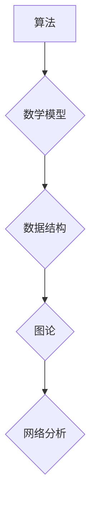

> 计算机科学、数学、算法、模型、应用、未来趋势

## 1. 背景介绍

计算机科学与数学有着密不可分的联系。从算法设计到数据结构，从人工智能到密码学，数学为计算机科学的发展提供了坚实的基础和强大的工具。随着计算机科学的不断发展，对数学的应用也日益深入和广泛。

近年来，计算机科学领域涌现出许多新的研究方向和技术突破，这些突破离不开数学的支撑。例如，深度学习的兴起，离不开线性代数、微积分和概率论等数学基础的应用；量子计算的快速发展，则依赖于抽象代数、线性代数和拓扑学等领域的数学理论。

## 2. 核心概念与联系

**2.1 算法与数学模型**

算法是计算机科学的核心概念之一，它描述了解决特定问题的步骤和规则。而数学模型则提供了一种抽象和形式化的描述方式，可以用来表示算法的逻辑关系和计算过程。

**2.2 数据结构与数学集合**

数据结构是计算机科学中用于组织和存储数据的基本概念。数学集合论为数据结构提供了理论基础，例如，数组、链表、树等数据结构都可以用数学集合的性质来描述和分析。

**2.3 图论与网络分析**

图论是研究图结构和图性质的数学分支，它在计算机科学中有着广泛的应用，例如，社交网络分析、路由算法、推荐系统等。

**Mermaid 流程图**



## 3. 核心算法原理 & 具体操作步骤

**3.1 算法原理概述**

**快速排序算法**是一种高效的排序算法，其时间复杂度为O(n log n)。它基于分治策略，将待排序数组分成左右两部分，然后递归地对两部分进行排序，最后将两部分合并得到最终排序结果。

**3.2 算法步骤详解**

1. 选择一个元素作为**基准元素**。
2. 将数组中的元素分为两部分：小于基准元素的部分和大于基准元素的部分。
3. 对两部分分别进行快速排序。
4. 将两部分排序后的结果合并得到最终排序结果。

**3.3 算法优缺点**

**优点:**

* 时间复杂度为O(n log n)，在大多数情况下表现优异。
* 空间复杂度为O(log n)，相对较低。

**缺点:**

* 在某些情况下，例如数组已经有序时，时间复杂度可能会退化为O(n^2)。
* 选择基准元素的方式可能会影响算法的效率。

**3.4 算法应用领域**

快速排序算法广泛应用于各种排序场景，例如：

* 数据排序
* 搜索引擎索引
* 图像处理
* 机器学习

## 4. 数学模型和公式 & 详细讲解 & 举例说明

**4.1 数学模型构建**

快速排序算法可以抽象为一个**递归函数**，其输入为待排序数组，输出为排序后的数组。

**4.2 公式推导过程**

时间复杂度分析：

* 每次递归调用，数组大小减半，因此递归深度为log n。
* 每次递归调用都需要进行比较和交换操作，时间复杂度为O(n)。
* 因此，快速排序算法的时间复杂度为O(n log n)。

**4.3 案例分析与讲解**

假设待排序数组为：[5, 2, 8, 3, 1, 6]。

1. 选择第一个元素5作为基准元素。
2. 将数组分为：[2, 3, 1] 和 [8, 6]。
3. 对两部分分别进行快速排序。
4. 将两部分排序后的结果合并得到最终排序结果：[1, 2, 3, 5, 6, 8]。

## 5. 项目实践：代码实例和详细解释说明

**5.1 开发环境搭建**

使用Python语言进行快速排序算法的实现。

**5.2 源代码详细实现**

```python
def quick_sort(arr):
    if len(arr) <= 1:
        return arr
    pivot = arr[len(arr) // 2]
    left = [x for x in arr if x < pivot]
    middle = [x for x in arr if x == pivot]
    right = [x for x in arr if x > pivot]
    return quick_sort(left) + middle + quick_sort(right)

# 测试代码
arr = [5, 2, 8, 3, 1, 6]
sorted_arr = quick_sort(arr)
print(sorted_arr)
```

**5.3 代码解读与分析**

* 函数`quick_sort(arr)`接受一个待排序数组`arr`作为输入。
* 如果数组长度小于等于1，则直接返回数组，因为已经排序。
* 选择数组中间元素作为基准元素`pivot`。
* 使用列表推导式将数组分为三个部分：小于基准元素的`left`部分，等于基准元素的`middle`部分，大于基准元素的`right`部分。
* 递归地对`left`和`right`部分进行排序。
* 将排序后的`left`、`middle`和`right`部分合并得到最终排序结果。

**5.4 运行结果展示**

```
[1, 2, 3, 5, 6, 8]
```

## 6. 实际应用场景

快速排序算法广泛应用于各种实际场景，例如：

* **搜索引擎索引:** 搜索引擎需要对海量网页进行排序，以便快速检索相关信息。
* **推荐系统:** 推荐系统需要对用户感兴趣的内容进行排序，以便提供个性化的推荐。
* **数据分析:** 数据分析需要对数据进行排序，以便进行统计分析和可视化展示。

**6.4 未来应用展望**

随着计算机科学的不断发展，快速排序算法的应用场景将会更加广泛。例如，在云计算和大数据时代，快速排序算法可以用于对海量数据进行高效的排序和处理。

## 7. 工具和资源推荐

**7.1 学习资源推荐**

* **书籍:**
    * 《算法导论》
    * 《数据结构与算法分析》
* **在线课程:**
    * Coursera: 数据结构与算法
    * edX: 算法导论

**7.2 开发工具推荐**

* **Python:** 
    * 强大的编程语言，广泛应用于数据科学和机器学习。
* **Java:** 
    * 性能优异的编程语言，适合开发大型应用程序。

**7.3 相关论文推荐**

* **Quicksort Algorithm:** https://en.wikipedia.org/wiki/Quicksort

## 8. 总结：未来发展趋势与挑战

**8.1 研究成果总结**

计算机科学与数学的结合为计算机科学的发展提供了强大的理论基础和工具。快速排序算法作为一种高效的排序算法，在实际应用中发挥着重要作用。

**8.2 未来发展趋势**

* **人工智能:** 人工智能的发展离不开数学的支撑，例如，深度学习算法的应用依赖于线性代数、微积分和概率论等数学基础。
* **量子计算:** 量子计算的快速发展依赖于抽象代数、线性代数和拓扑学等领域的数学理论。
* **大数据分析:** 大数据分析需要对海量数据进行高效的处理和分析，数学模型和算法在其中发挥着重要作用。

**8.3 面临的挑战**

* **算法复杂度:** 随着数据规模的不断增长，算法的复杂度问题越来越突出。
* **模型可解释性:** 一些复杂的机器学习模型难以解释，这限制了其在实际应用中的推广。
* **数据隐私保护:** 数据隐私保护问题日益重要，需要开发新的数学模型和算法来保障数据安全。

**8.4 研究展望**

未来，计算机科学与数学的结合将会更加紧密，新的数学模型和算法将会不断涌现，推动计算机科学的发展。


## 9. 附录：常见问题与解答

**9.1 如何选择快速排序算法的基准元素？**

基准元素的选择会影响算法的效率。一些常见的基准元素选择策略包括：

* 选择数组中间元素。
* 选择随机元素。
* 使用中位数选择算法。

**9.2 快速排序算法的时间复杂度为什么是O(n log n)？**

快速排序算法的时间复杂度分析基于以下假设：

* 每次递归调用，数组大小减半。
* 每次递归调用都需要进行比较和交换操作，时间复杂度为O(n)。

因此，递归深度为log n，每次递归调用的时间复杂度为O(n)，总的时间复杂度为O(n log n)。

**9.3 快速排序算法的缺点是什么？**

快速排序算法的缺点包括：

* 在某些情况下，例如数组已经有序时，时间复杂度可能会退化为O(n^2)。
* 选择基准元素的方式可能会影响算法的效率。


作者：禅与计算机程序设计艺术 / Zen and the Art of Computer Programming 
<end_of_turn>