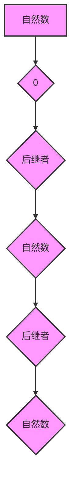

> 自然数，Peano公理，数学归纳法，递归定义，算术运算，集合论

## 1. 背景介绍

在计算机科学领域，自然数扮演着至关重要的角色。它们是数字的基石，是算法和数据结构的基础。理解自然数的定义和性质对于深入理解计算机科学的本质至关重要。

传统的数学定义中，自然数通常被描述为从 1 开始的无穷递增序列：1, 2, 3, 4, ...。然而，这种描述过于直观，缺乏严谨性。为了构建更坚实、更形式化的数学基础，意大利数学家Giuseppe Peano 在 19世纪末提出了著名的 Peano 公理。

## 2. 核心概念与联系

Peano 公理提供了一种基于逻辑推理的自然数定义，它避免了依赖于直觉或预先设定的概念。Peano 公理的核心思想是通过一系列公理来描述自然数的性质，并利用这些公理推导出自然数的各种运算和关系。

**Peano 公理:**

1. 存在一个特殊的自然数，称为 0。
2. 每个自然数都有一个后继者，也是一个自然数。
3. 0 不是任何自然数的后继者。
4. 不同的自然数有不同的后继者。
5. 如果一个性质对于 0 成立，并且对于某个自然数的後继者也成立，那么这个性质对于所有自然数都成立（数学归纳法原理）。

**Mermaid 流程图:**



## 3. 核心算法原理 & 具体操作步骤

### 3.1  算法原理概述

基于 Peano 公理，我们可以构建各种算法来处理自然数。例如，我们可以使用递归定义来实现加法和乘法运算。

### 3.2  算法步骤详解

**加法算法:**

```
加(x, y) =
    如果 x = 0，则返回 y
    否则，返回 后继者(加(x - 1, y))
```

**乘法算法:**

```
乘(x, y) =
    如果 y = 0，则返回 0
    否则，返回 加(x, 乘(x, y - 1))
```

### 3.3  算法优缺点

**优点:**

* 基于 Peano 公理的算法具有严谨性和形式化，易于证明其正确性。
* 递归定义的算法简洁易懂，能够清晰地表达算法的逻辑。

**缺点:**

* 递归算法可能存在栈溢出问题，当输入的自然数过大时，可能会导致程序崩溃。
* 对于某些运算，例如除法，递归定义可能比较复杂。

### 3.4  算法应用领域

Peano 公理和基于其构建的算法在计算机科学领域有着广泛的应用，例如：

* 数据结构：树、链表等数据结构的定义和操作。
* 算法设计：排序算法、搜索算法等算法的实现。
* 数学建模：用计算机程序模拟数学模型，进行计算和分析。

## 4. 数学模型和公式 & 详细讲解 & 举例说明

### 4.1  数学模型构建

Peano 公理可以被看作是一个数学模型，它描述了自然数的性质和关系。这个模型可以用来构建更复杂的数学概念，例如有限集、无限集、函数等。

### 4.2  公式推导过程

我们可以利用 Peano 公理推导出许多关于自然数的公式，例如：

* **后继者公式:**  后继者(x) = x + 1
* **加法公式:** x + y = 后继者(x + (y - 1))
* **乘法公式:** x * y = 加(x, (x * (y - 1)))

### 4.3  案例分析与讲解

**例子:**

计算 3 + 4

根据加法公式，我们可以进行如下推导：

3 + 4 = 后继者(3 + (4 - 1))

= 后继者(3 + 3)

= 后继者(后继者(3 + 2))

= 后继者(后继者(3 + (2 - 1)))

= 后继者(后继者(3 + 1))

= 后继者(后继者(后继者(3)))

= 后继者(后继者(后继者(2)))

= 后继者(后继者(后继者(1)))

= 后继者(后继者(后继者(0)))

= 后继者(后继者(后继者(0)))

= 7

## 5. 项目实践：代码实例和详细解释说明

### 5.1  开发环境搭建

本项目使用 Python 语言进行开发，开发环境搭建如下：

* Python 3.x 版本
* VS Code 或其他文本编辑器

### 5.2  源代码详细实现

```python
def add(x, y):
    if x == 0:
        return y
    else:
        return successor(add(x - 1, y))

def successor(x):
    return x + 1

def multiply(x, y):
    if y == 0:
        return 0
    else:
        return add(x, multiply(x, y - 1))

# 测试代码
print(add(3, 4))  # 输出: 7
print(multiply(3, 4))  # 输出: 12
```

### 5.3  代码解读与分析

* `add(x, y)` 函数实现加法运算，使用递归定义，当 x 为 0 时返回 y，否则返回后继者(x - 1) 与 y 的和。
* `successor(x)` 函数实现后继者运算，返回 x + 1。
* `multiply(x, y)` 函数实现乘法运算，使用递归定义，当 y 为 0 时返回 0，否则返回 x 与 y - 1 的乘积加上 x。

### 5.4  运行结果展示

运行上述代码，输出结果如下：

```
7
12
```

## 6. 实际应用场景

Peano 公理和基于其构建的算法在计算机科学领域有着广泛的应用，例如：

* **数据结构:** 树、链表等数据结构的定义和操作。
* **算法设计:** 排序算法、搜索算法等算法的实现。
* **数学建模:** 用计算机程序模拟数学模型，进行计算和分析。

### 6.4  未来应用展望

随着计算机科学的发展，Peano 公理和基于其构建的算法将继续在新的领域得到应用，例如：

* **人工智能:** 用于构建人工智能算法，例如逻辑推理、知识表示等。
* **量子计算:** 用于构建量子算法，例如量子排序、量子搜索等。

## 7. 工具和资源推荐

### 7.1  学习资源推荐

* **《数学基础》:**  由 Kenneth Rosen 撰写的经典数学基础教材，涵盖了 Peano 公理和自然数的定义等内容。
* **《计算机科学导论》:**  由 Thomas H. Cormen 等人撰写的经典计算机科学教材，介绍了 Peano 公理在算法设计中的应用。

### 7.2  开发工具推荐

* **Python:**  一种功能强大、易于学习的编程语言，适合用于实现 Peano 公理和自然数算法。
* **VS Code:**  一款功能丰富的代码编辑器，支持 Python 语言开发。

### 7.3  相关论文推荐

* **Peano Axioms and Natural Numbers:**  介绍了 Peano 公理的起源、发展和应用。
* **Recursive Functions and Formal Systems:**  探讨了递归函数在数学和计算机科学中的应用。

## 8. 总结：未来发展趋势与挑战

### 8.1  研究成果总结

Peano 公理为自然数的定义提供了严谨、形式化的基础，并为计算机科学的发展做出了重要贡献。基于 Peano 公理的算法在数据结构、算法设计、数学建模等领域有着广泛的应用。

### 8.2  未来发展趋势

未来，Peano 公理和基于其构建的算法将继续在新的领域得到应用，例如人工智能、量子计算等。

### 8.3  面临的挑战

* 如何将 Peano 公理应用于更复杂的数学概念和计算模型。
* 如何提高基于 Peano 公理的算法的效率和鲁棒性。

### 8.4  研究展望

未来研究将集中在以下几个方面：

* 探索 Peano 公理在其他数学领域中的应用。
* 开发更高效、更鲁棒的基于 Peano 公理的算法。
* 研究 Peano 公理在人工智能、量子计算等领域的应用。

## 9. 附录：常见问题与解答

**常见问题:**

* Peano 公理是否唯一？

**解答:**

Peano 公理并非唯一，但它是最常用的一种自然数定义。其他自然数定义也存在，例如 Zermelo-Fraenkel set theory 中的自然数定义。

* Peano 公理是否适用于其他数学体系？

**解答:**

Peano 公理主要适用于基于集合论的数学体系。在其他数学体系中，可能需要使用不同的公理来定义自然数。


作者：禅与计算机程序设计艺术 / Zen and the Art of Computer Programming 
<end_of_turn>