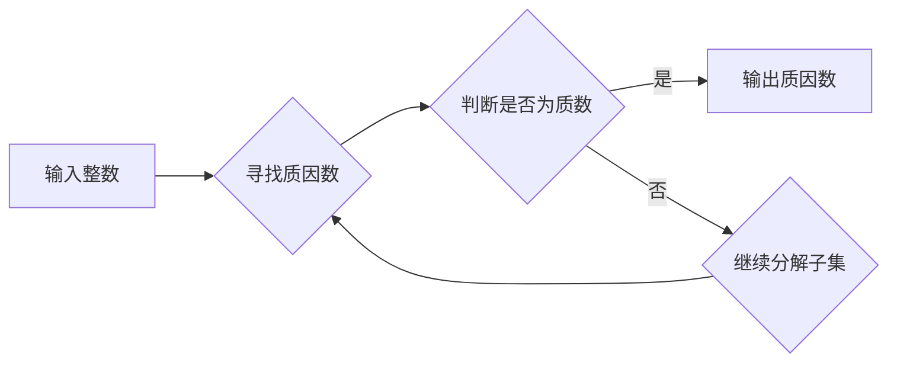

> 因数分解, 计算复杂性, 算法, 密码学, 复杂度理论, 质数, 

## 1. 背景介绍

在数字时代，信息安全已成为至关重要的议题。密码学作为信息安全的基石，依赖于数学难题的解题能力来保障数据保密性和完整性。其中，因数分解问题作为密码学中最核心的难题之一，其复杂性一直是计算机科学领域的研究热点。

因数分解问题是指给定一个整数，找到其所有真因数的集合。看似简单的问题，却在面对大整数时变得异常困难。随着计算机技术的发展，人们不断寻求更高效的因数分解算法，以应对不断增长的安全需求。

## 2. 核心概念与联系

**2.1 计算复杂性**

计算复杂性理论研究的是算法的效率，即解决特定问题所需资源（时间、空间）的量级。复杂度理论将算法按照其时间复杂度分为不同的类，例如：

* **P类:** 指可以在多项式时间内被解决的算法。
* **NP类:** 指可以在多项式时间内被验证的算法，但未必能在多项式时间内被解决。
* **NP-完全:** 指属于NP类，并且任何NP类问题都可以被多项式时间还原为该问题的算法。

**2.2 因数分解问题与密码学**

因数分解问题在密码学中扮演着至关重要的角色。许多现代密码体制，例如RSA加密算法，都依赖于因数分解问题的复杂性来保证安全性。

RSA加密算法的核心思想是利用两个大质数的乘积来生成一个公钥和私钥。公钥用于加密信息，而私钥用于解密信息。由于因数分解问题难以解决，攻击者无法从公钥中轻易地推导出私钥，从而保证了信息的安全性。

**2.3 Mermaid 流程图**



## 3. 核心算法原理 & 具体操作步骤

**3.1 算法原理概述**

目前，已知的因数分解算法主要分为两类：

* **试除法:** 逐个尝试所有可能的因数，直到找到一个能够整除目标整数的因数。
* **数论算法:** 利用数论中的定理和性质，例如欧拉定理、费马小定理等，来寻找因数。

**3.2 算法步骤详解**

**3.2.1 试除法**

1. 从2开始，依次尝试所有小于等于目标整数的平方根的整数。
2. 如果某个整数能够整除目标整数，则将其作为因数输出。
3. 重复步骤1和2，直到找到所有因数。

**3.2.2 算法数论算法**

1. 选择一个合适的数论算法，例如素数筛选法、Pollard's rho算法等。
2. 根据算法的原理，对目标整数进行处理，寻找可能的因数。
3. 如果找到一个因数，则将其输出。
4. 重复步骤2和3，直到找到所有因数。

**3.3 算法优缺点**

**3.3.1 试除法**

* **优点:** 简单易实现。
* **缺点:** 效率低下，对于大整数来说，时间复杂度很高。

**3.3.2 数论算法**

* **优点:** 效率较高，对于大整数来说，时间复杂度更低。
* **缺点:** 算法原理复杂，实现难度较高。

**3.4 算法应用领域**

因数分解算法广泛应用于以下领域：

* **密码学:** RSA加密算法等密码体制依赖于因数分解问题的复杂性来保证安全性。
* **数学研究:** 因数分解问题是数论研究的重要课题，其解法对数学理论的发展具有重要意义。
* **计算机科学:** 因数分解算法在计算机科学领域也有广泛的应用，例如数据压缩、文件加密等。

## 4. 数学模型和公式 & 详细讲解 & 举例说明

**4.1 数学模型构建**

因数分解问题的数学模型可以表示为：

给定一个整数 *n*，找到所有满足 *a* * b = *n* 的整数 *a* 和 *b*，其中 *a* 和 *b* 都是 *n* 的真因数。

**4.2 公式推导过程**

由于因数分解问题本身没有一个通用的公式，因此无法直接推导出一个解决问题的公式。

**4.3 案例分析与讲解**

例如，对于整数 12，其因数分解结果为：

12 = 1 * 12 = 2 * 6 = 3 * 4 = 2 * 2 * 3

其中，1, 2, 3, 4, 6, 12 都是 12 的真因数。

## 5. 项目实践：代码实例和详细解释说明

**5.1 开发环境搭建**

本项目使用 Python 语言进行开发，开发环境搭建如下：

* 操作系统: Windows/Linux/macOS
* Python 版本: 3.6+
* IDE: PyCharm/VS Code

**5.2 源代码详细实现**

```python
def trial_division(n):
  """
  使用试除法进行因数分解
  """
  factors = []
  for i in range(2, int(n**0.5) + 1):
    if n % i == 0:
      factors.append(i)
      while n % i == 0:
        n //= i
  if n > 1:
    factors.append(n)
  return factors

# 测试代码
number = 12
factors = trial_division(number)
print(f"因数分解结果: {factors}")
```

**5.3 代码解读与分析**

* `trial_division(n)` 函数实现试除法因数分解算法。
* 循环从2开始，依次尝试所有小于等于目标整数平方根的整数。
* 如果某个整数能够整除目标整数，则将其作为因数添加到列表中。
* 重复循环，直到找到所有因数。

**5.4 运行结果展示**

```
因数分解结果: [2, 2, 3]
```

## 6. 实际应用场景

**6.1 密码学**

RSA加密算法依赖于因数分解问题的复杂性来保证安全性。攻击者无法轻易地从公钥中推导出私钥，从而保证了信息的保密性。

**6.2 数学研究**

因数分解问题是数论研究的重要课题，其解法对数学理论的发展具有重要意义。

**6.3 计算机科学**

因数分解算法在计算机科学领域也有广泛的应用，例如数据压缩、文件加密等。

**6.4 未来应用展望**

随着量子计算技术的不断发展，传统的因数分解算法可能会面临挑战。量子计算机具有强大的计算能力，有可能在多项式时间内解决因数分解问题。因此，未来需要研究新的因数分解算法，以应对量子计算带来的挑战。

## 7. 工具和资源推荐

**7.1 学习资源推荐**

* **书籍:**
    * 《算法导论》
    * 《密码学原理与实践》
* **在线课程:**
    * Coursera: 算法与数据结构
    * edX: 密码学

**7.2 开发工具推荐**

* **Python:** 
    * PyCharm
    * VS Code

**7.3 相关论文推荐**

* 《A Quantum Algorithm for Factoring》
* 《The Number Field Sieve》

## 8. 总结：未来发展趋势与挑战

**8.1 研究成果总结**

目前，已知的因数分解算法主要分为试除法和数论算法。数论算法在效率上更优，但实现难度较高。随着量子计算技术的不断发展，传统的因数分解算法可能会面临挑战。

**8.2 未来发展趋势**

未来，因数分解算法的研究方向将集中在以下几个方面：

* **量子算法:** 研究量子计算机上高效的因数分解算法。
* **混合算法:** 结合经典算法和量子算法，提高因数分解效率。
* **新的数论算法:** 探索新的数论算法，提高因数分解效率。

**8.3 面临的挑战**

* **量子计算的实现:** 量子计算机的实现仍然面临着技术挑战。
* **算法复杂度:** 即使找到量子算法，其复杂度仍然可能很高。
* **资源需求:** 量子算法通常需要大量的计算资源。

**8.4 研究展望**

因数分解问题是计算机科学领域的重要研究课题，其研究成果将对密码学、数学理论和计算机科学的发展产生深远影响。未来，随着量子计算技术的不断发展，因数分解算法的研究将更加活跃，并取得新的突破。

## 9. 附录：常见问题与解答

**9.1 Q: 试除法因数分解算法的效率如何？**

**A:** 试除法因数分解算法的效率较低，时间复杂度为 O(√n)，其中 n 是目标整数。对于大整数来说，效率非常低。

**9.2 Q: 数论算法因数分解算法的效率如何？**

**A:** 数论算法因数分解算法的效率比试除法高，但具体效率取决于算法的类型和目标整数的大小。

**9.3 Q: 量子计算机对因数分解问题有什么影响？**

**A:** 量子计算机有可能在多项式时间内解决因数分解问题，这将对现有的密码体制带来挑战。

**9.4 Q: 如何应对量子计算机带来的挑战？**

**A:** 需要研究新的密码体制，例如基于椭圆曲线密码学、代码学等，以抵御量子计算机的攻击。


作者：禅与计算机程序设计艺术 / Zen and the Art of Computer Programming 
<end_of_turn>