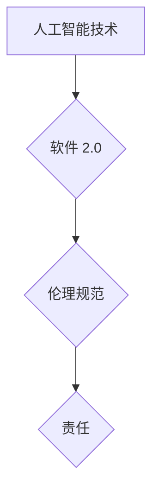

> 人工智能，伦理规范，责任，软件 2.0，可解释性，公平性，透明度，安全

## 1. 背景介绍

软件已经深刻地改变了我们的生活，从智能手机到自动驾驶汽车，再到医疗诊断和金融交易，软件无处不在。随着人工智能（AI）技术的飞速发展，软件正在经历一场新的变革，我们正迈入“软件 2.0”时代。

软件 2.0 的核心特征是智能化和自主性。它不再仅仅是按照预先设定的规则执行指令的程序，而是能够学习、适应和自主决策的系统。这带来了前所未有的机遇，但也带来了新的伦理挑战。

## 2. 核心概念与联系

**2.1 人工智能（AI）**

人工智能是指模拟人类智能行为的计算机系统。它涵盖了多种技术，例如机器学习、深度学习、自然语言处理和计算机视觉。

**2.2 软件 2.0**

软件 2.0 指的是基于人工智能技术的下一代软件。它具有以下特点：

* **智能化:** 软件能够学习和适应环境，并做出智能决策。
* **自主性:** 软件能够自主执行任务，无需人工干预。
* **个性化:** 软件能够根据用户的需求和喜好进行定制。
* **协作性:** 软件能够与其他软件和系统协同工作。

**2.3 伦理规范**

伦理规范是指指导人们行为的道德准则和原则。在软件 2.0 时代，我们需要制定新的伦理规范，以确保人工智能技术被安全、负责任和公平地使用。

**2.4 责任**

责任是指对自己的行为和结果负责。在软件 2.0 时代，我们需要明确人工智能系统的责任主体，并建立相应的责任机制。

**2.5 流程图**



## 3. 核心算法原理 & 具体操作步骤

**3.1 算法原理概述**

深度学习是人工智能领域的核心算法之一。它是一种基于人工神经网络的机器学习方法，能够从海量数据中学习复杂的模式和关系。

**3.2 算法步骤详解**

1. **数据收集和预处理:** 收集大量相关数据，并进行清洗、转换和格式化。
2. **网络结构设计:** 设计深度神经网络的结构，包括层数、节点数和激活函数。
3. **模型训练:** 使用训练数据训练深度神经网络，调整网络参数以最小化预测误差。
4. **模型评估:** 使用测试数据评估模型的性能，例如准确率、召回率和F1-score。
5. **模型部署:** 将训练好的模型部署到实际应用场景中。

**3.3 算法优缺点**

**优点:**

* 能够学习复杂的模式和关系。
* 性能优于传统机器学习算法。
* 可应用于多种领域，例如图像识别、自然语言处理和语音识别。

**缺点:**

* 需要大量数据进行训练。
* 训练过程耗时和耗能。
* 模型的可解释性较差。

**3.4 算法应用领域**

* **图像识别:** 人脸识别、物体检测、图像分类。
* **自然语言处理:** 机器翻译、文本摘要、情感分析。
* **语音识别:** 语音转文本、语音助手。
* **医疗诊断:** 病情预测、疾病诊断、辅助治疗。
* **金融交易:** 风险评估、欺诈检测、投资决策。

## 4. 数学模型和公式 & 详细讲解 & 举例说明

**4.1 数学模型构建**

深度学习模型通常采用多层感知机（MLP）结构。每个层包含多个神经元，神经元之间通过权重连接。

**4.2 公式推导过程**

* **激活函数:** 激活函数用于引入非线性，使神经网络能够学习复杂的模式。常用的激活函数包括 sigmoid 函数、ReLU 函数和 tanh 函数。

* **损失函数:** 损失函数用于衡量模型预测结果与真实值的差异。常用的损失函数包括均方误差（MSE）和交叉熵损失（Cross-Entropy Loss）。

* **梯度下降:** 梯度下降算法用于优化模型参数，使其能够最小化损失函数。

**4.3 案例分析与讲解**

假设我们有一个图像分类任务，目标是将图像分类为猫或狗。我们可以使用深度学习模型进行训练。

* **输入数据:** 图像数据，经过预处理后转换为数字向量。
* **模型结构:** 多层感知机，包含多个隐藏层和输出层。
* **损失函数:** 交叉熵损失函数。
* **优化算法:** 梯度下降算法。

通过训练，模型能够学习到猫和狗的特征，并能够准确地将图像分类。

## 5. 项目实践：代码实例和详细解释说明

**5.1 开发环境搭建**

* **操作系统:** Linux 或 macOS
* **编程语言:** Python
* **深度学习框架:** TensorFlow 或 PyTorch
* **其他工具:** Jupyter Notebook、Git

**5.2 源代码详细实现**

```python
import tensorflow as tf

# 定义模型结构
model = tf.keras.models.Sequential([
    tf.keras.layers.Conv2D(32, (3, 3), activation='relu', input_shape=(28, 28, 1)),
    tf.keras.layers.MaxPooling2D((2, 2)),
    tf.keras.layers.Conv2D(64, (3, 3), activation='relu'),
    tf.keras.layers.MaxPooling2D((2, 2)),
    tf.keras.layers.Flatten(),
    tf.keras.layers.Dense(10, activation='softmax')
])

# 编译模型
model.compile(optimizer='adam',
              loss='sparse_categorical_crossentropy',
              metrics=['accuracy'])

# 训练模型
model.fit(x_train, y_train, epochs=5)

# 评估模型
loss, accuracy = model.evaluate(x_test, y_test)
print('Test loss:', loss)
print('Test accuracy:', accuracy)
```

**5.3 代码解读与分析**

* **模型结构:** 代码定义了一个简单的卷积神经网络模型，包含两个卷积层、两个池化层和一个全连接层。
* **编译模型:** 使用 Adam 优化器、交叉熵损失函数和准确率作为评估指标编译模型。
* **训练模型:** 使用训练数据训练模型，训练 5 个 epochs。
* **评估模型:** 使用测试数据评估模型的性能。

**5.4 运行结果展示**

运行代码后，会输出测试集上的损失值和准确率。

## 6. 实际应用场景

**6.1 医疗诊断**

* **疾病预测:** 使用深度学习模型分析患者的医疗记录、影像数据和基因信息，预测患病风险。
* **疾病诊断:** 使用深度学习模型分析患者的影像数据，辅助医生诊断疾病。

**6.2 金融交易**

* **风险评估:** 使用深度学习模型分析客户的财务数据和交易行为，评估其信用风险。
* **欺诈检测:** 使用深度学习模型分析交易数据，识别异常交易行为，防止欺诈。

**6.3 自动驾驶**

* **物体检测:** 使用深度学习模型检测道路上的车辆、行人、交通信号灯等物体。
* **路径规划:** 使用深度学习模型规划车辆行驶路径，避免碰撞。

**6.4 未来应用展望**

* **个性化教育:** 使用深度学习模型分析学生的学习情况，提供个性化的学习方案。
* **智能客服:** 使用深度学习模型构建智能客服系统，自动回答用户问题。
* **科学研究:** 使用深度学习模型加速科学研究，例如药物研发和材料设计。

## 7. 工具和资源推荐

**7.1 学习资源推荐**

* **书籍:**
    * 深度学习
    * 人工智能：一种现代方法
* **在线课程:**
    * Coursera: 深度学习
    * Udacity: 
    * fast.ai: 深度学习课程

**7.2 开发工具推荐**

* **深度学习框架:** TensorFlow, PyTorch, Keras
* **编程语言:** Python
* **数据可视化工具:** Matplotlib, Seaborn

**7.3 相关论文推荐**

* **ImageNet Classification with Deep Convolutional Neural Networks**
* **Attention Is All You Need**
* **BERT: Pre-training of Deep Bidirectional Transformers for Language Understanding**

## 8. 总结：未来发展趋势与挑战

**8.1 研究成果总结**

近年来，人工智能技术取得了长足的进步，深度学习算法在多个领域取得了突破性进展。

**8.2 未来发展趋势**

* **模型规模和复杂度提升:** 未来深度学习模型将更加庞大，包含更多层和参数。
* **数据驱动的发展:** 深度学习模型的性能依赖于数据的质量和数量，未来数据收集和处理技术将得到进一步发展。
* **可解释性增强:** 如何解释深度学习模型的决策过程是一个重要的研究方向。
* **边缘计算:** 将深度学习模型部署到边缘设备，实现更快速的响应和更低的延迟。

**8.3 面临的挑战**

* **数据安全和隐私:** 深度学习模型需要大量数据进行训练，如何保护数据安全和隐私是一个重要的挑战。
* **算法偏见:** 深度学习模型可能存在算法偏见，导致不公平的结果。
* **伦理问题:** 人工智能技术的应用引发了许多伦理问题，例如工作岗位替代和人工智能的控制权。

**8.4 研究展望**

未来，我们需要继续加强人工智能技术的研发，并制定相应的伦理规范和法律法规，确保人工智能技术被安全、负责任和公平地使用。


## 9. 附录：常见问题与解答

**9.1 如何选择合适的深度学习框架？**

选择深度学习框架需要根据具体项目需求和个人经验进行考虑。 TensorFlow 和 PyTorch 是目前最流行的深度学习框架，各有优缺点。

**9.2 如何解决深度学习模型的过拟合问题？**

过拟合是指模型在训练数据上表现良好，但在测试数据上表现差。解决过拟合问题的方法包括：

* 增加训练数据量
* 使用正则化技术
* 使用 dropout 技巧
* 使用早停策略

**9.3 如何评估深度学习模型的性能？**

常用的评估指标包括准确率、召回率、F1-score、AUC 等。选择合适的评估指标需要根据具体任务需求进行考虑。

作者：禅与计算机程序设计艺术 / Zen and the Art of Computer Programming 


<end_of_turn>