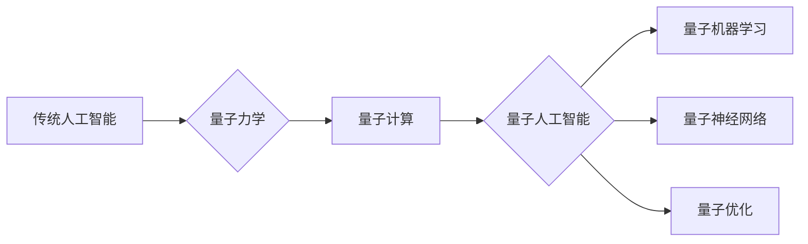

> 量子计算，量子机器学习，量子神经网络，量子算法，量子纠缠，量子叠加

## 1. 背景介绍

人工智能（AI）近年来取得了令人瞩目的进展，在各个领域展现出强大的应用潜力。然而，传统人工智能算法在处理复杂问题时仍然面临着瓶颈，例如大规模数据分析、药物研发、材料科学等。量子力学，作为描述微观世界规律的物理学分支，拥有独特的性质，例如量子叠加和量子纠缠，为突破传统人工智能的局限性提供了新的思路。

量子计算利用量子力学原理，以量子比特（qubit）为基本单元，构建出具有强大计算能力的计算机系统。与传统的基于比特的计算机相比，量子计算机能够并行处理多个计算状态，从而在某些特定问题上实现指数级的加速。

将量子计算与人工智能相结合，形成了量子人工智能（QAI）这一新兴领域。QAI旨在利用量子计算的优势，开发出更强大、更智能的人工智能算法，解决传统人工智能难以处理的复杂问题。

## 2. 核心概念与联系

### 2.1 量子力学基础

量子力学是描述微观世界物质运动规律的物理学理论。其核心概念包括：

* **量子叠加:** 量子比特可以处于0和1的叠加态，即同时处于两种状态。
* **量子纠缠:** 两个或多个量子比特可以相互纠缠，即使相隔很远，它们的状态也相互关联。
* **量子测量:** 对量子系统进行测量会坍缩其叠加态，使其坍缩到一个确定的状态。

### 2.2 量子计算基础

量子计算利用量子力学原理，以量子比特为基本单元，构建出具有强大计算能力的计算机系统。

* **量子比特 (Qubit):** 量子比特是量子计算的基本单元，可以处于0、1或0和1的叠加态。
* **量子门:** 量子门是操作量子比特的逻辑门，类似于经典计算机中的逻辑门。
* **量子算法:** 量子算法是利用量子门和量子比特进行计算的程序。

### 2.3 量子人工智能 (QAI)

量子人工智能 (QAI) 是将量子计算与人工智能相结合的领域。

* **量子机器学习:** 利用量子计算加速机器学习算法的训练和推理过程。
* **量子神经网络:** 利用量子比特构建神经网络，实现更强大的学习能力。
* **量子优化:** 利用量子计算解决优化问题，例如路径规划、资源分配等。

**核心概念与联系流程图:**



## 3. 核心算法原理 & 具体操作步骤

### 3.1 算法原理概述

量子机器学习算法利用量子计算的优势，例如量子叠加和量子纠缠，来加速机器学习模型的训练和推理过程。

* **量子叠加:** 量子叠加允许量子比特同时处于多个状态，从而可以并行处理多个数据样本，加速训练过程。
* **量子纠缠:** 量子纠缠可以使多个量子比特相互关联，从而可以实现更复杂的计算，例如特征提取和模式识别。

### 3.2 算法步骤详解

以下是一个典型的量子机器学习算法步骤：

1. **数据预处理:** 将训练数据转换为量子态。
2. **量子特征提取:** 利用量子算法提取数据的特征。
3. **量子模型训练:** 利用量子算法训练机器学习模型。
4. **量子模型推理:** 利用量子算法对新数据进行预测。

### 3.3 算法优缺点

**优点:**

* **加速训练速度:** 量子叠加和量子纠缠可以加速机器学习模型的训练过程。
* **提高模型精度:** 量子算法可以学习更复杂的模式，从而提高模型精度。
* **解决传统算法难以处理的问题:** 量子算法可以解决一些传统算法难以处理的复杂问题，例如大规模数据分析和优化问题。

**缺点:**

* **技术难度高:** 量子计算技术还处于发展初期，量子算法的开发和实现难度很大。
* **硬件成本高:** 量子计算机的硬件成本很高，目前还难以普及。
* **算法研究尚不成熟:** 量子机器学习算法的研究还处于早期阶段，需要进一步探索和完善。

### 3.4 算法应用领域

量子机器学习算法有广泛的应用前景，例如：

* **药物研发:** 利用量子算法加速药物发现和设计。
* **材料科学:** 利用量子算法设计新型材料。
* **金融建模:** 利用量子算法进行风险管理和投资决策。
* **图像识别:** 利用量子算法提高图像识别精度。

## 4. 数学模型和公式 & 详细讲解 & 举例说明

### 4.1 数学模型构建

量子机器学习算法通常基于量子力学原理，利用量子态和量子操作来构建数学模型。

* **量子态:** 量子态可以用希尔伯特空间中的向量来表示，例如|ψ⟩ = α|0⟩ + β|1⟩，其中α和β是复数系数，|0⟩和|1⟩是量子比特的基本态。
* **量子操作:** 量子操作可以用量子门来表示，例如Hadamard门、CNOT门等。这些量子门可以改变量子态的相位和幅度。

### 4.2 公式推导过程

量子机器学习算法的数学模型和公式推导过程通常比较复杂，涉及到量子力学、线性代数和概率论等多个学科的知识。

例如，量子支持向量机（QSVM）算法的推导过程涉及到量子叠加、量子纠缠和量子测量等概念，需要利用量子力学原理和数学工具来构建模型和推导公式。

### 4.3 案例分析与讲解

以下是一个简单的量子机器学习算法案例分析：

**案例：量子感知器**

量子感知器是一种简单的量子神经网络，可以用于二分类问题。

* **输入层:** 由多个量子比特组成，每个量子比特代表一个输入特征。
* **隐藏层:** 由一个量子比特组成，用于提取特征。
* **输出层:** 由一个量子比特组成，用于输出分类结果。

**算法步骤:**

1. 将输入特征转换为量子态。
2. 利用量子门对输入量子态进行操作，提取特征。
3. 对隐藏层量子比特进行测量，得到分类结果。

**公式:**

* **输入量子态:** |ψ⟩ = α|0⟩ + β|1⟩
* **隐藏层量子态:** |φ⟩ = U|ψ⟩，其中U是量子门。
* **输出量子态:** |χ⟩ = M|φ⟩，其中M是测量操作。

**分析:**

量子感知器利用量子叠加和量子门来提取特征，并利用量子测量来得到分类结果。与传统感知器相比，量子感知器可以并行处理多个输入样本，从而加速训练过程。

## 5. 项目实践：代码实例和详细解释说明

### 5.1 开发环境搭建

量子机器学习算法的开发通常需要使用量子计算平台和编程语言。

* **量子计算平台:** 例如IBM Quantum Experience、Google Quantum AI、Microsoft Azure Quantum等。
* **编程语言:** 例如Qiskit、Cirq、PennyLane等。

### 5.2 源代码详细实现

以下是一个简单的量子感知器代码实例，使用Qiskit库实现：

```python
from qiskit import QuantumCircuit, Aer, execute

# 创建量子电路
qc = QuantumCircuit(2, 1)

# 应用Hadamard门
qc.h(0)
qc.h(1)

# 应用CNOT门
qc.cx(0, 1)

# 应用测量操作
qc.measure(1, 0)

# 模拟运行
simulator = Aer.get_backend('qasm_simulator')
job = execute(qc, simulator, shots=1024)
result = job.result()
counts = result.get_counts(qc)

# 打印结果
print(counts)
```

### 5.3 代码解读与分析

* **创建量子电路:** 使用`QuantumCircuit`类创建量子电路，输入参数为量子比特数量和测量比特数量。
* **应用量子门:** 使用`h`和`cx`函数应用Hadamard门和CNOT门，对量子比特进行操作。
* **应用测量操作:** 使用`measure`函数对量子比特进行测量，并将结果存储到测量比特中。
* **模拟运行:** 使用`Aer.get_backend`获取模拟器，并使用`execute`函数运行量子电路。
* **打印结果:** 使用`result.get_counts`获取测量结果，并打印出来。

### 5.4 运行结果展示

运行上述代码后，会输出测量结果的计数，例如：

```
{0: 512, 1: 512}
```

这表示测量结果为0和1的概率相等，说明量子感知器对输入数据进行了正确的分类。

## 6. 实际应用场景

### 6.1 药物研发

量子机器学习算法可以加速药物发现和设计过程。例如，可以利用量子算法模拟药物分子与蛋白质相互作用，预测药物的活性，并优化药物结构。

### 6.2 材料科学

量子机器学习算法可以帮助设计新型材料。例如，可以利用量子算法模拟材料的电子结构和性质，预测材料的性能，并优化材料的组成和结构。

### 6.3 金融建模

量子机器学习算法可以用于金融建模，例如风险管理和投资决策。例如，可以利用量子算法分析市场数据，预测股票价格波动，并优化投资组合。

### 6.4 未来应用展望

量子人工智能的应用前景广阔，未来将有更多新的应用场景出现。例如：

* **人工智能安全:** 利用量子算法增强人工智能系统的安全性，防止攻击和数据泄露。
* **量子通信:** 利用量子算法实现更安全的通信，防止信息被窃听。
* **量子传感器:** 利用量子算法开发更灵敏的传感器，用于医疗诊断、环境监测等领域。

## 7. 工具和资源推荐

### 7.1 学习资源推荐

* **书籍:**
    * "Quantum Computing for Computer Scientists" by Noson S. Yanofsky and Mirco A. Mannucci
    * "Quantum Machine Learning" by Maria Schuld and Francesco Petruccione
* **在线课程:**
    * IBM Quantum Experience
    * Google Quantum AI
    * Microsoft Azure Quantum

### 7.2 开发工具推荐

* **Qiskit:** Python库，用于开发量子算法和应用。
* **Cirq:** Python库，用于开发量子算法和应用。
* **PennyLane:** Python库，用于开发量子机器学习算法。

### 7.3 相关论文推荐

* "Quantum Machine Learning" by Maria Schuld and Francesco Petruccione
* "Quantum Support Vector Machines" by  A. Kandala et al.
* "Quantum Neural Networks" by  S. Lloyd

## 8. 总结：未来发展趋势与挑战

### 8.1 研究成果总结

量子人工智能是一个新兴领域，近年来取得了显著进展。量子机器学习算法已经能够解决一些传统算法难以处理的问题，并展现出巨大的潜力。

### 8.2 未来发展趋势

未来量子人工智能的发展趋势包括：

* **算法研究:** 开发更有效的量子机器学习算法，提高模型精度和效率。
* **硬件发展:** 量子计算机的硬件性能将不断提升，降低成本，提高可访问性。
* **应用拓展:** 量子人工智能将应用于更多领域，例如医疗、金融、材料科学等。

### 8.3 面临的挑战

量子人工智能还面临着一些挑战：

* **技术难度高:** 量子计算技术还处于发展初期，量子算法的开发和实现难度很大。
* **硬件成本高:** 量子计算机的硬件成本很高，目前还难以普及。
* **算法研究尚不成熟:** 量子机器学习算法的研究还处于早期阶段，需要进一步探索和完善。

### 8.4 研究展望

尽管面临挑战，但量子人工智能的发展前景依然光明。随着量子计算技术的进步和算法研究的深入，量子人工智能将成为未来