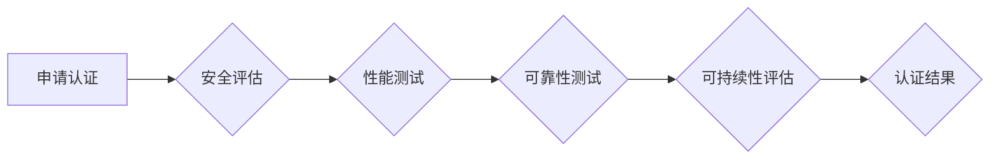

> AI大模型、数据中心、认证考试、模型部署、安全保障、性能优化、可持续发展

## 1. 背景介绍

随着人工智能技术的飞速发展，大规模人工智能模型（AI大模型）在各个领域展现出强大的应用潜力，例如自然语言处理、计算机视觉、药物研发等。然而，将这些模型从实验室部署到实际应用场景中，面临着诸多挑战，其中之一就是如何建立一个安全、高效、可持续的AI大模型应用数据中心。

AI大模型应用数据中心是一个专门用于部署、管理和运行AI大模型的平台，它需要具备以下关键特性：

* **高性能计算能力:** AI大模型训练和推理都需要大量的计算资源，数据中心需要配备强大的GPU集群和高速网络来满足需求。
* **海量存储能力:** AI大模型本身体积庞大，训练数据也需要存储在数据中心，因此需要具备海量存储空间和高效的数据访问机制。
* **安全可靠性:** AI大模型数据和模型本身都具有重要价值，需要采取严格的安全措施来防止数据泄露和模型攻击。
* **可扩展性和灵活性:** 随着业务发展和模型更新，数据中心需要具备可扩展性和灵活性，能够根据需求动态调整资源配置。
* **可持续发展:** 数据中心需要采用节能环保的技术和方案，降低能源消耗和碳排放。

为了确保AI大模型应用数据中心的安全性、可靠性和高效性，需要建立一套完善的认证体系。

## 2. 核心概念与联系

**2.1 AI大模型应用数据中心架构**

AI大模型应用数据中心通常采用分层架构，主要包括以下几个层级：

* **基础设施层:** 包括服务器、存储、网络等硬件资源，以及操作系统、虚拟化技术等软件基础设施。
* **平台层:** 提供模型训练、推理、管理等功能的软件平台，例如TensorFlow、PyTorch、Kubernetes等。
* **应用层:** 运行具体的AI应用，例如图像识别、自然语言处理等。

**2.2 认证体系核心概念**

* **安全认证:** 确保数据中心访问权限的控制和数据安全，防止未授权访问和数据泄露。
* **性能认证:** 评估数据中心的计算能力、存储性能和网络带宽等指标，确保能够满足AI模型的运行需求。
* **可靠性认证:** 评估数据中心的稳定性、可用性和容灾能力，确保模型能够持续稳定运行。
* **可持续性认证:** 评估数据中心的能源效率和环境影响，确保其符合可持续发展理念。

**2.3 认证体系流程**



## 3. 核心算法原理 & 具体操作步骤

**3.1 算法原理概述**

AI大模型应用数据中心的认证考试通常会涉及到以下几个核心算法原理：

* **加密算法:** 用于保护数据中心访问权限和数据安全，例如AES、RSA等。
* **身份验证算法:** 用于验证用户身份，例如密码验证、多因素认证等。
* **性能测试算法:** 用于评估数据中心的计算能力、存储性能和网络带宽等指标，例如吞吐量测试、延迟测试等。
* **可靠性测试算法:** 用于评估数据中心的稳定性、可用性和容灾能力，例如故障注入测试、负载测试等。
* **可持续性评估算法:** 用于评估数据中心的能源效率和环境影响，例如PUE指标计算等。

**3.2 算法步骤详解**

* **加密算法:**

    1. 选择合适的加密算法和密钥长度。
    2. 对敏感数据进行加密，例如用户密码、模型参数等。
    3. 在数据传输和存储过程中使用加密算法保护数据安全。

* **身份验证算法:**

    1. 用户提供身份信息，例如用户名、密码等。
    2. 系统使用身份验证算法验证用户身份，例如密码哈希比较、多因素认证等。
    3. 如果验证成功，系统授予用户相应的访问权限。

* **性能测试算法:**

    1. 设计测试用例，模拟实际应用场景下的数据访问和计算需求。
    2. 使用性能测试工具对数据中心进行测试，例如JMeter、LoadRunner等。
    3. 收集测试结果，分析数据中心性能指标，例如吞吐量、延迟、资源利用率等。

* **可靠性测试算法:**

    1. 设计故障注入测试用例，模拟硬件故障、软件故障等情况。
    2. 使用可靠性测试工具对数据中心进行测试，例如Chaos Monkey、Gremlin等。
    3. 收集测试结果，分析数据中心的故障恢复能力、容灾能力等。

* **可持续性评估算法:**

    1. 测量数据中心的能源消耗、碳排放等指标。
    2. 使用可持续性评估算法计算数据中心的PUE指标等。
    3. 分析数据中心的能源效率和环境影响，提出节能减排方案。

**3.3 算法优缺点**

* **加密算法:** 优点是能够有效保护数据安全，缺点是计算复杂度较高，可能会影响性能。
* **身份验证算法:** 优点是能够验证用户身份，防止未授权访问，缺点是需要用户配合，例如输入密码等。
* **性能测试算法:** 优点是能够评估数据中心的性能指标，帮助优化资源配置，缺点是需要专业的测试工具和经验。
* **可靠性测试算法:** 优点是能够评估数据中心的故障恢复能力，帮助提高系统稳定性，缺点是需要模拟各种故障场景，测试成本较高。
* **可持续性评估算法:** 优点是能够评估数据中心的能源效率和环境影响，帮助实现可持续发展，缺点是需要收集大量数据，计算复杂度较高。

**3.4 算法应用领域**

* **安全认证:** 用于保护数据中心访问权限和数据安全，例如银行、医疗机构等敏感数据存储系统。
* **性能优化:** 用于评估数据中心的性能指标，帮助优化资源配置，例如电商平台、游戏服务器等高性能计算系统。
* **可靠性保障:** 用于评估数据中心的故障恢复能力，帮助提高系统稳定性，例如金融交易系统、电力控制系统等关键基础设施。
* **可持续发展:** 用于评估数据中心的能源效率和环境影响，帮助实现可持续发展，例如云计算平台、数据中心集群等大型能源消耗系统。

## 4. 数学模型和公式 & 详细讲解 & 举例说明

**4.1 数学模型构建**

AI大模型应用数据中心的认证考试通常会涉及到以下几个数学模型：

* **安全模型:** 用于描述数据中心的安全威胁和防御机制，例如访问控制模型、数据加密模型等。
* **性能模型:** 用于描述数据中心的计算能力、存储性能和网络带宽等指标，例如吞吐量模型、延迟模型等。
* **可靠性模型:** 用于描述数据中心的故障发生概率和恢复时间等指标，例如故障树模型、可靠性方程等。
* **可持续性模型:** 用于描述数据中心的能源消耗和碳排放等指标，例如PUE模型、碳足迹模型等。

**4.2 公式推导过程**

* **安全模型:**

    * 访问控制模型: 
        * $A = \{u_1, u_2, ..., u_n\}$: 用户集合
        * $R = \{r_1, r_2, ..., r_m\}$: 资源集合
        * $P = \{p_{ij}\}$: 访问权限矩阵，$p_{ij} = 1$表示用户$u_i$可以访问资源$r_j$，否则为0。
        * 安全策略: $S = \{s_1, s_2, ..., s_k\}$，其中$s_i$表示一个访问控制规则。
    * 数据加密模型:
        * $E_k(m)$: 使用密钥$k$对明文$m$进行加密，得到密文$c$。
        * $D_k(c)$: 使用密钥$k$对密文$c$进行解密，得到明文$m$。

* **性能模型:**

    * 吞吐量模型: $T = \frac{N}{t}$，其中$N$表示处理的数据量，$t$表示处理时间。
    * 延迟模型: $L = t - r$，其中$t$表示请求处理时间，$r$表示响应时间。

* **可靠性模型:**

    * 故障树模型: 用于分析系统故障的潜在原因和发生概率。
    * 可靠性方程: $R(t) = \prod_{i=1}^{n} (1 - F_i(t))$，其中$R(t)$表示系统在时间$t$内的可靠性，$F_i(t)$表示第$i$个组件在时间$t$内的故障概率。

* **可持续性模型:**

    * PUE模型: $PUE = \frac{P_{total}}{P_{IT}}$，其中$P_{total}$表示数据中心总功耗，$P_{IT}$表示IT设备功耗。

**4.3 案例分析与讲解**

* **安全模型案例:**

    * 银行数据中心需要保护用户账户信息和交易数据安全。可以使用访问控制模型和数据加密模型来实现。
    * 访问控制模型可以限制不同用户对不同资源的访问权限，例如只有管理员才能访问数据库，普通用户只能访问自己的账户信息。
    * 数据加密模型可以对用户账户信息和交易数据进行加密，防止未授权访问。

* **性能模型案例:**

    * 电商平台需要处理大量的用户访问请求，需要评估数据中心的吞吐量和延迟性能。
    * 可以使用吞吐量模型和延迟模型来评估数据中心的性能，并根据结果优化资源配置。
    * 例如，如果数据中心的吞吐量不足，可以增加服务器数量或升级网络带宽。

* **可靠性模型案例:**

    * 电力控制系统需要保证高可靠性，防止故障导致停电。
    * 可以使用故障树模型和可靠性方程来分析系统故障的潜在原因和发生概率，并采取措施提高系统可靠性。
    * 例如，可以采用冗余备份和故障转移机制，确保系统在部分组件故障时仍然能够正常运行。

* **可持续性模型案例:**

    * 云计算平台需要降低能源消耗和碳排放，实现可持续发展。
    * 可以使用PUE模型和碳足迹模型来评估数据中心的能源效率和环境影响，并提出节能减排方案。
    * 例如，可以采用高效的服务器和空调设备，优化数据中心布局，减少能源浪费。

## 5. 项目实践：代码实例和详细解释说明

**5.1 开发环境搭建**

* 操作系统: Ubuntu 20.04 LTS
* 虚拟机: VirtualBox
* 软件环境: Python 3.8, TensorFlow 2.0, Jupyter Notebook

**5.2 源代码详细实现**

```python
# 性能测试代码示例

import time
import numpy as np

# 定义一个简单的模型
def model(x):
    return np.dot(x, np.random.rand(10))

# 生成测试数据
x = np.random.rand(10000, 10)

# 计时开始
start_time = time.time()

# 模型推理
for i in range(1000):
    model(x)

# 计时结束
end_time = time.time()

# 计算吞吐量
throughput = 1000 / (end_time - start_time)

# 打印结果
print(f"吞吐量: {throughput} samples/second")
```

**5.3 代码解读与分析**

* 该代码示例定义了一个简单的模型，并使用循环进行1000次推理。
* 使用`time.time()`函数记录开始和结束时间，计算推理时间。
* 吞吐量计算公式为：吞吐量 = 样本数量 / 推理时间。

**5.4 运行结果展示**

运行该代码后，会输出模型的吞吐量，例如