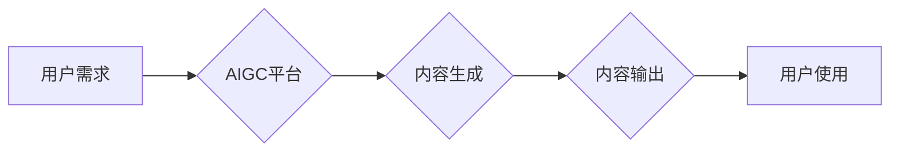

> AIGC, 商业模式, 创业, 技术趋势, 应用场景, 伦理问题

## 1. 背景介绍

近年来，人工智能（AI）技术突飞猛进，特别是生成式人工智能（AIGC）的兴起，为各行各业带来了前所未有的机遇。AIGC能够自动生成文本、图像、音频、视频等多种内容，打破了传统内容创作的壁垒，极大地降低了内容生产成本，并激发了人们对创意和创新内容的渴望。

AIGC创业热潮随之而来，涌现出许多利用AIGC技术开发新产品的创业公司。从文本生成工具到图像创作平台，从代码生成器到音乐作曲软件，AIGC应用场景日益广泛。然而，随着创业热潮的升温，也逐渐暴露了一些问题，例如商业模式的探索、伦理风险的控制、技术壁垒的突破等。

## 2. 核心概念与联系

**2.1 AIGC 的定义与特点**

AIGC是指利用人工智能技术，自动生成各种新内容的系统。其核心特点包括：

* **自动生成：** AIGC系统能够根据输入的指令或数据，自动生成新的文本、图像、音频、视频等内容。
* **创意性：** AIGC系统能够根据训练数据学习创作规律，并生成具有创意和原创性的内容。
* **多样性：** AIGC系统能够生成多种类型的内容，包括文本、图像、音频、视频等。
* **效率性：** AIGC系统能够大幅提高内容生产效率，降低成本。

**2.2 AIGC 与传统内容创作的对比**

传统内容创作依赖于人类的创意和劳动，而AIGC则利用人工智能技术，自动生成内容。两者在以下方面存在显著差异：

| 特征 | 传统内容创作 | AIGC |
|---|---|---|
| 内容生成方式 | 人类创意和劳动 | 人工智能算法 |
| 效率 | 低 | 高 |
| 成本 | 高 | 低 |
| 创意性 | 高 | 可达传统水平 |
| 质量 | 依赖于创作者水平 | 依赖于算法训练数据和模型 |

**2.3 AIGC 商业模式的探索**

AIGC创业公司采用多种商业模式，包括：

* **订阅制：** 用户付费订阅AIGC平台，获得使用AIGC工具和服务的权限。
* **按需付费：** 用户根据使用量付费，例如每生成一篇文本或一张图像收费。
* **授权许可：** AIGC平台将生成的版权授权给用户，用户可以商业化使用这些内容。
* **数据服务：** AIGC平台收集用户生成的内容数据，并将其用于训练模型或提供数据服务。

**2.4 AIGC 创业的挑战与机遇**

AIGC创业面临着许多挑战，例如：

* **技术壁垒：** AIGC技术门槛较高，需要强大的算法和计算能力。
* **商业模式创新：** AIGC商业模式尚不成熟，需要不断探索和创新。
* **伦理风险控制：** AIGC技术可能带来一些伦理风险，例如内容虚假、版权侵权等。

然而，AIGC创业也蕴藏着巨大的机遇：

* **市场需求旺盛：** AIGC技术能够满足人们对高质量、低成本内容的需求。
* **技术发展迅速：** AIGC技术正在快速发展，未来将带来更多创新应用。
* **行业变革：** AIGC技术将颠覆传统内容创作模式，带来新的商业模式和产业生态。

**2.5 Mermaid 流程图**



## 3. 核心算法原理 & 具体操作步骤

**3.1 算法原理概述**

AIGC的核心算法主要包括：

* **深度学习：** 深度学习算法能够从海量数据中学习复杂的模式和规律，是AIGC技术的基础。
* **自然语言处理 (NLP)：** NLP算法能够理解和生成人类语言，是文本生成AIGC的关键技术。
* **计算机视觉 (CV)：** CV算法能够理解和生成图像，是图像生成AIGC的关键技术。

**3.2 算法步骤详解**

以文本生成AIGC为例，其算法步骤可以概括为以下几个阶段：

1. **数据收集和预处理：** 收集大量文本数据，并进行清洗、格式化等预处理工作。
2. **模型训练：** 使用深度学习算法，将预处理后的文本数据训练成一个文本生成模型。
3. **文本生成：** 根据用户的输入指令或文本片段，利用训练好的模型生成新的文本内容。
4. **文本后处理：** 对生成的文本进行语法检查、格式调整等后处理工作，使其更加流畅自然。

**3.3 算法优缺点**

**优点：**

* **自动生成：** 可以自动生成大量文本内容，提高效率。
* **创意性：** 可以根据训练数据学习创作规律，生成具有创意的内容。
* **多样性：** 可以生成不同风格、不同主题的文本内容。

**缺点：**

* **依赖数据：** 算法性能依赖于训练数据的质量和数量。
* **缺乏深度理解：** 算法只能根据数据模式生成文本，缺乏对文本内容的深度理解。
* **可能生成虚假信息：** 算法可能生成与事实不符的虚假信息。

**3.4 算法应用领域**

* **内容创作：** 自动生成新闻报道、广告文案、小说、诗歌等。
* **客户服务：** 自动回复客户咨询，提供24小时在线服务。
* **教育培训：** 自动生成学习材料、练习题、个性化辅导等。
* **软件开发：** 自动生成代码、文档、测试用例等。

## 4. 数学模型和公式 & 详细讲解 & 举例说明

**4.1 数学模型构建**

AIGC算法通常基于深度学习模型，例如循环神经网络（RNN）和变分自编码器（VAE）。这些模型可以看作是复杂的数学函数，其输入是数据，输出是生成的内容。

**4.2 公式推导过程**

深度学习模型的训练过程涉及到许多数学公式，例如梯度下降算法、激活函数、损失函数等。这些公式的推导过程比较复杂，需要一定的数学基础。

**4.3 案例分析与讲解**

以文本生成为例，可以使用RNN模型生成文本。RNN模型的输出是一个概率分布，表示每个词出现的概率。训练过程中，模型会根据输入文本和目标文本之间的差异，调整模型参数，使得输出概率分布更加接近目标文本的分布。

**举例说明：**

假设输入文本为“今天天气”，目标文本为“今天天气很好”。RNN模型会根据输入文本和目标文本之间的差异，调整模型参数，使得输出概率分布更加接近“今天天气很好”的分布。

## 5. 项目实践：代码实例和详细解释说明

**5.1 开发环境搭建**

AIGC项目开发通常需要使用Python语言和相关的深度学习框架，例如TensorFlow或PyTorch。

**5.2 源代码详细实现**

以下是一个简单的文本生成AIGC代码示例，使用TensorFlow框架实现：

```python
import tensorflow as tf

# 定义RNN模型
model = tf.keras.Sequential([
    tf.keras.layers.Embedding(input_dim=vocab_size, output_dim=embedding_dim),
    tf.keras.layers.LSTM(units=lstm_units),
    tf.keras.layers.Dense(units=vocab_size, activation='softmax')
])

# 编译模型
model.compile(optimizer='adam', loss='sparse_categorical_crossentropy', metrics=['accuracy'])

# 训练模型
model.fit(x_train, y_train, epochs=epochs)

# 生成文本
def generate_text(seed_text, num_words):
    for _ in range(num_words):
        # 使用模型生成下一个词
        prediction = model.predict(seed_text)
        # 选择概率最高的词
        predicted_word = tf.math.argmax(prediction).numpy()
        # 添加预测词到seed_text
        seed_text = seed_text + ' ' + str(predicted_word)
    return seed_text
```

**5.3 代码解读与分析**

代码示例中，首先定义了一个RNN模型，包含嵌入层、LSTM层和全连接层。嵌入层将词向量化，LSTM层捕捉文本序列的上下文信息，全连接层输出每个词的概率分布。

然后，使用Adam优化器和交叉熵损失函数编译模型，并使用训练数据训练模型。

最后，定义了一个`generate_text`函数，用于根据给定的种子文本生成新的文本。该函数会循环使用模型预测下一个词，并将其添加到种子文本中，直到生成指定数量的词。

**5.4 运行结果展示**

运行代码后，可以根据输入的种子文本和词数生成新的文本。例如，输入种子文本为“今天天气”，词数为10，生成的文本可能为：

```
今天天气很好今天阳光明媚今天是周末今天心情愉快今天想出去玩
```

## 6. 实际应用场景

**6.1 内容创作**

AIGC可以用于自动生成各种类型的文本内容，例如新闻报道、广告文案、小说、诗歌等。

* **新闻报道：** AIGC可以根据新闻事件数据自动生成新闻报道，提高新闻报道效率。
* **广告文案：** AIGC可以根据产品信息和目标客户特征自动生成广告文案，提高广告文案的吸引力。
* **小说创作：** AIGC可以根据用户提供的剧情梗概和人物设定自动生成小说，帮助用户完成创作。

**6.2 客户服务**

AIGC可以用于自动回复客户咨询，提供24小时在线服务。

* **聊天机器人：** AIGC可以训练出能够理解用户自然语言的聊天机器人，自动回复客户咨询，提供个性化服务。
* **客服系统：** AIGC可以用于自动处理客户常见问题，例如订单查询、退换货等，提高客服效率。

**6.3 教育培训**

AIGC可以用于自动生成学习材料、练习题、个性化辅导等。

* **学习材料生成：** AIGC可以根据课程内容自动生成学习材料，例如课件、习题等，提高学习效率。
* **个性化辅导：** AIGC可以根据学生的学习情况和需求，自动生成个性化的辅导材料，帮助学生更好地理解知识。

**6.4 其他应用场景**

* **软件开发：** AIGC可以用于自动生成代码、文档、测试用例等，提高软件开发效率。
* **音乐创作：** AIGC可以用于自动生成音乐旋律、歌词等，帮助音乐人创作新的音乐作品。
* **艺术创作：** AIGC可以用于自动生成绘画、雕塑等艺术作品，探索新的艺术形式。

**6.5 未来应用展望**

随着AIGC技术的不断发展，其应用场景将更加广泛，例如：

* **虚拟助手：** AIGC可以训练出更加智能的虚拟助手，能够理解用户的复杂指令，并提供更加个性化的服务。
* **个性化内容推荐：** AIGC可以根据用户的兴趣爱好和行为数据，自动生成个性化的内容推荐，提高用户体验。
* **跨语言沟通：** AIGC可以用于实现跨语言的实时翻译，打破语言障碍，促进全球交流。

## 7. 工具和资源推荐

**7.1 学习资源推荐**

* **书籍：**
    * 《深度学习》
    * 《自然语言处理》
    * 《机器学习》
* **在线课程：**
    * Coursera
    * edX
    * Udacity
* **开源项目：**
    * TensorFlow
    * PyTorch
    * Hugging Face

**7.2 开发工具推荐**

* **Python：** 
* **TensorFlow：** 
* **PyTorch：** 
* **Jupyter Notebook：** 

**7.3 相关论文推荐**

* **Attention Is