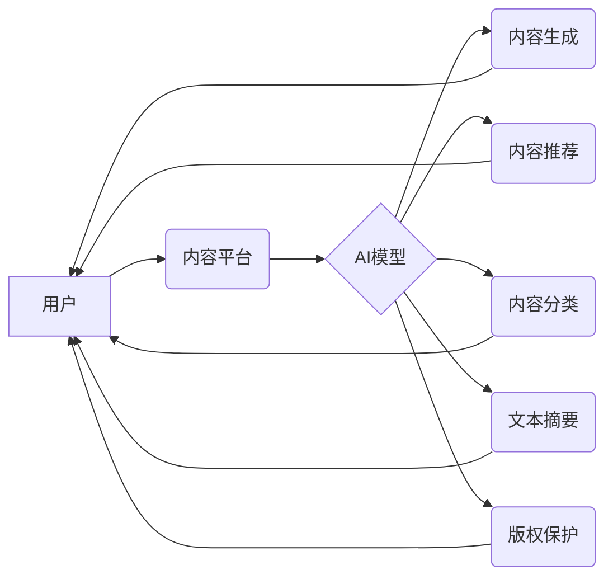

>  人工智能，出版业，自然语言处理，机器学习，内容生成，个性化推荐，版权保护，未来趋势

## 1. 背景介绍

出版业作为文化传播的重要载体，经历了漫长的发展历程。从传统的印刷出版到如今的数字出版，出版业始终在不断革新。近年来，人工智能（AI）技术突飞猛进，为出版业带来了前所未有的机遇。AI技术的应用，正在深刻地改变出版业的生产模式、内容创作方式和读者体验。

传统出版业面临着诸多挑战，例如：

* **内容创作效率低下：** 内容创作是一个耗时耗力的过程，需要大量的专业人才和时间投入。
* **市场竞争激烈：** 出版市场竞争日益激烈，新书的涌现速度快，读者选择更多，出版商面临着巨大的压力。
* **读者需求多元化：** 读者需求日益多元化，个性化内容的需求越来越高。
* **版权保护难题：** 数字出版环境下，版权保护问题更加突出。

AI技术为出版业提供了解决这些问题的有效途径。

## 2. 核心概念与联系

**2.1  人工智能（AI）**

人工智能是指模拟人类智能行为的计算机系统。AI技术涵盖了多个领域，例如机器学习、深度学习、自然语言处理等。

**2.2  自然语言处理（NLP）**

自然语言处理是指让计算机能够理解、处理和生成人类语言的技术。NLP技术是AI技术的重要组成部分，在出版业中应用广泛。

**2.3  机器学习（ML）**

机器学习是指让计算机从数据中学习，并根据学习到的知识进行预测或决策的技术。机器学习技术可以用于内容推荐、内容分类、文本摘要等出版业应用场景。

**2.4  深度学习（DL）**

深度学习是机器学习的一种高级形式，它使用多层神经网络来模拟人类大脑的学习过程。深度学习技术可以用于更复杂的出版业应用场景，例如内容生成、机器翻译等。

**2.5  出版业场景**

AI技术在出版业中的应用场景包括：

* **内容创作：** 使用AI技术生成新闻稿、小说、诗歌等内容。
* **内容推荐：** 根据读者的阅读历史和喜好，推荐合适的书籍或文章。
* **内容分类：** 自动将书籍或文章分类到不同的类别。
* **文本摘要：** 自动生成书籍或文章的摘要。
* **版权保护：** 使用AI技术检测和防止盗版行为。

**2.6  AI出版业架构**



## 3. 核心算法原理 & 具体操作步骤

### 3.1  算法原理概述

**3.1.1  生成式对抗网络（GAN）**

GAN是一种生成式模型，由两个神经网络组成：生成器和鉴别器。生成器试图生成逼真的数据，而鉴别器试图区分真实数据和生成数据。通过不断的对抗训练，生成器可以生成越来越逼真的数据。

**3.1.2  Transformer模型**

Transformer模型是一种基于注意力机制的神经网络模型，它能够处理长序列数据，并捕捉数据之间的长距离依赖关系。Transformer模型在自然语言处理领域取得了显著的成果，例如机器翻译、文本摘要、对话系统等。

### 3.2  算法步骤详解

**3.2.1  GAN算法步骤**

1. 初始化生成器和鉴别器网络。
2. 生成器生成伪造数据，鉴别器判断数据真实性。
3. 根据鉴别器的反馈，更新生成器和鉴别器的参数。
4. 重复步骤2和3，直到生成器生成的伪造数据与真实数据难以区分。

**3.2.2  Transformer模型步骤**

1. 将输入序列编码成向量表示。
2. 使用多头注意力机制捕捉数据之间的关系。
3. 使用前馈神经网络处理编码后的向量表示。
4. 将处理后的向量表示解码成输出序列。

### 3.3  算法优缺点

**3.3.1  GAN算法**

* **优点：** 可以生成逼真的数据，应用广泛。
* **缺点：** 训练过程复杂，容易陷入局部最优解。

**3.3.2  Transformer模型**

* **优点：** 能够处理长序列数据，捕捉数据之间的长距离依赖关系。
* **缺点：** 计算量大，训练成本高。

### 3.4  算法应用领域

**3.4.1  GAN算法**

* 图像生成
* 视频生成
* 语音合成
* 数据增强

**3.4.2  Transformer模型**

* 机器翻译
* 文本摘要
* 问答系统
* 对话系统

## 4. 数学模型和公式 & 详细讲解 & 举例说明

### 4.1  数学模型构建

**4.1.1  GAN模型**

GAN模型由两个神经网络组成：生成器G和鉴别器D。

* 生成器G：输入随机噪声z，输出生成数据x。
* 鉴别器D：输入数据x，输出判断数据真实性的概率p(真实|x)。

**4.1.2  Transformer模型**

Transformer模型的核心是注意力机制。注意力机制可以计算每个词与其他词之间的相关性，并根据相关性赋予不同的权重。

### 4.2  公式推导过程

**4.2.1  GAN模型损失函数**

* 生成器损失函数：L_G = -E_{z~p_z(z)}[log(D(G(z)))]
* 鉴别器损失函数：L_D = -E_{x~p_data(x)}[log(D(x))] - E_{z~p_z(z)}[log(1-D(G(z)))]

**4.2.2  Transformer模型注意力机制公式**

```
Attention(Q, K, V) = softmax(Q*K^T / sqrt(d_k)) * V
```

其中：

* Q：查询矩阵
* K：键矩阵
* V：值矩阵
* d_k：键向量的维度

### 4.3  案例分析与讲解

**4.3.1  GAN模型案例：图像生成**

使用GAN模型可以生成逼真的图像，例如人脸图像、风景图像等。

**4.3.2  Transformer模型案例：机器翻译**

使用Transformer模型可以实现高质量的机器翻译，例如将英文翻译成中文。

## 5. 项目实践：代码实例和详细解释说明

### 5.1  开发环境搭建

* Python 3.7+
* TensorFlow 2.0+
* PyTorch 1.0+
* CUDA 10.0+

### 5.2  源代码详细实现

**5.2.1  GAN模型代码示例（TensorFlow）**

```python
import tensorflow as tf

# 定义生成器网络
def generator(z):
  # ...

# 定义鉴别器网络
def discriminator(x):
  # ...

# 定义损失函数和优化器
optimizer_G = tf.keras.optimizers.Adam(learning_rate=0.0002, beta_1=0.5)
optimizer_D = tf.keras.optimizers.Adam(learning_rate=0.0002, beta_1=0.5)
loss_fn = tf.keras.losses.BinaryCrossentropy()

# 训练循环
for epoch in range(num_epochs):
  for batch in dataset:
    # ...
```

**5.2.2  Transformer模型代码示例（PyTorch）**

```python
import torch
import torch.nn as nn

# 定义Transformer模型
class Transformer(nn.Module):
  # ...

# 实例化模型
model = Transformer()

# 定义损失函数和优化器
optimizer = torch.optim.Adam(model.parameters(), lr=0.001)
loss_fn = nn.CrossEntropyLoss()

# 训练循环
for epoch in range(num_epochs):
  for batch in dataset:
    # ...
```

### 5.3  代码解读与分析

**5.3.1  GAN模型代码解读**

* 生成器网络接收随机噪声作为输入，并输出生成数据。
* 鉴别器网络接收数据作为输入，并输出判断数据真实性的概率。
* 损失函数用于衡量生成器和鉴别器的性能。
* 优化器用于更新生成器和鉴别器的参数。

**5.3.2  Transformer模型代码解读**

* Transformer模型由多个编码器和解码器层组成。
* 每个编码器和解码器层包含多头注意力机制和前馈神经网络。
* 损失函数用于衡量模型的预测结果与真实标签之间的差异。
* 优化器用于更新模型的参数。

### 5.4  运行结果展示

* GAN模型可以生成逼真的图像，例如人脸图像、风景图像等。
* Transformer模型可以实现高质量的机器翻译，例如将英文翻译成中文。

## 6. 实际应用场景

### 6.1  内容创作

* **自动生成新闻稿：** 使用AI技术自动生成新闻稿，提高新闻报道效率。
* **创作小说、诗歌等文学作品：** 使用AI技术辅助创作文学作品，激发创作灵感。
* **生成个性化内容：** 根据读者的兴趣爱好，生成个性化的新闻、文章、书籍等内容。

### 6.2  内容推荐

* **个性化推荐：** 根据读者的阅读历史和喜好，推荐合适的书籍或文章。
* **跨平台内容推荐：** 将不同平台上的内容进行整合，提供更全面的内容推荐。
* **内容发现：** 通过AI技术挖掘隐藏的热门内容，帮助读者发现新知。

### 6.3  内容分类

* **自动分类书籍：** 根据书籍内容自动分类到不同的类别，方便读者查找。
* **识别垃圾邮件：** 使用AI技术识别垃圾邮件，提高邮件收件箱的质量。
* **内容审核：** 自动审核内容，识别违规内容，保障内容安全。

### 6.4  未来应用展望

* **AI写作助手：** AI写作助手可以帮助作家进行写作，例如提供语法检查、风格建议、情节构思等。
* **虚拟出版人：** 虚拟出版人可以帮助作者完成出版流程，例如编辑、排版、印刷、发行等。
* **沉浸式阅读体验：** 使用AI技术打造沉浸式阅读体验，例如语音朗读、3D场景展示等。

## 7. 工具和资源推荐

### 7.1  学习资源推荐

* **书籍：**
    * 《深度学习》
    * 《自然语言处理》
    * 《机器学习》
* **在线课程：**
    * Coursera
    * edX
    * Udacity

### 7.2  开发工具推荐

* **TensorFlow：** 开源深度学习框架
* **PyTorch：** 开源深度学习框架
* **HuggingFace：** 提供预训练模型和工具

### 7.3  相关论文推荐

* **《Generative Adversarial Networks》**
* **《Attention Is All You Need》**
* **《BERT: Pre-training of Deep Bidirectional Transformers for Language Understanding》**

## 8. 总结：未来发展趋势与挑战

### 8.1  研究成果总结

AI技术在出版业的应用取得了显著成果，例如内容生成、内容推荐、内容分类等。

### 8.2  未来发展趋势

* **更强大的AI模型：** 未来将出现更强大的AI模型，能够生成更高质量的内容，并更好地理解读者的需求。
* **更个性化的阅读体验：** AI技术将为读者提供更个性化的阅读体验，例如定制化的内容推荐、