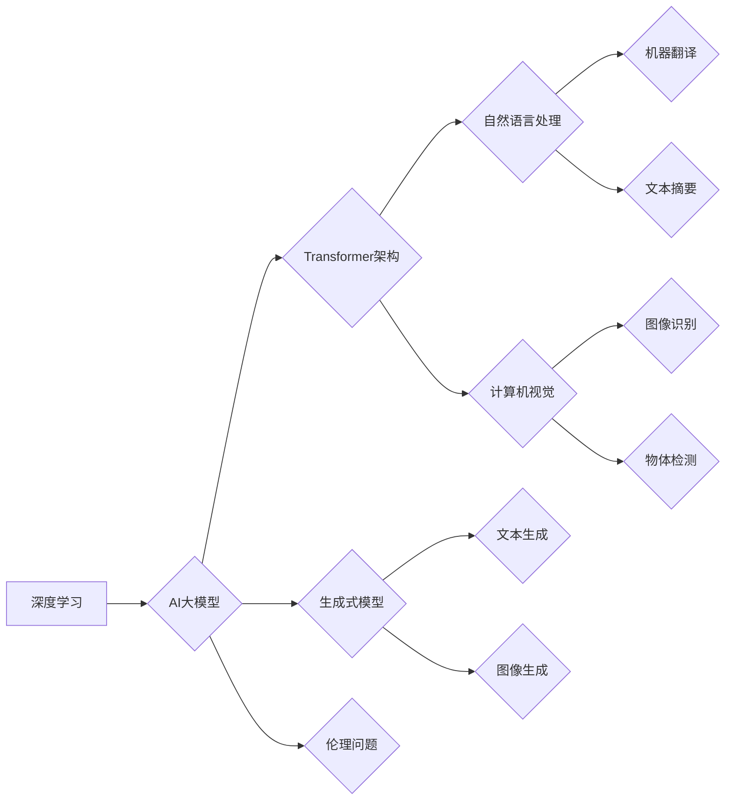

> AI大模型，深度学习，自然语言处理，计算机视觉，生成式模型，伦理问题，未来趋势

## 1. 背景介绍

近年来，人工智能（AI）技术取得了飞速发展，特别是深度学习算法的突破，使得AI大模型的规模和能力不断提升。AI大模型，是指拥有数亿甚至数十亿参数的深度学习模型，能够处理海量数据，学习复杂的模式，并展现出强大的泛化能力。这些模型在自然语言处理、计算机视觉、语音识别等领域取得了令人瞩目的成果，引发了人们对AI技术改变人类生活的期待。

然而，AI大模型距离真正改变人类生活还存在着一些距离。一方面，AI大模型的训练成本高昂，需要大量的计算资源和数据，这限制了其广泛应用。另一方面，AI大模型的解释性和可控性仍然是一个挑战，其决策过程往往难以理解，这使得人们对AI技术的信任度不高。

## 2. 核心概念与联系

**2.1  深度学习**

深度学习是机器学习的一种重要分支，它利用多层神经网络来模拟人类大脑的学习过程。深度学习模型能够从海量数据中自动学习特征，并进行复杂的模式识别和预测。

**2.2  AI大模型**

AI大模型是指拥有数亿甚至数十亿参数的深度学习模型。这些模型通过训练大量的文本、图像、音频等数据，能够掌握丰富的知识和技能，并应用于各种任务。

**2.3  Transformer架构**

Transformer是一种新型的神经网络架构，它能够有效地处理序列数据，例如文本和语音。Transformer的核心是注意力机制，它能够学习到输入序列中不同元素之间的关系，从而更好地理解上下文信息。

**2.4  生成式模型**

生成式模型能够根据训练数据生成新的数据，例如文本、图像、音频等。常见的生成式模型包括GAN、VAEs等。

**2.5  自然语言处理（NLP）**

自然语言处理是指让计算机能够理解和处理人类语言的任务。AI大模型在NLP领域取得了突破性进展，例如机器翻译、文本摘要、对话系统等。

**2.6  计算机视觉（CV）**

计算机视觉是指让计算机能够“看”和理解图像的任务。AI大模型在CV领域也取得了显著成果，例如图像识别、物体检测、图像生成等。

**2.7  伦理问题**

AI大模型的强大能力也带来了伦理问题，例如数据隐私、算法偏见、责任归属等。

**Mermaid 流程图**



## 3. 核心算法原理 & 具体操作步骤

### 3.1  算法原理概述

AI大模型的核心算法是深度学习算法，特别是Transformer架构。Transformer架构通过注意力机制能够有效地处理序列数据，学习到输入序列中不同元素之间的关系，从而更好地理解上下文信息。

### 3.2  算法步骤详解

1. **数据预处理:** 将原始数据转换为模型可以理解的格式，例如文本数据需要进行分词、词向量化等处理。
2. **模型构建:** 根据任务需求选择合适的深度学习模型架构，例如Transformer、BERT等。
3. **模型训练:** 使用训练数据训练模型，调整模型参数，使模型能够准确地完成任务。
4. **模型评估:** 使用测试数据评估模型的性能，例如准确率、召回率等指标。
5. **模型部署:** 将训练好的模型部署到实际应用场景中，例如服务器、移动设备等。

### 3.3  算法优缺点

**优点:**

* 强大的泛化能力：AI大模型能够从海量数据中学习到复杂的模式，并应用于各种任务。
* 高精度：AI大模型在许多任务上已经达到了甚至超过了人类水平的精度。
* 自动特征学习：AI大模型能够自动学习特征，无需人工特征工程。

**缺点:**

* 训练成本高昂：AI大模型的训练需要大量的计算资源和数据。
* 解释性和可控性差：AI大模型的决策过程往往难以理解，这使得人们对AI技术的信任度不高。
* 算法偏见：AI大模型的训练数据可能存在偏见，导致模型输出结果存在偏差。

### 3.4  算法应用领域

AI大模型在各个领域都有广泛的应用，例如：

* **自然语言处理:** 机器翻译、文本摘要、对话系统、问答系统、情感分析等。
* **计算机视觉:** 图像识别、物体检测、图像生成、视频分析等。
* **语音识别:** 语音转文本、语音助手、语音搜索等。
* **推荐系统:** 商品推荐、内容推荐、用户画像等。
* **医疗诊断:** 病情诊断、疾病预测、药物研发等。

## 4. 数学模型和公式 & 详细讲解 & 举例说明

### 4.1  数学模型构建

AI大模型的数学模型通常基于神经网络，它由多个层组成，每一层包含多个神经元。每个神经元接收来自上一层的输入，并通过激活函数进行处理，输出到下一层。

**4.1.1  神经网络结构**

一个典型的多层感知机（MLP）模型结构如下：

```
输入层 -> 隐藏层1 -> 隐藏层2 -> ... -> 隐藏层N -> 输出层
```

其中，输入层接收原始数据，输出层输出模型的预测结果。隐藏层用于提取数据的特征和表示。

**4.1.2  激活函数**

激活函数用于引入非线性，使神经网络能够学习复杂的模式。常见的激活函数包括ReLU、Sigmoid、Tanh等。

**4.1.3  损失函数**

损失函数用于衡量模型预测结果与真实值的差距。常见的损失函数包括均方误差（MSE）、交叉熵损失等。

### 4.2  公式推导过程

**4.2.1  前向传播**

前向传播是指将输入数据通过神经网络传递，得到最终的预测结果的过程。

**公式:**

```
y = f(W * x + b)
```

其中，

* y 是模型的预测结果
* x 是输入数据
* W 是权重矩阵
* b 是偏置向量
* f 是激活函数

**4.2.2  反向传播**

反向传播是指根据损失函数的梯度，调整模型参数的过程。

**公式:**

```
dW = ∂L/∂W
db = ∂L/∂b
```

其中，

* ∂L/∂W 是损失函数对权重矩阵的梯度
* ∂L/∂b 是损失函数对偏置向量的梯度

**4.2.3  梯度下降**

梯度下降是一种常用的优化算法，它用于更新模型参数，使损失函数最小化。

**公式:**

```
W = W - α * ∂L/∂W
b = b - α * ∂L/∂b
```

其中，

* α 是学习率

### 4.3  案例分析与讲解

**4.3.1  图像分类**

假设我们有一个图像分类任务，目标是将图像分类为不同的类别，例如猫、狗、鸟等。我们可以使用卷积神经网络（CNN）来解决这个问题。CNN能够学习图像的特征，例如边缘、纹理等，并将其用于分类。

**4.3.2  机器翻译**

机器翻译是指将一种语言的文本翻译成另一种语言的文本。我们可以使用Transformer架构的模型，例如BERT、GPT-3等，来进行机器翻译。这些模型能够学习语言的语法和语义，并生成流畅自然的翻译结果。

## 5. 项目实践：代码实例和详细解释说明

### 5.1  开发环境搭建

* **操作系统:** Linux/macOS
* **编程语言:** Python
* **深度学习框架:** TensorFlow/PyTorch
* **其他工具:** Git、Jupyter Notebook等

### 5.2  源代码详细实现

```python
# 使用TensorFlow构建一个简单的多层感知机模型
import tensorflow as tf

# 定义模型输入层
input_layer = tf.keras.Input(shape=(10,))

# 定义隐藏层
hidden_layer1 = tf.keras.layers.Dense(64, activation='relu')(input_layer)
hidden_layer2 = tf.keras.layers.Dense(32, activation='relu')(hidden_layer1)

# 定义输出层
output_layer = tf.keras.layers.Dense(10, activation='softmax')(hidden_layer2)

# 创建模型
model = tf.keras.Model(inputs=input_layer, outputs=output_layer)

# 编译模型
model.compile(optimizer='adam',
              loss='sparse_categorical_crossentropy',
              metrics=['accuracy'])

# 训练模型
model.fit(x_train, y_train, epochs=10)

# 评估模型
loss, accuracy = model.evaluate(x_test, y_test)
print('Loss:', loss)
print('Accuracy:', accuracy)
```

### 5.3  代码解读与分析

* **输入层:** 定义模型的输入形状，例如10个特征。
* **隐藏层:** 使用全连接层（Dense）构建隐藏层，并使用ReLU激活函数。
* **输出层:** 使用全连接层构建输出层，并使用softmax激活函数，用于多分类任务。
* **模型编译:** 使用Adam优化器、交叉熵损失函数和准确率作为评估指标。
* **模型训练:** 使用训练数据训练模型，设置训练轮数（epochs）。
* **模型评估:** 使用测试数据评估模型的性能，输出损失值和准确率。

### 5.4  运行结果展示

训练完成后，可以查看模型的损失值和准确率，并使用模型对新的数据进行预测。

## 6. 实际应用场景

### 6.1  自然语言处理

* **机器翻译:** Google Translate、DeepL等翻译工具使用AI大模型进行机器翻译，能够实现多种语言之间的快速准确翻译。
* **文本摘要:** AI大模型能够自动生成文本摘要，例如新闻文章、会议记录等，节省时间和精力。
* **对话系统:** AI大模型可以构建智能对话系统，例如聊天机器人、虚拟助手等，能够与人类进行自然流畅的对话。

### 6.2  计算机视觉

* **图像识别:** AI大模型能够识别图像中的物体、场景、人物等，应用于图像搜索、物体检测、医疗诊断等领域。
* **图像生成:** AI大模型能够生成逼真的图像，例如人脸、风景、物体等，应用于艺术创作、游戏开发等领域。
* **视频分析:** AI大模型能够分析视频内容，例如识别动作、跟踪物体、理解场景等，应用于安防监控、体育赛事分析等领域。

### 6.3  语音识别

* **语音转文本:** AI大模型能够将语音转换为文本，应用于语音助手、听写软件、语音搜索等领域。
* **语音合成:** AI大模型能够将文本转换为语音，应用于语音导航、语音播报、虚拟助手等领域。

### 6.4  未来应用展望

AI大模型的应用前景广阔，未来将应用于更多领域，例如：

* **个性化教育:** AI大模型能够根据学生的学习情况提供个性化的学习方案。
* **精准医疗:** AI大模型能够辅助医生诊断疾病、预测病情、制定治疗方案。
* **自动驾驶:** AI大模型能够帮助车辆感知周围环境、做出决策、自动驾驶。

## 7. 工具和资源推荐

### 7.1  学习资源推荐

* **书籍:**
    * 《深度学习》
    * 《动手学深度学习》
    * 《自然语言处理》
* **在线课程:**
    * Coursera
    * edX
    