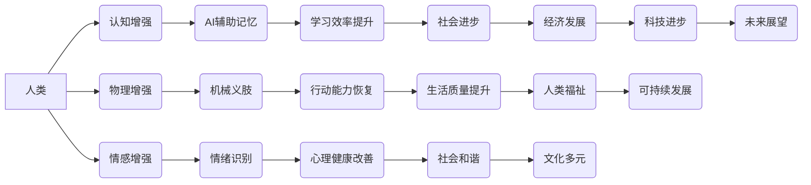

> 人工智能，人类增强，道德，社会影响，伦理，可持续发展，未来趋势

## 1. 背景介绍

人工智能（AI）正以惊人的速度发展，其影响力正在深刻地改变着我们的世界。从自动驾驶汽车到医疗诊断，从个性化教育到金融服务，AI技术正在各个领域展现出强大的潜力。然而，随着AI技术的进步，一个新的议题逐渐浮出水面：AI时代的人类增强。

人类增强是指利用AI技术提升人类能力，使其超越自然界限制的领域。这包括增强人类的认知能力、物理能力、情感能力等多个方面。例如，脑机接口技术可以帮助残疾人恢复行动能力，增强现实技术可以为人们提供更丰富的交互体验，基因编辑技术可以帮助人类战胜疾病，延长寿命。

人类增强技术蕴含着巨大的机遇和挑战。它有潜力解决人类面临的诸多难题，例如疾病、贫困、环境污染等。但同时，它也引发了广泛的伦理和社会担忧。例如，人类增强技术可能会加剧社会不平等，引发新的安全风险，甚至威胁到人类自身的本性。

## 2. 核心概念与联系

**2.1 人类增强类型**

人类增强可以分为以下几类：

* **认知增强:** 提升人类的记忆力、学习能力、创造力等认知功能。例如，使用AI辅助记忆、学习新知识、解决复杂问题。
* **物理增强:** 增强人类的体力、耐力、速度等物理能力。例如，使用机械义肢、增强型运动装备等。
* **情感增强:** 提升人类的情感感知、表达、调节能力。例如，使用AI技术帮助人们识别和理解情绪，缓解压力和焦虑。

**2.2 人类增强技术**

人类增强技术涉及多个领域，包括：

* **生物技术:** 基因编辑、脑机接口、生物打印等。
* **信息技术:** 人工智能、虚拟现实、增强现实等。
* **纳米技术:** 纳米机器人、纳米材料等。

**2.3 人类增强与社会影响**

人类增强技术将对社会产生深远的影响，包括：

* **经济:** 提高生产效率、创造新的就业机会、加剧社会不平等。
* **社会:** 改变人际关系、影响社会结构、引发新的伦理问题。
* **文化:** 改变人类的认知方式、审美观、价值观。

**2.4 核心概念关系图**



## 3. 核心算法原理 & 具体操作步骤

**3.1 算法原理概述**

人类增强算法通常基于机器学习、深度学习等人工智能技术。这些算法能够从海量数据中学习模式，并根据学习到的知识进行预测、决策或控制。例如，用于认知增强的算法可以学习人类的学习模式，并提供个性化的学习建议；用于物理增强的算法可以学习人类的运动模式，并控制机械义肢进行精确的动作。

**3.2 算法步骤详解**

1. **数据收集:** 收集大量相关数据，例如人类的脑电波、运动轨迹、情感表达等。
2. **数据预处理:** 对收集到的数据进行清洗、转换、特征提取等处理，使其适合算法训练。
3. **模型训练:** 选择合适的算法模型，并利用训练数据进行模型训练。
4. **模型评估:** 使用测试数据评估模型的性能，并进行模型调优。
5. **模型部署:** 将训练好的模型部署到实际应用场景中，例如脑机接口设备、增强现实眼镜等。

**3.3 算法优缺点**

* **优点:** 能够学习人类的复杂行为模式，并提供个性化的增强体验。
* **缺点:** 需要大量的数据进行训练，训练过程耗时且资源消耗大。

**3.4 算法应用领域**

* **医疗保健:** 辅助诊断、治疗疾病、恢复功能。
* **教育:** 个性化学习、提升学习效率。
* **娱乐:** 增强现实游戏、虚拟体验。
* **工业:** 自动化生产、远程操作。

## 4. 数学模型和公式 & 详细讲解 & 举例说明

**4.1 数学模型构建**

人类增强算法通常基于数学模型进行构建。例如，用于认知增强的算法可以利用神经网络模型模拟人类大脑的学习过程。神经网络模型由多个层级的神经元组成，每个神经元接收来自前一层神经元的输入，并根据权重进行计算，最终输出到下一层神经元。

**4.2 公式推导过程**

神经网络模型的训练过程基于梯度下降算法。梯度下降算法的目标是找到一个能够使模型预测结果与真实结果误差最小的参数值。

**损失函数:** 用于衡量模型预测结果与真实结果之间的误差。常见的损失函数包括均方误差（MSE）、交叉熵损失（Cross-Entropy Loss）等。

**梯度:** 损失函数对模型参数的偏导数，表示参数变化对损失函数的影响。

**更新规则:** 根据梯度信息，更新模型参数，使损失函数逐渐减小。

**4.3 案例分析与讲解**

例如，假设我们训练一个神经网络模型用于识别手写数字。训练数据包括大量手写数字的图像和对应的标签。模型的输入是图像像素值，输出是数字的类别。

训练过程中，模型会根据输入图像预测数字类别，并计算预测结果与真实标签之间的误差。然后，根据误差信息，更新模型参数，使模型预测结果越来越接近真实标签。

## 5. 项目实践：代码实例和详细解释说明

**5.1 开发环境搭建**

* 操作系统: Ubuntu 20.04
* Python 版本: 3.8
* 深度学习框架: TensorFlow 2.0

**5.2 源代码详细实现**

```python
import tensorflow as tf

# 定义神经网络模型
model = tf.keras.models.Sequential([
    tf.keras.layers.Flatten(input_shape=(28, 28)),
    tf.keras.layers.Dense(128, activation='relu'),
    tf.keras.layers.Dropout(0.2),
    tf.keras.layers.Dense(10, activation='softmax')
])

# 编译模型
model.compile(optimizer='adam',
              loss='sparse_categorical_crossentropy',
              metrics=['accuracy'])

# 加载训练数据
(x_train, y_train), (x_test, y_test) = tf.keras.datasets.mnist.load_data()

# 训练模型
model.fit(x_train, y_train, epochs=5)

# 评估模型
loss, accuracy = model.evaluate(x_test, y_test)
print('Test loss:', loss)
print('Test accuracy:', accuracy)
```

**5.3 代码解读与分析**

* 代码首先定义了一个简单的卷积神经网络模型，用于识别手写数字。
* 模型包含三个层：一个扁平化层，一个全连接层，一个输出层。
* 训练过程中，模型会根据输入图像预测数字类别，并计算预测结果与真实标签之间的误差。
* 然后，根据误差信息，更新模型参数，使模型预测结果越来越接近真实标签。

**5.4 运行结果展示**

训练完成后，模型可以用来识别新的手写数字图像。

## 6. 实际应用场景

**6.1 医疗保健**

* **辅助诊断:** AI算法可以分析医学影像数据，例如X光片、CT扫描、MRI扫描等，帮助医生诊断疾病。
* **个性化治疗:** AI算法可以根据患者的基因信息、病史、生活方式等数据，制定个性化的治疗方案。
* **远程医疗:** AI技术可以实现远程医疗，例如远程诊断、远程手术指导等。

**6.2 教育**

* **个性化学习:** AI算法可以根据学生的学习进度、学习风格、知识掌握情况等数据，提供个性化的学习内容和学习建议。
* **智能辅导:** AI系统可以作为学生的智能辅导员，解答学生的疑问、提供学习指导。
* **自动批改:** AI算法可以自动批改学生的作业，节省教师的时间和精力。

**6.3 娱乐**

* **增强现实游戏:** AI算法可以为增强现实游戏提供更逼真的场景、更智能的对手。
* **虚拟体验:** AI技术可以创造更沉浸式的虚拟体验，例如虚拟旅游、虚拟演唱会等。

**6.4 未来应用展望**

* **人类-机器协作:** AI技术将与人类更加紧密地协作，共同完成复杂的任务。
* **智能家居:** AI技术将赋予家居更多的智能化功能，例如自动控制灯光、温度、安全等。
* **个性化服务:** AI技术将提供更加个性化的服务，例如个性化推荐、个性化医疗等。

## 7. 工具和资源推荐

**7.1 学习资源推荐**

* **在线课程:** Coursera、edX、Udacity等平台提供丰富的AI课程。
* **书籍:** 《深度学习》、《人工智能：一种现代方法》等书籍。
* **开源项目:** TensorFlow、PyTorch等开源深度学习框架。

**7.2 开发工具推荐**

* **Python:** 广泛用于AI开发的编程语言。
* **Jupyter Notebook:** 用于编写和运行Python代码的交互式环境。
* **TensorFlow:** Google开发的开源深度学习框架。
* **PyTorch:** Facebook开发的开源深度学习框架。

**7.3 相关论文推荐**

* **《ImageNet Classification with Deep Convolutional Neural Networks》**
* **《Attention Is All You Need》**
* **《BERT: Pre-training of Deep Bidirectional Transformers for Language Understanding》**

## 8. 总结：未来发展趋势与挑战

**8.1 研究成果总结**

近年来，AI技术取得了长足的进步，在各个领域都展现出强大的应用潜力。人类增强技术作为AI技术的重要分支，正在为人类带来新的机遇和挑战。

**8.2 未来发展趋势**

* **算法更智能:** AI算法将更加智能化，能够更好地理解和模拟人类的认知能力。
* **技术更融合:** 人类增强技术将与其他技术更加融合，例如生物技术、纳米技术等。
* **应用更广泛:** 人类增强技术将应用于更广泛的领域，例如医疗保健、教育、娱乐、工业等。

**8.3 面临的挑战**

* **伦理问题:** 人类增强技术可能会引发新的伦理问题，例如隐私问题、公平问题、安全问题等。
* **社会影响:** 人类增强技术可能会加剧社会不平等，引发新的社会矛盾。
* **技术风险:** 人类增强技术可能会带来新的技术风险，例如算法偏差、系统漏洞等。

**8.4 研究展望**

未来，我们需要加强对人类增强技术的伦理、社会和安全风险的评估和研究。同时，还需要加强国际合作，制定相应的规范和政策，引导人类增强技术健康发展，造福人类社会。

## 9. 附录：常见问题与解答

**9.1 人类增强技术是否会取代人类？**

人类增强技术旨在提升人类能力，而不是取代人类。AI技术可以帮助人类完成更复杂的任务，但人类的创造力、情感能力、伦理判断等方面仍然是AI无法替代的。

**9.2 人类增强技术是否会加剧社会不平等？**

人类增强技术可能会加剧社会不平等，因为只有少数人能够负担得起这些技术的成本。因此，我们需要制定相应的政策，确保所有