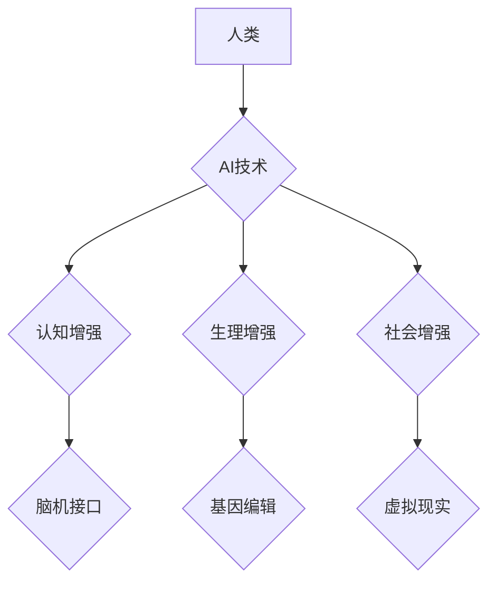

> 人类增强、AI、道德伦理、身体增强、未来趋势、神经接口、生物技术、社会影响

## 1. 背景介绍

人类文明自诞生以来，就一直在探索如何超越自身的局限性。从使用工具到发明火，从农业文明到工业革命，每一次进步都代表着人类对自身能力的提升。如今，人工智能（AI）和生物技术的飞速发展，为我们开启了新的篇章——人类增强。

人类增强是指利用科技手段提升人类的认知能力、生理能力和社会适应能力，使其超越自然界赋予的局限。这不仅仅是科幻小说中的幻想，而是正在逐渐成为现实。

## 2. 核心概念与联系

**2.1 人类增强类型**

人类增强可以分为以下几类：

* **认知增强:** 提升人类的记忆力、学习能力、创造力等认知功能。例如，脑机接口技术可以帮助人们直接控制计算机，实现无障碍的沟通和信息获取。
* **生理增强:** 提升人类的体力、耐力、寿命等生理功能。例如，基因编辑技术可以纠正基因缺陷，增强免疫力，甚至延长寿命。
* **社会增强:** 提升人类在社会中的适应能力和互动能力。例如，虚拟现实技术可以创造沉浸式的社交环境，帮助人们克服社交障碍。

**2.2 AI与人类增强的关系**

AI技术是推动人类增强的重要驱动力。AI可以帮助我们：

* **开发更先进的人类增强技术:** AI算法可以分析海量数据，识别人类增强技术的潜在应用场景，并设计更有效的增强方案。
* **个性化定制人类增强体验:** AI可以根据个人的需求和特点，定制个性化的增强方案，实现更加精准和有效的增强效果。
* **提高人类增强技术的安全性:** AI可以帮助我们预测和避免人类增强技术的潜在风险，确保其安全可靠地应用于人类身上。

**2.3 核心概念架构**



## 3. 核心算法原理 & 具体操作步骤

**3.1 算法原理概述**

人类增强算法的核心是利用机器学习、深度学习等人工智能技术，分析人类大脑和身体的运作机制，并设计相应的增强方案。

**3.2 算法步骤详解**

1. **数据收集:** 收集大量关于人类大脑和身体的生理、心理和行为数据。
2. **数据预处理:** 对收集到的数据进行清洗、转换和特征提取，使其适合机器学习算法的训练。
3. **模型训练:** 利用机器学习算法，训练一个能够预测和模拟人类大脑和身体运作的模型。
4. **增强方案设计:** 根据训练好的模型，设计相应的增强方案，例如，开发脑机接口设备、基因编辑技术等。
5. **方案测试与优化:** 对设计好的增强方案进行测试和优化，确保其安全、有效和可行。

**3.3 算法优缺点**

* **优点:**

    * 可以实现对人类能力的精准提升。
    * 可以根据个人的需求和特点，定制个性化的增强方案。
    * 可以推动人类文明的进步，解决人类面临的各种挑战。

* **缺点:**

    * 需要大量的训练数据和计算资源。
    * 存在潜在的伦理风险，例如，增强技术可能导致社会不平等加剧。
    * 增强技术可能被用于恶意目的，例如，控制人类思想或行为。

**3.4 算法应用领域**

* **医疗保健:** 治疗神经退行性疾病、修复肢体损伤、增强免疫力。
* **教育:** 提升学习效率、增强记忆力、个性化教学。
* **娱乐:** 创造沉浸式的游戏体验、增强现实互动。
* **军事:** 增强士兵的作战能力、提高决策效率。

## 4. 数学模型和公式 & 详细讲解 & 举例说明

**4.1 数学模型构建**

人类增强算法通常基于神经网络模型，其结构和参数可以根据具体应用场景进行调整。

**4.2 公式推导过程**

神经网络模型的训练过程涉及到大量的数学公式，例如梯度下降算法、激活函数等。这些公式的推导过程较为复杂，需要一定的数学基础。

**4.3 案例分析与讲解**

例如，在脑机接口技术中，可以使用神经网络模型来识别用户的意图，并将其转化为计算机指令。

## 5. 项目实践：代码实例和详细解释说明

**5.1 开发环境搭建**

可以使用Python语言和相关的深度学习框架，例如TensorFlow或PyTorch，来开发人类增强算法。

**5.2 源代码详细实现**

```python
# 这是一个简单的示例代码，用于演示神经网络模型的训练过程

import tensorflow as tf

# 定义神经网络模型
model = tf.keras.models.Sequential([
    tf.keras.layers.Dense(128, activation='relu', input_shape=(100,)),
    tf.keras.layers.Dense(64, activation='relu'),
    tf.keras.layers.Dense(10, activation='softmax')
])

# 编译模型
model.compile(optimizer='adam',
              loss='sparse_categorical_crossentropy',
              metrics=['accuracy'])

# 训练模型
model.fit(x_train, y_train, epochs=10)

# 评估模型
loss, accuracy = model.evaluate(x_test, y_test)
print('Loss:', loss)
print('Accuracy:', accuracy)
```

**5.3 代码解读与分析**

这段代码定义了一个简单的多层感知机模型，并使用Adam优化器和交叉熵损失函数进行训练。

**5.4 运行结果展示**

训练完成后，可以评估模型的性能，例如，计算模型在测试集上的准确率。

## 6. 实际应用场景

**6.1 医疗保健**

* **神经退行性疾病治疗:** 利用脑机接口技术，帮助帕金森病患者控制肢体运动，改善生活质量。
* **肢体修复:** 利用基因编辑技术，修复因事故或疾病导致的肢体损伤。
* **增强免疫力:** 利用基因编辑技术，增强免疫系统对疾病的抵抗力。

**6.2 教育**

* **个性化学习:** 利用AI算法，根据学生的学习进度和特点，定制个性化的学习方案。
* **增强记忆力:** 利用脑机接口技术，帮助学生更好地记忆和理解知识。
* **沉浸式教学:** 利用虚拟现实技术，创造沉浸式的学习环境，提高学生的学习兴趣和效果。

**6.3 娱乐**

* **沉浸式游戏体验:** 利用虚拟现实技术，创造更加逼真的游戏环境，增强玩家的代入感。
* **增强现实互动:** 利用增强现实技术，将虚拟内容叠加到现实世界中，创造新的互动体验。

**6.4 未来应用展望**

随着AI和生物技术的不断发展，人类增强技术的应用场景将更加广泛，例如：

* **增强人类寿命:** 利用基因编辑技术，延长人类寿命。
* **提升人类智力:** 利用脑机接口技术，增强人类的认知能力。
* **创造新的人类形态:** 利用生物打印技术，创造新的人类形态。

## 7. 工具和资源推荐

**7.1 学习资源推荐**

* **书籍:**
    * 《深度学习》
    * 《人工智能：一种现代方法》
    * 《人机交互》
* **在线课程:**
    * Coursera上的深度学习课程
    * edX上的人工智能课程
    * Udacity上的无人驾驶汽车课程

**7.2 开发工具推荐**

* **Python:** 人工智能开发的常用语言。
* **TensorFlow:** 深度学习框架。
* **PyTorch:** 深度学习框架。
* **OpenCV:** 图像处理库。

**7.3 相关论文推荐**

* **《深度学习》**
* **《人工智能：一种现代方法》**
* **《人机交互》**

## 8. 总结：未来发展趋势与挑战

**8.1 研究成果总结**

人类增强技术已经取得了显著的进展，例如，脑机接口技术、基因编辑技术等。这些技术为人类提供了新的可能性，但也带来了新的挑战。

**8.2 未来发展趋势**

未来，人类增强技术将朝着以下方向发展：

* **更加精准和个性化:** 利用AI算法，设计更加精准和个性化的增强方案。
* **更加安全和可靠:** 提高人类增强技术的安全性，避免潜在的风险。
* **更加广泛的应用场景:** 将人类增强技术应用于更多领域，例如医疗保健、教育、娱乐等。

**8.3 面临的挑战**

人类增强技术也面临着一些挑战：

* **伦理风险:** 人类增强技术可能导致社会不平等加剧，甚至威胁到人类的生存。
* **技术瓶颈:** 人类增强技术的开发还面临着一些技术瓶颈，例如，如何更好地理解和模拟人类大脑的运作机制。
* **社会接受度:** 人们对人类增强技术的接受度还比较低，需要进行更多的科普和宣传工作。

**8.4 研究展望**

未来，我们需要加强对人类增强技术的伦理研究，制定相应的规范和政策，确保其安全、有效和可持续地发展。同时，还需要加大对基础研究的投入，突破技术瓶颈，推动人类增强技术的进步。


## 9. 附录：常见问题与解答

**9.1 人类增强技术会取代人类吗？**

人类增强技术旨在提升人类的能力，而不是取代人类。它将帮助人类更好地应对挑战，实现更美好的未来。

**9.2 人类增强技术会造成社会不平等吗？**

人类增强技术可能会加剧社会不平等，因为只有少数人能够负担得起这些技术的成本。因此，我们需要制定相应的政策，确保这些技术能够公平地惠及所有人。

**9.3 人类增强技术是否安全？**

人类增强技术还处于发展初期，存在一些潜在的风险。我们需要加强对这些技术的安全性研究，制定相应的规范和政策，确保其安全可靠地应用于人类身上。


作者：禅与计算机程序设计艺术 / Zen and the Art of Computer Programming 
<end_of_turn>