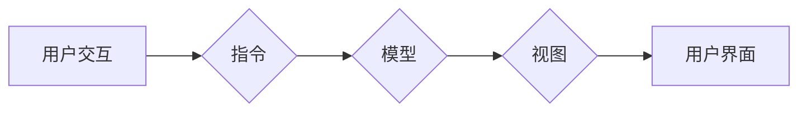

Angular, MVW, TypeScript,组件化,单页应用,前端开发,JavaScript

## 1. 背景介绍

在当今快速发展的软件开发领域，前端技术扮演着越来越重要的角色。用户对网站和应用程序的体验要求越来越高，而前端框架则成为了构建复杂、交互式用户界面的利器。Angular，由 Google 开发的开源前端框架，凭借其强大的功能和完善的生态系统，成为了众多开发者的首选。

Angular 是一种基于 MVW（模型-视图-指令）架构的框架，它提供了一套完整的工具和规范，帮助开发者构建高质量、可维护的单页应用（SPA）。与传统的基于 jQuery 的开发方式相比，Angular 能够显著提高开发效率，并提供更强大的功能和更好的用户体验。

## 2. 核心概念与联系

### 2.1 模型（Model）

模型负责应用程序的数据处理和业务逻辑。它定义了应用程序的数据结构和操作，并与数据源进行交互。

### 2.2 视图（View）

视图负责呈现应用程序的用户界面。它根据模型的数据生成 HTML 内容，并响应用户的交互事件。

### 2.3 指令（Directive）

指令是 Angular 的核心概念之一，它允许开发者扩展 HTML 元素的功能。指令可以修改元素的样式、行为或属性，并与模型和视图进行交互。

**MVW 架构流程图**



## 3. 核心算法原理 & 具体操作步骤

### 3.1 算法原理概述

Angular 的核心算法原理是基于组件化的思想，将应用程序拆分成多个独立的组件，每个组件都负责处理特定的功能和数据。组件之间通过指令和数据绑定进行通信，实现应用程序的整体逻辑。

### 3.2 算法步骤详解

1. **定义组件：** 使用 Angular 的 `@Component` 装饰器定义组件，指定组件的模板、样式和逻辑。
2. **创建模板：** 使用 HTML 模板定义组件的用户界面，并使用 Angular 的指令和数据绑定语法与组件的逻辑和数据进行交互。
3. **编写逻辑：** 使用 TypeScript 编写组件的逻辑代码，处理数据、响应事件和与其他组件进行通信。
4. **注册组件：** 在应用程序的根组件中注册所有组件，以便 Angular 可以识别和渲染它们。
5. **启动应用程序：** 使用 Angular 的 `bootstrap` 方法启动应用程序，Angular 会解析组件树并渲染用户界面。

### 3.3 算法优缺点

**优点：**

* **组件化：** 将应用程序拆分成独立的组件，提高代码的可维护性和可复用性。
* **数据绑定：** 使用双向数据绑定，自动同步模型和视图，简化开发过程。
* **指令扩展：** 使用指令扩展 HTML 元素的功能，实现自定义的交互和行为。
* **类型安全：** 使用 TypeScript 编写代码，提高代码的可靠性和安全性。

**缺点：**

* **学习曲线：** Angular 的语法和概念相对复杂，需要一定的学习成本。
* **性能：** 对于大型应用程序，Angular 的性能可能不如其他轻量级框架。

### 3.4 算法应用领域

Angular 广泛应用于各种类型的 Web 应用，包括：

* **单页应用（SPA）：** Angular 非常适合构建 SPA，因为它提供了一套完整的工具和规范，可以帮助开发者构建快速、交互式的用户界面。
* **企业级应用：** Angular 的组件化架构和类型安全特性使其非常适合构建大型、复杂的企业级应用。
* **移动应用：** 使用 Angular 的 NativeScript 或 Ionic 等框架，可以将 Angular 应用移植到移动平台。

## 4. 数学模型和公式 & 详细讲解 & 举例说明

### 4.1 数学模型构建

Angular 的数据绑定机制可以看作是一种数学模型，它将模型中的数据映射到视图中的元素。

**数据绑定模型：**

```
视图元素值 = 模型数据函数(模型数据)
```

其中：

* 视图元素值：视图中元素的属性值或文本内容。
* 模型数据：模型中存储的数据。
* 模型数据函数：将模型数据转换为视图元素值的函数。

### 4.2 公式推导过程

Angular 使用双向数据绑定机制，这意味着模型数据和视图元素值是相互关联的。当模型数据发生变化时，视图元素值也会自动更新；反之亦然。

**双向数据绑定公式：**

```
模型数据 = 视图元素值函数(视图元素值)
```

其中：

* 模型数据：模型中存储的数据。
* 视图元素值函数：将视图元素值转换为模型数据的函数。

### 4.3 案例分析与讲解

**示例：**

假设有一个名为 `name` 的模型数据，并有一个名为 `<h1></h1>` 的视图元素，其文本内容绑定到 `name` 数据上。

* 当 `name` 数据为 "Zen" 时，`<h1></h1>` 元素的文本内容为 "Zen"。
* 当用户在 `<h1></h1>` 元素上修改文本内容为 "Master" 时，`name` 数据也会自动更新为 "Master"。

## 5. 项目实践：代码实例和详细解释说明

### 5.1 开发环境搭建

1. 安装 Node.js 和 npm。
2. 使用 Angular CLI 创建一个新的项目：`ng new my-app`。
3. 启动开发服务器：`ng serve`。

### 5.2 源代码详细实现

```typescript
// app.component.ts
import { Component } from '@angular/core';

@Component({
  selector: 'app-root',
  templateUrl: './app.component.html',
  styleUrls: ['./app.component.css']
})
export class AppComponent {
  name = 'Zen';
}
```

```html
<!-- app.component.html -->
<h1>{{ name }}</h1>
<button (click)="name = 'Master'">修改名称</button>
```

### 5.3 代码解读与分析

* `@Component` 装饰器定义了组件的元数据，包括组件选择器、模板路径和样式路径。
* `name` 属性存储了组件的数据，并使用双向数据绑定语法 `{{ name }}` 与视图元素绑定。
* `(click)` 事件绑定将按钮的点击事件与 `name` 属性的赋值操作绑定。

### 5.4 运行结果展示

启动开发服务器后，访问 `http://localhost:4200/`，可以看到一个显示 "Zen" 的标题，点击按钮后，标题会更新为 "Master"。

## 6. 实际应用场景

Angular 在各种实际应用场景中都得到了广泛的应用，例如：

* **电商平台：** Angular 可以构建复杂的电商平台，包括商品展示、购物车、订单管理等功能。
* **社交媒体：** Angular 可以构建社交媒体平台，包括用户注册、登录、消息推送等功能。
* **企业管理系统：** Angular 可以构建企业管理系统，包括客户管理、财务管理、人力资源管理等功能。

### 6.4 未来应用展望

随着 Web 技术的不断发展，Angular 将继续在以下领域得到应用：

* **移动应用开发：** Angular 的 NativeScript 和 Ionic 等框架将推动 Angular 在移动应用开发领域的应用。
* **物联网应用：** Angular 的实时数据绑定和组件化架构将使其成为物联网应用开发的理想选择。
* **人工智能应用：** Angular 可以与人工智能框架结合，构建交互式的人工智能应用。

## 7. 工具和资源推荐

### 7.1 学习资源推荐

* **Angular 官方文档：** https://angular.io/docs
* **Angular 中文网：** https://angular.cn/
* **Angular Udemy 课程：** https://www.udemy.com/topic/angular/

### 7.2 开发工具推荐

* **Angular CLI：** https://angular.io/cli
* **Visual Studio Code：** https://code.visualstudio.com/
* **WebStorm：** https://www.jetbrains.com/webstorm/

### 7.3 相关论文推荐

* **AngularJS: A Framework for Building Dynamic Web Applications:** https://www.researchgate.net/publication/263776504_AngularJS_A_Framework_for_Building_Dynamic_Web_Applications
* **Angular 2: A Comprehensive Overview:** https://www.researchgate.net/publication/329111031_Angular_2_A_Comprehensive_Overview

## 8. 总结：未来发展趋势与挑战

### 8.1 研究成果总结

Angular 作为 Google 开发的开源前端框架，在过去几年中取得了巨大的成功，并成为了众多开发者的首选。其强大的功能、完善的生态系统和持续的更新迭代使其在前端开发领域占据了重要的地位。

### 8.2 未来发展趋势

* **更强大的组件化：** Angular 将继续加强组件化功能，使其更加灵活、可复用和可维护。
* **更好的性能优化：** Angular 将继续优化性能，使其能够更好地应对大型应用程序的需求。
* **更完善的移动端支持：** Angular 将继续加强移动端支持，使其能够更方便地构建跨平台移动应用。

### 8.3 面临的挑战

* **学习曲线：** Angular 的语法和概念相对复杂，对于初学者来说，学习曲线可能比较陡峭。
* **生态系统竞争：** Angular 面临着来自其他前端框架的竞争，需要不断创新和改进，才能保持其领先地位。

### 8.4 研究展望

未来，Angular 将继续朝着更强大、更灵活、更易于使用的方向发展。随着 Web 技术的不断发展，Angular 将继续在前端开发领域发挥重要的作用。

## 9. 附录：常见问题与解答

### 9.1 如何安装 Angular CLI？

可以使用 npm 命令安装 Angular CLI：

```
npm install -g @angular/cli
```

### 9.2 如何创建新的 Angular 项目？

可以使用 Angular CLI 创建新的项目：

```
ng new my-app
```

### 9.3 如何启动 Angular 开发服务器？

可以使用以下命令启动 Angular 开发服务器：

```
ng serve
```

### 9.4 如何运行 Angular 应用？

可以使用以下命令运行 Angular 应用：

```
ng build
```

### 9.5 如何部署 Angular 应用？

可以使用各种工具和平台部署 Angular 应用，例如 Netlify、Heroku 和 AWS。


作者：禅与计算机程序设计艺术 / Zen and the Art of Computer Programming 
<end_of_turn>