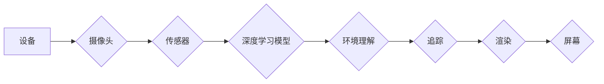

> ARCore,增强现实,Android,计算机视觉,深度学习,移动开发

## 1. 背景介绍

增强现实（AR）技术近年来发展迅速，它将虚拟信息叠加到现实世界中，为用户提供一种全新的交互体验。ARCore是Google开发的移动AR平台，专门为Android设备打造，旨在简化AR应用开发，并提供丰富的AR功能。

随着智能手机的普及和计算能力的提升，AR技术逐渐从实验室走向现实生活。AR应用场景日益广泛，涵盖游戏、教育、购物、医疗等多个领域。ARCore作为一款成熟的AR平台，为开发者提供了强大的工具和资源，助力AR技术在Android平台上的快速发展。

## 2. 核心概念与联系

ARCore的核心概念包括：

* **环境理解:** ARCore利用设备的摄像头、传感器和深度学习模型，对周围环境进行感知和理解，包括场景的平面、物体的位置和大小等信息。
* **追踪:** ARCore通过跟踪设备的运动和姿态，确保虚拟物体在现实世界中保持正确的定位和方向。
* **渲染:** ARCore提供渲染引擎，将虚拟物体渲染到设备的屏幕上，并与现实世界进行融合。

**ARCore 架构流程图:**



## 3. 核心算法原理 & 具体操作步骤

### 3.1  算法原理概述

ARCore的核心算法包括环境理解、追踪和渲染算法。

* **环境理解算法:** 主要利用计算机视觉技术，包括特征检测、图像匹配和深度估计等，对周围环境进行建模。
* **追踪算法:** 主要利用惯性测量单元（IMU）和视觉信息，跟踪设备的运动和姿态。
* **渲染算法:** 主要利用图形渲染技术，将虚拟物体渲染到设备的屏幕上，并与现实世界进行融合。

### 3.2  算法步骤详解

**环境理解算法步骤:**

1. **图像采集:** 设备摄像头采集周围环境的图像。
2. **特征检测:** 利用特征检测算法，从图像中提取特征点。
3. **图像匹配:** 利用图像匹配算法，将特征点与已知模型进行匹配，识别场景中的平面和物体。
4. **深度估计:** 利用深度估计算法，估计场景中物体的深度信息。

**追踪算法步骤:**

1. **IMU数据采集:** IMU传感器采集设备的加速度和角速度数据。
2. **视觉特征跟踪:** 利用视觉特征跟踪算法，跟踪设备相对于周围环境的运动。
3. **姿态估计:** 利用IMU数据和视觉特征跟踪数据，估计设备的姿态。

**渲染算法步骤:**

1. **虚拟物体建模:** 将虚拟物体建模为3D模型。
2. **虚拟物体定位:** 根据追踪算法的结果，将虚拟物体定位到现实世界中。
3. **虚拟物体渲染:** 利用图形渲染引擎，将虚拟物体渲染到设备的屏幕上。
4. **现实世界与虚拟世界融合:** 将虚拟物体与现实世界图像进行融合，呈现出增强现实效果。

### 3.3  算法优缺点

**环境理解算法:**

* **优点:** 可以识别场景中的平面和物体，为AR应用提供丰富的环境信息。
* **缺点:** 对光照条件和场景复杂度敏感，识别精度可能较低。

**追踪算法:**

* **优点:** 可以跟踪设备的运动和姿态，确保虚拟物体在现实世界中保持正确的定位。
* **缺点:** 对设备的传感器精度和稳定性要求较高，可能存在漂移现象。

**渲染算法:**

* **优点:** 可以将虚拟物体渲染到设备的屏幕上，并与现实世界进行融合，呈现出逼真的增强现实效果。
* **缺点:** 对设备的图形处理能力要求较高，可能导致渲染延迟。

### 3.4  算法应用领域

ARCore的算法应用领域广泛，包括：

* **游戏:** AR游戏可以将虚拟角色和场景叠加到现实世界中，为玩家提供沉浸式的游戏体验。
* **教育:** AR教育可以将虚拟模型和动画叠加到现实世界中，帮助学生更好地理解抽象概念。
* **购物:** AR购物可以将虚拟商品叠加到现实世界中，帮助消费者更好地了解商品的尺寸和外观。
* **医疗:** AR医疗可以将虚拟手术模型叠加到现实世界中，帮助医生进行更精准的手术操作。

## 4. 数学模型和公式 & 详细讲解 & 举例说明

### 4.1  数学模型构建

ARCore的数学模型主要包括以下几个方面：

* **相机模型:** 描述相机拍摄图像的几何关系，包括内参和外参。
* **场景模型:** 描述周围环境的几何形状和材质信息。
* **追踪模型:** 描述设备运动和姿态的数学关系。

### 4.2  公式推导过程

**相机模型:**

* **内参矩阵:** 描述相机镜头本身的几何特性，包括焦距、主点坐标等。
* **外参矩阵:** 描述相机相对于世界坐标系的旋转和平移关系。

**场景模型:**

* **点云:** 描述场景中物体的三维坐标点。
* **三角网:** 描述场景中物体的表面形状。

**追踪模型:**

* **卡尔曼滤波:** 用于估计设备运动和姿态，并融合IMU数据和视觉特征跟踪数据。

### 4.3  案例分析与讲解

**相机标定:**

相机标定是确定相机内参和外参的过程。可以使用棋盘格图案或其他标定板，通过图像匹配和几何关系计算相机参数。

**环境重建:**

利用点云数据和三角网模型，可以重建周围环境的3D模型。

**姿态估计:**

利用卡尔曼滤波算法，可以融合IMU数据和视觉特征跟踪数据，估计设备的姿态。

## 5. 项目实践：代码实例和详细解释说明

### 5.1  开发环境搭建

* **Android Studio:** Google官方的Android开发工具。
* **ARCore SDK:** Google提供的ARCore开发工具包。

### 5.2  源代码详细实现

```java
// 初始化ARCore会话
Session session = new Session(this);

// 创建AR场景
ARSceneView sceneView = findViewById(R.id.scene_view);
sceneView.setSession(session);

// 添加虚拟物体
Anchor anchor = sceneView.createAnchor(new Vector3(0, 0, 0));
Model model = new Model(this, R.raw.model);
model.setAnchor(anchor);
sceneView.addChild(model);

// 启动AR会话
session.resume();
```

### 5.3  代码解读与分析

* **初始化ARCore会话:** 创建一个ARCore会话对象，用于管理AR应用的运行状态。
* **创建AR场景:** 创建一个AR场景视图对象，用于显示AR内容。
* **添加虚拟物体:** 创建一个锚点对象，将虚拟物体固定在现实世界中。然后创建虚拟物体模型对象，并将其添加到场景视图中。
* **启动AR会话:** 启动AR会话，开始运行AR应用。

### 5.4  运行结果展示

运行代码后，会在设备屏幕上显示一个虚拟物体，该物体将固定在现实世界中，并随着设备的运动而移动。

## 6. 实际应用场景

### 6.1  游戏

ARCore可以用于开发AR游戏，例如Pokemon Go，将虚拟角色和场景叠加到现实世界中，为玩家提供沉浸式的游戏体验。

### 6.2  教育

ARCore可以用于开发AR教育应用，例如虚拟解剖模型，将虚拟解剖模型叠加到现实世界中，帮助学生更好地理解人体结构。

### 6.3  购物

ARCore可以用于开发AR购物应用，例如虚拟试衣镜，将虚拟服装叠加到现实世界中，帮助消费者更好地了解服装的款式和效果。

### 6.4  未来应用展望

ARCore的未来应用前景广阔，例如：

* **AR导航:** 在现实世界中叠加导航指示，帮助用户更方便地找到目的地。
* **AR维修:** 在现实世界中叠加维修说明，帮助用户更方便地进行设备维修。
* **AR设计:** 在现实世界中叠加设计模型，帮助用户更方便地进行产品设计。

## 7. 工具和资源推荐

### 7.1  学习资源推荐

* **ARCore官方文档:** https://developers.google.com/ar/develop/android
* **ARCore示例代码:** https://github.com/google-ar/arcore-android-samples

### 7.2  开发工具推荐

* **Android Studio:** https://developer.android.com/studio
* **Unity3D:** https://unity3d.com/

### 7.3  相关论文推荐

* **ARCore: A Platform for Mobile Augmented Reality:** https://arxiv.org/abs/1707.06979

## 8. 总结：未来发展趋势与挑战

### 8.1  研究成果总结

ARCore平台的开发和应用取得了显著成果，为移动AR技术的发展做出了重要贡献。

### 8.2  未来发展趋势

* **更精准的环境理解:** 利用更先进的计算机视觉算法和深度学习模型，提高AR应用的环境理解精度。
* **更稳定的追踪:** 利用更精确的传感器和更有效的追踪算法，提高AR应用的追踪稳定性。
* **更丰富的交互方式:** 开发更丰富的交互方式，例如手势识别、语音识别等，增强用户体验。

### 8.3  面临的挑战

* **计算资源限制:** 移动设备的计算资源有限，需要开发更轻量级的AR算法和模型。
* **用户体验问题:** AR应用的体验还存在一些问题，例如眩晕感、延迟等，需要进一步优化。
* **隐私安全问题:** AR应用需要访问用户的摄像头和传感器数据，需要加强隐私安全保护。

### 8.4  研究展望

未来AR技术的发展将更加注重用户体验、隐私安全和计算效率，ARCore平台也将继续发挥重要作用，推动AR技术向更广泛的应用领域扩展。

## 9. 附录：常见问题与解答

### 9.1  ARCore是否需要联网？

ARCore部分功能需要联网，例如环境理解和追踪。

### 9.2  ARCore支持哪些Android设备？

ARCore支持大部分支持Android 7.0及以上版本的设备。

### 9.3  如何获取ARCore SDK？

ARCore SDK可以通过Google Play商店或Android Studio下载。


作者：禅与计算机程序设计艺术 / Zen and the Art of Computer Programming 
<end_of_turn>