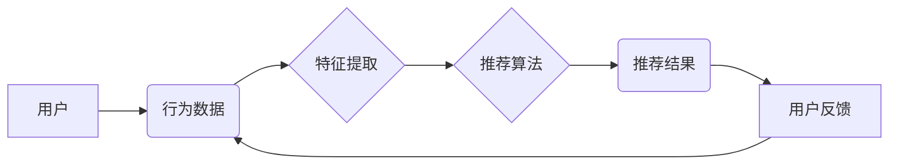

> 个性化推荐, 用户粘性, 算法原理, 协同过滤, 内容过滤, 深度学习, 推荐系统

## 1. 背景介绍

在当今互联网时代，信息爆炸和用户需求的多样化使得个性化推荐成为各大平台的核心竞争力。个性化推荐系统能够根据用户的兴趣、偏好、行为等信息，精准地推荐用户感兴趣的内容，从而提升用户体验，增强用户粘性，最终促进商业目标的实现。

从电商平台的商品推荐到视频网站的影视剧推荐，从音乐平台的歌曲推荐到社交媒体的动态推荐，个性化推荐已经渗透到我们生活的方方面面。

## 2. 核心概念与联系

个性化推荐的核心在于理解用户的需求，并根据用户的特征和行为历史，预测用户对哪些内容感兴趣。

**推荐系统架构**



**核心概念:**

* **用户:** 推荐系统的最终目标用户，拥有独特的兴趣、偏好和行为模式。
* **物品:** 需要被推荐的内容，例如商品、影视剧、歌曲等。
* **行为数据:** 用户与物品之间的交互记录，例如点击、浏览、购买、评分等。
* **特征提取:** 从行为数据中提取用户的兴趣偏好、物品的属性等特征，为推荐算法提供输入。
* **推荐算法:** 根据用户特征和物品特征，预测用户对哪些物品感兴趣，并生成推荐结果。
* **推荐结果:**  推荐算法输出的物品列表，根据用户需求进行排序。
* **用户反馈:** 用户对推荐结果的评价，例如点击、收藏、购买等，用于评估推荐算法的性能，并反向反馈到特征提取环节，不断优化推荐效果。

## 3. 核心算法原理 & 具体操作步骤

### 3.1  算法原理概述

个性化推荐算法主要分为两大类：

* **协同过滤:** 基于用户的相似度或物品的相似度进行推荐。
* **内容过滤:** 基于物品的属性和用户对物品属性的偏好进行推荐。

**协同过滤算法**

协同过滤算法的核心思想是：如果用户A喜欢物品X，而用户B与用户A的兴趣相似，那么用户B也可能喜欢物品X。

**内容过滤算法**

内容过滤算法的核心思想是：根据用户对物品属性的偏好，推荐与用户偏好相符的物品。

### 3.2  算法步骤详解

**协同过滤算法步骤:**

1. **数据收集:** 收集用户对物品的交互数据，例如评分、购买记录等。
2. **用户相似度计算:** 计算用户之间的相似度，常用的方法包括余弦相似度、皮尔逊相关系数等。
3. **物品推荐:** 根据用户与其他用户的相似度，推荐与相似用户喜欢的物品。

**内容过滤算法步骤:**

1. **物品特征提取:** 从物品描述中提取特征，例如物品类别、作者、主题等。
2. **用户偏好学习:** 学习用户对不同物品特征的偏好，例如用户喜欢动作片、科幻片等。
3. **物品推荐:** 根据用户的偏好，推荐与用户偏好相符的物品。

### 3.3  算法优缺点

**协同过滤算法:**

* **优点:** 可以发现用户之间的隐性关联，推荐出用户可能没有想到的物品。
* **缺点:** 数据稀疏性问题，当用户对物品的交互数据较少时，难以计算出准确的用户相似度。

**内容过滤算法:**

* **优点:** 不需要用户之间的交互数据，可以根据物品本身的属性进行推荐。
* **缺点:** 容易陷入“同质化推荐”问题，推荐的物品过于相似，缺乏多样性。

### 3.4  算法应用领域

* **电商平台:** 商品推荐、个性化促销
* **视频网站:** 影视剧推荐、用户画像分析
* **音乐平台:** 歌曲推荐、音乐发现
* **社交媒体:** 动态推荐、好友推荐
* **新闻平台:** 新闻推荐、个性化资讯

## 4. 数学模型和公式 & 详细讲解 & 举例说明

### 4.1  数学模型构建

**协同过滤算法的数学模型:**

假设用户集合为U，物品集合为I，用户对物品的评分矩阵为R，其中R(u,i)表示用户u对物品i的评分。

协同过滤算法的目标是预测用户u对物品i的评分R(u,i)。

**内容过滤算法的数学模型:**

假设物品集合为I，物品特征向量为X，用户偏好向量为Y，则用户u对物品i的评分可以表示为：

R(u,i) = Y(u) * X(i)

其中，Y(u)表示用户u的偏好向量，X(i)表示物品i的特征向量。

### 4.2  公式推导过程

**协同过滤算法的公式推导:**

常用的协同过滤算法包括基于用户的协同过滤和基于物品的协同过滤。

**基于用户的协同过滤:**

预测用户u对物品i的评分R(u,i) =  平均评分 + (相似度 * (用户相似用户的评分 - 平均评分))

**基于物品的协同过滤:**

预测用户u对物品i的评分R(u,i) = 平均评分 + (相似度 * (用户喜欢的物品的评分 - 平均评分))

**内容过滤算法的公式推导:**

用户对物品的评分可以看作是用户偏好向量和物品特征向量的内积。

### 4.3  案例分析与讲解

**协同过滤算法案例:**

假设用户A和用户B都喜欢电影《流浪地球》，那么我们可以推断用户A和用户B的兴趣相似，因此可以推荐用户A喜欢的其他电影给用户B。

**内容过滤算法案例:**

假设用户A喜欢动作片，那么我们可以推荐其他动作片给用户A。

## 5. 项目实践：代码实例和详细解释说明

### 5.1  开发环境搭建

* Python 3.x
* scikit-learn
* pandas
* numpy

### 5.2  源代码详细实现

```python
# 协同过滤算法示例代码

from sklearn.metrics.pairwise import cosine_similarity
import pandas as pd

# 数据加载
data = pd.read_csv('ratings.csv')

# 用户-物品评分矩阵
user_item_matrix = data.pivot_table(index='userId', columns='movieId', values='rating')

# 计算用户相似度
user_similarity = cosine_similarity(user_item_matrix)

# 用户推荐
def recommend_movies(user_id, top_n=5):
    # 获取用户相似用户
    similar_users = user_similarity[user_id].argsort()[:-top_n-1:-1]

    # 获取相似用户喜欢的电影
    recommended_movies = []
    for similar_user in similar_users:
        # 获取相似用户喜欢的电影
        similar_user_movies = user_item_matrix.loc[similar_user].index
        # 过滤掉用户已经喜欢的电影
        recommended_movies.extend(similar_user_movies[~user_item_matrix.loc[user_id].index.isin(similar_user_movies)])

    # 去重并排序
    recommended_movies = list(set(recommended_movies))
    recommended_movies.sort(key=lambda x: user_item_matrix.loc[user_id, x], reverse=True)

    return recommended_movies[:top_n]

# 获取用户ID
user_id = 1

# 推荐电影
recommendations = recommend_movies(user_id)

# 打印推荐结果
print(f'推荐给用户 {user_id} 的电影：{recommendations}')
```

### 5.3  代码解读与分析

* **数据加载:** 从CSV文件加载用户-物品评分数据。
* **用户-物品评分矩阵:** 将数据转换为用户-物品评分矩阵，方便后续计算相似度。
* **计算用户相似度:** 使用余弦相似度计算用户之间的相似度。
* **用户推荐:** 根据用户相似度，推荐用户可能喜欢的电影。

### 5.4  运行结果展示

运行代码后，将输出用户1可能喜欢的电影列表。

## 6. 实际应用场景

### 6.1  电商平台

个性化商品推荐是电商平台的核心功能，可以帮助用户快速找到感兴趣的商品，提高用户购物体验和转化率。

### 6.2  视频网站

个性化影视剧推荐可以帮助用户发现更多符合兴趣的影视作品，提高用户粘性和观看时长。

### 6.3  音乐平台

个性化歌曲推荐可以帮助用户发现新音乐，丰富用户的音乐体验。

### 6.4  未来应用展望

随着人工智能技术的不断发展，个性化推荐系统将更加智能化、精准化，能够更好地满足用户的个性化需求。

## 7. 工具和资源推荐

### 7.1  学习资源推荐

* **书籍:**
    * 《推荐系统》
    * 《机器学习》
* **在线课程:**
    * Coursera: Recommender Systems
    * edX: Machine Learning

### 7.2  开发工具推荐

* **Python:** 
    * scikit-learn
    * pandas
    * numpy
* **Spark:** 
    * MLlib

### 7.3  相关论文推荐

* **协同过滤:**
    * Collaborative Filtering: A User-Based Approach
* **内容过滤:**
    * Content-Based Recommendation Systems

## 8. 总结：未来发展趋势与挑战

### 8.1  研究成果总结

个性化推荐系统已经取得了显著的成果，在电商、视频、音乐等领域得到了广泛应用。

### 8.2  未来发展趋势

* **深度学习:** 深度学习算法可以更好地学习用户行为和物品特征，提高推荐效果。
* **多模态推荐:** 将文本、图像、音频等多种模态信息融合到推荐系统中，提供更丰富的推荐结果。
* **解释性推荐:** 使推荐结果更加透明可解释，帮助用户理解推荐背后的逻辑。

### 8.3  面临的挑战

* **数据稀疏性:** 用户对物品的交互数据往往稀疏，难以训练出准确的推荐模型。
* **冷启动问题:** 新用户和新物品难以获得推荐，需要新的算法和策略来解决。
* **用户隐私保护:** 个性化推荐需要收集用户的个人信息，需要采取有效的措施保护用户隐私。

### 8.4  研究展望

未来个性化推荐系统将更加智能化、精准化、个性化，为用户提供更丰富的体验和服务。


## 9. 附录：常见问题与解答

**Q1: 协同过滤算法和内容过滤算法有什么区别？**

**A1:** 协同过滤算法基于用户的相似度或物品的相似度进行推荐，而内容过滤算法基于物品的属性和用户对物品属性的偏好进行推荐。

**Q2: 如何解决协同过滤算法的数据稀疏性问题？**

**A2:** 可以使用矩阵分解、隐语义模型等方法来解决数据稀疏性问题。

**Q3: 如何评估个性化推荐系统的性能？**

**A3:** 常用的评估指标包括准确率、召回率、NDCG等。

**作者：禅与计算机程序设计艺术 / Zen and the Art of Computer Programming**


<end_of_turn>