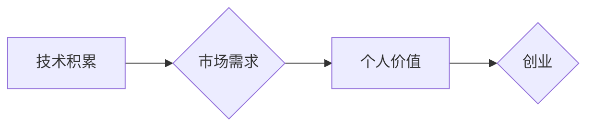

> 贾扬清,阿里巴巴,创业,技术架构,分布式系统,云计算,大数据

## 1. 背景介绍

贾扬清，一位在阿里巴巴担任多年技术架构师的资深工程师，以其对分布式系统和云计算的深刻理解而闻名。他曾参与阿里巴巴核心业务的架构设计和建设，积累了丰富的经验。然而，在2016年，他毅然选择离开阿里巴巴，创办了自己的公司。这个职业转折引发了业界广泛的关注和讨论。

## 2. 核心概念与联系

贾扬清的职业转折可以从以下几个核心概念来理解：

* **技术积累:** 贾扬清在阿里巴巴积累了丰富的技术经验，特别是对分布式系统和云计算的深入理解。这些技术积累是他在创业道路上的重要资本。
* **市场需求:** 贾扬清选择创业的原因之一是看到了市场对新技术的巨大需求。他认为，分布式系统和云计算技术的发展将带来新的商业机会。
* **个人价值:** 贾扬清希望通过创业实现自己的价值，并为社会做出贡献。他认为，创业可以让他发挥自己的技术能力，创造新的产品和服务。

**Mermaid 流程图:**

## 3. 核心算法原理 & 具体操作步骤

贾扬清在阿里巴巴期间，参与了阿里巴巴核心业务的架构设计和建设，其中涉及到许多分布式系统和云计算技术的核心算法。

### 3.1  算法原理概述

例如，阿里巴巴的电商平台需要处理海量的用户请求和商品数据，因此需要高效的分布式存储和计算算法。阿里巴巴采用了类似于Hadoop和Cassandra的分布式存储系统，并开发了自身的分布式计算框架，例如阿里巴巴的Blink。这些算法的核心原理是将数据和计算任务分散到多个节点上，并通过协调机制保证数据的一致性和计算结果的正确性。

### 3.2  算法步骤详解

具体操作步骤包括：

1. 数据切分：将数据按照一定的规则切分成多个部分，分别存储在不同的节点上。
2. 数据复制：将数据复制到多个节点上，以保证数据的可靠性。
3. 计算任务分配：将计算任务分配到不同的节点上，并根据节点的负载情况进行动态调整。
4. 结果汇总：将各个节点计算的结果汇总在一起，得到最终的计算结果。

### 3.3  算法优缺点

* **优点:** 
    * 高可用性：数据和计算任务分散存储，即使部分节点出现故障，也能保证系统的正常运行。
    * 高扩展性：可以根据需要增加节点数量，提高系统的处理能力。
    * 高性能：通过并行计算，可以显著提高计算速度。
* **缺点:** 
    * 复杂性：分布式系统的设计和维护比单机系统复杂得多。
    * 协调机制：需要设计有效的协调机制，保证数据的一致性和计算结果的正确性。

### 3.4  算法应用领域

分布式系统和云计算技术广泛应用于各种领域，例如：

* 电子商务平台
* 社交网络
* 搜索引擎
* 数据分析
* 金融交易

## 4. 数学模型和公式 & 详细讲解 & 举例说明

分布式系统和云计算技术的核心算法通常需要借助数学模型和公式来进行分析和设计。例如，在设计分布式存储系统时，需要考虑数据冗余度、一致性协议和容错机制等问题。

### 4.1  数学模型构建

可以构建一个数学模型来描述数据分布和访问模式，并利用概率论和统计学方法来分析数据冗余度和一致性协议的性能。

### 4.2  公式推导过程

例如，可以推导一个公式来计算数据丢失的概率，并根据这个公式来确定数据冗余度的最佳值。

### 4.3  案例分析与讲解

可以结合实际案例来分析和讲解数学模型和公式的应用。例如，可以分析阿里巴巴的电商平台是如何利用分布式存储系统来处理海量用户请求和商品数据的。

## 5. 项目实践：代码实例和详细解释说明

贾扬清在创业过程中，需要将自己的技术积累转化为实际的产品和服务。

### 5.1  开发环境搭建

需要搭建一个合适的开发环境，包括操作系统、编程语言、数据库和云计算平台等。

### 5.2  源代码详细实现

需要编写源代码来实现产品的核心功能，例如数据存储、计算处理、用户交互等。

### 5.3  代码解读与分析

需要对源代码进行解读和分析，了解代码的逻辑结构、算法实现和性能特点。

### 5.4  运行结果展示

需要运行代码并展示运行结果，验证产品的功能和性能。

## 6. 实际应用场景

贾扬清的创业公司开发的产品和服务可以应用于各种实际场景，例如：

* **金融科技:** 提供分布式账本技术和金融风险管理解决方案。
* **物联网:** 提供物联网数据存储和分析解决方案。
* **人工智能:** 提供人工智能模型训练和部署解决方案。

### 6.4  未来应用展望

未来，贾扬清的创业公司可以继续探索新的应用场景，例如：

* **区块链:** 利用分布式账本技术开发区块链应用。
* **边缘计算:** 利用边缘计算技术开发边缘智能应用。

## 7. 工具和资源推荐

### 7.1  学习资源推荐

* **书籍:** 《分布式系统的设计与实现》、《云计算架构设计》
* **在线课程:** Coursera、edX、Udacity等平台上的分布式系统和云计算课程。

### 7.2  开发工具推荐

* **编程语言:** Java、Python、Go等。
* **数据库:** MySQL、MongoDB、Cassandra等。
* **云计算平台:** AWS、Azure、阿里云等。

### 7.3  相关论文推荐

* **论文数据库:** ACM Digital Library、IEEE Xplore等。

## 8. 总结：未来发展趋势与挑战

贾扬清的职业转折体现了技术人才在创业领域的巨大潜力。未来，随着分布式系统和云计算技术的不断发展，将会有更多技术人才选择创业，并为社会创造新的价值。

### 8.1  研究成果总结

贾扬清在阿里巴巴期间积累了丰富的技术经验，并将其应用于自己的创业公司。他的创业经历为其他技术人才提供了借鉴和启示。

### 8.2  未来发展趋势

分布式系统和云计算技术将继续发展，并应用于更多领域。未来，技术人才需要不断学习和提升自己的技术能力，才能在竞争激烈的市场中立于不败之地。

### 8.3  面临的挑战

创业面临着许多挑战，例如市场竞争、资金压力、人才招聘等。技术人才需要具备创业精神和风险承受能力，才能克服这些挑战，实现创业目标。

### 8.4  研究展望

未来，研究者可以继续深入研究分布式系统和云计算技术，并探索新的应用场景。同时，也可以研究如何帮助技术人才更好地进行创业，并为社会创造更大的价值。

## 9. 附录：常见问题与解答

### 9.1  常见问题

* 贾扬清的创业公司有哪些产品和服务？
* 贾扬清的创业公司面临哪些挑战？
* 贾扬清的创业经历有哪些启示？

### 9.2  解答

* 贾扬清的创业公司开发的产品和服务主要集中在分布式系统和云计算领域，例如金融科技、物联网和人工智能等。
* 贾扬清的创业公司面临着市场竞争、资金压力、人才招聘等挑战。
* 贾扬清的创业经历告诉我们，技术人才在创业领域具有巨大的潜力，但需要具备创业精神和风险承受能力。

作者：禅与计算机程序设计艺术 / Zen and the Art of Computer Programming

<end_of_turn>