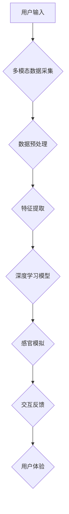

> 人工智能，感官体验，多模态融合，深度学习，神经网络，交互设计

## 1. 背景介绍

人类的感知世界的方式是多维度的，我们通过视觉、听觉、触觉、嗅觉和味觉等感官接收信息，并将其整合形成完整的认知体验。然而，传统的计算机系统主要依赖于文本和数字数据，缺乏对多模态信息的理解和处理能力。近年来，随着人工智能技术的飞速发展，特别是深度学习的突破，AI系统开始具备模拟人类感官体验的能力，为我们创造全新的交互方式和体验。

## 2. 核心概念与联系

**2.1 多模态融合**

多模态融合是指将来自不同模态（如文本、图像、音频、视频等）的信息进行整合和分析，以获得更全面、更深入的理解。

**2.2 感官模拟**

感官模拟是指利用AI技术模拟人类的感官感知机制，例如通过深度学习模型生成逼真的图像、音频或触觉反馈。

**2.3 交互设计**

交互设计是指设计用户与系统之间交互的方式，以确保用户体验流畅、自然和愉悦。

**2.4  AI感官协奏曲架构**



## 3. 核心算法原理 & 具体操作步骤

**3.1 算法原理概述**

AI感官协奏曲的核心算法原理是基于深度学习，特别是卷积神经网络（CNN）、循环神经网络（RNN）和生成对抗网络（GAN）等模型。这些模型能够学习数据中的复杂模式和关系，并生成逼真的感官体验。

**3.2 算法步骤详解**

1. **数据采集:** 收集来自不同模态（如文本、图像、音频）的数据。
2. **数据预处理:** 对数据进行清洗、转换和增强，使其适合深度学习模型的训练。
3. **特征提取:** 利用CNN、RNN等模型提取数据的特征，例如图像中的物体、音频中的音调等。
4. **模型训练:** 利用深度学习模型训练，学习数据之间的关系和模式。
5. **感官模拟:** 利用训练好的模型生成逼真的感官体验，例如生成图像、音频或触觉反馈。
6. **交互反馈:** 将生成的感官体验反馈给用户，并根据用户的反馈进行调整和优化。

**3.3 算法优缺点**

**优点:**

* 能够模拟人类的多模态感知体验。
* 能够学习数据中的复杂模式和关系。
* 能够生成逼真的感官体验。

**缺点:**

* 需要大量的训练数据。
* 计算资源需求高。
* 难以解释模型的决策过程。

**3.4 算法应用领域**

* **虚拟现实 (VR) 和增强现实 (AR):** 创建更沉浸式的虚拟环境和增强现实体验。
* **游戏:** 生成更逼真的游戏场景和角色。
* **教育:** 提供更生动的学习体验。
* **医疗:** 用于诊断和治疗疾病。
* **艺术创作:** 创作新的艺术作品。

## 4. 数学模型和公式 & 详细讲解 & 举例说明

**4.1 数学模型构建**

AI感官协奏曲的数学模型通常基于神经网络，其中每个神经元都代表一个特征或概念。神经元之间通过连接和权重进行信息传递，学习数据之间的关系。

**4.2 公式推导过程**

神经网络的训练过程基于反向传播算法，其核心公式是梯度下降法。梯度下降法用于更新神经网络的权重，使其能够更好地拟合数据。

**4.3 案例分析与讲解**

例如，在图像生成任务中，可以使用GAN模型生成逼真的图像。GAN模型由两个网络组成：生成器和鉴别器。生成器网络负责生成图像，鉴别器网络负责判断图像是否真实。这两个网络在对抗游戏中相互竞争，生成器网络试图生成更逼真的图像，而鉴别器网络试图识别出生成器生成的图像。

## 5. 项目实践：代码实例和详细解释说明

**5.1 开发环境搭建**

可以使用Python语言和深度学习框架（如TensorFlow、PyTorch）开发AI感官协奏曲项目。

**5.2 源代码详细实现**

以下是一个简单的图像生成代码示例，使用TensorFlow框架实现：

```python
import tensorflow as tf

# 定义生成器网络
def generator(z):
  # ...

# 定义鉴别器网络
def discriminator(x):
  # ...

# 训练过程
optimizer = tf.keras.optimizers.Adam()
for epoch in range(num_epochs):
  # ...
```

**5.3 代码解读与分析**

代码中定义了生成器和鉴别器网络，并使用Adam优化器进行训练。训练过程包括生成器生成图像，鉴别器判断图像是否真实，并根据反馈更新生成器和鉴别器的权重。

**5.4 运行结果展示**

训练完成后，可以利用生成器网络生成逼真的图像。

## 6. 实际应用场景

**6.1 虚拟现实 (VR) 和增强现实 (AR):**

AI感官协奏曲可以为VR和AR体验增添更多感官刺激，例如生成逼真的环境音效、触觉反馈和气味模拟，从而提升用户沉浸感和参与度。

**6.2 游戏:**

AI感官协奏曲可以为游戏创造更逼真的视觉、听觉和触觉体验，例如生成逼真的角色动作、环境音效和武器反馈，从而提升游戏乐趣和沉浸感。

**6.3 教育:**

AI感官协奏曲可以为教育提供更生动的学习体验，例如生成逼真的虚拟实验室、历史场景和生物模型，从而提升学生的学习兴趣和理解能力。

**6.4 未来应用展望:**

随着AI技术的不断发展，AI感官协奏曲将在更多领域得到应用，例如医疗诊断、艺术创作、情感交互等。

## 7. 工具和资源推荐

**7.1 学习资源推荐:**

* 深度学习书籍：
    * 《深度学习》
    * 《动手学深度学习》
* 在线课程：
    * Coursera 深度学习课程
    * Udacity 深度学习工程师 Nanodegree

**7.2 开发工具推荐:**

* 深度学习框架：
    * TensorFlow
    * PyTorch
* 图像处理库：
    * OpenCV
* 音频处理库：
    * Librosa

**7.3 相关论文推荐:**

* Generative Adversarial Networks
* Deep Convolutional Generative Adversarial Networks for Image Synthesis

## 8. 总结：未来发展趋势与挑战

**8.1 研究成果总结:**

AI感官协奏曲的研究取得了显著进展，能够模拟人类的多模态感知体验，并应用于多个领域。

**8.2 未来发展趋势:**

* 更逼真的感官模拟：
* 更广泛的应用场景：
* 更智能的交互设计：

**8.3 面临的挑战:**

* 数据获取和标注：
* 计算资源需求：
* 模型解释性和可信度：

**8.4 研究展望:**

未来，AI感官协奏曲的研究将继续朝着更逼真、更智能、更广泛的方向发展，为人类创造更加丰富多彩的数字体验。

## 9. 附录：常见问题与解答

**9.1 如何选择合适的深度学习模型？**

选择合适的深度学习模型取决于具体的应用场景和数据类型。例如，图像生成任务可以使用GAN模型，文本生成任务可以使用RNN模型。

**9.2 如何训练AI感官协奏曲模型？**

训练AI感官协奏曲模型需要大量的训练数据和计算资源。可以使用深度学习框架（如TensorFlow、PyTorch）进行训练，并使用梯度下降法优化模型参数。

**9.3 如何评估AI感官协奏曲模型的性能？**

评估AI感官协奏曲模型的性能可以使用多种指标，例如图像生成任务中的PSNR、SSIM指标，文本生成任务中的BLEU、ROUGE指标。

作者：禅与计算机程序设计艺术 / Zen and the Art of Computer Programming


<end_of_turn>