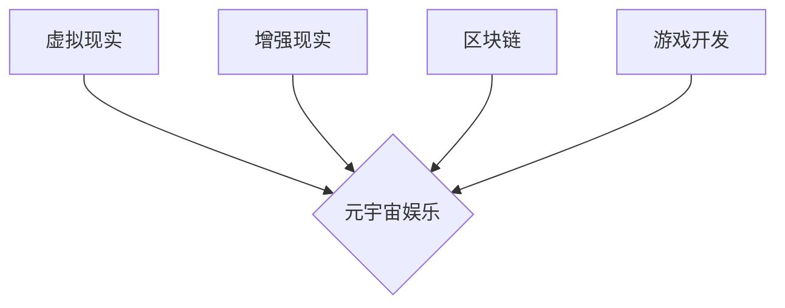

> 元宇宙、沉浸式体验、虚拟现实、增强现实、区块链、游戏开发、娱乐产业

## 1. 背景介绍

元宇宙的概念近年来备受关注，它被描绘成一个由虚拟世界、增强现实和区块链技术构成的融合网络，将现实世界与数字世界紧密连接。在这个充满无限潜力的虚拟世界中，娱乐产业将迎来一场前所未有的变革。

传统的娱乐模式，例如电影、游戏和音乐会，往往局限于物理空间和时间。元宇宙的出现，打破了这些限制，为用户提供了一种全新的沉浸式体验。用户可以身临其境地参与虚拟世界，与虚拟角色互动，体验虚拟故事，甚至创造自己的虚拟世界。

## 2. 核心概念与联系

元宇宙娱乐的核心概念包括：

* **虚拟现实 (VR):** 利用头戴式显示器和手柄等设备，模拟真实世界的环境和交互体验。
* **增强现实 (AR):** 利用摄像头和投影技术，将虚拟元素叠加到现实世界中，增强现实世界的体验。
* **区块链:** 提供去中心化的、安全可靠的数字资产管理和交易平台，保障用户在元宇宙中的权益和财产安全。
* **游戏开发:** 元宇宙娱乐的核心内容之一，利用游戏引擎和技术，构建虚拟世界和游戏体验。

**核心概念架构图:**



## 3. 核心算法原理 & 具体操作步骤

### 3.1  算法原理概述

元宇宙娱乐的核心算法原理主要包括：

* **3D建模和渲染:** 创建虚拟世界的场景和物体，并将其以逼真的方式呈现给用户。
* **物理模拟:** 模拟虚拟世界的物理规则，例如重力、碰撞和运动，使虚拟世界更加真实。
* **人工智能 (AI):** 利用AI技术，赋予虚拟角色智能行为，使虚拟世界更加生动和互动。

### 3.2  算法步骤详解

**3D建模和渲染:**

1. 使用3D建模软件创建虚拟世界的场景和物体。
2. 将3D模型导入渲染引擎，并设置渲染参数，例如光照、材质和阴影。
3. 渲染引擎根据设置的参数，将3D模型渲染成图像，并将其显示给用户。

**物理模拟:**

1. 建立虚拟世界的物理模型，定义物理规则和参数。
2. 使用物理引擎模拟物体之间的碰撞、摩擦和运动。
3. 根据物理模拟的结果，更新虚拟世界的状态，并将其渲染给用户。

**人工智能 (AI):**

1. 使用机器学习算法训练虚拟角色的智能行为模型。
2. 根据用户的输入和虚拟世界的状态，预测虚拟角色的下一步行动。
3. 控制虚拟角色的运动和对话，使其表现出智能的行为。

### 3.3  算法优缺点

**优点:**

* 能够创造逼真的虚拟世界和沉浸式的体验。
* 可以模拟复杂的物理现象和智能行为。
* 为用户提供互动性和创造性的体验。

**缺点:**

* 算法复杂度高，需要强大的计算能力。
* 渲染和物理模拟需要消耗大量资源。
* AI算法的训练和优化需要大量数据和时间。

### 3.4  算法应用领域

* **游戏开发:** 创建沉浸式的游戏体验，例如角色扮演游戏、动作冒险游戏和模拟游戏。
* **影视制作:** 制作虚拟场景和特效，增强电影和电视剧的视觉效果。
* **教育培训:** 创建虚拟课堂和模拟环境，提供沉浸式的学习体验。
* **医疗保健:** 用于手术模拟、疾病诊断和康复训练。

## 4. 数学模型和公式 & 详细讲解 & 举例说明

### 4.1  数学模型构建

元宇宙娱乐的数学模型主要用于描述虚拟世界的物理特性、用户交互行为和虚拟资产的交易规则。

**物理模型:**

* **牛顿运动定律:** 描述物体运动的规律，用于模拟虚拟世界的物理运动。
* **弹性碰撞模型:** 描述物体碰撞时的弹性恢复，用于模拟物体之间的碰撞行为。
* **流体动力学模型:** 描述流体的运动和流动，用于模拟虚拟世界的液体和气体效果。

**用户交互模型:**

* **行为预测模型:** 利用机器学习算法预测用户的行为模式，例如点击、滑动和购买行为。
* **情感识别模型:** 利用自然语言处理和计算机视觉技术识别用户的虚拟世界中的情感状态。
* **社交网络模型:** 描述用户在虚拟世界中的社交关系和互动模式。

**虚拟资产模型:**

* **加密货币模型:** 利用区块链技术创建虚拟货币，用于虚拟世界的交易和支付。
* **NFT模型:** 利用非同质化代币 (NFT) 技术创建独特的虚拟资产，例如虚拟物品、虚拟土地和虚拟角色。

### 4.2  公式推导过程

**牛顿运动定律:**

* **F = ma:** 其中，F是力，m是质量，a是加速度。

**弹性碰撞模型:**

* **v1' = (e * (v1 - v2)) + v2:** 其中，v1和v2是碰撞前两个物体的速度，v1'是碰撞后第一个物体的速度，e是碰撞弹性系数。

### 4.3  案例分析与讲解

**案例:**

一个虚拟角色在虚拟世界中行走，遇到一个障碍物。

**分析:**

1. 利用牛顿运动定律计算角色与障碍物的碰撞力。
2. 利用弹性碰撞模型计算角色与障碍物碰撞后的速度变化。
3. 更新角色的位置和速度，使其绕过障碍物。

## 5. 项目实践：代码实例和详细解释说明

### 5.1  开发环境搭建

* **操作系统:** Windows、macOS或Linux
* **编程语言:** C++、Python或Java
* **游戏引擎:** Unity、Unreal Engine或Godot
* **虚拟现实头显:** Oculus Rift、HTC Vive或Valve Index

### 5.2  源代码详细实现

```python
# 虚拟角色移动代码示例 (Python)

class Character:
    def __init__(self, position, speed):
        self.position = position
        self.speed = speed

    def move(self, direction):
        if direction == "forward":
            self.position[0] += self.speed
        elif direction == "backward":
            self.position[0] -= self.speed
        elif direction == "left":
            self.position[1] -= self.speed
        elif direction == "right":
            self.position[1] += self.speed

# 示例用法
character = Character(position=[0, 0], speed=5)
character.move("forward")
print(character.position)
```

### 5.3  代码解读与分析

* **Character类:** 定义了一个虚拟角色的类，包含位置和速度属性。
* **move方法:** 根据传入的方向，更新虚拟角色的位置。
* **示例用法:** 创建一个虚拟角色，并使其向前移动。

### 5.4  运行结果展示

运行上述代码，将输出虚拟角色移动后的位置坐标。

## 6. 实际应用场景

### 6.1  游戏娱乐

* **沉浸式游戏体验:** VR和AR技术可以为用户提供更加沉浸式的游戏体验，例如在虚拟世界中与其他玩家互动、探索虚拟环境和完成任务。
* **虚拟世界社交:** 元宇宙可以为用户提供一个虚拟世界社交平台，用户可以创建自己的虚拟形象，与其他用户互动，参加虚拟活动。
* **虚拟演唱会和演出:** AR和VR技术可以为用户提供虚拟演唱会和演出的体验，用户可以身临其境地感受音乐和表演。

### 6.2  教育培训

* **虚拟课堂:** 元宇宙可以创建虚拟课堂，用户可以与老师和同学互动，学习各种课程。
* **模拟训练:** 元宇宙可以模拟各种场景，例如手术模拟、飞行模拟和驾驶模拟，为用户提供沉浸式的培训体验。
* **虚拟博物馆和旅游:** 元宇宙可以创建虚拟博物馆和旅游景点，用户可以虚拟参观博物馆和旅游景点，了解历史文化和地理环境。

### 6.3  商业应用

* **虚拟试衣间:** 用户可以利用AR技术在虚拟试衣间试穿衣服，体验不同的搭配效果。
* **虚拟产品展示:** 企业可以利用VR技术创建虚拟产品展示厅，展示产品的功能和特点。
* **虚拟会议和培训:** 元宇宙可以为企业提供虚拟会议和培训平台，用户可以远程参加会议和培训，提高工作效率。

### 6.4  未来应用展望

元宇宙娱乐的应用场景将更加广泛，例如：

* **元宇宙体育:** 用户可以参与虚拟体育比赛，例如虚拟足球、虚拟篮球和虚拟跑步。
* **元宇宙艺术:** 用户可以创作和欣赏虚拟艺术作品，例如虚拟绘画、虚拟雕塑和虚拟音乐。
* **元宇宙社交:** 元宇宙将成为一个更加沉浸式和社交化的虚拟世界，用户可以创建自己的虚拟形象，与其他用户互动，参加虚拟活动。

## 7. 工具和资源推荐

### 7.1  学习资源推荐

* **书籍:**
    * 《元宇宙：下一代互联网》
    * 《虚拟现实技术》
    * 《增强现实技术》
* **在线课程:**
    * Coursera: 虚拟现实开发
    * Udemy: 增强现实开发
    * edX: 元宇宙技术

### 7.2  开发工具推荐

* **游戏引擎:** Unity、Unreal Engine、Godot
* **虚拟现实头显:** Oculus Rift、HTC Vive、Valve Index
* **编程语言:** C++、Python、Java

### 7.3  相关论文推荐

* **元宇宙的定义和发展趋势**
* **元宇宙娱乐的应用场景和技术挑战**
* **元宇宙的伦理和社会影响**

## 8. 总结：未来发展趋势与挑战

### 8.1  研究成果总结

元宇宙娱乐是一个充满无限潜力的领域，它将改变我们娱乐、学习和工作的方式。

### 8.2  未来发展趋势

* **技术进步:** VR、AR和AI技术的不断进步将推动元宇宙娱乐的发展。
* **内容丰富:** 元宇宙娱乐的内容将更加丰富多样，例如虚拟游戏、虚拟音乐会和虚拟社交平台。
* **用户体验提升:** 元宇宙娱乐的用户体验将更加沉浸式和互动性。

### 8.3  面临的挑战

* **技术瓶颈:** 元宇宙娱乐的技术发展还面临一些瓶颈，例如计算能力、渲染性能和网络带宽。
* **内容创作:** 元宇宙娱乐的内容创作需要大量的人力和时间投入。
* **用户隐私和安全:** 元宇宙娱乐的用户隐私和安全需要得到保障。

### 8.4  研究展望

未来，元宇宙娱乐的研究将集中在以下几个方面:

* **提高沉浸式体验:** 研究更逼真的虚拟现实和增强现实技术。
* **开发更智能的虚拟角色:** 研究更先进的人工智能算法，赋予虚拟角色更智能的行为。
* **构建更安全的虚拟世界:** 研究更有效的用户隐私和安全保护机制。

## 9. 附录：常见问题与解答

**常见问题:**

* **元宇宙娱乐和虚拟现实有什么区别？**
* **元宇宙娱乐的安全性如何保证？**
* **元宇宙娱乐对社会有什么影响？**

**解答:**

* **元宇宙娱乐和虚拟现实的区别:** 虚拟现实是元宇宙娱乐的一种技术手段，它通过头戴式显示器和手柄等设备，模拟真实世界的环境和交互体验。元宇宙娱乐是一个更广义的概念，它包括虚拟现实、增强现实、区块链等多种技术，构建一个虚拟世界，用户可以在其中生活、工作和娱乐。
* **元宇宙娱乐的安全性:** 元宇宙娱乐的安全性需要通过多种技术手段保障，例如加密货币、区块链技术和身份验证系统。
* **元宇宙娱乐对社会的影響:** 元宇宙娱乐对社会的影响是多方面的，它既可以带来新的娱乐方式和社交平台，也可以带来一些挑战，例如虚拟世界中的犯罪和虚拟资产的泡沫化。


作者：禅与计算机程序设计艺术 / Zen and the Art of Computer Programming 


