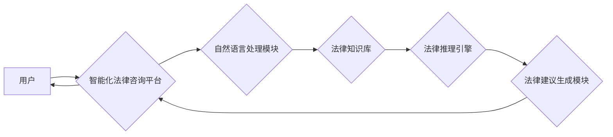

> 全球脑，法律人工智能，智能化法律咨询，自然语言处理，深度学习，法律推理，知识图谱，伦理问题

## 1. 背景介绍

随着人工智能技术的飞速发展，其应用领域不断拓展，法律领域也不例外。传统法律服务模式面临着效率低下、成本高昂、服务不均等问题。而人工智能技术的介入，为法律服务带来了新的机遇和挑战。

智能化法律咨询服务作为人工智能在法律领域的应用之一，旨在利用人工智能技术，为用户提供便捷、高效、智能的法律咨询服务。它可以帮助用户快速了解法律知识，解答法律疑问，并提供个性化的法律建议。

## 2. 核心概念与联系

**2.1 全球脑**

全球脑是一个由众多计算节点组成的超级计算机网络，其目标是模拟和超越人类大脑的认知能力。它通过分布式计算、大数据处理和人工智能算法，实现对海量信息的处理和分析，并具备学习、推理、决策等高级认知功能。

**2.2 法律人工智能**

法律人工智能是指利用人工智能技术，解决法律问题和提供法律服务的应用。它涵盖了自然语言处理、深度学习、法律推理、知识图谱等多个领域。

**2.3 智能化法律咨询服务**

智能化法律咨询服务是将全球脑和法律人工智能相结合，为用户提供智能化的法律咨询服务。它利用全球脑的强大计算能力和海量数据处理能力，以及法律人工智能的法律知识和推理能力，为用户提供更精准、更全面的法律咨询服务。

**2.4 架构图**



## 3. 核心算法原理 & 具体操作步骤

**3.1 算法原理概述**

智能化法律咨询服务的核心算法主要包括自然语言处理、法律知识库构建、法律推理引擎和法律建议生成模块。

* **自然语言处理 (NLP)**：用于理解和处理用户的自然语言输入，将其转换为机器可理解的格式。
* **法律知识库构建**：构建包含法律法规、案例判例、法律条文等法律知识的数据库。
* **法律推理引擎**：利用逻辑推理和规则引擎，根据用户的法律问题和法律知识库中的信息，进行法律推理，得出法律结论。
* **法律建议生成模块**：根据法律推理的结果，生成符合法律法规和用户需求的法律建议。

**3.2 算法步骤详解**

1. **用户输入**: 用户通过文本或语音的方式输入法律问题。
2. **自然语言处理**: NLP模块对用户的输入进行分析，识别关键词、句法结构等，并将其转换为机器可理解的格式。
3. **知识库检索**: 法律知识库模块根据用户的输入，检索相关法律法规、案例判例和法律条文。
4. **法律推理**: 法律推理引擎根据检索到的法律知识和用户的输入，进行逻辑推理，得出可能的法律结论。
5. **法律建议生成**: 法律建议生成模块根据法律推理的结果，生成符合法律法规和用户需求的法律建议。
6. **结果输出**: 系统将法律建议以文本或语音的方式输出给用户。

**3.3 算法优缺点**

**优点**:

* **效率高**: 智能化法律咨询服务可以快速处理大量法律咨询请求，提高法律服务效率。
* **成本低**: 相比传统法律服务，智能化法律咨询服务成本更低，更易于普及。
* **服务更广泛**: 智能化法律咨询服务可以覆盖更广泛的法律领域，为更多用户提供法律服务。

**缺点**:

* **法律知识局限**: 目前法律人工智能技术还处于发展阶段，法律知识库的覆盖面和深度有限。
* **推理能力不足**: 法律推理是一个复杂的过程，人工智能技术在法律推理方面的能力还不足以完全替代人类律师。
* **伦理问题**: 智能化法律咨询服务涉及到法律伦理问题，需要谨慎处理。

**3.4 算法应用领域**

* **法律咨询**: 为用户提供法律咨询服务，解答法律疑问，提供法律建议。
* **法律合规**: 帮助企业进行法律合规性审查，识别法律风险。
* **法律研究**: 为法律研究提供数据支持，辅助法律分析和决策。
* **法律教育**: 为法律教育提供新的教学模式，提高法律学习效率。

## 4. 数学模型和公式 & 详细讲解 & 举例说明

**4.1 数学模型构建**

智能化法律咨询服务可以利用数学模型来表示法律知识和推理规则。例如，可以使用图论模型来表示法律关系，使用逻辑公式来表示法律规则。

**4.2 公式推导过程**

例如，可以使用以下逻辑公式来表示法律规则：

* 如果 A 且 B，则 C

其中，A、B、C 是法律概念，例如：

* A：合同签订
* B：合同内容合法
* C：合同有效

**4.3 案例分析与讲解**

假设用户咨询：

* 我和朋友签订了一份合同，合同内容是否合法？

系统可以根据用户输入和法律知识库中的信息，推导以下逻辑：

* 用户输入：合同签订，需要判断合同内容是否合法。
* 法律规则：如果 A 且 B，则 C，其中 A：合同签订，B：合同内容合法，C：合同有效。
* 系统推理：需要判断 B：合同内容合法。

系统可以根据法律知识库中的信息，分析合同内容是否合法，并给出相应的法律建议。

## 5. 项目实践：代码实例和详细解释说明

**5.1 开发环境搭建**

* 操作系统：Ubuntu 20.04
* Python 版本：3.8
* 虚拟环境：venv

**5.2 源代码详细实现**

```python
# 法律知识库
legal_knowledge = {
    "合同": {
        "合法性": ["双方自愿", "内容明确", "形式合法"],
    },
}

# 自然语言处理模块
def process_user_input(user_input):
    # 对用户输入进行分析，识别关键词等
    # ...

# 法律推理引擎
def legal_inference(user_input, legal_knowledge):
    # 根据用户输入和法律知识库进行推理
    # ...

# 法律建议生成模块
def generate_legal_advice(inference_result):
    # 根据推理结果生成法律建议
    # ...

# 主程序
if __name__ == "__main__":
    user_input = input("请输入您的法律问题：")
    processed_input = process_user_input(user_input)
    inference_result = legal_inference(processed_input, legal_knowledge)
    legal_advice = generate_legal_advice(inference_result)
    print(f"法律建议：{legal_advice}")
```

**5.3 代码解读与分析**

* 代码首先定义了一个法律知识库，包含了法律概念和相关规则。
* 自然语言处理模块负责对用户输入进行分析，识别关键词等。
* 法律推理引擎根据用户输入和法律知识库进行推理，得出法律结论。
* 法律建议生成模块根据推理结果生成法律建议。

**5.4 运行结果展示**

用户输入：

* 我和朋友签订了一份合同，合同内容是否合法？

系统输出：

* 为了判断合同内容是否合法，请提供更多信息，例如合同内容、双方身份等。

## 6. 实际应用场景

智能化法律咨询服务可以应用于以下场景：

* **个人法律咨询**: 为个人用户提供法律咨询服务，解答法律疑问，提供法律建议。
* **企业法律合规**: 帮助企业进行法律合规性审查，识别法律风险，避免法律纠纷。
* **法律研究**: 为法律研究提供数据支持，辅助法律分析和决策。
* **法律教育**: 为法律教育提供新的教学模式，提高法律学习效率。

**6.4 未来应用展望**

未来，智能化法律咨询服务将更加智能化、个性化和便捷化。

* **更智能的法律推理**: 利用深度学习等人工智能技术，提高法律推理的准确性和效率。
* **更个性化的法律建议**: 根据用户的具体情况和需求，提供更个性化的法律建议。
* **更便捷的交互方式**: 支持语音、图像等多种交互方式，更加方便用户使用。

## 7. 工具和资源推荐

**7.1 学习资源推荐**

* **书籍**:
    * 《人工智能：一种现代方法》
    * 《深度学习》
    * 《自然语言处理》
* **在线课程**:
    * Coursera: 自然语言处理
    * edX: 深度学习
    * Udacity: 人工智能工程师

**7.2 开发工具推荐**

* **Python**: 广泛应用于人工智能开发，拥有丰富的库和工具。
* **TensorFlow**: 深度学习框架，用于构建和训练深度学习模型。
* **PyTorch**: 深度学习框架，灵活易用，适合研究和开发。
* **spaCy**: 自然语言处理库，用于文本分析、实体识别等任务。

**7.3 相关论文推荐**

* **BERT**: Bidirectional Encoder Representations from Transformers
* **GPT-3**: Generative Pre-trained Transformer 3
* **XLNet**: Generalized Autoregressive Pretraining for Language Understanding

## 8. 总结：未来发展趋势与挑战

**8.1 研究成果总结**

智能化法律咨询服务是一个新兴的领域，近年来取得了显著进展。自然语言处理、深度学习等人工智能技术为法律服务带来了新的机遇和挑战。

**8.2 未来发展趋势**

* **更智能的法律推理**: 利用深度学习等人工智能技术，提高法律推理的准确性和效率。
* **更个性化的法律建议**: 根据用户的具体情况和需求，提供更个性化的法律建议。
* **更便捷的交互方式**: 支持语音、图像等多种交互方式，更加方便用户使用。

**8.3 面临的挑战**

* **法律知识的覆盖面和深度**: 目前法律人工智能技术还处于发展阶段，法律知识库的覆盖面和深度有限。
* **法律推理的复杂性**: 法律推理是一个复杂的过程，人工智能技术在法律推理方面的能力还不足以完全替代人类律师。
* **法律伦理问题**: 智能化法律咨询服务涉及到法律伦理问题，需要谨慎处理。

**8.4 研究展望**

未来，需要进一步加强法律人工智能技术的研发，构建更完善的法律知识库，提高法律推理的准确性和效率，并解决法律伦理问题，推动智能化法律咨询服务更好地服务于社会。

## 9. 附录：常见问题与解答

**9.1 Q: 智能化法律咨询服务可以完全替代人类律师吗？**

**A:** 目前，智能化法律咨询服务还不能完全替代人类律师。法律问题往往复杂多变，需要人类律师的专业知识、经验和判断力来进行分析和解决。

**9.2 Q: 智能化法律咨询服务是否安全可靠？**

**A:** 智能化法律咨询服务需要严格保护用户的隐私信息和法律数据安全。选择信誉良好的平台和服务提供商，并注意保护自己的个人信息。

**9.3 Q: 如何使用智能化法律咨询服务？**

**A:** 使用智能化法律咨询服务通常需要注册账号，然后输入您的法律问题，系统会根据您的问题提供相应的法律建议。

作者：禅与计算机程序设计艺术 / Zen and the Art of Computer Programming


<end_of_turn>