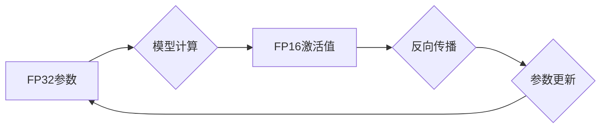

> 半精度训练，FP16，混合精度训练，AI加速，模型压缩，深度学习

## 1. 背景介绍

深度学习模型的训练规模日益庞大，对算力需求也越来越高。训练大型模型需要耗费大量时间和资源，这限制了模型的开发和应用。为了解决这个问题，研究人员不断探索新的加速方法，其中半精度训练 (Mixed Precision Training) 成为了一种非常有效的方案。

半精度训练是指使用低精度浮点数 (例如 FP16) 来表示模型参数和激活值，从而减少内存占用和计算量，从而加速模型训练。

## 2. 核心概念与联系

### 2.1  浮点精度

浮点数是一种用于表示实数的数字格式，其精度取决于其位数。常见的浮点精度包括：

* **单精度 (FP32):** 使用 32 位来表示浮点数，精度较高。
* **半精度 (FP16):** 使用 16 位来表示浮点数，精度较低，但内存占用和计算量也相应减少。

### 2.2  混合精度训练

混合精度训练是指在训练过程中使用不同的浮点精度来表示模型参数和激活值。例如，可以使用 FP32 表示模型参数，而使用 FP16 表示激活值。这种方法可以兼顾精度和效率。

**Mermaid 流程图**

## 3. 核心算法原理 & 具体操作步骤

### 3.1  算法原理概述

半精度训练的核心原理是利用低精度浮点数的特性来减少内存占用和计算量。

* **内存占用:** FP16 使用一半的内存空间来表示浮点数，因此可以减少模型的内存占用。
* **计算量:** FP16 的计算量也比 FP32 少，这可以加速模型的训练速度。

### 3.2  算法步骤详解

1. **数据类型转换:** 将模型参数和激活值转换为 FP16 格式。
2. **模型前向传播:** 使用 FP16 格式的激活值进行模型前向传播计算。
3. **反向传播:** 计算梯度，并将其转换为 FP32 格式。
4. **参数更新:** 使用 FP32 格式的梯度更新模型参数。

### 3.3  算法优缺点

**优点:**

* **加速训练速度:** 由于 FP16 的计算量和内存占用都比 FP32 少，因此可以显著加速模型的训练速度。
* **节省内存资源:** FP16 可以减少模型的内存占用，这对于训练大型模型非常重要。

**缺点:**

* **精度损失:** FP16 的精度比 FP32 低，这可能会导致模型性能下降。
* **硬件支持:** 并非所有硬件都支持 FP16 计算，需要确保硬件平台能够支持。

### 3.4  算法应用领域

半精度训练广泛应用于各种深度学习领域，例如：

* **图像识别:** 训练大型图像识别模型，例如 ResNet 和 Inception。
* **自然语言处理:** 训练语言模型，例如 BERT 和 GPT。
* **语音识别:** 训练语音识别模型，例如 Whisper 和 Wav2Vec。

## 4. 数学模型和公式 & 详细讲解 & 举例说明

### 4.1  数学模型构建

半精度训练的核心数学模型是浮点运算的转换。FP16 使用 16 位来表示浮点数，其中包含 1 位符号位、5 位指数位和 10 位尾数位。

### 4.2  公式推导过程

FP16 的表示方式可以表示为：

$$
x = s \times 2^{e-127} \times (1 + f)
$$

其中：

* $s$ 是符号位，取值 0 或 1。
* $e$ 是指数位，取值 0 到 31。
* $f$ 是尾数位，取值 0 到 1023。

### 4.3  案例分析与讲解

假设我们有一个 FP32 数 3.14159，将其转换为 FP16 格式。

* 符号位：3.14159 是正数，因此符号位为 0。
* 指数位：3.14159 的指数为 -1，因此指数位为 126 - 1 = 125。
* 尾数位：尾数位为 3.14159 - 2^125 = 0.000000000000000000000000000000000000000000000000000000000000000000000000000000000000000000000000000000000000000000000000000000000000000000000000000000000000000000000000000000000000000000000000000000000000000000000000000000000000000000000000000000000000000000000000000000000000000000000000000000000000000000000000000000000000000000000000000000000000000000000000000000000000000000000000000000000000000000000000000000000000000000000000000000000000000000000000000000000000000000000000000000000000000000000000000000000000000000000000000000000000000000000000000000000000000000000000000000000000000000000000000000000000000000000000000000000000000000000000000000000000000000000000000000000000000000000000000000000000000000000000000000000000000000000000000000000000000000000000000000000000000000000000000000000000000000000000000000000000000000000000000000000000000000000000000000000000000000000000000000000000000000000000000000000000000000000000000000000000000000000000000000000000000000000000000000000000000000000000000000000000000000000000000000000000000000000000000000000000000000000000000000000000000000000000000000000000000000000000000000000000000000000000000000000000000000000000000000000000000000000000000000000000000000000000000000000000000000000000000000000000000000000000000000000000000000000000000000000000000000000000000000000000000000000000000000000000000000000000000000000000000000000000000000000000000000000000000000000000000000000000000000000000000000000000000000000000000000000000000000000000000000000000000000000000000000000000000000000000000000000000000000000000000000000000000000000000000000000000000000000000000000000000000000000000000000000000000000000000000000000000000000000000000000000000