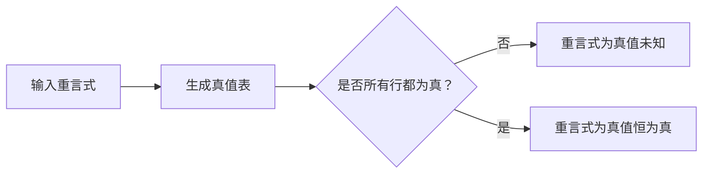

                 

逻辑学、重言式、真值表、命题逻辑、谓词逻辑

## 1. 背景介绍

数理逻辑是数学和逻辑学的交叉学科，它研究逻辑推理的数学基础。重言式是数理逻辑中的一个重要概念，它是一种总是为真（或总是为假）的命题逻辑表达式。本章将介绍重言式的概念、分类、真值表、以及在命题逻辑和谓词逻辑中的应用。

## 2. 核心概念与联系

### 2.1 重言式的概念

重言式是一种总是为真（或总是为假）的命题逻辑表达式。它是由逻辑连接词（如与、或、非）和命题变量（如p、q、r）组成的表达式。重言式的真值是不依赖于命题变量的真值的。

### 2.2 重言式的分类

重言式可以分为以下几类：

- **真值恒为真（tautology）**：无论命题变量的真值如何，总是为真的重言式。例如，$p \vee \neg p$。
- **真值恒为假（contradiction）**：无论命题变量的真值如何，总是为假的重言式。例如，$p \wedge \neg p$。
- **真值未知（contingency）**：真值可能为真也可能为假的重言式。例如，$p \vee q$。

### 2.3 重言式的真值表

真值表是一种表格，它列出了重言式中所有可能的命题变量真值组合及其对应的重言式真值。真值表可以帮助我们判断一个重言式是否为真值恒为真或真值恒为假。

例如，下面是重言式$p \vee \neg p$的真值表：

| p | $\neg p$ | $p \vee \neg p$ |
|---|---|---|
| T | F | T |
| F | T | T |
| U | U | U |

从真值表中可以看出，$p \vee \neg p$是真值恒为真的重言式。

### 2.4 Mermaid 流程图

下面是重言式判断流程的 Mermaid 流程图：

## 3. 核心算法原理 & 具体操作步骤

### 3.1 算法原理概述

判断重言式真值的算法原理是基于真值表的穷举法。算法的步骤是：生成重言式的真值表，然后判断真值表中是否所有行都为真。

### 3.2 算法步骤详解

1. **生成真值表**：对于重言式中的每个命题变量，列出所有可能的真值组合。然后，计算每个组合对应的重言式真值。
2. **判断真值表**：检查真值表中是否所有行都为真。如果是，则重言式为真值恒为真；如果不是，则重言式为真值未知。

### 3.3 算法优缺点

**优点**：该算法简单易懂，容易实现。

**缺点**：该算法的时间复杂度为$O(2^n)$，其中$n$是重言式中的命题变量数。对于大型重言式，该算法的效率可能会很低。

### 3.4 算法应用领域

重言式判断算法在逻辑推理、自动化推理系统、逻辑电路设计等领域有广泛应用。

## 4. 数学模型和公式 & 详细讲解 & 举例说明

### 4.1 数学模型构建

数学模型可以用来表示重言式。一种常用的数学模型是布尔代数。布尔代数是一种抽象代数结构，它由集合$B$和二元运算$\vee$，$\wedge$，$\neg$组成，满足以下公理：

1. $a \vee b = b \vee a$
2. $a \wedge b = b \wedge a$
3. $a \vee (b \vee c) = (a \vee b) \vee c$
4. $a \wedge (b \wedge c) = (a \wedge b) \wedge c$
5. $a \vee \neg a = 1$
6. $a \wedge \neg a = 0$
7. $\neg \neg a = a$

### 4.2 公式推导过程

重言式的真值可以通过布尔代数的公理进行推导。例如，考虑重言式$p \vee (q \wedge \neg p)$：

1. 使用公理1，将$p \vee (q \wedge \neg p)$改写为$(p \vee q) \wedge (p \vee \neg p)$。
2. 使用公理5，将$(p \vee \neg p)$改写为$1$。
3. 使用公理3，将$(p \vee q) \wedge 1$改写为$(p \vee q)$。

因此，$p \vee (q \wedge \neg p)$等价于$(p \vee q)$。

### 4.3 案例分析与讲解

下面是一个重言式真值判断的例子：

判断重言式$(p \vee q) \wedge (\neg p \vee \neg q)$的真值。

**解**：生成真值表：

| p | q | $\neg p$ | $\neg q$ | $p \vee q$ | $\neg p \vee \neg q$ | $(p \vee q) \wedge (\neg p \vee \neg q)$ |
|---|---|---|---|---|---|---|
| T | T | F | F | T | T | T |
| T | F | F | T | T | T | T |
| F | T | T | F | T | T | T |
| F | F | T | T | F | T | F |

从真值表中可以看出，重言式$(p \vee q) \wedge (\neg p \vee \neg q)$不是真值恒为真，而是真值未知。

## 5. 项目实践：代码实例和详细解释说明

### 5.1 开发环境搭建

本项目使用Python作为编程语言，并使用Pytho

