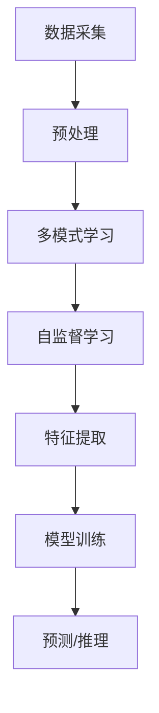

                 

**人工智能（AI）、机器学习（ML）、深度学习（DL）、自动驾驶、自然语言处理（NLP）、计算机视觉（CV）、AI 伦理、AI 2.0**

## 1. 背景介绍

自从人工智能（AI）概念于1956年提出以来，它已经从一项科学幻想变为现实，并深入到我们的日常生活中。从Siri到自动驾驶汽车，从推荐系统到医疗诊断，AI无处不在。然而，我们现在正处于一个新的转折点，即AI 2.0时代。本文将探讨AI 2.0的趋势，其核心概念，算法原理，数学模型，项目实践，实际应用场景，工具和资源推荐，以及未来发展趋势。

## 2. 核心概念与联系

AI 2.0的核心概念之一是**多模式学习（Multimodal Learning）**，它指的是从多种数据模式（如文本、图像、音频）中学习的能力。另一个关键概念是**自监督学习（Self-Supervised Learning）**，它允许模型在没有人工标签的情况下学习。这两个概念是相互关联的，因为多模式学习可以利用自监督学习来提取有意义的特征。

下面是这两个概念的关系的Mermaid流程图：

## 3. 核心算法原理 & 具体操作步骤

### 3.1 算法原理概述

**自监督学习**的一个常用方法是**对比学习（Contrastive Learning）**。它的原理是，模型学习将相似的数据视为正样本，将不相似的数据视为负样本。另一个方法是**预测未来（Predict Future）**，模型学习预测数据的未来状态。

**多模式学习**的一个常用方法是**联合表示学习（Joint Representation Learning）**。它的原理是，模型学习将多种模式的数据表示为共享的表示。

### 3.2 算法步骤详解

1. **对比学习**的步骤：
   - 将数据分为正样本对和负样本对。
   - 使用表示网络（如CNN或Transformer）将数据表示为向量。
   - 使用对比损失函数（如NT-Xent）训练模型。

2. **预测未来**的步骤：
   - 使用表示网络将数据表示为向量。
   - 使用自回归模型（如GRU或Transformer）预测数据的未来状态。
   - 使用均方误差（MSE）或交叉熵损失函数训练模型。

3. **联合表示学习**的步骤：
   - 使用表示网络（如CNN或Transformer）将每种模式的数据表示为向量。
   - 使用对比损失函数（如NT-Xent）或重构损失函数（如MSE）训练模型，以学习共享表示。

### 3.3 算法优缺点

**自监督学习**的优点是可以在没有人工标签的情况下学习，缺点是学习到的表示可能不适合特定的任务。

**多模式学习**的优点是可以从多种数据模式中学习，缺点是需要处理不同模式的数据，这可能会增加复杂性。

### 3.4 算法应用领域

**自监督学习**的应用领域包括无监督学习、半监督学习、自动标注等。

**多模式学习**的应用领域包括计算机视觉（CV）、自然语言处理（NLP）、跨模式推荐系统等。

## 4. 数学模型和公式 & 详细讲解 & 举例说明

### 4.1 数学模型构建

**对比学习**的数学模型可以表示为：

$$L_{NT-Xent}(z_i, z_j) = -log\frac{exp(sim(z_i, z_j)/\tau)}{exp(sim(z_i, z_j)/\tau) + \sum_{k=1}^{K}exp(sim(z_i, z_k)/\tau)}$$

其中，$z_i$和$z_j$是正样本对，$z_k$是负样本，$sim(\cdot, \cdot)$是余弦相似度，$K$是负样本数，$

