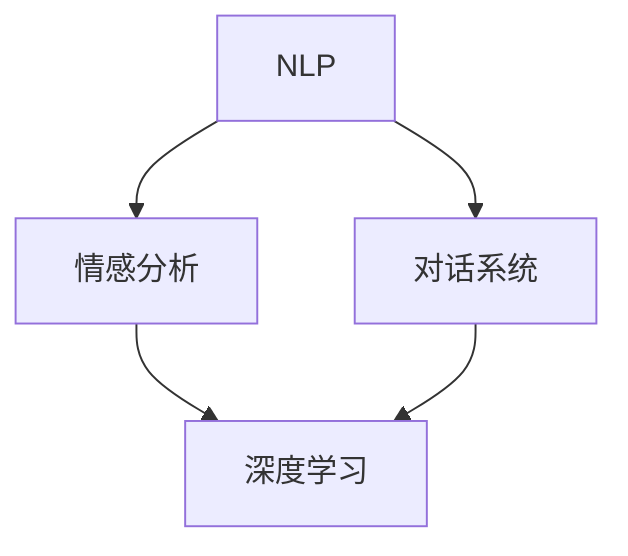

                 

**关键词：**人工智能、故事讲述、自然语言处理、深度学习、情感分析、对话系统

## 1. 背景介绍

在当今信息爆炸的时代，人工智能（AI）已经渗透到我们的日常生活中，从搜索引擎到智能助手，再到自动驾驶汽车。然而，大多数AI系统都缺乏一种关键的能力：讲故事。故事是人类交流和理解世界的基本方式，它可以传达情感、传递知识，并帮助我们建立共同的文化和经验。因此，构建能够讲故事的人工智能系统是一项具有挑战性但意义重大的任务。

## 2. 核心概念与联系

构建讲故事的人工智能系统需要涉及多个领域的知识，包括自然语言处理（NLP）、深度学习、情感分析和对话系统。图1展示了这些概念之间的关系。



### 2.1 自然语言处理（NLP）

NLP是人机交互的关键，它涉及使计算机能够理解、解释和生成人类语言的技术。在故事讲述的上下文中，NLP被用于分析和生成故事的文本。

### 2.2 情感分析

情感分析是NLP的一个子领域，它旨在识别和分析文本或语音中的情感。在故事讲述中，情感分析有助于理解故事的情感走向，并帮助AI系统生成具有情感的故事。

### 2.3 对话系统

对话系统是一种人机交互系统，它能够理解和生成人类语言，并与用户进行对话。在故事讲述中，对话系统可以帮助AI系统与用户互动，并根据用户的反馈调整故事的方向。

### 2.4 深度学习

深度学习是一种机器学习方法，它模仿人类大脑的结构和功能。在故事讲述中，深度学习模型可以用于生成故事的文本，并学习故事的结构和情感走向。

## 3. 核心算法原理 & 具体操作步骤

### 3.1 算法原理概述

构建讲故事的人工智能系统的核心是一个生成式模型，它能够根据输入的主题和情感生成故事的文本。这个模型通常基于深度学习，使用循环神经网络（RNN）或其变体（如长短期记忆网络（LSTM）或转换器）来生成故事的文本。

### 3.2 算法步骤详解

构建讲故事的人工智能系统的步骤如下：

1. **数据预处理：**收集和预处理故事数据，包括文本清洗、标记化和分词。
2. **特征提取：**提取故事文本的特征，如词汇特征、语法特征和语义特征。
3. **模型训练：**使用深度学习模型（如RNN或转换器）在故事数据上进行训练，学习故事的结构和情感走向。
4. **故事生成：**使用训练好的模型根据输入的主题和情感生成故事的文本。
5. **情感分析和调整：**使用情感分析模型分析故事的情感，并根据需要调整故事的方向。
6. **对话系统集成：**将故事生成模型集成到对话系统中，以便与用户互动。

### 3.3 算法优缺点

**优点：**

* 生成的故事具有多样性和创造性。
* 可以根据用户的偏好和反馈调整故事的方向。
* 可以学习和模仿人类故事的结构和情感走向。

**缺点：**

* 生成的故事可能包含不合理或不连贯的部分。
* 训练深度学习模型需要大量的故事数据。
* 评估故事质量是一项挑战，因为它涉及主观判断。

### 3.4 算法应用领域

构建讲故事的人工智能系统的应用领域包括：

* **教育：**AI系统可以讲述历史故事或科学故事，帮助学生理解复杂的概念。
* **娱乐：**AI系统可以生成互动故事，为用户提供个性化的娱乐体验。
* **心理治疗：**AI系统可以帮助心理治疗师通过讲故事来治疗创伤后应激障碍（PTSD）等疾病。
* **营销：**AI系统可以生成具有吸引力的故事，帮助企业推广其产品或服务。

## 4. 数学模型和公式 & 详细讲解 & 举例说明

### 4.1 数学模型构建

构建讲故事的人工智能系统的数学模型通常基于深度学习，使用循环神经网络（RNN）或其变体来生成故事的文本。RNN的数学模型可以表示为：

$$h_t = \tanh(W_{hh}h_{t-1} + W_{xh}x_t + b_h)$$
$$y_t = W_{hy}h_t + b_y$$

其中，$h_t$是时间步长$t$的隐藏状态，$x_t$是时间步长$t$的输入，$y_t$是时间步长$t$的输出，$W$和$b$是学习的权重和偏置。

### 4.2 公式推导过程

RNN的推导过程基于链式法则，它假设隐藏状态$h_t$是前一时间步长的隐藏状态$h_{t-1}$和当前输入$x_t$的函数。然后，输出$y_t$是当前隐藏状态$h_t$的函数。

### 4.3 案例分析与讲解

例如，假设我们想要构建一个故事生成模型，它根据输入的主题和情感生成故事的文本。我们可以使用转换器模型，它是一种基于注意力机制的模型，可以生成长度可变的序列。转换器模型的数学模型如下：

$$z_0 = E(x_0)$$
$$z_t = E(x_t) + \sum_{i=1}^{t-1} a_{ti} z_i$$
$$a_{ti} = \frac{\exp(e_{ti})}{\sum_{j=1}^{t-1} \exp(e_{tj})}$$
$$e_{ti} = a(z_i, z_t)$$
$$y_t = D(z_t)$$

其中，$E$和$D$是编码器和解码器，$x_t$是时间步长$t$的输入，$y_t$是时间步长$t$的输出，$z_t$是时间步长$t$的上下文向量，$a_{ti}$是注意力权重，$e_{ti}$是注意力分数，$a(\cdot, \cdot)$是注意力函数。

## 5. 项目实践：代码实例和详细解释说明

### 5.1 开发环境搭建

构建讲故事的人工智能系统需要一个Python开发环境，并安装以下库：

* TensorFlow或PyTorch（深度学学习库）
* NLTK（自然语言处理库）
* Transformers（转换器模型库）
* TextBlob（情感分析库）
* ChatterBot（对话系统库）

### 5.2 源代码详细实现

以下是构建讲故事的人工智能系统的源代码示例：

```python
import nltk
from nltk.corpus import stopwords
from nltk.tokenize import word_tokenize
from transformers import Transfo
```

