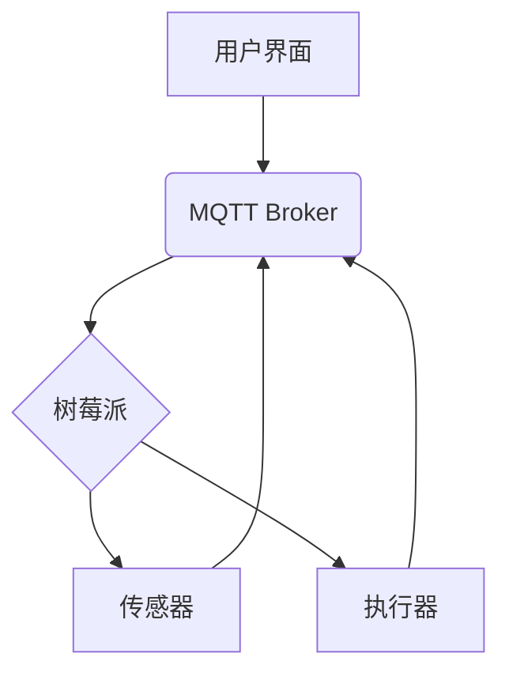

> 树莓派，智能家居，物联网，Python，MQTT，Home Assistant

## 1. 背景介绍

智能家居正逐渐成为现代生活的重要组成部分，它通过将各种智能设备连接起来，实现自动化控制和远程管理，为人们带来更加便捷舒适的生活体验。树莓派作为一款功能强大、价格亲民的单板电脑，凭借其强大的处理能力、丰富的接口和开源特性，成为了构建智能家居中心的理想平台。

本文将详细介绍如何利用树莓派搭建一个智能家居中心，涵盖从硬件选型到软件配置、从核心算法原理到实际应用场景等各个方面，并提供详细的代码实例和运行结果展示，帮助读者快速上手并构建自己的智能家居系统。

## 2. 核心概念与联系

### 2.1 智能家居系统架构

智能家居系统通常由以下几个核心组件组成：

* **传感器:** 用于感知环境信息，例如温度、湿度、光照、运动等。
* **执行器:** 用于控制智能设备，例如灯光、窗帘、空调等。
* **控制中心:** 负责接收传感器数据、处理逻辑、并控制执行器。
* **用户界面:** 用于用户与智能家居系统交互，例如手机APP、语音助手等。

### 2.2 树莓派在智能家居中的应用

树莓派作为控制中心，可以连接各种传感器和执行器，并通过软件程序实现对它们的控制和管理。其强大的处理能力和丰富的接口，使其能够处理复杂的逻辑运算和数据分析，并支持多种通信协议，例如MQTT、HTTP等，方便与其他智能设备和云平台进行交互。

### 2.3 核心技术

* **物联网 (IoT):**  智能家居系统本质上是一个物联网应用，它通过网络连接各种设备，实现数据交换和远程控制。
* **MQTT:**  一种轻量级的消息传输协议，非常适合在资源受限的设备上使用，例如树莓派。
* **Python:**  一种易于学习和使用的编程语言，广泛应用于智能家居开发。
* **Home Assistant:**  一款开源的智能家居平台，可以与各种设备和服务集成，并提供丰富的自动化功能。

### 2.4 系统架构图



## 3. 核心算法原理 & 具体操作步骤

### 3.1 算法原理概述

智能家居系统的核心算法主要包括：

* **数据采集和处理:**  从传感器获取数据，并进行清洗、转换和分析。
* **规则引擎:**  根据预设的规则，判断需要执行的操作。
* **自动化控制:**  根据规则引擎的判断，控制执行器执行相应的动作。

### 3.2 算法步骤详解

1. **数据采集:**  传感器将环境信息转换为数字信号，通过MQTT协议发送到MQTT Broker。
2. **数据处理:**  树莓派订阅MQTT Broker上的主题，接收传感器数据。
3. **规则匹配:**  树莓派根据预设的规则，判断传感器数据是否满足触发条件。
4. **执行控制:**  如果满足条件，树莓派通过MQTT协议发送控制指令到执行器，执行相应的动作。

### 3.3 算法优缺点

* **优点:**  规则引擎可以实现灵活的自动化控制，并根据实际情况动态调整行为。
* **缺点:**  规则的设定需要专业知识，并且难以应对复杂、非线性场景。

### 3.4 算法应用领域

* **智能照明:**  根据光照强度自动调节灯光亮度。
* **智能空调:**  根据温度和湿度自动调节空调温度。
* **智能安防:**  根据运动传感器检测到异常情况，自动报警。

## 4. 数学模型和公式 & 详细讲解 & 举例说明

### 4.1 数学模型构建

智能家居系统的控制逻辑可以抽象为一个状态机模型，其中每个状态代表一个特定的家居场景，例如“白天”、“晚上”、“外出”等。状态机通过传感器数据和预设规则进行状态转换，并控制执行器执行相应的动作。

### 4.2 公式推导过程

状态转换的规则可以表示为一个逻辑表达式，例如：

```
if (光照强度 < 阈值) and (时间 >= 晚上开始时间) then 状态 = “晚上”
```

其中：

* 光照强度：传感器获取的光照强度值。
* 阈值：预设的光照强度阈值。
* 时间：当前时间。
* 晚上开始时间：预设的晚上开始时间。

### 4.3 案例分析与讲解

例如，一个智能照明系统，可以根据光照强度和时间自动调节灯光亮度。

* 当光照强度低于阈值，并且时间在晚上开始时间之后，则状态机将切换到“晚上”状态，灯光亮度将降低到预设的“晚上”亮度。
* 当光照强度高于阈值，或者时间在“晚上”状态结束时间之前，则状态机将切换到“白天”状态，灯光亮度将恢复到预设的“白天”亮度。

## 5. 项目实践：代码实例和详细解释说明

### 5.1 开发环境搭建

* 树莓派 4B
* 64GB SD卡
* 鼠标、键盘
* 网络连接

### 5.2 源代码详细实现

```python
# 导入必要的库
import paho.mqtt.client as mqtt
import time

# MQTT Broker地址
MQTT_BROKER = "mqtt.example.com"

# 主题
SENSOR_TOPIC = "sensor/light"
CONTROL_TOPIC = "control/light"

# 阈值
LIGHT_THRESHOLD = 500

# 亮度
LIGHT_BRIGHTNESS_DAY = 100
LIGHT_BRIGHTNESS_NIGHT = 50

# MQTT客户端连接
client = mqtt.Client()
client.connect(MQTT_BROKER)

# 订阅传感器主题
client.subscribe(SENSOR_TOPIC)

# 定时循环
while True:
    # 获取传感器数据
    data = client.loop_start()
    light_intensity = data.payload.decode("utf-8")

    # 判断是否需要改变灯光亮度
    if int(light_intensity) < LIGHT_THRESHOLD:
        # 设置灯光亮度为夜间亮度
        client.publish(CONTROL_TOPIC, LIGHT_BRIGHTNESS_NIGHT)
    else:
        # 设置灯光亮度为白天亮度
        client.publish(CONTROL_TOPIC, LIGHT_BRIGHTNESS_DAY)

    # 等待一段时间
    time.sleep(1)

```

### 5.3 代码解读与分析

* 代码首先导入必要的库，包括MQTT客户端库和时间库。
* 然后定义MQTT Broker地址、主题、阈值和亮度等参数。
* 创建MQTT客户端并连接到MQTT Broker。
* 订阅传感器主题，以便接收传感器数据。
* 使用无限循环，不断获取传感器数据并判断是否需要改变灯光亮度。
* 如果光照强度低于阈值，则将灯光亮度设置为夜间亮度；否则，将灯光亮度设置为白天亮度。
* 最后，使用`time.sleep()`函数暂停一段时间，避免程序占用过多资源。

### 5.4 运行结果展示

当传感器检测到光照强度低于阈值时，灯光亮度将降低到预设的夜间亮度；当光照强度高于阈值时，灯光亮度将恢复到预设的白天亮度。

## 6. 实际应用场景

### 6.1 智能照明

根据光照强度和时间自动调节灯光亮度，实现节能环保和舒适照明。

### 6.2 智能空调

根据温度和湿度自动调节空调温度，实现舒适恒温和节能降耗。

### 6.3 智能安防

根据运动传感器检测到异常情况，自动报警，提高家居安全。

### 6.4 未来应用展望

随着物联网技术的不断发展，智能家居系统将更加智能化、个性化和安全化。未来，智能家居系统将能够：

* 更精准地感知环境信息，例如空气质量、噪音水平等。
* 更智能地控制家居设备，例如自动清洁、自动烹饪等。
* 更安全地保护用户隐私，例如数据加密、身份验证等。

## 7. 工具和资源推荐

### 7.1 学习资源推荐

* **树莓派官方网站:** https://www.raspberrypi.org/
* **Home Assistant官方网站:** https://www.home-assistant.io/
* **MQTT官方网站:** https://mqtt.org/

### 7.2 开发工具推荐

* **Python:** https://www.python.org/
* **Eclipse IDE:** https://www.eclipse.org/
* **Visual Studio Code:** https://code.visualstudio.com/

### 7.3 相关论文推荐

* **Home Automation Using Raspberry Pi and MQTT:** https://ieeexplore.ieee.org/document/8819708
* **A Survey on Smart Home Technologies:** https://ieeexplore.ieee.org/document/8797777

## 8. 总结：未来发展趋势与挑战

### 8.1 研究成果总结

本文介绍了如何利用树莓派搭建智能家居中心，涵盖了核心概念、算法原理、代码实现和实际应用场景等各个方面。

### 8.2 未来发展趋势

智能家居系统将朝着更加智能化、个性化和安全化的方向发展，例如：

* **人工智能:**  利用人工智能技术，实现更精准的场景识别和行为预测，提供更个性化的服务。
* **边缘计算:**  将计算能力下沉到边缘设备，实现更快速、更可靠的响应。
* **区块链:**  利用区块链技术，保障数据安全和隐私保护。

### 8.3 面临的挑战

智能家居系统的开发和应用还面临一些挑战，例如：

* **标准化:**  缺乏统一的标准和协议，导致不同设备和平台难以互联互通。
* **安全性:**  智能家居系统涉及大量敏感数据，需要加强安全防护措施。
* **隐私保护:**  智能家居系统会收集用户的行为数据，需要妥善处理用户的隐私信息。

### 8.4 研究展望

未来，我们需要继续加强智能家居系统的研究和开发，推动其标准化、安全性和隐私保护，为用户提供更加便捷、舒适和安全的智能家居体验。

## 9. 附录：常见问题与解答

### 9.1 如何连接树莓派到MQTT Broker？

可以使用树莓派的网络接口连接到MQTT Broker。需要在树莓派上安装MQTT客户端库，并配置MQTT Broker的地址和端口号。

### 9.2 如何编写传感器数据处理程序？

需要根据具体的传感器类型和数据格式编写数据处理程序。程序需要将传感器数据转换为可理解的格式，并进行必要的清洗、转换和分析。

### 9.3 如何设置规则引擎？

可以使用规则引擎的图形化界面或编程接口设置规则。需要根据具体的场景需求，定义规则的条件和动作。

### 9.4 如何保证智能家居系统的安全性？

可以使用以下措施保证智能家居系统的安全性：

* 使用强密码保护用户账号。
* 使用数据加密技术保护敏感数据。
* 定期更新软件和固件，修复安全漏洞。
* 使用防火墙和入侵检测系统，防止恶意攻击。

### 9.5 如何保护智能家居系统的隐私？

可以使用以下措施保护智能家居系统的隐私：

* 仅收集必要的用户数据。
* 对用户数据进行匿名化处理。
* 使用数据加密技术保护用户数据。
* 提供用户数据访问和删除的权利。


作者：禅与计算机程序设计艺术 / Zen and the Art of Computer Programming 
<end_of_turn>