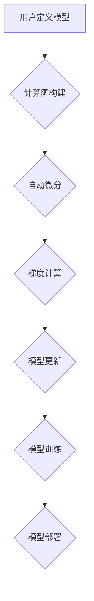

> 深度学习, PyTorch, TensorFlow, 框架比较, 优缺点, 应用场景

## 1. 背景介绍

深度学习作为机器学习领域的重要分支，近年来取得了令人瞩目的成就，在图像识别、自然语言处理、语音识别等领域展现出强大的应用潜力。深度学习模型的训练和部署离不开深度学习框架的支持。PyTorch 和 TensorFlow 是目前最流行的两大深度学习框架，它们在功能、性能、易用性和社区支持等方面各有优劣。本文将深入比较 PyTorch 和 TensorFlow，帮助读者更好地理解它们的特性和适用场景。

## 2. 核心概念与联系

**2.1 深度学习框架概述**

深度学习框架提供了一套完整的工具和库，用于构建、训练和部署深度学习模型。它们抽象了底层的计算图和优化算法，简化了模型开发流程，提高了开发效率。

**2.2 PyTorch 和 TensorFlow 的核心概念**

* **计算图:** 深度学习模型的训练过程可以看作是计算图的执行过程。计算图由节点和边组成，节点代表运算，边代表数据流。
* **自动微分:** 自动微分是深度学习训练的核心技术之一，它用于计算模型参数的梯度。PyTorch 和 TensorFlow 都支持自动微分，可以自动计算梯度，简化模型训练过程。
* **张量:** 张量是深度学习框架中用于表示数据的基本数据结构。它可以看作是多维数组，可以存储各种类型的数值数据。
* **模型定义:** 深度学习模型的定义通常使用层级结构，将模型分解成多个层，每层执行特定的运算。PyTorch 和 TensorFlow 都提供灵活的模型定义机制，可以方便地构建各种类型的深度学习模型。

**2.3 PyTorch 和 TensorFlow 的联系**

PyTorch 和 TensorFlow 都是基于计算图的深度学习框架，都支持自动微分和张量运算。它们在核心概念和技术实现上有很多相似之处。

**2.4 PyTorch 和 TensorFlow 的区别**

尽管 PyTorch 和 TensorFlow 在核心概念上有很多相似之处，但在设计理念、编程模型和应用场景上也存在一些关键区别。

**2.5 Mermaid 流程图**



## 3. 核心算法原理 & 具体操作步骤

**3.1 算法原理概述**

深度学习的核心算法是反向传播算法，它用于计算模型参数的梯度，并根据梯度更新模型参数，从而使模型的预测性能不断提高。

**3.2 算法步骤详解**

1. **前向传播:** 将输入数据通过模型层级结构进行传递，最终得到模型的输出结果。
2. **损失函数计算:** 计算模型输出结果与真实标签之间的差异，即损失值。
3. **反向传播:** 计算损失值对模型参数的梯度。
4. **参数更新:** 根据梯度更新模型参数，使模型朝着降低损失值的的方向进行调整。

**3.3 算法优缺点**

* **优点:** 反向传播算法能够有效地训练深度学习模型，并取得令人瞩目的性能提升。
* **缺点:** 反向传播算法的计算量较大，训练时间较长，对于大型模型来说，训练成本很高。

**3.4 算法应用领域**

反向传播算法广泛应用于各种深度学习任务，例如图像识别、自然语言处理、语音识别等。

## 4. 数学模型和公式 & 详细讲解 & 举例说明

**4.1 数学模型构建**

深度学习模型可以看作是一个多层神经网络，每个神经元都接收来自前一层神经元的输入，并通过激活函数进行处理，输出到下一层神经元。

**4.2 公式推导过程**

* **激活函数:** 激活函数用于引入非线性，使模型能够学习复杂的映射关系。常见的激活函数包括 sigmoid 函数、ReLU 函数、tanh 函数等。
* **损失函数:** 损失函数用于衡量模型预测结果与真实标签之间的差异。常见的损失函数包括均方误差、交叉熵等。
* **梯度下降:** 梯度下降算法用于更新模型参数，使模型朝着降低损失值的的方向进行调整。

**4.3 案例分析与讲解**

以图像分类为例，假设我们有一个包含 10 个类别的图像分类模型。模型的输入是一个图像，输出是一个包含 10 个值的向量，每个值代表该图像属于各个类别的概率。

* **损失函数:** 我们使用交叉熵作为损失函数，它衡量模型预测结果与真实标签之间的差异。
* **梯度下降:** 我们使用随机梯度下降算法更新模型参数，每次更新都使用一个随机选择的样本进行训练。

## 5. 项目实践：代码实例和详细解释说明

**5.1 开发环境搭建**

* **Python:** PyTorch 和 TensorFlow 都需要 Python 环境。
* **CUDA:** 如果需要使用 GPU 进行训练，需要安装 CUDA 和 cuDNN。

**5.2 源代码详细实现**

```python
# PyTorch 代码示例
import torch
import torch.nn as nn

class SimpleNet(nn.Module):
    def __init__(self):
        super(SimpleNet, self).__init__()
        self.fc1 = nn.Linear(784, 128)
        self.fc2 = nn.Linear(128, 10)

    def forward(self, x):
        x = torch.relu(self.fc1(x))
        x = self.fc2(x)
        return x

# TensorFlow 代码示例
import tensorflow as tf

model = tf.keras.models.Sequential([
    tf.keras.layers.Dense(128, activation='relu', input_shape=(784,)),
    tf.keras.layers.Dense(10)
])
```

**5.3 代码解读与分析**

* **PyTorch 代码:**
    * `nn.Module` 是 PyTorch 中的模型基类。
    * `nn.Linear` 是全连接层，用于将输入数据映射到输出空间。
    * `torch.relu` 是 ReLU 激活函数。
    * `forward` 方法定义了模型的计算流程。
* **TensorFlow 代码:**
    * `tf.keras.models.Sequential` 是 TensorFlow 中的顺序模型，用于构建层级结构的模型。
    * `tf.keras.layers.Dense` 是全连接层。
    * `activation='relu'` 指定了 ReLU 激活函数。
    * `input_shape=(784,)` 指定了输入数据的形状。

**5.4 运行结果展示**

运行上述代码，可以训练一个简单的图像分类模型。

## 6. 实际应用场景

**6.1 图像识别**

PyTorch 和 TensorFlow 都广泛应用于图像识别任务，例如人脸识别、物体检测、图像分类等。

**6.2 自然语言处理**

PyTorch 和 TensorFlow 也被广泛应用于自然语言处理任务，例如文本分类、机器翻译、文本生成等。

**6.3 语音识别**

PyTorch 和 TensorFlow 都可以用于语音识别任务，例如语音转文本、语音命令识别等。

**6.4 未来应用展望**

随着深度学习技术的不断发展，PyTorch 和 TensorFlow 将在更多领域得到应用，例如自动驾驶、医疗诊断、金融预测等。

## 7. 工具和资源推荐

**7.1 学习资源推荐**

* **PyTorch 官方文档:** https://pytorch.org/docs/stable/
* **TensorFlow 官方文档:** https://www.tensorflow.org/
* **深度学习课程:** Coursera、edX、Udacity 等平台提供丰富的深度学习课程。

**7.2 开发工具推荐**

* **Jupyter Notebook:** 用于编写和运行 Python 代码，方便进行深度学习模型开发和调试。
* **VS Code:** 一款功能强大的代码编辑器，支持 PyTorch 和 TensorFlow 开发。

**7.3 相关论文推荐**

* **AlexNet:** https://papers.nips.cc/paper/4824-imagenet-classification-with-deep-convolutional-neural-networks.pdf
* **ResNet:** https://arxiv.org/abs/1512.03385
* **BERT:** https://arxiv.org/abs/1810.04805

## 8. 总结：未来发展趋势与挑战

**8.1 研究成果总结**

PyTorch 和 TensorFlow 作为深度学习领域的领先框架，推动了深度学习技术的快速发展，取得了令人瞩目的成果。

**8.2 未来发展趋势**

* **模型效率:** 研究更高效的深度学习模型，降低训练和部署成本。
* **可解释性:** 研究更可解释的深度学习模型，提高模型的透明度和可信度。
* **边缘计算:** 将深度学习模型部署到边缘设备，实现更低延迟和更高效率的应用。

**8.3 面临的挑战**

* **模型规模:** 大型深度学习模型的训练和部署成本很高，需要更有效的训练和优化方法。
* **数据隐私:** 深度学习模型的训练需要大量数据，如何保护数据隐私是一个重要的挑战。
* **算法安全:** 深度学习模型容易受到攻击，需要研究更安全的算法和训练方法。

**8.4 研究展望**

未来，深度学习框架将继续朝着更高效、更可解释、更安全的方向发展，并应用于更多领域，为人类社会带来更多福祉。

## 9. 附录：常见问题与解答

**9.1 PyTorch 和 TensorFlow 的区别是什么？**

PyTorch 和 TensorFlow 都是基于计算图的深度学习框架，但它们在编程模型、社区支持和应用场景上存在一些差异。

**9.2 如何选择 PyTorch 或 TensorFlow？**

选择 PyTorch 或 TensorFlow 取决于具体的应用场景和个人偏好。

**9.3 如何学习 PyTorch 或 TensorFlow？**

可以通过官方文档、在线课程和书籍学习 PyTorch 或 TensorFlow。

作者：禅与计算机程序设计艺术 / Zen and the Art of Computer Programming


<end_of_turn>