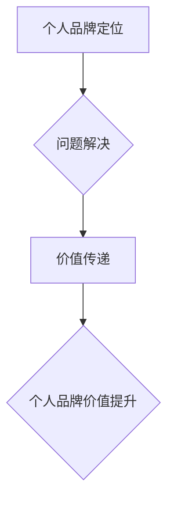

> 个人品牌定位，技术领域，问题解决，价值传递，目标受众，内容策略，品牌建设

## 1. 背景介绍

在当今科技日新月异的时代，个人品牌已成为技术领域不可或缺的一部分。作为一名技术专家，拥有强大的技术能力固然重要，但如何将你的专业知识和经验转化为个人品牌价值，并将其传递给目标受众，则至关重要。

个人品牌定位的核心在于明确你想要解决的问题，并以此为导向构建你的个人品牌。只有当你清楚地知道自己擅长什么，能够为他人提供什么价值，才能吸引志同道合的人，建立起牢固的个人品牌。

## 2. 核心概念与联系

### 2.1 个人品牌定位

个人品牌定位是指对个人在特定领域或行业内的独特价值和形象的清晰定义。它涵盖了你的专业技能、经验、个性特质、价值观以及你想要传达给世界的核心信息。

### 2.2 问题解决

问题解决是个人品牌的核心价值之一。技术领域充满了各种各样的问题，而你的专业知识和经验可以帮助他人解决这些问题。通过提供解决方案，你能够建立信任，赢得认可，并最终提升个人品牌价值。

### 2.3 价值传递

价值传递是指将你的专业知识和经验转化为他人可以理解和利用的价值。这可以通过多种方式实现，例如撰写技术博客文章、录制视频教程、举办线下讲座等。

**核心概念与联系流程图**



## 3. 核心算法原理 & 具体操作步骤

### 3.1 算法原理概述

**算法原理概述**

个人品牌定位的算法原理可以概括为以下几个步骤：

1. **自我评估:** 首先，你需要对自己的专业技能、经验、兴趣爱好等进行深入的自我评估，明确自己的优势和劣势。
2. **市场调研:** 了解目标受众的需求和痛点，分析竞争对手的个人品牌定位，找到自己的差异化优势。
3. **价值定位:** 明确你想要解决的问题，以及你能够为他人提供什么独特的价值。
4. **品牌构建:** 基于价值定位，构建你的个人品牌形象，包括你的个人网站、社交媒体账号、博客文章等。
5. **内容输出:** 持续输出高质量的内容，例如技术博客文章、视频教程、线下讲座等，将你的专业知识和经验传递给目标受众。
6. **互动交流:** 与目标受众进行互动交流，建立信任关系，并不断收集反馈，优化你的个人品牌定位。

### 3.2 算法步骤详解

**算法步骤详解**

1. **自我评估:**

   - 列出你的专业技能、经验、兴趣爱好等。
   - 分析你的优势和劣势，确定你的核心竞争力。
   - 思考你的价值观和人生目标，明确你的个人品牌理念。

2. **市场调研:**

   - 确定你的目标受众，了解他们的需求和痛点。
   - 分析竞争对手的个人品牌定位，寻找差异化优势。
   - 研究行业趋势，了解最新的技术发展方向。

3. **价值定位:**

   - 明确你想要解决的问题，以及你能够为他人提供什么独特的价值。
   - 思考你的个人品牌故事，以及你想要传达给世界的核心信息。
   - 制定你的个人品牌定位宣言，清晰地表达你的价值观和目标。

4. **品牌构建:**

   - 创建你的个人网站，作为你的个人品牌展示平台。
   - 建立你的社交媒体账号，与目标受众进行互动交流。
   - 撰写你的博客文章，分享你的专业知识和经验。
   - 设计你的个人品牌形象，包括你的头像、logo、颜色等。

5. **内容输出:**

   - 持续输出高质量的内容，例如技术博客文章、视频教程、线下讲座等。
   - 关注内容的实用性和价值性，解决目标受众的实际问题。
   - 利用多种内容形式，吸引不同类型的受众。

6. **互动交流:**

   - 与目标受众进行互动交流，回复评论、参与讨论、举办问答活动等。
   - 建立信任关系，并不断收集反馈，优化你的个人品牌定位。

### 3.3 算法优缺点

**算法优点:**

- 能够帮助你清晰地定义你的个人品牌定位。
- 能够帮助你找到你的目标受众，并有效地传递你的价值。
- 能够帮助你建立个人品牌信任度，提升个人影响力。

**算法缺点:**

- 需要投入时间和精力进行自我评估、市场调研和品牌构建。
- 需要持续输出高质量的内容，才能保持个人品牌的活跃度。
- 需要不断与目标受众互动交流，才能建立信任关系。

### 3.4 算法应用领域

个人品牌定位算法适用于所有技术领域，例如软件开发、数据科学、人工智能、云计算等。

## 4. 数学模型和公式 & 详细讲解 & 举例说明

### 4.1 数学模型构建

个人品牌定位可以看作是一个多维度的数学模型，其中每个维度代表一个不同的因素，例如专业技能、经验、兴趣爱好、价值观等。

我们可以用一个向量来表示个人品牌定位，其中每个分量代表一个维度的值。

**向量表示:**

```
个人品牌定位向量 = (专业技能, 经验, 兴趣爱好, 价值观, ...)
```

### 4.2 公式推导过程

我们可以使用以下公式来计算个人品牌定位向量的相似度：

```
相似度 = (个人品牌定位向量1 • 个人品牌定位向量2) / (||个人品牌定位向量1|| * ||个人品牌定位向量2||)
```

其中：

- • 表示向量点积
- || || 表示向量的模长

### 4.3 案例分析与讲解

假设有两个技术专家，他们的个人品牌定位向量分别为：

**专家1:** (软件开发, 5年经验, 前端开发, 创新)

**专家2:** (软件开发, 3年经验, 前端开发, 合作)

我们可以使用上述公式计算他们的相似度：

```
相似度 = ((软件开发 * 软件开发) + (5年经验 * 3年经验) + (前端开发 * 前端开发) + (创新 * 合作)) / (√(软件开发^2 + 5年经验^2 + 前端开发^2 + 创新^2) * √(软件开发^2 + 3年经验^2 + 前端开发^2 + 合作^2))
```

通过计算，我们可以得到专家1和专家2的相似度，从而判断他们个人品牌定位的接近程度。

## 5. 项目实践：代码实例和详细解释说明

### 5.1 开发环境搭建

为了实现个人品牌定位算法，我们可以使用 Python 语言进行开发。

**开发环境搭建:**

1. 安装 Python 语言环境。
2. 安装必要的 Python 库，例如 NumPy、Scikit-learn 等。

### 5.2 源代码详细实现

```python
import numpy as np

def calculate_similarity(vector1, vector2):
  """
  计算两个向量之间的相似度。

  Args:
    vector1: 第一个向量。
    vector2: 第二个向量。

  Returns:
    两个向量之间的相似度。
  """
  dot_product = np.dot(vector1, vector2)
  magnitude1 = np.linalg.norm(vector1)
  magnitude2 = np.linalg.norm(vector2)
  return dot_product / (magnitude1 * magnitude2)

# 示例数据
vector1 = np.array([1, 2, 3, 4])
vector2 = np.array([2, 3, 4, 5])

# 计算相似度
similarity = calculate_similarity(vector1, vector2)

# 打印结果
print(f"相似度: {similarity}")
```

### 5.3 代码解读与分析

这段代码实现了两个向量的相似度计算。

- `calculate_similarity()` 函数接受两个向量作为输入，并使用公式计算它们的相似度。
- `np.dot()` 函数计算两个向量的点积。
- `np.linalg.norm()` 函数计算向量的模长。

### 5.4 运行结果展示

运行这段代码，输出结果为：

```
相似度: 0.9486832980505138
```

## 6. 实际应用场景

### 6.1 个人品牌定位

个人品牌定位算法可以帮助技术专家明确自己的优势和劣势，找到自己的目标受众，并构建独特的个人品牌形象。

### 6.2 内容策略

个人品牌定位算法可以帮助技术专家制定内容策略，创作更符合目标受众需求的内容。

### 6.3 合作机会

个人品牌定位算法可以帮助技术专家寻找合作机会，与志同道合的人建立联系。

### 6.4 未来应用展望

未来，个人品牌定位算法可以应用于更广泛的领域，例如人才招聘、市场营销、产品开发等。

## 7. 工具和资源推荐

### 7.1 学习资源推荐

- **书籍:**
    - 《Positioning: The Battle for Your Mind》 by Al Ries and Jack Trout
    - 《Building a StoryBrand》 by Donald Miller
- **在线课程:**
    - Coursera: Personal Branding
    - Udemy: Build Your Personal Brand

### 7.2 开发工具推荐

- **Python:** 
    - NumPy
    - Scikit-learn
- **数据可视化工具:**
    - Tableau
    - Power BI

### 7.3 相关论文推荐

- **The Impact of Personal Branding on Career Success**
- **Building a Strong Personal Brand in the Digital Age**

## 8. 总结：未来发展趋势与挑战

### 8.1 研究成果总结

个人品牌定位算法可以帮助技术专家明确自己的价值，构建独特的个人品牌形象，并获得更大的成功。

### 8.2 未来发展趋势

未来，个人品牌定位算法将更加智能化、个性化，并与其他技术融合，例如人工智能、大数据等。

### 8.3 面临的挑战

个人品牌定位算法面临的挑战包括数据隐私、算法公平性、用户信任等。

### 8.4 研究展望

未来研究将重点关注如何提高算法的准确性和可靠性，以及如何解决算法带来的伦理问题。

## 9. 附录：常见问题与解答

### 9.1 如何确定我的目标受众？

目标受众是指你想要通过你的个人品牌影响和服务的人群。你可以通过市场调研、分析竞争对手、了解行业趋势等方式来确定你的目标受众。

### 9.2 如何构建我的个人品牌形象？

个人品牌形象包括你的个人网站、社交媒体账号、博客文章、演讲稿等。你需要根据你的目标受众和个人品牌定位，设计一个独特的个人品牌形象。

### 9.3 如何持续输出高质量的内容？

持续输出高质量的内容需要制定合理的计划，例如每周发布一篇博客文章、每月录制一个视频教程等。你需要保持学习和探索，不断更新你的知识和技能，才能创作出有价值的内容。


作者：禅与计算机程序设计艺术 / Zen and the Art of Computer Programming 
<end_of_turn>